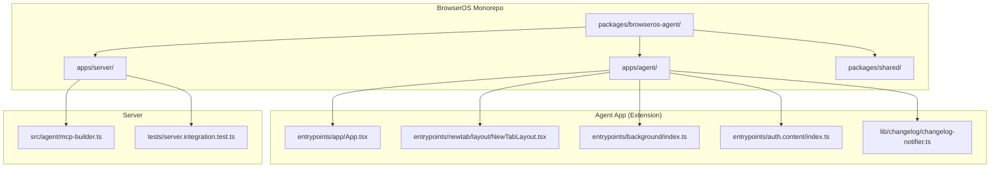
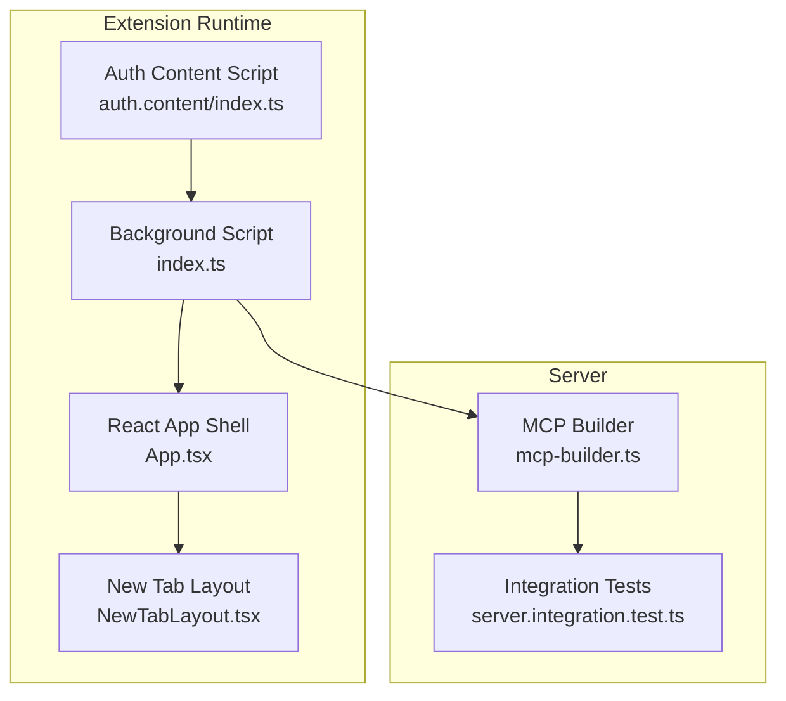
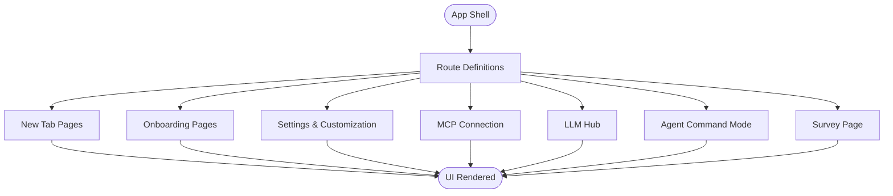
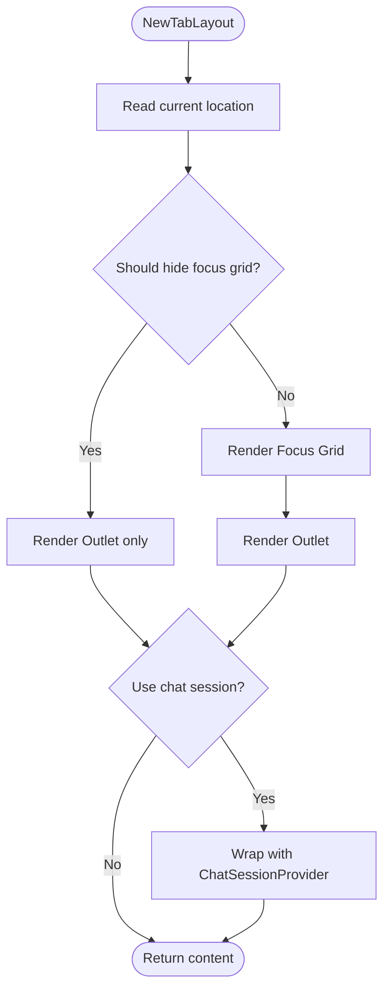
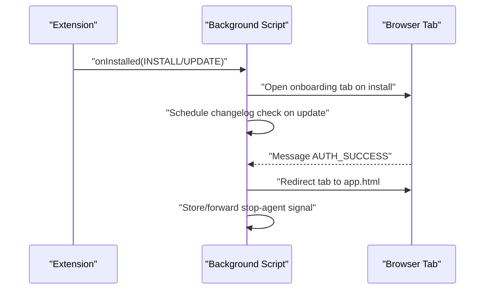
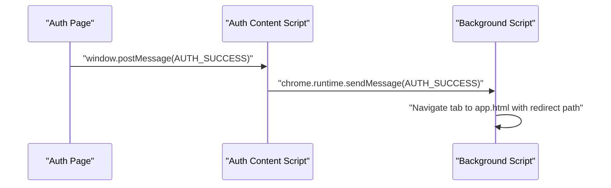
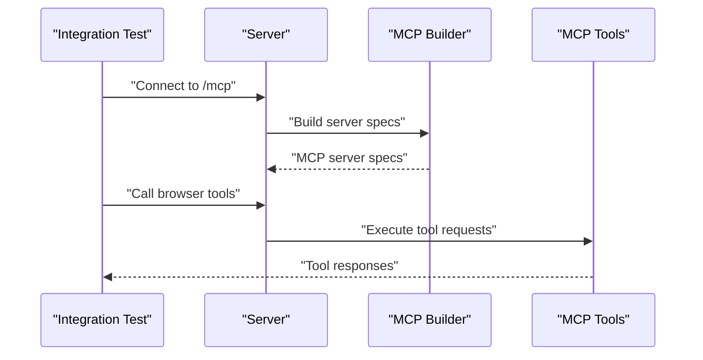
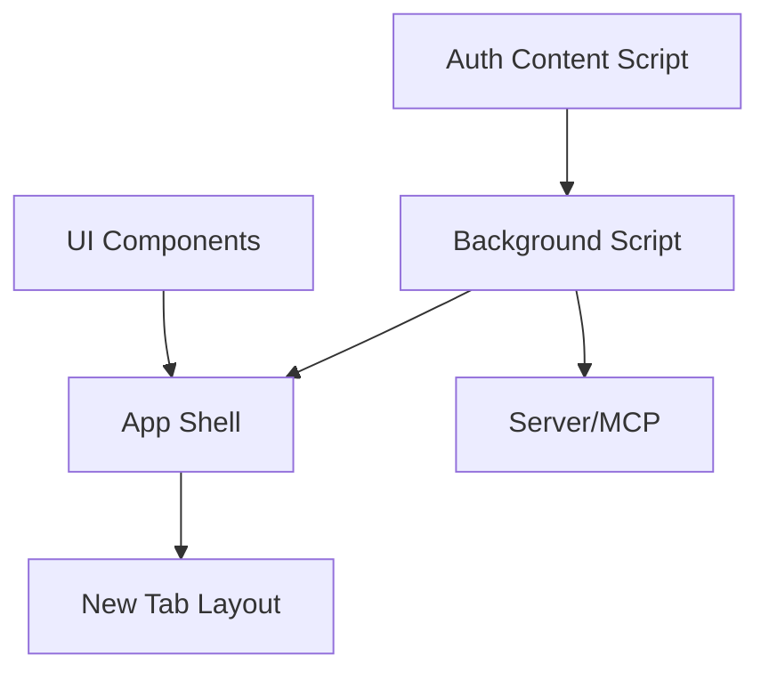
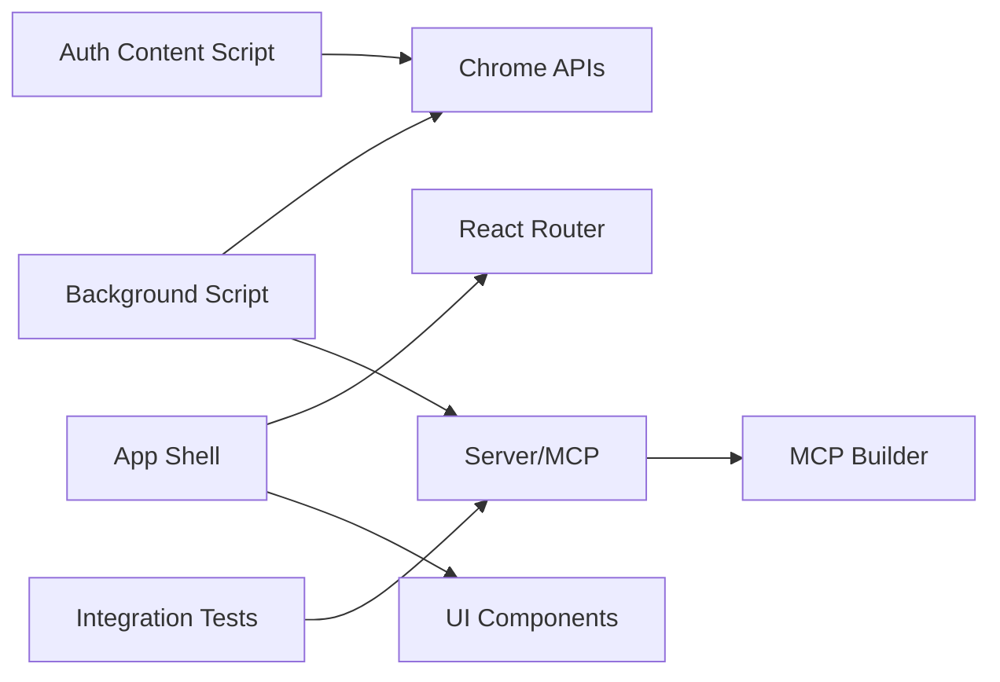

# Agent Extension

<cite>
**Referenced Files in This Document**
- [README.md](file://README.md)
- [package.json](file://packages/browseros-agent/package.json)
- [App.tsx](file://packages/browseros-agent/apps/agent/entrypoints/app/App.tsx)
- [NewTabLayout.tsx](file://packages/browseros-agent/apps/agent/entrypoints/newtab/layout/NewTabLayout.tsx)
- [index.ts](file://packages/browseros-agent/apps/agent/entrypoints/background/index.ts)
- [changelog-notifier.ts](file://packages/browseros-agent/apps/agent/lib/changelog/changelog-notifier.ts)
- [index.ts](file://packages/browseros-agent/apps/agent/entrypoints/auth.content/index.ts)
- [mcp-builder.ts](file://packages/browseros-agent/apps/server/src/agent/mcp-builder.ts)
- [server.integration.test.ts](file://packages/browseros-agent/apps/server/tests/server.integration.test.ts)
- [mcp-test.sh](file://packages/browseros-agent/scripts/dev/mcp-test.sh)
</cite>

## Table of Contents
1. [Introduction](#introduction)
2. [Project Structure](#project-structure)
3. [Core Components](#core-components)
4. [Architecture Overview](#architecture-overview)
5. [Detailed Component Analysis](#detailed-component-analysis)
6. [Dependency Analysis](#dependency-analysis)
7. [Performance Considerations](#performance-considerations)
8. [Troubleshooting Guide](#troubleshooting-guide)
9. [Conclusion](#conclusion)
10. [Appendices](#appendices)

## Introduction
This document describes the BrowserOS agent extension, focusing on the browser extension that powers the UI and integrates with the BrowserOS application and Chromium APIs. It covers the extension architecture including the new tab interface, side panel chat, onboarding flow, and settings management. It also explains the browser adapter for Chrome API integration, the MCP client for tool communication, and helper utilities for extension functionality. The document details the extension manifest configuration, content scripts, background scripts, and popup interfaces, along with integration patterns with the main BrowserOS application and Chromium browser APIs. Examples of extension development, custom UI components, and messaging between the extension and server are included, alongside lifecycle, permissions, and security considerations.

## Project Structure
The BrowserOS agent extension resides in the BrowserOS monorepo under the agent application. The extension is built with WXT (Web Extensions Toolkit) and React, and integrates with the BrowserOS server and MCP tool ecosystem.

**Diagram sources**
- [package.json:1-83](file://packages/browseros-agent/package.json#L1-L83)
- [App.tsx:1-23](file://packages/browseros-agent/apps/agent/entrypoints/app/App.tsx#L1-L23)
- [NewTabLayout.tsx:1-30](file://packages/browseros-agent/apps/agent/entrypoints/newtab/layout/NewTabLayout.tsx#L1-L30)
- [index.ts:68-111](file://packages/browseros-agent/apps/agent/entrypoints/background/index.ts#L68-L111)
- [index.ts:1-13](file://packages/browseros-agent/apps/agent/entrypoints/auth.content/index.ts#L1-L13)
- [changelog-notifier.ts:1-26](file://packages/browseros-agent/apps/agent/lib/changelog/changelog-notifier.ts#L1-L26)
- [mcp-builder.ts:1-44](file://packages/browseros-agent/apps/server/src/agent/mcp-builder.ts#L1-L44)
- [server.integration.test.ts:43-91](file://packages/browseros-agent/apps/server/tests/server.integration.test.ts#L43-L91)

**Section sources**
- [README.md:144-178](file://README.md#L144-L178)
- [package.json:1-83](file://packages/browseros-agent/package.json#L1-L83)

## Core Components
- Application shell and routing: The app entry defines routes for new tab, onboarding, side panel chat, settings, MCP connection, and LLM hub pages.
- New tab layout: Provides focus grid and optional chat session context for the new tab experience.
- Background script: Handles extension installation, updates, changelog notifications, and inter-tab messaging for auth redirects and agent control.
- Content script for auth: Bridges auth success messages from the hosted auth page to the extension background.
- Changelog notifier: Manages post-install/update changelog visibility.
- Server-side MCP builder: Constructs MCP server specifications and tools for the agent runtime.

**Section sources**
- [App.tsx:1-23](file://packages/browseros-agent/apps/agent/entrypoints/app/App.tsx#L1-L23)
- [NewTabLayout.tsx:1-30](file://packages/browseros-agent/apps/agent/entrypoints/newtab/layout/NewTabLayout.tsx#L1-L30)
- [index.ts:68-111](file://packages/browseros-agent/apps/agent/entrypoints/background/index.ts#L68-L111)
- [index.ts:1-13](file://packages/browseros-agent/apps/agent/entrypoints/auth.content/index.ts#L1-L13)
- [changelog-notifier.ts:1-26](file://packages/browseros-agent/apps/agent/lib/changelog/changelog-notifier.ts#L1-L26)
- [mcp-builder.ts:1-44](file://packages/browseros-agent/apps/server/src/agent/mcp-builder.ts#L1-L44)

## Architecture Overview
The extension architecture integrates UI components with the BrowserOS server and MCP tool ecosystem. The background script coordinates lifecycle events and messaging, while content scripts handle cross-frame auth signaling. The UI routes cover new tab, onboarding, settings, and MCP connections.

**Diagram sources**
- [index.ts:68-111](file://packages/browseros-agent/apps/agent/entrypoints/background/index.ts#L68-L111)
- [index.ts:1-13](file://packages/browseros-agent/apps/agent/entrypoints/auth.content/index.ts#L1-L13)
- [App.tsx:1-23](file://packages/browseros-agent/apps/agent/entrypoints/app/App.tsx#L1-L23)
- [NewTabLayout.tsx:1-30](file://packages/browseros-agent/apps/agent/entrypoints/newtab/layout/NewTabLayout.tsx#L1-L30)
- [mcp-builder.ts:1-44](file://packages/browseros-agent/apps/server/src/agent/mcp-builder.ts#L1-L44)
- [server.integration.test.ts:43-91](file://packages/browseros-agent/apps/server/tests/server.integration.test.ts#L43-L91)

## Detailed Component Analysis

### Application Shell and Routing
The application shell defines routes for:
- New tab and chat surfaces
- Onboarding steps and demo
- Settings and customization
- MCP connection and LLM hub
- Agent command mode and survey

These routes enable the new tab interface, side panel chat, onboarding flow, and settings management.

**Diagram sources**
- [App.tsx:1-23](file://packages/browseros-agent/apps/agent/entrypoints/app/App.tsx#L1-L23)

**Section sources**
- [App.tsx:1-23](file://packages/browseros-agent/apps/agent/entrypoints/app/App.tsx#L1-L23)

### New Tab Layout and Focus Grid
The new tab layout composes a focus grid and an outlet for nested routes. It conditionally wraps content with a chat session provider and can hide the focus grid based on route conditions.

**Diagram sources**
- [NewTabLayout.tsx:1-30](file://packages/browseros-agent/apps/agent/entrypoints/newtab/layout/NewTabLayout.tsx#L1-L30)

**Section sources**
- [NewTabLayout.tsx:1-30](file://packages/browseros-agent/apps/agent/entrypoints/newtab/layout/NewTabLayout.tsx#L1-L30)

### Background Script Lifecycle and Messaging
The background script handles:
- Installation and update flows
- Changelog notification tab creation
- Inter-tab messaging for auth redirects
- Agent control signals (stop agent)

**Diagram sources**
- [index.ts:68-111](file://packages/browseros-agent/apps/agent/entrypoints/background/index.ts#L68-L111)
- [changelog-notifier.ts:1-26](file://packages/browseros-agent/apps/agent/lib/changelog/changelog-notifier.ts#L1-L26)

**Section sources**
- [index.ts:68-111](file://packages/browseros-agent/apps/agent/entrypoints/background/index.ts#L68-L111)
- [changelog-notifier.ts:1-26](file://packages/browseros-agent/apps/agent/lib/changelog/changelog-notifier.ts#L1-L26)

### Auth Content Script Bridge
The auth content script listens for auth success messages from a hosted auth page and forwards them to the extension background script for navigation redirection.

**Diagram sources**
- [index.ts:1-13](file://packages/browseros-agent/apps/agent/entrypoints/auth.content/index.ts#L1-L13)
- [index.ts:86-108](file://packages/browseros-agent/apps/agent/entrypoints/background/index.ts#L86-L108)

**Section sources**
- [index.ts:1-13](file://packages/browseros-agent/apps/agent/entrypoints/auth.content/index.ts#L1-L13)
- [index.ts:86-108](file://packages/browseros-agent/apps/agent/entrypoints/background/index.ts#L86-L108)

### MCP Client and Tool Communication
The server builds MCP server specifications and tools, enabling the agent to communicate with external MCP clients and tools. Integration tests demonstrate connecting an MCP client and invoking browser tools.

**Diagram sources**
- [mcp-builder.ts:1-44](file://packages/browseros-agent/apps/server/src/agent/mcp-builder.ts#L1-L44)
- [server.integration.test.ts:43-91](file://packages/browseros-agent/apps/server/tests/server.integration.test.ts#L43-L91)
- [mcp-test.sh:50-143](file://packages/browseros-agent/scripts/dev/mcp-test.sh#L50-L143)

**Section sources**
- [mcp-builder.ts:1-44](file://packages/browseros-agent/apps/server/src/agent/mcp-builder.ts#L1-L44)
- [server.integration.test.ts:43-91](file://packages/browseros-agent/apps/server/tests/server.integration.test.ts#L43-L91)
- [mcp-test.sh:50-143](file://packages/browseros-agent/scripts/dev/mcp-test.sh#L50-L143)

### Conceptual Overview
The extension’s UI and lifecycle are orchestrated by the background script, routed by the app shell, and integrated with the server’s MCP tool ecosystem. The auth content script enables seamless OAuth flows by bridging messages between the auth page and the extension.

[No sources needed since this diagram shows conceptual workflow, not actual code structure]

[No sources needed since this section doesn't analyze specific source files]

## Dependency Analysis
The agent extension depends on:
- WXT and React for UI and routing
- Chrome extension APIs for background and content scripts
- Server-side MCP builder for tool definitions
- Integration tests for validating MCP connectivity

**Diagram sources**
- [index.ts:68-111](file://packages/browseros-agent/apps/agent/entrypoints/background/index.ts#L68-L111)
- [index.ts:1-13](file://packages/browseros-agent/apps/agent/entrypoints/auth.content/index.ts#L1-L13)
- [App.tsx:1-23](file://packages/browseros-agent/apps/agent/entrypoints/app/App.tsx#L1-L23)
- [mcp-builder.ts:1-44](file://packages/browseros-agent/apps/server/src/agent/mcp-builder.ts#L1-L44)
- [server.integration.test.ts:43-91](file://packages/browseros-agent/apps/server/tests/server.integration.test.ts#L43-L91)

**Section sources**
- [package.json:1-83](file://packages/browseros-agent/package.json#L1-L83)
- [README.md:144-178](file://README.md#L144-L178)

## Performance Considerations
- Minimize background script work: Offload heavy tasks to worker threads or server-side handlers.
- Lazy-load UI routes: Defer rendering of non-critical UI until needed.
- Debounce messaging: Batch frequent messages between content scripts and background to reduce overhead.
- Optimize MCP tool calls: Cache tool metadata and avoid redundant server round trips.
- Use efficient storage: Prefer indexedDB or extension storage APIs for persistent data.

[No sources needed since this section provides general guidance]

## Troubleshooting Guide
Common issues and resolutions:
- Auth redirect loops: Verify the auth content script posts the correct message type and the background script updates the tab URL to the app route.
- Changelog tab not opening: Confirm version gating logic and that the tab creation delay is sufficient.
- MCP tool failures: Validate server connectivity, tool names, and arguments; check integration test logs for errors.
- New tab focus grid visibility: Ensure route conditions properly evaluate to hide or show the grid.

**Section sources**
- [index.ts:86-108](file://packages/browseros-agent/apps/agent/entrypoints/background/index.ts#L86-L108)
- [changelog-notifier.ts:10-26](file://packages/browseros-agent/apps/agent/lib/changelog/changelog-notifier.ts#L10-L26)
- [server.integration.test.ts:43-91](file://packages/browseros-agent/apps/server/tests/server.integration.test.ts#L43-L91)

## Conclusion
The BrowserOS agent extension provides a modular UI built on React and WXT, coordinated by a background script and integrated with the BrowserOS server and MCP tool ecosystem. Its architecture supports a new tab interface, side panel chat, onboarding, and settings, while leveraging Chromium APIs for lifecycle and messaging. The MCP client and server components enable robust tool communication, validated by integration tests. Following the development patterns and security considerations outlined here ensures reliable extension behavior and maintainable code.

[No sources needed since this section summarizes without analyzing specific files]

## Appendices

### Extension Manifest and Scripts
- Manifest configuration: Define permissions, background scripts, content scripts, and action/popup entries.
- Permissions management: Request only necessary permissions (tabs, storage, identity) and justify each in the manifest.
- Security considerations: Restrict content script match patterns, enforce CSP, and sanitize cross-frame messages.

[No sources needed since this section provides general guidance]

### Development Examples
- Custom UI components: Create reusable components for chat sessions, settings panels, and onboarding steps.
- Messaging patterns: Use chrome.runtime.sendMessage for lightweight messages; use background script listeners for long-lived handlers.
- MCP tool invocation: Follow integration test patterns to connect clients and call tools with proper JSON-RPC envelopes.

[No sources needed since this section provides general guidance]