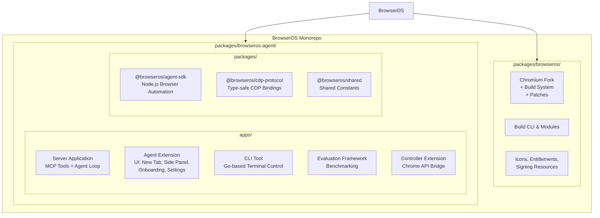
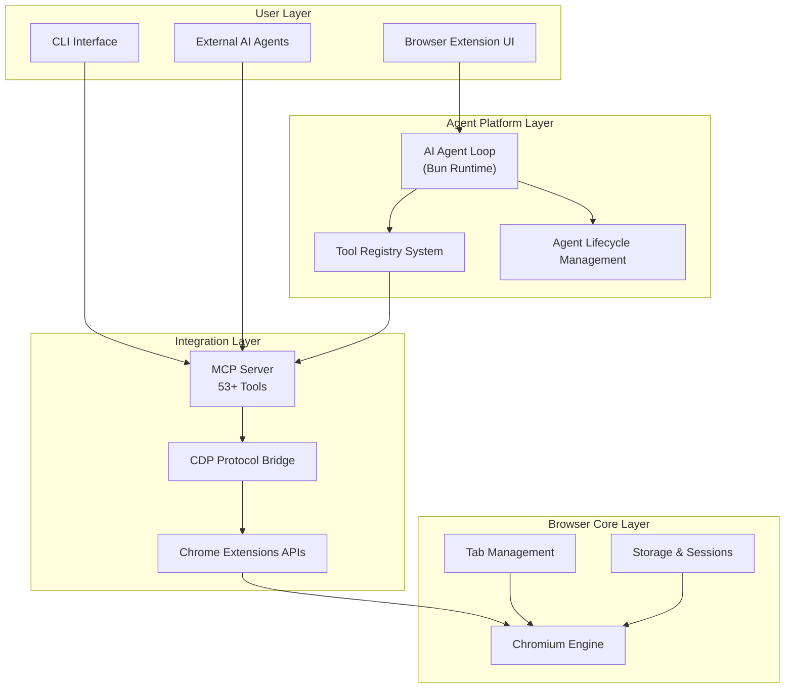
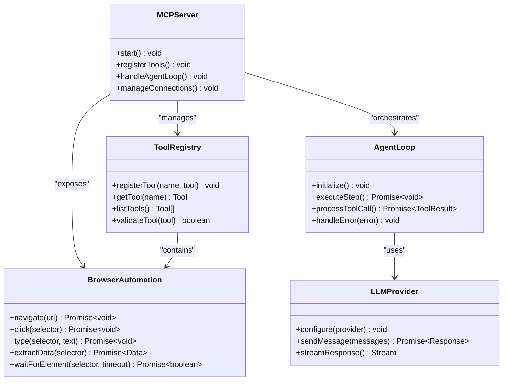
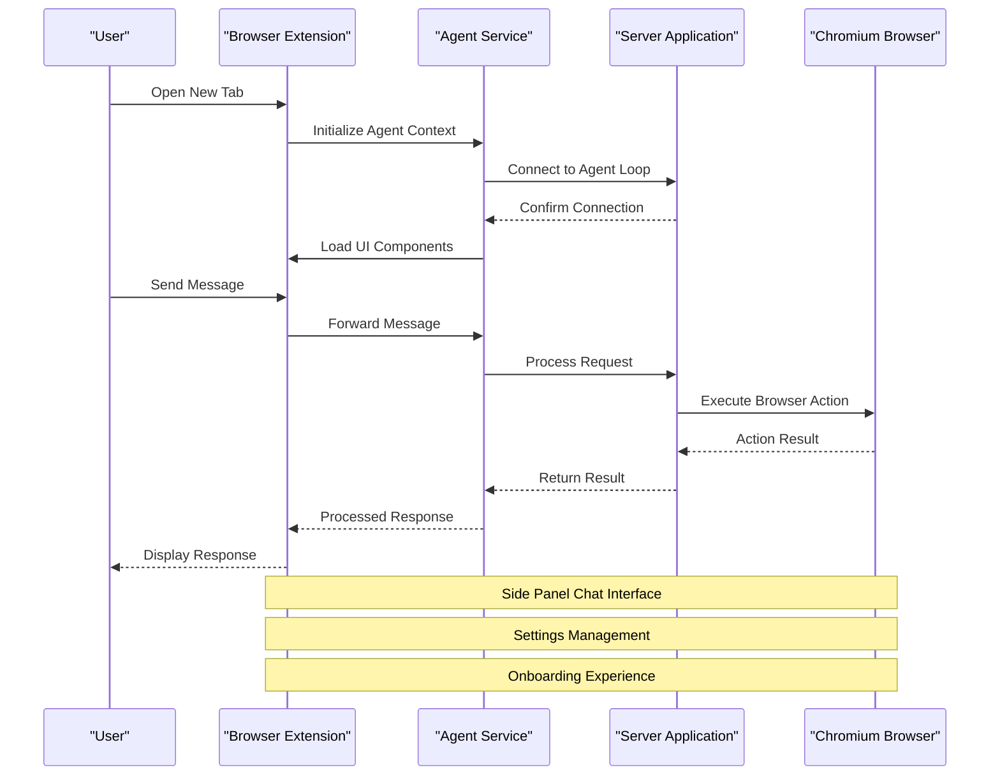
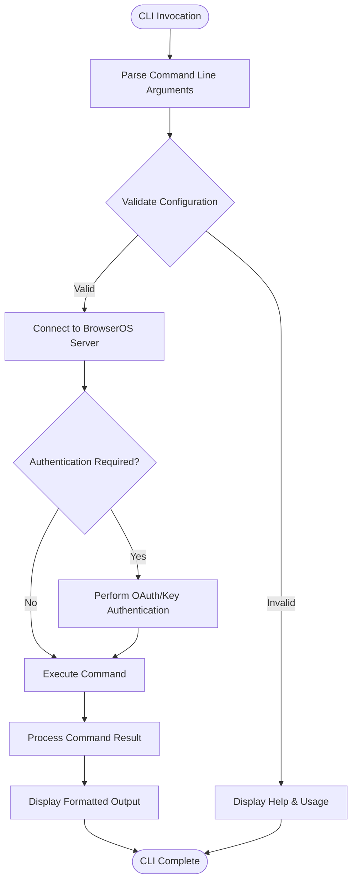
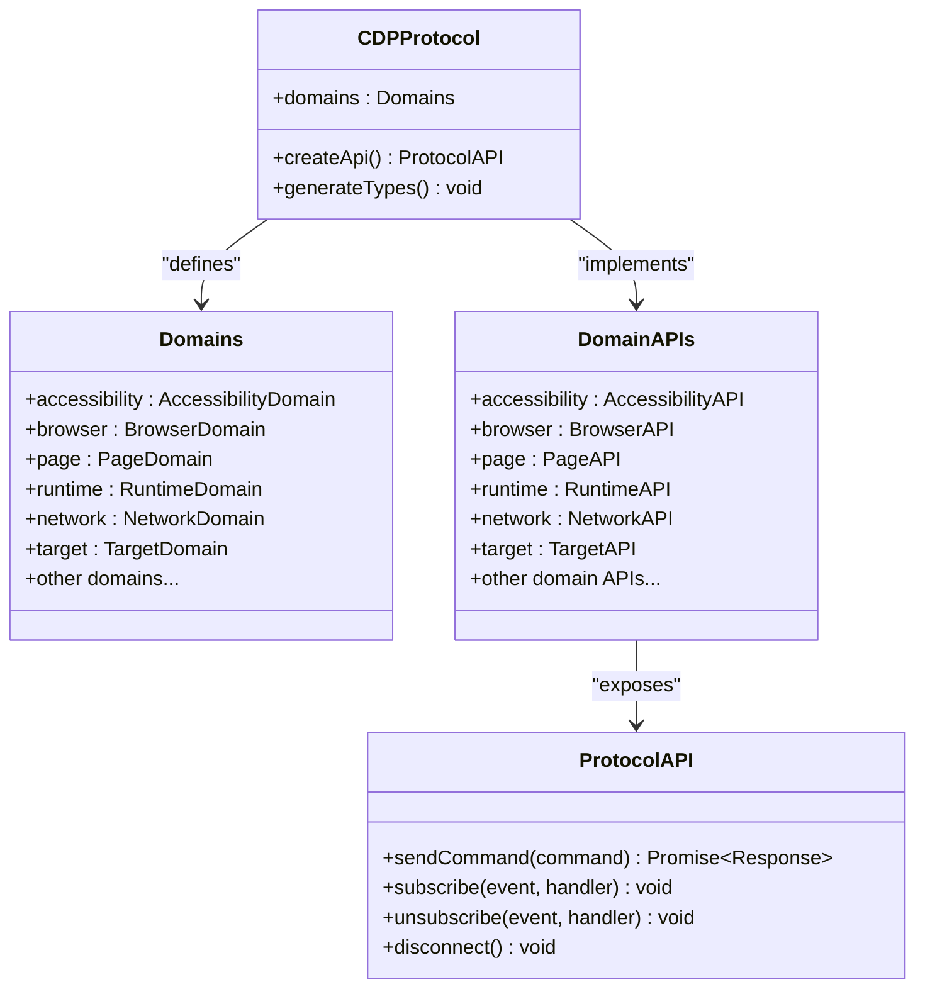

# Agent Platform

<cite>
**Referenced Files in This Document**
- [README.md](file://README.md)
- [browseros-agent package.json](file://packages/browseros-agent/package.json)
- [server package.json](file://packages/browseros-agent/apps/server/package.json)
- [agent package.json](file://packages/browseros-agent/apps/agent/package.json)
- [cdp-protocol package.json](file://packages/browseros-agent/packages/cdp-protocol/package.json)
- [skills README](file://.claude/skills/README.md)
- [skills index](file://.claude/skills/)
</cite>

## Table of Contents
1. [Introduction](#introduction)
2. [Project Structure](#project-structure)
3. [Core Components](#core-components)
4. [Architecture Overview](#architecture-overview)
5. [Detailed Component Analysis](#detailed-component-analysis)
6. [Dependency Analysis](#dependency-analysis)
7. [Performance Considerations](#performance-considerations)
8. [Troubleshooting Guide](#troubleshooting-guide)
9. [Conclusion](#conclusion)
10. [Appendices](#appendices)

## Introduction
BrowserOS is an open-source Chromium fork that runs AI agents natively, providing a privacy-first alternative to existing browser-based AI assistants. The platform consists of two main subsystems: the browser (Chromium fork) and the agent platform (TypeScript/Go). The agent platform exposes a comprehensive MCP server with 53+ browser automation tools, runs an AI agent loop using the Bun runtime, and integrates tightly with the underlying Chromium browser through Chrome DevTools Protocol (CDP) bindings.

Key capabilities include:
- A server application exposing 53+ MCP tools for browser automation
- An AI agent loop powered by Bun runtime
- A browser extension providing new tab, side panel chat, onboarding, and settings
- A CLI tool for controlling BrowserOS from terminal or AI coding agents
- An agent SDK for Node.js browser automation with natural language capabilities
- CDP protocol type bindings for Chrome DevTools Protocol integration
- An AI SDK agent implementation and browser automation capabilities
- A controller extension bridging Chrome APIs
- A benchmarking evaluation framework
- Tool registry system and agent lifecycle management
- Integration patterns for building custom skills and tools

## Project Structure
The BrowserOS repository is organized as a monorepo with clear separation between the browser (Chromium fork) and the agent platform (TypeScript/Go). The agent platform is further divided into several key applications and packages:

**Diagram sources**
- [README.md:144-178](file://README.md#L144-L178)

The monorepo structure enables coordinated development across all components while maintaining clear boundaries between the browser core and the agent platform.

**Section sources**
- [README.md:144-178](file://README.md#L144-L178)

## Core Components
The BrowserOS agent platform comprises five primary applications and three specialized packages that work together to provide a comprehensive AI-powered browser automation solution:

### Server Application (MCP Tools + Agent Loop)
The server application serves as the central hub for AI agent operations, exposing 53+ MCP tools and orchestrating the agent loop. Built with Bun runtime, it provides:
- Comprehensive browser automation toolset with natural language capabilities
- AI agent loop implementation using modern JavaScript/TypeScript
- Integration with multiple LLM providers (Claude, OpenAI, Gemini, etc.)
- Real-time communication protocols for agent-server interaction

### Browser Extension (Agent UI)
The browser extension provides a rich user interface integrated directly into the Chromium browser:
- New tab functionality with agent capabilities
- Side panel chat interface for agent interactions
- Onboarding experience for new users
- Settings management for agent configuration
- Seamless integration with browser APIs

### CLI Tool (Terminal Control)
A Go-based command-line interface that enables:
- Terminal control of BrowserOS instances
- Integration with AI coding agents like Claude Code
- Remote management capabilities
- Scriptable automation workflows

### Evaluation Framework
A comprehensive benchmarking system supporting:
- WebVoyager evaluation metrics
- Mind2Web benchmarking scenarios
- Automated performance testing
- Comparative analysis frameworks

### Controller Extension (Chrome API Bridge)
A specialized extension that bridges Chrome APIs with the agent platform:
- Direct Chrome API access from agent workflows
- Enhanced browser automation capabilities
- Secure API exposure patterns

**Section sources**
- [README.md:48-56](file://README.md#L48-L56)
- [README.md:171-177](file://README.md#L171-L177)

## Architecture Overview
The BrowserOS architecture follows a layered approach with clear separation of concerns:

**Diagram sources**
- [README.md:144-178](file://README.md#L144-L178)

The architecture ensures loose coupling between components while maintaining efficient communication channels for seamless browser automation.

## Detailed Component Analysis

### Server Application Architecture
The server application represents the core intelligence of the BrowserOS platform, implementing a sophisticated MCP (Model Context Protocol) server with extensive browser automation capabilities.

**Diagram sources**
- [server package.json:75-116](file://packages/browseros-agent/apps/server/package.json#L75-L116)

The server leverages Bun's high-performance runtime to deliver responsive agent interactions while maintaining compatibility with various LLM providers through the MCP protocol.

### Agent Extension UI Components
The browser extension provides a comprehensive user interface layer with multiple interaction modes:

**Diagram sources**
- [agent package.json:21-99](file://packages/browseros-agent/apps/agent/package.json#L21-L99)

The extension utilizes modern web technologies including React, Radix UI components, and GraphQL for efficient state management and user interaction.

### CLI Tool Implementation
The CLI tool provides programmatic access to BrowserOS functionality through a Go-based implementation:

**Diagram sources**
- [README.md:87-104](file://README.md#L87-L104)

The CLI supports both interactive sessions and automated script execution, enabling integration with external AI coding agents.

### CDP Protocol Integration
The CDP protocol integration provides type-safe bindings for Chrome DevTools Protocol communication:

**Diagram sources**
- [cdp-protocol package.json:8-465](file://packages/browseros-agent/packages/cdp-protocol/package.json#L8-L465)

The protocol binding system covers all major Chrome DevTools Protocol domains, enabling comprehensive browser automation capabilities.

**Section sources**
- [server package.json:75-116](file://packages/browseros-agent/apps/server/package.json#L75-L116)
- [agent package.json:21-99](file://packages/browseros-agent/apps/agent/package.json#L21-L99)
- [cdp-protocol package.json:8-465](file://packages/browseros-agent/packages/cdp-protocol/package.json#L8-L465)

## Dependency Analysis
The BrowserOS agent platform maintains a carefully orchestrated dependency structure that balances functionality with maintainability:

```mermaid
graph TB
subgraph "Server Dependencies"
BunRuntime["Bun Runtime"]
MCPFramework["@hono/mcp"]
AISDK["@ai-sdk/*"]
CDPIntegration["@browseros/cdp-protocol"]
BrowserAutomation["puppeteer-core"]
end
subgraph "Extension Dependencies"
ReactFramework["React 19"]
RadixUI["@radix-ui/*"]
GraphQL["GraphQL Client"]
WXT["WXT Framework"]
end
subgraph "CLI Dependencies"
GoRuntime["Go Runtime"]
HTTPClient["HTTP Client"]
ConfigManagement["Configuration Management"]
end
subgraph "Shared Dependencies"
SharedPackage["@browseros/shared"]
TypeSafety["TypeScript Types"]
Testing["Testing Framework"]
end
BunRuntime --> MCPFramework
MCPFramework --> AISDK
AISDK --> CDPIntegration
CDPIntegration --> BrowserAutomation
ReactFramework --> RadixUI
RadixUI --> GraphQL
GraphQL --> WXT
GoRuntime --> HTTPClient
HTTPClient --> ConfigManagement
SharedPackage --> ServerDependencies
SharedPackage --> ExtensionDependencies
SharedPackage --> CLIDependencies
```

**Diagram sources**
- [server package.json:75-116](file://packages/browseros-agent/apps/server/package.json#L75-L116)
- [agent package.json:21-99](file://packages/browseros-agent/apps/agent/package.json#L21-L99)
- [browseros-agent package.json:7-10](file://packages/browseros-agent/package.json#L7-L10)

The dependency analysis reveals strategic use of modern JavaScript/TypeScript ecosystem tools alongside Go for CLI functionality, ensuring optimal performance across different operational contexts.

**Section sources**
- [browseros-agent package.json:7-10](file://packages/browseros-agent/package.json#L7-L10)
- [server package.json:75-116](file://packages/browseros-agent/apps/server/package.json#L75-L116)
- [agent package.json:21-99](file://packages/browseros-agent/apps/agent/package.json#L21-L99)

## Performance Considerations
The BrowserOS platform implements several performance optimization strategies:

### Runtime Optimization
- **Bun Runtime**: Leverages Bun's superior JavaScript/TypeScript performance for server operations
- **Efficient Memory Management**: Implements proper resource cleanup and garbage collection strategies
- **Concurrent Processing**: Supports parallel tool execution where safe and appropriate

### Network Efficiency
- **Connection Pooling**: Reuses connections to minimize overhead
- **Compression**: Uses gzip compression for data transmission
- **Batch Operations**: Groups related operations to reduce network round trips

### Browser Automation Performance
- **CDP Optimization**: Direct protocol communication minimizes abstraction overhead
- **Lazy Loading**: Loads browser automation features only when needed
- **Resource Management**: Proper cleanup of browser contexts and sessions

### Scalability Patterns
- **Modular Architecture**: Enables horizontal scaling of individual components
- **Load Balancing**: Supports distribution of agent requests across multiple instances
- **Caching Strategies**: Implements intelligent caching for repeated operations

## Troubleshooting Guide
Common issues and their resolutions:

### Server Connection Issues
- **Symptom**: Cannot connect to server from extension
- **Cause**: Port conflicts or firewall blocking
- **Solution**: Verify server is running, check port availability, configure firewall rules

### Tool Registration Failures
- **Symptom**: Tools not appearing in MCP server
- **Cause**: Incorrect tool registration or validation errors
- **Solution**: Check tool definition format, validate tool interfaces, review server logs

### Browser Automation Problems
- **Symptom**: Browser actions fail or timeout
- **Cause**: Element not found or timing issues
- **Solution**: Implement proper waits, verify selectors, check browser state

### Performance Degradation
- **Symptom**: Slow response times or memory leaks
- **Cause**: Resource exhaustion or inefficient operations
- **Solution**: Monitor resource usage, optimize tool implementations, implement proper cleanup

**Section sources**
- [README.md:105-123](file://README.md#L105-L123)

## Conclusion
The BrowserOS agent platform represents a sophisticated integration of AI capabilities with browser automation, built on a robust TypeScript/Go foundation. The platform's modular architecture, comprehensive tool ecosystem, and tight Chromium integration provide a powerful foundation for AI-powered browser automation.

Key strengths include:
- **Comprehensive Tool Ecosystem**: 53+ MCP tools covering diverse browser automation scenarios
- **Modern Architecture**: Clean separation of concerns with clear integration patterns
- **Developer-Friendly**: Extensive documentation and example implementations
- **Performance Optimized**: High-performance runtime choices and efficient resource management
- **Extensible Design**: Well-defined interfaces for custom tool and skill development

The platform positions itself as a privacy-first alternative to existing browser-based AI solutions while maintaining enterprise-grade reliability and extensibility.

## Appendices

### Development Setup
To set up the BrowserOS agent platform for development:

1. **Prerequisites**: Node.js 18+, Bun 1.3.6, Go 1.21+
2. **Install Dependencies**: `bun install` in the root directory
3. **Start Development Servers**: 
   - `bun run dev:server` for server development
   - `bun run dev:agent` for extension development
4. **Build Production**: `bun run build` for production builds

### API Reference
The platform exposes several key APIs:
- **MCP Server API**: For tool registration and agent communication
- **Browser Automation API**: For direct browser manipulation
- **Agent Management API**: For lifecycle and configuration management
- **CLI Interface**: For terminal-based control and automation

### Integration Examples
Example integration patterns include:
- **Custom Tool Development**: Creating new browser automation tools
- **Skill Implementation**: Building reusable agent behaviors
- **External Service Integration**: Connecting third-party APIs
- **Workflow Automation**: Building complex multi-step processes