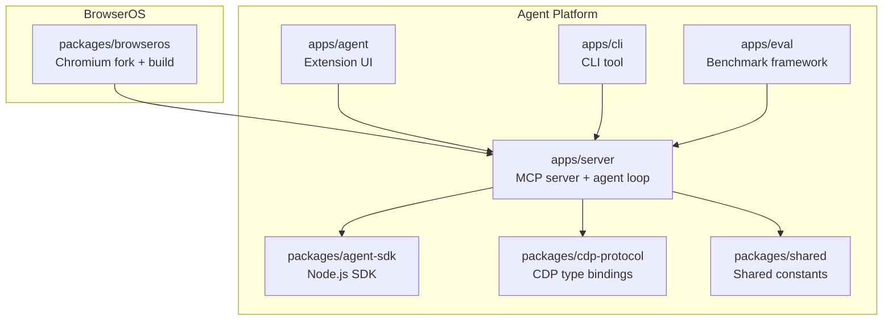
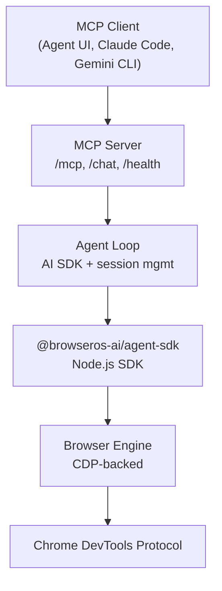
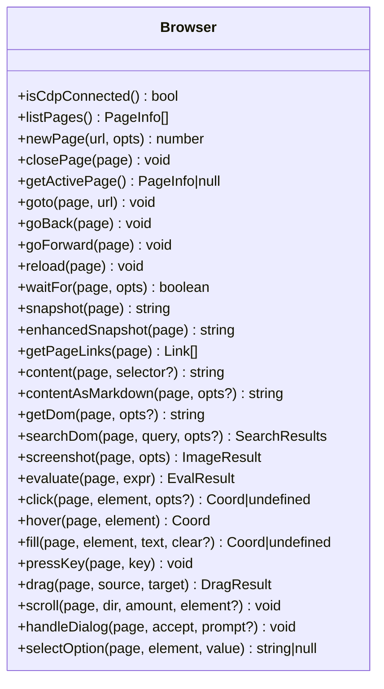
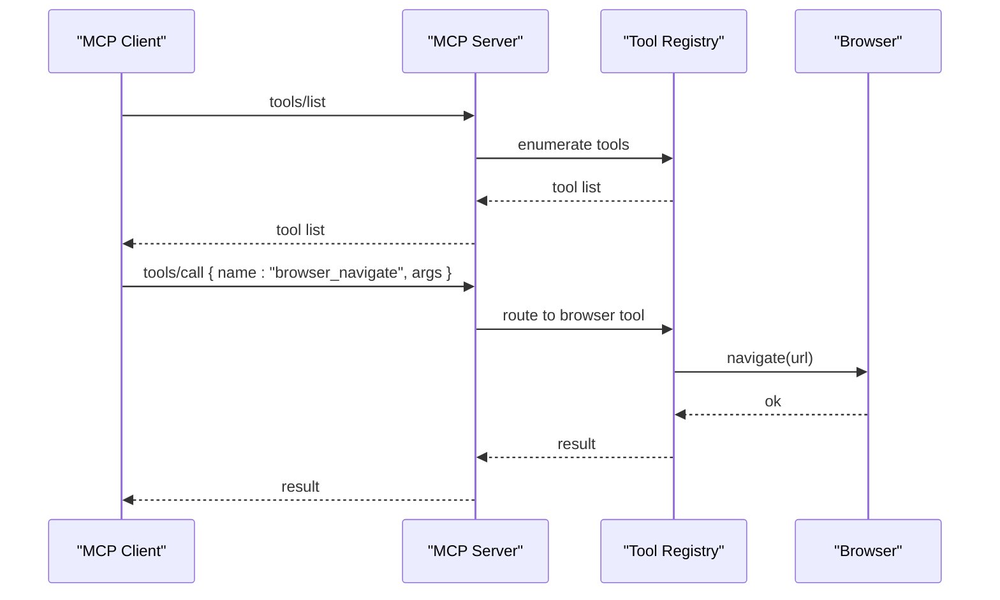
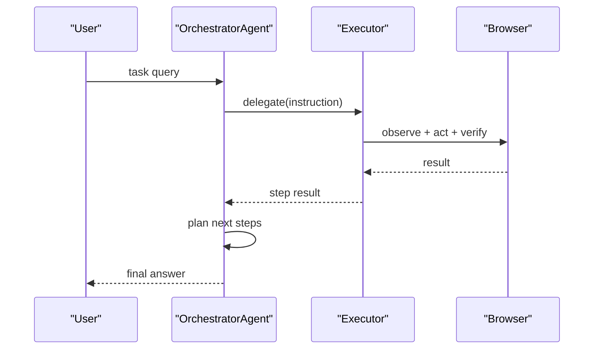
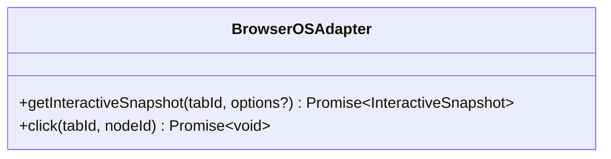
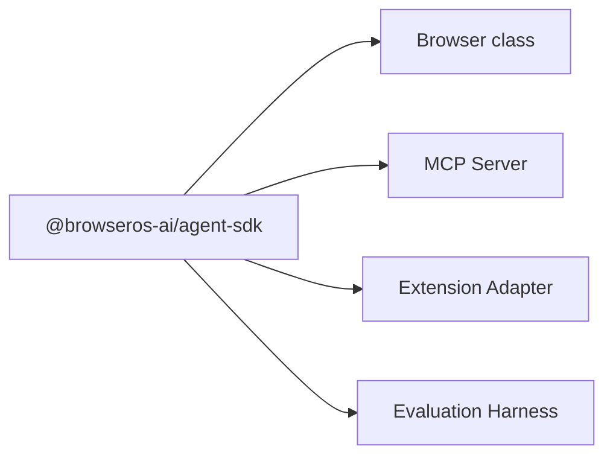

# Agent SDK

<cite>
**Referenced Files in This Document**
- [README.md](file://README.md)
- [packages/browseros-agent/README.md](file://packages/browseros-agent/README.md)
- [packages/browseros-agent/apps/server/src/browser/browser.ts](file://packages/browseros-agent/apps/server/src/browser/browser.ts)
- [packages/browseros-agent/apps/server/src/api/services/mcp/mcp-prompt.ts](file://packages/browseros-agent/apps/server/src/api/services/mcp/mcp-prompt.ts)
- [packages/browseros-agent/scripts/dev/mcp-test.sh](file://packages/browseros-agent/scripts/dev/mcp-test.sh)
- [packages/browseros-agent/apps/agent/lib/browseros/adapter.ts](file://packages/browseros-agent/apps/agent/lib/browseros/adapter.ts)
- [packages/browseros-agent/apps/agent/lib/credits/useCredits.ts](file://packages/browseros-agent/apps/agent/lib/credits/useCredits.ts)
- [packages/browseros-agent/apps/server/tests/server.integration.test.ts](file://packages/browseros-agent/apps/server/tests/server.integration.test.ts)
- [packages/browseros-agent/apps/eval/src/agents/orchestrator-executor/orchestrator-agent.ts](file://packages/browseros-agent/apps/eval/src/agents/orchestrator-executor/orchestrator-agent.ts)
- [packages/browseros-agent/apps/eval/src/agents/single-agent.ts](file://packages/browseros-agent/apps/eval/src/agents/single-agent.ts)
- [packages/browseros-agent/apps/eval/src/agents/orchestrated/backends/tool-loop/tool-loop-executor-backend.ts](file://packages/browseros-agent/apps/eval/src/agents/orchestrated/backends/tool-loop/tool-loop-executor-backend.ts)
- [docs/comparisons/chrome-devtools-mcp.mdx](file://docs/comparisons/chrome-devtools-mcp.mdx)
</cite>

## Table of Contents
1. [Introduction](#introduction)
2. [Project Structure](#project-structure)
3. [Core Components](#core-components)
4. [Architecture Overview](#architecture-overview)
5. [Detailed Component Analysis](#detailed-component-analysis)
6. [Dependency Analysis](#dependency-analysis)
7. [Performance Considerations](#performance-considerations)
8. [Troubleshooting Guide](#troubleshooting-guide)
9. [Conclusion](#conclusion)
10. [Appendices](#appendices)

## Introduction
This document describes the BrowserOS Agent SDK with a focus on the Node.js browser automation library that powers natural language browser automation. It explains the SDK architecture, browser control interfaces, automation utilities, and integration patterns with the main agent platform, tool registry system, and the Model Context Protocol (MCP). It also covers SDK usage examples, custom automation scenarios, performance optimization techniques, page interaction patterns, and error handling strategies.

## Project Structure
The repository is a monorepo containing:
- A Chromium-based browser (packages/browseros)
- An agent platform (packages/browseros-agent) with:
  - Server exposing MCP tools and an agent loop
  - Browser extension UI
  - CLI tool
  - Evaluation framework
  - Shared packages including the Node.js SDK (@browseros-ai/agent-sdk), CDP protocol bindings, and shared constants

**Diagram sources**
- [README.md:144-178](file://README.md#L144-L178)

**Section sources**
- [README.md:144-178](file://README.md#L144-L178)

## Core Components
- Browser abstraction: Provides a high-level API for page lifecycle, navigation, observation, input, and form helpers backed by Chrome DevTools Protocol (CDP).
- MCP server: Exposes 53+ browser tools and integrates with external services, enabling natural language-driven automation.
- Agent SDK: A Node.js SDK that offers typed browser control interfaces and utilities for building agent-driven automation.
- Tool registry and orchestration: Tools are discoverable and callable via MCP; orchestrators coordinate multi-step tasks.
- Extension adapter: Bridges browser extension APIs to the SDK for interactive snapshots and element clicks.
- CLI and evaluation: Utilities for testing, benchmarking, and validating automation flows.

**Section sources**
- [packages/browseros-agent/apps/server/src/browser/browser.ts:94-1467](file://packages/browseros-agent/apps/server/src/browser/browser.ts#L94-L1467)
- [packages/browseros-agent/README.md:33-62](file://packages/browseros-agent/README.md#L33-L62)
- [packages/browseros-agent/apps/agent/lib/browseros/adapter.ts:29-74](file://packages/browseros-agent/apps/agent/lib/browseros/adapter.ts#L29-L74)

## Architecture Overview
The Agent SDK sits between the MCP server and the browser automation engine. The server exposes tools over HTTP/SSE and streams chat responses. The SDK consumes these tools to drive the browser through CDP-backed operations.

**Diagram sources**
- [packages/browseros-agent/README.md:33-62](file://packages/browseros-agent/README.md#L33-L62)
- [packages/browseros-agent/apps/server/src/browser/browser.ts:94-1467](file://packages/browseros-agent/apps/server/src/browser/browser.ts#L94-L1467)

## Detailed Component Analysis

### Browser Control Interfaces
The Browser class encapsulates page lifecycle, navigation, observation, input, and form helpers. It manages CDP sessions, attaches to targets, and exposes methods for:
- Page management: list, create, close, get active page, refresh info
- Navigation: go to URL, go back/forward, reload, wait for conditions
- Observation: snapshot, enhanced snapshot, content extraction, DOM queries, screenshots
- Input: click, hover, type, drag, scroll, dialog handling, select option
- Form helpers: focus, check/uncheck, clear field, evaluate expressions

**Diagram sources**
- [packages/browseros-agent/apps/server/src/browser/browser.ts:94-1467](file://packages/browseros-agent/apps/server/src/browser/browser.ts#L94-L1467)

**Section sources**
- [packages/browseros-agent/apps/server/src/browser/browser.ts:94-1467](file://packages/browseros-agent/apps/server/src/browser/browser.ts#L94-L1467)

### MCP Tool Registry and Orchestration
The MCP server exposes a tool registry with 53+ tools covering tabs, navigation, input, screenshots, bookmarks, history, console, DOM, tab groups, windows, and more. The MCP prompt defines best practices for observation-act-verify cycles, obstacle handling, and error recovery.

**Diagram sources**
- [packages/browseros-agent/apps/server/src/api/services/mcp/mcp-prompt.ts:1-33](file://packages/browseros-agent/apps/server/src/api/services/mcp/mcp-prompt.ts#L1-L33)
- [packages/browseros-agent/scripts/dev/mcp-test.sh:1-143](file://packages/browseros-agent/scripts/dev/mcp-test.sh#L1-L143)

**Section sources**
- [packages/browseros-agent/apps/server/src/api/services/mcp/mcp-prompt.ts:1-33](file://packages/browseros-agent/apps/server/src/api/services/mcp/mcp-prompt.ts#L1-L33)
- [packages/browseros-agent/scripts/dev/mcp-test.sh:1-143](file://packages/browseros-agent/scripts/dev/mcp-test.sh#L1-L143)

### Agent Orchestration and Tool Loop
Agents use an orchestrator pattern to break tasks into goal-level steps and delegate to executors. The orchestrator-agent coordinates tool usage and produces a final answer. The tool-loop executor backend builds a browser context from current tabs and pages.

**Diagram sources**
- [packages/browseros-agent/apps/eval/src/agents/orchestrator-executor/orchestrator-agent.ts:1-29](file://packages/browseros-agent/apps/eval/src/agents/orchestrator-executor/orchestrator-agent.ts#L1-L29)
- [packages/browseros-agent/apps/eval/src/agents/orchestrated/backends/tool-loop/tool-loop-executor-backend.ts:122-144](file://packages/browseros-agent/apps/eval/src/agents/orchestrated/backends/tool-loop/tool-loop-executor-backend.ts#L122-L144)

**Section sources**
- [packages/browseros-agent/apps/eval/src/agents/orchestrator-executor/orchestrator-agent.ts:1-29](file://packages/browseros-agent/apps/eval/src/agents/orchestrator-executor/orchestrator-agent.ts#L1-L29)
- [packages/browseros-agent/apps/eval/src/agents/single-agent.ts:30-72](file://packages/browseros-agent/apps/eval/src/agents/single-agent.ts#L30-L72)
- [packages/browseros-agent/apps/eval/src/agents/orchestrated/backends/tool-loop/tool-loop-executor-backend.ts:122-144](file://packages/browseros-agent/apps/eval/src/agents/orchestrated/backends/tool-loop/tool-loop-executor-backend.ts#L122-L144)

### Extension Adapter and Interactive Snapshots
The extension adapter exposes methods to obtain interactive snapshots and perform element clicks from the browser extension context. These utilities bridge extension APIs to the SDK.

**Diagram sources**
- [packages/browseros-agent/apps/agent/lib/browseros/adapter.ts:29-74](file://packages/browseros-agent/apps/agent/lib/browseros/adapter.ts#L29-L74)

**Section sources**
- [packages/browseros-agent/apps/agent/lib/browseros/adapter.ts:29-74](file://packages/browseros-agent/apps/agent/lib/browseros/adapter.ts#L29-L74)

### SDK Types and Interfaces
The SDK exposes typed browser control interfaces and utilities for agent development. While the exact TypeScript definitions are not included here, the SDK’s responsibilities include:
- Typed wrappers around Browser methods
- Utility functions for common automation patterns
- Integration helpers for MCP tool invocation
- Error handling and retry strategies

[No sources needed since this section provides a conceptual overview]

### Browser Automation Capabilities
Capabilities include:
- Natural language-driven navigation and interaction
- Element-centric operations using IDs from snapshots
- Robust observation-act-verify loops with retries and error recovery
- Support for external integrations via MCP connectors

**Section sources**
- [packages/browseros-agent/apps/server/src/api/services/mcp/mcp-prompt.ts:1-33](file://packages/browseros-agent/apps/server/src/api/services/mcp/mcp-prompt.ts#L1-L33)

### Utility Functions for Agent Development
Utilities include:
- Snapshot builders for interactive and enhanced views
- DOM search and content extraction helpers
- Screenshot capture with device pixel ratio awareness
- Form helpers for filling, selecting, and focusing elements
- Scroll and drag utilities with fallbacks

**Section sources**
- [packages/browseros-agent/apps/server/src/browser/browser.ts:525-702](file://packages/browseros-agent/apps/server/src/browser/browser.ts#L525-L702)
- [packages/browseros-agent/apps/server/src/browser/browser.ts:734-824](file://packages/browseros-agent/apps/server/src/browser/browser.ts#L734-L824)

### Integration Patterns
- MCP protocol: Tools are discoverable and callable via JSON-RPC over HTTP/SSE
- Agent platform: The server runs the AI loop and orchestrates tool usage
- Tool registry: Centralized tool definitions enable consistent behavior across clients
- External integrations: Connector servers enable authentication and discovery for 40+ services

**Section sources**
- [packages/browseros-agent/README.md:33-62](file://packages/browseros-agent/README.md#L33-L62)
- [packages/browseros-agent/apps/server/src/api/services/mcp/mcp-prompt.ts:26-33](file://packages/browseros-agent/apps/server/src/api/services/mcp/mcp-prompt.ts#L26-L33)

### SDK Usage Examples
Examples of typical automation tasks:
- Observe the page, click a link by ID, verify navigation, and extract content
- Fill forms, select options, and submit
- Take screenshots and capture page content as Markdown
- Manage tabs and windows, including hidden windows for background tasks

**Section sources**
- [packages/browseros-agent/scripts/dev/mcp-test.sh:43-143](file://packages/browseros-agent/scripts/dev/mcp-test.sh#L43-L143)

### Custom Automation Scenarios
Custom scenarios can leverage:
- The orchestrator-agent to decompose complex tasks
- Tool-loop executor backend to maintain browser context
- Extension adapter for interactive snapshots and clicks
- Evaluation harness to validate and benchmark automation flows

**Section sources**
- [packages/browseros-agent/apps/eval/src/agents/orchestrator-executor/orchestrator-agent.ts:1-29](file://packages/browseros-agent/apps/eval/src/agents/orchestrator-executor/orchestrator-agent.ts#L1-L29)
- [packages/browseros-agent/apps/eval/src/agents/single-agent.ts:30-72](file://packages/browseros-agent/apps/eval/src/agents/single-agent.ts#L30-L72)

### Performance Optimization Techniques
Techniques include:
- Efficient snapshot usage: take snapshots before interactions and re-snapshot after navigation
- Conditional waits: use waitFor with selectors or text to avoid busy-waiting
- Batch operations: group related actions to minimize round trips
- Screenshot optimization: choose appropriate format and quality to balance fidelity and speed
- Scroll and drag: prefer element-centered operations to reduce unnecessary movement

**Section sources**
- [packages/browseros-agent/apps/server/src/browser/browser.ts:448-477](file://packages/browseros-agent/apps/server/src/browser/browser.ts#L448-L477)
- [packages/browseros-agent/apps/server/src/browser/browser.ts:666-702](file://packages/browseros-agent/apps/server/src/browser/browser.ts#L666-L702)

### Page Interaction Patterns
Patterns include:
- Observation: snapshot or enhancedSnapshot to discover interactive elements
- Action: click, fill, selectOption, pressKey, drag, scroll
- Verification: waitFor, content checks, evaluate expressions
- Recovery: re-snapshot after navigation, handle dialogs, and retry on failure

**Section sources**
- [packages/browseros-agent/apps/server/src/browser/browser.ts:525-702](file://packages/browseros-agent/apps/server/src/browser/browser.ts#L525-L702)
- [packages/browseros-agent/apps/server/src/browser/browser.ts:828-1036](file://packages/browseros-agent/apps/server/src/browser/browser.ts#L828-L1036)

### Error Handling Strategies
Strategies include:
- Graceful handling of missing elements: re-snapshot, scroll, and retry
- Dialog handling: accept or dismiss prompts as needed
- Load state verification: wait for document ready before proceeding
- Fallbacks: JS-based clicks when CDP clicks fail; window scroll fallbacks when wheel events do not move the viewport

**Section sources**
- [packages/browseros-agent/apps/server/src/browser/browser.ts:1077-1087](file://packages/browseros-agent/apps/server/src/browser/browser.ts#L1077-L1087)
- [packages/browseros-agent/apps/server/src/browser/browser.ts:418-446](file://packages/browseros-agent/apps/server/src/browser/browser.ts#L418-L446)
- [packages/browseros-agent/apps/server/src/browser/browser.ts:848-855](file://packages/browseros-agent/apps/server/src/browser/browser.ts#L848-L855)
- [packages/browseros-agent/apps/server/src/browser/browser.ts:1066-1075](file://packages/browseros-agent/apps/server/src/browser/browser.ts#L1066-L1075)

## Dependency Analysis
The Agent SDK depends on:
- Browser abstraction for CDP-backed operations
- MCP server for tool discovery and invocation
- Extension adapter for interactive snapshots and clicks
- Evaluation framework for testing and benchmarking

**Diagram sources**
- [packages/browseros-agent/apps/server/src/browser/browser.ts:94-1467](file://packages/browseros-agent/apps/server/src/browser/browser.ts#L94-L1467)
- [packages/browseros-agent/apps/agent/lib/browseros/adapter.ts:29-74](file://packages/browseros-agent/apps/agent/lib/browseros/adapter.ts#L29-L74)

**Section sources**
- [packages/browseros-agent/apps/server/src/browser/browser.ts:94-1467](file://packages/browseros-agent/apps/server/src/browser/browser.ts#L94-L1467)
- [packages/browseros-agent/apps/agent/lib/browseros/adapter.ts:29-74](file://packages/browseros-agent/apps/agent/lib/browseros/adapter.ts#L29-L74)

## Performance Considerations
- Prefer element IDs from snapshots to avoid brittle selectors
- Use targeted waits and retries rather than fixed timeouts
- Minimize screenshot frequency and choose optimal image formats
- Batch DOM queries and avoid excessive reflows
- Use hidden windows for background tasks to reduce UI overhead

[No sources needed since this section provides general guidance]

## Troubleshooting Guide
Common issues and resolutions:
- Tool discovery failures: verify MCP server connectivity and tool availability
- Navigation errors: ensure load completion before subsequent actions
- Element not found: re-snapshot, scroll into view, and retry
- Dialog blocking: handle dialogs promptly with accept/dismiss
- Authentication flows: integrate with connector servers and follow MCP instructions

**Section sources**
- [packages/browseros-agent/apps/server/tests/server.integration.test.ts:88-126](file://packages/browseros-agent/apps/server/tests/server.integration.test.ts#L88-L126)
- [packages/browseros-agent/apps/server/src/api/services/mcp/mcp-prompt.ts:17-33](file://packages/browseros-agent/apps/server/src/api/services/mcp/mcp-prompt.ts#L17-L33)

## Conclusion
The BrowserOS Agent SDK provides a robust, natural language–driven browser automation framework built on a strong MCP tool ecosystem and CDP-backed browser controls. Its integration patterns, orchestration utilities, and performance-conscious design enable agents to reliably automate complex browser tasks while remaining extensible and maintainable.

[No sources needed since this section summarizes without analyzing specific files]

## Appendices

### MCP Tool Comparison
BrowserOS MCP provides 53 tools compared to 29 in Chrome DevTools MCP, with built-in external integrations and simplified setup.

**Section sources**
- [docs/comparisons/chrome-devtools-mcp.mdx:1-29](file://docs/comparisons/chrome-devtools-mcp.mdx#L1-L29)