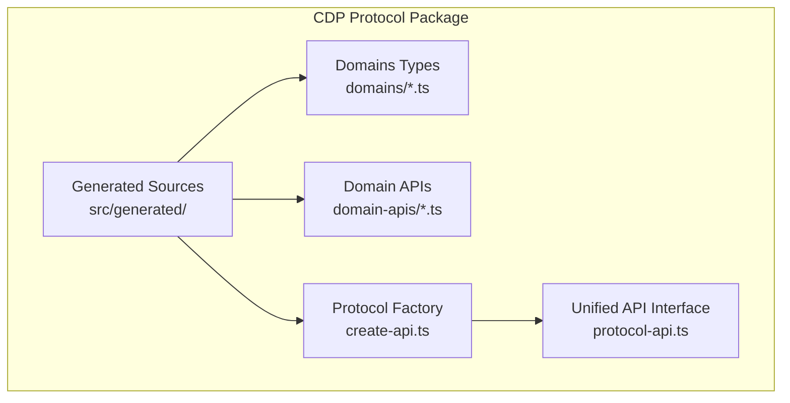
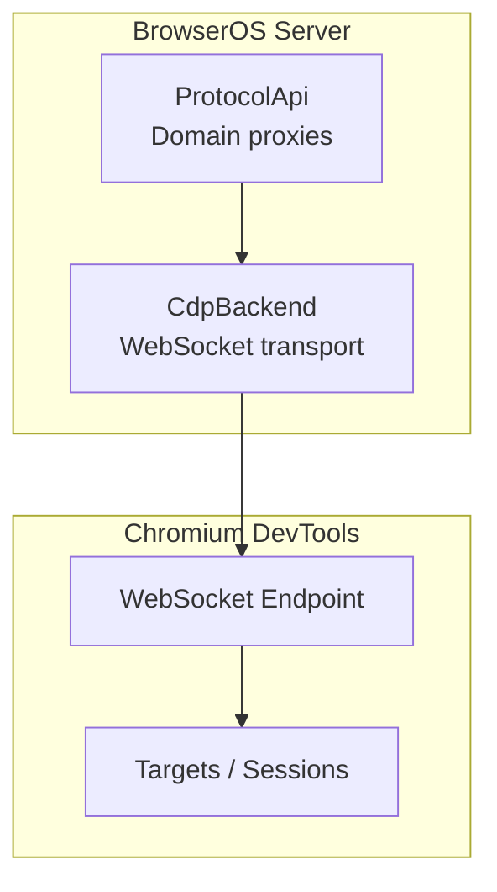
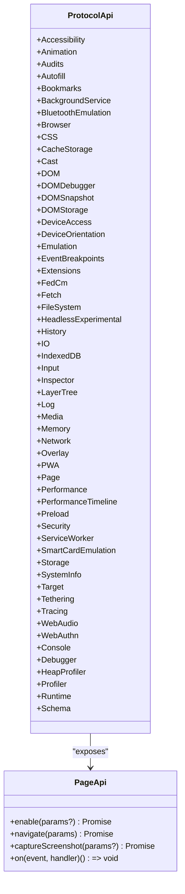
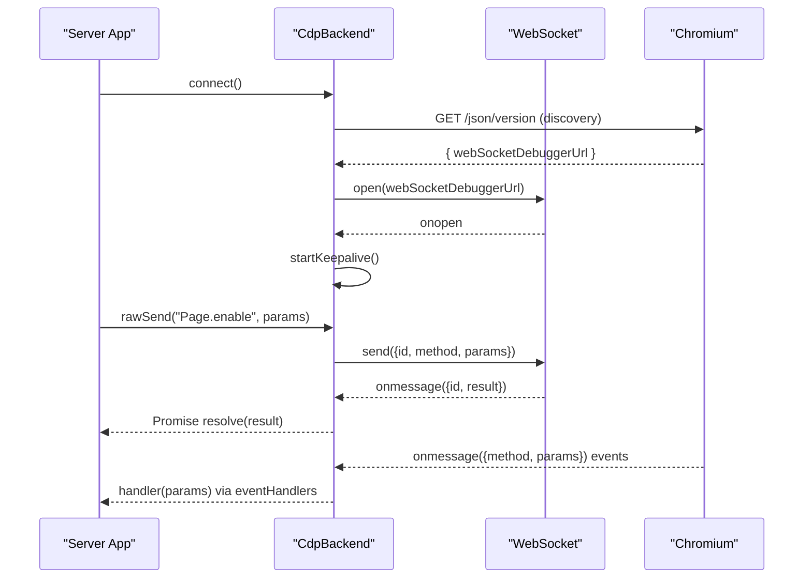
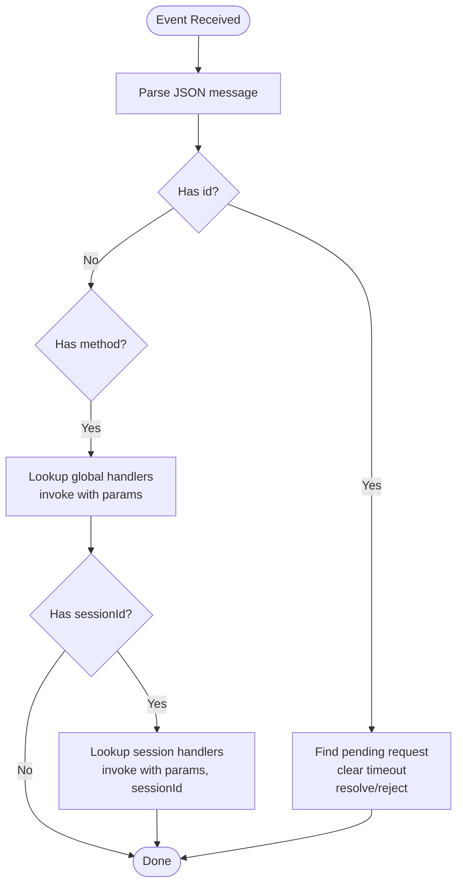
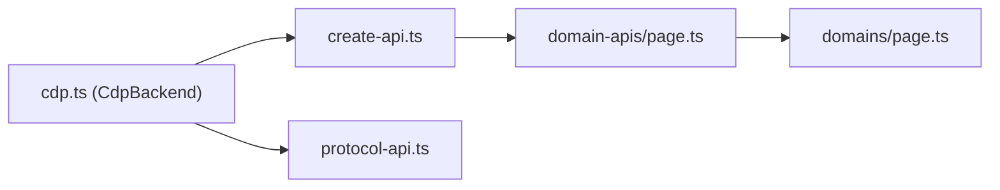

# CDP Protocol

<cite>
**Referenced Files in This Document**
- [README.md](file://packages/browseros-agent/packages/cdp-protocol/README.md)
- [package.json](file://packages/browseros-agent/packages/cdp-protocol/package.json)
- [create-api.ts](file://packages/browseros-agent/packages/cdp-protocol/src/generated/create-api.ts)
- [protocol-api.ts](file://packages/browseros-agent/packages/cdp-protocol/src/generated/protocol-api.ts)
- [page.ts (domain API)](file://packages/browseros-agent/packages/cdp-protocol/src/generated/domain-apis/page.ts)
- [page.ts (domain types)](file://packages/browseros-agent/packages/cdp-protocol/src/generated/domains/page.ts)
- [bookmarks.ts (domain API)](file://packages/browseros-agent/packages/cdp-protocol/src/generated/domain-apis/bookmarks.ts)
- [history.ts (domain API)](file://packages/browseros-agent/packages/cdp-protocol/src/generated/domain-apis/history.ts)
- [bookmarks.ts (domain types)](file://packages/browseros-agent/packages/cdp-protocol/src/generated/domains/bookmarks.ts)
- [history.ts (domain types)](file://packages/browseros-agent/packages/cdp-protocol/src/generated/domains/history.ts)
- [cdp.ts](file://packages/browseros-agent/apps/server/src/browser/backends/cdp.ts)
- [cdp.test.ts](file://packages/browseros-agent/apps/server/tests/browser/backends/cdp.test.ts)
</cite>

## Table of Contents
1. [Introduction](#introduction)
2. [Project Structure](#project-structure)
3. [Core Components](#core-components)
4. [Architecture Overview](#architecture-overview)
5. [Detailed Component Analysis](#detailed-component-analysis)
6. [Dependency Analysis](#dependency-analysis)
7. [Performance Considerations](#performance-considerations)
8. [Troubleshooting Guide](#troubleshooting-guide)
9. [Conclusion](#conclusion)
10. [Appendices](#appendices)

## Introduction
This document describes the BrowserOS CDP Protocol package that provides type-safe Chrome DevTools Protocol (CDP) bindings for the BrowserOS ecosystem. It covers protocol type definitions, domain implementations, TypeScript interfaces, message serialization/deserialization, event handling patterns, integration with the browser automation backend, and debugging capabilities. It also explains how the package relates to the broader agent platform architecture and how to extend the protocol with custom domains.

## Project Structure
The CDP Protocol package is an internal, auto-generated TypeScript library exporting:
- Domain type definitions for every CDP domain
- Domain API wrapper interfaces for each domain
- A unified ProtocolApi type
- A factory to create typed protocol clients

**Diagram sources**
- [README.md:43-59](file://packages/browseros-agent/packages/cdp-protocol/README.md#L43-L59)
- [package.json:8-464](file://packages/browseros-agent/packages/cdp-protocol/package.json#L8-L464)

Key characteristics:
- Auto-generated from the official CDP protocol specification
- Subpath exports for domains and domain-apis
- Unified ProtocolApi interface aggregates all domain APIs
- Factory function creates typed proxies per domain

**Section sources**
- [README.md:1-90](file://packages/browseros-agent/packages/cdp-protocol/README.md#L1-L90)
- [package.json:1-467](file://packages/browseros-agent/packages/cdp-protocol/package.json#L1-L467)

## Core Components
- ProtocolApi: A single interface exposing all CDP domains as typed APIs.
- createProtocolApi: Factory that injects a transport layer (rawSend/rawOn) into domain proxies.
- Domain APIs: Per-domain interfaces that define commands and events with strongly typed parameters/results.
- Domain Types: Generated TypeScript types for parameters, results, and events.

Usage highlights:
- Import domain types or domain API wrappers using subpath exports
- Use ProtocolAPI for the unified interface
- Use createAPI to bind a transport to the protocol

**Section sources**
- [protocol-api.ts:60-117](file://packages/browseros-agent/packages/cdp-protocol/src/generated/protocol-api.ts#L60-L117)
- [create-api.ts:28-87](file://packages/browseros-agent/packages/cdp-protocol/src/generated/create-api.ts#L28-L87)
- [README.md:7-23](file://packages/browseros-agent/packages/cdp-protocol/README.md#L7-L23)

## Architecture Overview
The BrowserOS server integrates with Chromium via CDP. The CDP Protocol package provides type-safe bindings. The backend encapsulates WebSocket transport, request/response lifecycle, and event routing.

**Diagram sources**
- [cdp.ts:32-60](file://packages/browseros-agent/apps/server/src/browser/backends/cdp.ts#L32-L60)
- [create-api.ts:28-87](file://packages/browseros-agent/packages/cdp-protocol/src/generated/create-api.ts#L28-L87)

## Detailed Component Analysis

### Protocol Factory and Domain Proxies
The factory creates a ProtocolApi by injecting a transport into domain proxies. Each domain exposes:
- Command methods (typed parameters -> Promise<result>)
- An on(event, handler) method for event subscriptions

**Diagram sources**
- [protocol-api.ts:60-117](file://packages/browseros-agent/packages/cdp-protocol/src/generated/protocol-api.ts#L60-L117)
- [page.ts (domain API):94-298](file://packages/browseros-agent/packages/cdp-protocol/src/generated/domain-apis/page.ts#L94-L298)

**Section sources**
- [create-api.ts:15-26](file://packages/browseros-agent/packages/cdp-protocol/src/generated/create-api.ts#L15-L26)
- [create-api.ts:28-87](file://packages/browseros-agent/packages/cdp-protocol/src/generated/create-api.ts#L28-L87)
- [page.ts (domain API):94-298](file://packages/browseros-agent/packages/cdp-protocol/src/generated/domain-apis/page.ts#L94-L298)

### Message Serialization and Transport
The backend implements WebSocket transport with:
- Discovery of /json/version to obtain the debugger WebSocket URL
- Connection with timeouts and retries
- Keepalive pings to detect dead connections
- Request/response correlation via message IDs
- Event routing to global and session-aware handlers
- Session support via optional sessionId

**Diagram sources**
- [cdp.ts:62-142](file://packages/browseros-agent/apps/server/src/browser/backends/cdp.ts#L62-L142)
- [cdp.ts:392-432](file://packages/browseros-agent/apps/server/src/browser/backends/cdp.ts#L392-L432)
- [cdp.ts:471-512](file://packages/browseros-agent/apps/server/src/browser/backends/cdp.ts#L471-L512)

**Section sources**
- [cdp.ts:62-142](file://packages/browseros-agent/apps/server/src/browser/backends/cdp.ts#L62-L142)
- [cdp.ts:199-217](file://packages/browseros-agent/apps/server/src/browser/backends/cdp.ts#L199-L217)
- [cdp.ts:219-246](file://packages/browseros-agent/apps/server/src/browser/backends/cdp.ts#L219-L246)
- [cdp.ts:392-432](file://packages/browseros-agent/apps/server/src/browser/backends/cdp.ts#L392-L432)
- [cdp.ts:471-512](file://packages/browseros-agent/apps/server/src/browser/backends/cdp.ts#L471-L512)

### Event Handling Patterns
The backend supports:
- Global event handlers for domain events
- Session-aware event handlers when sessionId is present
- Handler registration and removal via returned unsubscribe functions

**Diagram sources**
- [cdp.ts:471-512](file://packages/browseros-agent/apps/server/src/browser/backends/cdp.ts#L471-L512)

**Section sources**
- [cdp.ts:434-469](file://packages/browseros-agent/apps/server/src/browser/backends/cdp.ts#L434-L469)
- [cdp.ts:471-512](file://packages/browseros-agent/apps/server/src/browser/backends/cdp.ts#L471-L512)

### Protocol Domains Coverage
The package supports all standard CDP domains plus BrowserOS custom domains:
- Page & DOM: Page, DOM, DOMDebugger, DOMSnapshot, DOMStorage, CSS, Overlay
- Network: Network, Fetch, IO, ServiceWorker, CacheStorage
- Input & Interaction: Input, Emulation, DeviceOrientation, DeviceAccess
- JavaScript: Runtime, Debugger, Console, Profiler, HeapProfiler
- Browser: Browser, Target, Inspector, Extensions, PWA
- Performance: Performance, PerformanceTimeline, Tracing, Memory
- Media: Media, WebAudio, Cast
- Security: Security, WebAuthn, FedCm
- Storage: IndexedDB, Storage, FileSystem
- Other: Accessibility, Animation, Audits, Autofill, BackgroundService, BluetoothEmulation, EventBreakpoints, HeadlessExperimental, LayerTree, Log, Preload, Schema, SystemInfo, Tethering
- BrowserOS Custom: Bookmarks, History

**Section sources**
- [README.md:25-41](file://packages/browseros-agent/packages/cdp-protocol/README.md#L25-L41)

### Custom Domain Extensions
BrowserOS extends the protocol with custom domains:
- Bookmarks: CRUD operations for bookmarks
- History: Search, recent entries, deletion by URL/range

These are exposed via domain APIs and types, enabling type-safe automation of browser-native features.

**Section sources**
- [bookmarks.ts (domain API):17-26](file://packages/browseros-agent/packages/cdp-protocol/src/generated/domain-apis/bookmarks.ts#L17-L26)
- [history.ts (domain API):12-19](file://packages/browseros-agent/packages/cdp-protocol/src/generated/domain-apis/history.ts#L12-L19)
- [bookmarks.ts (domain types):5-73](file://packages/browseros-agent/packages/cdp-protocol/src/generated/domains/bookmarks.ts#L5-L73)
- [history.ts (domain types):5-45](file://packages/browseros-agent/packages/cdp-protocol/src/generated/domains/history.ts#L5-L45)

### Protocol Usage Examples
- Import domain types or domain API wrappers using subpath exports
- Use ProtocolAPI for the unified interface
- Use createAPI to bind a transport to the protocol

Example references:
- [README.md:9-23](file://packages/browseros-agent/packages/cdp-protocol/README.md#L9-L23)

**Section sources**
- [README.md:9-23](file://packages/browseros-agent/packages/cdp-protocol/README.md#L9-L23)

### Debugging Scenarios
Common scenarios handled by the backend:
- Connection establishment with discovery and fallback hosts
- Reconnection loops with retry limits and delays
- Keepalive detection of dead connections
- Graceful disconnection and rejection of pending requests
- Session management for multiplexed targets

**Section sources**
- [cdp.ts:62-85](file://packages/browseros-agent/apps/server/src/browser/backends/cdp.ts#L62-L85)
- [cdp.ts:156-177](file://packages/browseros-agent/apps/server/src/browser/backends/cdp.ts#L156-L177)
- [cdp.ts:290-298](file://packages/browseros-agent/apps/server/src/browser/backends/cdp.ts#L290-L298)
- [cdp.ts:320-350](file://packages/browseros-agent/apps/server/src/browser/backends/cdp.ts#L320-L350)
- [cdp.ts:352-361](file://packages/browseros-agent/apps/server/src/browser/backends/cdp.ts#L352-L361)
- [cdp.ts:311-318](file://packages/browseros-agent/apps/server/src/browser/backends/cdp.ts#L311-L318)

### Relationship to Agent Platform Architecture
- The backend integrates BrowserOS server with Chromium’s CDP endpoint
- The protocol package provides type-safe abstractions for automation tasks
- Custom domains (Bookmarks, History) extend BrowserOS capabilities beyond standard CDP

**Section sources**
- [cdp.ts:32-60](file://packages/browseros-agent/apps/server/src/browser/backends/cdp.ts#L32-L60)
- [README.md:3-5](file://packages/browseros-agent/packages/cdp-protocol/README.md#L3-L5)

## Dependency Analysis
The backend depends on the protocol package for:
- Typed domain APIs
- Unified ProtocolApi interface
- Factory to bind transport

**Diagram sources**
- [cdp.ts:1-12](file://packages/browseros-agent/apps/server/src/browser/backends/cdp.ts#L1-L12)
- [create-api.ts:1-13](file://packages/browseros-agent/packages/cdp-protocol/src/generated/create-api.ts#L1-L13)
- [protocol-api.ts:1-59](file://packages/browseros-agent/packages/cdp-protocol/src/generated/protocol-api.ts#L1-L59)
- [page.ts (domain API):1-18](file://packages/browseros-agent/packages/cdp-protocol/src/generated/domain-apis/page.ts#L1-L18)
- [page.ts (domain types):1-20](file://packages/browseros-agent/packages/cdp-protocol/src/generated/domains/page.ts#L1-L20)

**Section sources**
- [cdp.ts:1-12](file://packages/browseros-agent/apps/server/src/browser/backends/cdp.ts#L1-L12)
- [create-api.ts:1-13](file://packages/browseros-agent/packages/cdp-protocol/src/generated/create-api.ts#L1-L13)
- [protocol-api.ts:1-59](file://packages/browseros-agent/packages/cdp-protocol/src/generated/protocol-api.ts#L1-L59)

## Performance Considerations
- Keepalive mechanism detects dead connections proactively to avoid hanging requests
- Retry and backoff strategies for connection and reconnection reduce downtime
- Pending request timeouts prevent resource leaks
- Session caching avoids recreating protocol clients for the same target

Recommendations:
- Tune keepalive intervals and timeouts according to environment stability
- Monitor pending request counts and adjust request timeouts
- Use sessions judiciously to minimize overhead

**Section sources**
- [cdp.ts:219-246](file://packages/browseros-agent/apps/server/src/browser/backends/cdp.ts#L219-L246)
- [cdp.ts:320-350](file://packages/browseros-agent/apps/server/src/browser/backends/cdp.ts#L320-L350)
- [cdp.ts:412-432](file://packages/browseros-agent/apps/server/src/browser/backends/cdp.ts#L412-L432)

## Troubleshooting Guide
Common issues and diagnostics:
- Connection failures: Discovery via multiple loopback hosts, preferred host caching, and retry loops
- Unexpected close: Triggers reconnection loop and rejection of pending requests
- Dead connection detection: Keepalive failures initiate forced closure and reconnection
- Timeout handling: Requests time out after configured duration; inspect pending map and timers
- Session events: Ensure sessionId presence for session-scoped event routing

Validation tests demonstrate:
- Host fallback behavior for /json/version
- Preferred host reuse during reconnect
- Reconnection queuing when sockets close mid-reconnect
- Disabling process exit on exhaustion

**Section sources**
- [cdp.ts:144-177](file://packages/browseros-agent/apps/server/src/browser/backends/cdp.ts#L144-L177)
- [cdp.ts:276-298](file://packages/browseros-agent/apps/server/src/browser/backends/cdp.ts#L276-L298)
- [cdp.ts:259-274](file://packages/browseros-agent/apps/server/src/browser/backends/cdp.ts#L259-L274)
- [cdp.ts:412-432](file://packages/browseros-agent/apps/server/src/browser/backends/cdp.ts#L412-L432)
- [cdp.test.ts:105-122](file://packages/browseros-agent/apps/server/tests/browser/backends/cdp.test.ts#L105-L122)
- [cdp.test.ts:124-143](file://packages/browseros-agent/apps/server/tests/browser/backends/cdp.test.ts#L124-L143)
- [cdp.test.ts:145-170](file://packages/browseros-agent/apps/server/tests/browser/backends/cdp.test.ts#L145-L170)
- [cdp.test.ts:172-197](file://packages/browseros-agent/apps/server/tests/browser/backends/cdp.test.ts#L172-L197)

## Conclusion
The BrowserOS CDP Protocol package delivers robust, type-safe bindings for the Chrome DevTools Protocol, enabling precise browser automation and debugging. The backend provides resilient transport with discovery, reconnection, and event routing. Custom domains extend BrowserOS capabilities, and the architecture cleanly integrates with the broader agent platform.

## Appendices

### Protocol Domains Reference
- Standard domains: All CDP domains listed in the package README
- BrowserOS custom domains: Bookmarks, History

**Section sources**
- [README.md:25-41](file://packages/browseros-agent/packages/cdp-protocol/README.md#L25-L41)

### Generated Types and API Contracts
- Domain types: Strongly typed parameters, results, and enums
- Domain APIs: Command methods and event handlers
- Protocol API: Unified interface aggregating all domains

**Section sources**
- [page.ts (domain types):1-800](file://packages/browseros-agent/packages/cdp-protocol/src/generated/domains/page.ts#L1-L800)
- [page.ts (domain API):94-298](file://packages/browseros-agent/packages/cdp-protocol/src/generated/domain-apis/page.ts#L94-L298)
- [protocol-api.ts:60-117](file://packages/browseros-agent/packages/cdp-protocol/src/generated/protocol-api.ts#L60-L117)