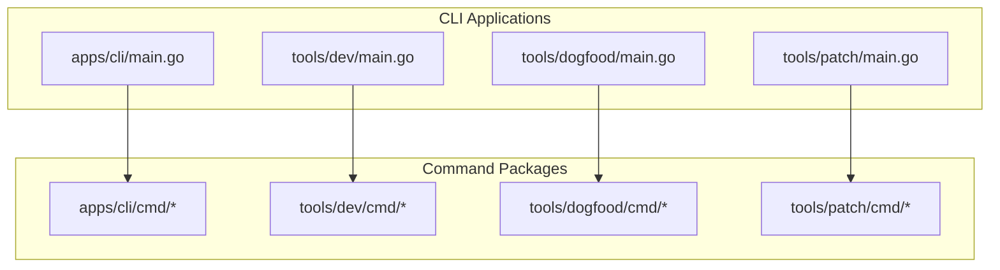
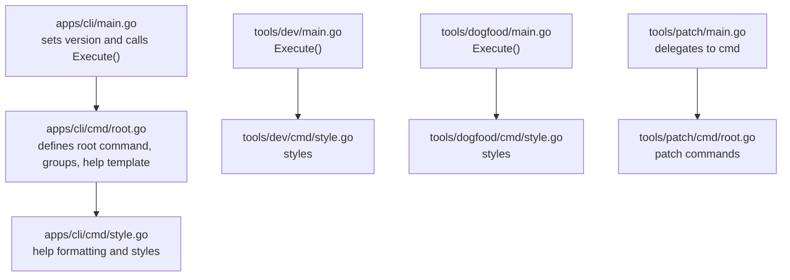
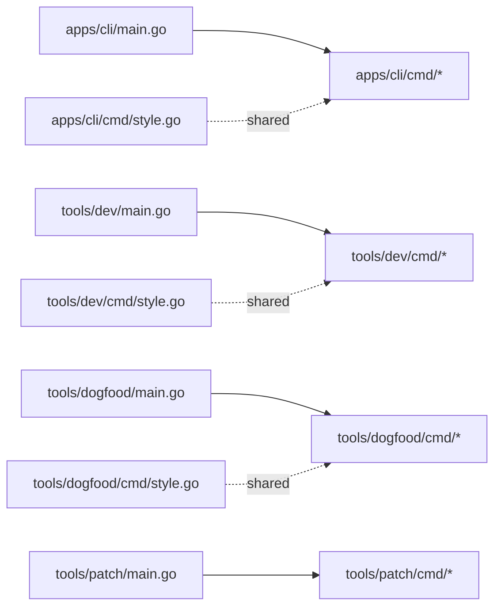

# CLI Tool

<cite>
**Referenced Files in This Document**
- [main.go](file://packages/browseros-agent/apps/cli/main.go)
- [root.go](file://packages/browseros-agent/apps/cli/cmd/root.go)
- [style.go](file://packages/browseros-agent/apps/cli/cmd/style.go)
- [main.go](file://packages/browseros-agent/tools/dev/main.go)
- [style.go](file://packages/browseros-agent/tools/dev/cmd/style.go)
- [main.go](file://packages/browseros-agent/tools/dogfood/main.go)
- [style.go](file://packages/browseros-agent/tools/dogfood/cmd/style.go)
- [main.go](file://packages/browseros/tools/patch/main.go)
- [root.go](file://packages/browseros/tools/patch/cmd/root.go)
- [common.go](file://packages/browseros/tools/patch/cmd/common.go)
</cite>

## Table of Contents
1. [Introduction](#introduction)
2. [Project Structure](#project-structure)
3. [Core Components](#core-components)
4. [Architecture Overview](#architecture-overview)
5. [Detailed Component Analysis](#detailed-component-analysis)
6. [Dependency Analysis](#dependency-analysis)
7. [Performance Considerations](#performance-considerations)
8. [Troubleshooting Guide](#troubleshooting-guide)
9. [Conclusion](#conclusion)

## Introduction
This document describes the BrowserOS CLI toolchain built with the Cobra framework. It covers the root command setup, version management, subcommand organization, help formatting, and integration points with the BrowserOS server and agent platform. It also provides usage patterns, automation guidance, and debugging techniques for CLI operations.

## Project Structure
The CLI toolchain consists of multiple applications under the BrowserOS ecosystem:
- apps/cli: primary CLI application entrypoint and command definitions
- tools/dev: developer-focused CLI tool
- tools/dogfood: internal dogfooding CLI tool
- tools/patch: patch management CLI under the browseros package

Each application follows a similar pattern: a small main.go that delegates to a cmd package, which defines the root command, subcommands, and shared styling helpers.

**Diagram sources**
- [main.go:1-11](file://packages/browseros-agent/apps/cli/main.go#L1-L11)
- [main.go:1-8](file://packages/browseros-agent/tools/dev/main.go#L1-L8)
- [main.go:1-8](file://packages/browseros-agent/tools/dogfood/main.go#L1-L8)
- [main.go:1-10](file://packages/browseros/tools/patch/main.go#L1-L10)

**Section sources**
- [main.go:1-11](file://packages/browseros-agent/apps/cli/main.go#L1-L11)
- [main.go:1-8](file://packages/browseros-agent/tools/dev/main.go#L1-L8)
- [main.go:1-8](file://packages/browseros-agent/tools/dogfood/main.go#L1-L8)
- [main.go:1-10](file://packages/browseros/tools/patch/main.go#L1-L10)

## Core Components
- Root command initialization and version management
- Subcommand registration and grouping
- Help formatting and styling utilities
- Application entrypoints delegating to cmd.Execute()

Key implementation patterns:
- Version is set via a package-level variable and passed to the root command during startup
- Commands are grouped for improved help readability
- Shared styling helpers provide consistent terminal output formatting

**Section sources**
- [main.go:5-10](file://packages/browseros-agent/apps/cli/main.go#L5-L10)
- [root.go:59-108](file://packages/browseros-agent/apps/cli/cmd/root.go#L59-L108)
- [style.go:1-73](file://packages/browseros-agent/apps/cli/cmd/style.go#L1-L73)

## Architecture Overview
The CLI architecture centers on Cobra with a layered approach:
- Entry points (main.go) initialize version and invoke cmd.Execute()
- Root command configures global flags, persistent flags, and help templates
- Subcommands are organized into logical groups
- Shared styling utilities enhance readability and UX

**Diagram sources**
- [main.go:5-10](file://packages/browseros-agent/apps/cli/main.go#L5-L10)
- [root.go:59-108](file://packages/browseros-agent/apps/cli/cmd/root.go#L59-L108)
- [style.go:1-73](file://packages/browseros-agent/apps/cli/cmd/style.go#L1-L73)
- [main.go:1-8](file://packages/browseros-agent/tools/dev/main.go#L1-L8)
- [style.go:1-13](file://packages/browseros-agent/tools/dev/cmd/style.go#L1-L13)
- [main.go:1-8](file://packages/browseros-agent/tools/dogfood/main.go#L1-L8)
- [style.go:1-59](file://packages/browseros-agent/tools/dogfood/cmd/style.go#L1-L59)
- [main.go:1-10](file://packages/browseros/tools/patch/main.go#L1-L10)
- [root.go:1-50](file://packages/browseros/tools/patch/cmd/root.go#L1-L50)

## Detailed Component Analysis

### Root Command Setup and Version Management
- The primary CLI sets a version variable and passes it to the root command before execution
- The root command configures help formatting and groups subcommands for discoverability
- Global and persistent flags can be attached at this level for cross-cutting concerns

Implementation highlights:
- Version injection ensures accurate reporting in help and version outputs
- Grouped help improves navigation among subcommands

**Section sources**
- [main.go:5-10](file://packages/browseros-agent/apps/cli/main.go#L5-L10)
- [root.go:59-108](file://packages/browseros-agent/apps/cli/cmd/root.go#L59-L108)

### Help Formatting and Styling Utilities
- Shared styling constants define consistent terminal formatting (headers, commands, hints)
- Grouped help organizes subcommands by logical categories for easy scanning
- Custom help templates integrate grouped listings and flag sections

Key behaviors:
- Header and command styles improve readability
- Group ordering ensures predictable help presentation
- Aliases and padding are handled consistently

**Section sources**
- [style.go:1-73](file://packages/browseros-agent/apps/cli/cmd/style.go#L1-L73)
- [style.go:1-13](file://packages/browseros-agent/tools/dev/cmd/style.go#L1-L13)
- [style.go:1-59](file://packages/browseros-agent/tools/dogfood/cmd/style.go#L1-L59)

### Application Entry Points
- Each CLI app has a minimal main.go that delegates to cmd.Execute()
- The dev and dogfood tools follow the same pattern, enabling focused workflows
- The patch tool demonstrates a separate command tree under the browseros package

Operational flow:
- main.go initializes version or defaults
- Execute() builds the command tree and handles parsing
- Subcommands implement their own logic while inheriting root flags

**Section sources**
- [main.go:1-11](file://packages/browseros-agent/apps/cli/main.go#L1-L11)
- [main.go:1-8](file://packages/browseros-agent/tools/dev/main.go#L1-L8)
- [main.go:1-8](file://packages/browseros-agent/tools/dogfood/main.go#L1-L8)
- [main.go:1-10](file://packages/browseros/tools/patch/main.go#L1-L10)

### Patch Tool Command Tree (Reference)
The patch tool showcases a distinct command hierarchy under the browseros package. While not part of the primary BrowserOS server CLI, it illustrates how subcommands are structured and grouped.

Typical structure:
- Root command with global flags
- Subcommands for patch lifecycle operations
- Shared utilities for common tasks

Note: This section documents structure and patterns; specific command details are outside the scope of this document.

**Section sources**
- [root.go:1-50](file://packages/browseros/tools/patch/cmd/root.go#L1-L50)
- [common.go:1-100](file://packages/browseros/tools/patch/cmd/common.go#L1-L100)

## Dependency Analysis
The CLI toolchain exhibits low coupling and clear separation of concerns:
- Entry points depend only on their respective cmd packages
- Shared styling utilities are imported by multiple command packages
- No circular dependencies are evident across the CLI applications

**Diagram sources**
- [main.go:1-11](file://packages/browseros-agent/apps/cli/main.go#L1-L11)
- [main.go:1-8](file://packages/browseros-agent/tools/dev/main.go#L1-L8)
- [main.go:1-8](file://packages/browseros-agent/tools/dogfood/main.go#L1-L8)
- [main.go:1-10](file://packages/browseros/tools/patch/main.go#L1-L10)
- [style.go:1-73](file://packages/browseros-agent/apps/cli/cmd/style.go#L1-L73)
- [style.go:1-13](file://packages/browseros-agent/tools/dev/cmd/style.go#L1-L13)
- [style.go:1-59](file://packages/browseros-agent/tools/dogfood/cmd/style.go#L1-L59)

**Section sources**
- [main.go:1-11](file://packages/browseros-agent/apps/cli/main.go#L1-L11)
- [main.go:1-8](file://packages/browseros-agent/tools/dev/main.go#L1-L8)
- [main.go:1-8](file://packages/browseros-agent/tools/dogfood/main.go#L1-L8)
- [main.go:1-10](file://packages/browseros/tools/patch/main.go#L1-L10)
- [style.go:1-73](file://packages/browseros-agent/apps/cli/cmd/style.go#L1-L73)
- [style.go:1-13](file://packages/browseros-agent/tools/dev/cmd/style.go#L1-L13)
- [style.go:1-59](file://packages/browseros-agent/tools/dogfood/cmd/style.go#L1-L59)

## Performance Considerations
- Keep command trees shallow and grouped to minimize parsing overhead
- Reuse shared styling utilities to avoid duplication and reduce binary size
- Prefer lazy initialization for expensive resources within subcommands
- Use persistent flags judiciously to avoid bloated help output

## Troubleshooting Guide
Common issues and resolutions:
- Version not displaying correctly: Verify the version variable is set before Execute() is called
- Help output missing subcommands: Ensure commands are registered and belong to visible groups
- Flag parsing errors: Confirm flags are defined on the correct command and not shadowed by global flags
- Styling inconsistencies: Use shared style helpers to maintain uniform formatting across tools

Debugging tips:
- Enable verbose logging in subcommands for detailed operation traces
- Validate command groups and aliases to ensure discoverability
- Test help templates locally to confirm grouped listings and flag sections

## Conclusion
The BrowserOS CLI toolchain leverages Cobra for a clean, extensible architecture. With version-aware root commands, grouped subcommands, and shared styling utilities, it supports multiple specialized tools while maintaining consistency. The documented patterns enable reliable automation, clear help output, and straightforward integration with the broader BrowserOS server and agent platform.