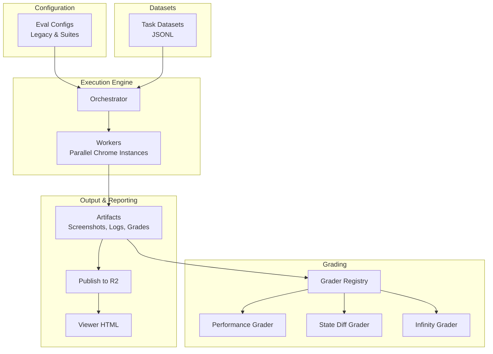
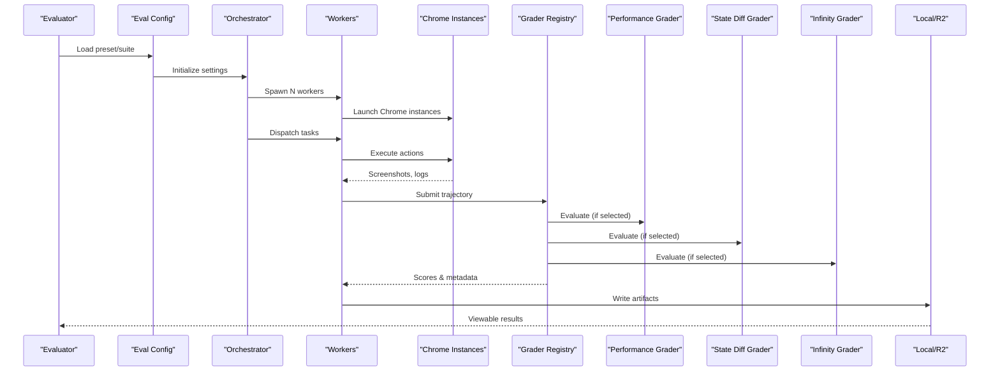
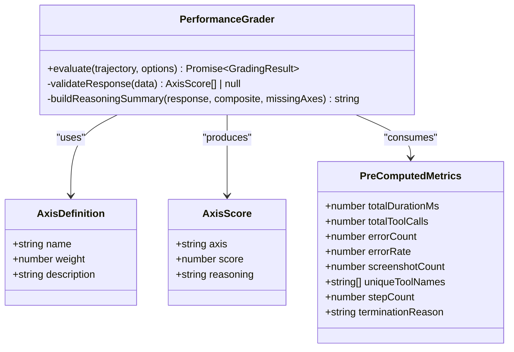
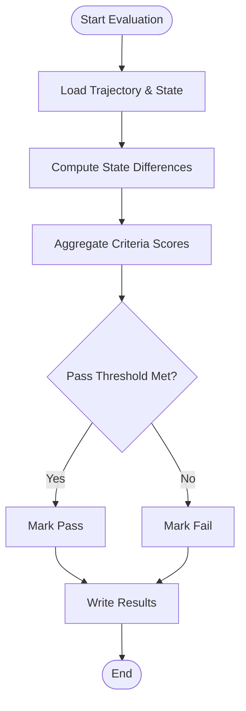
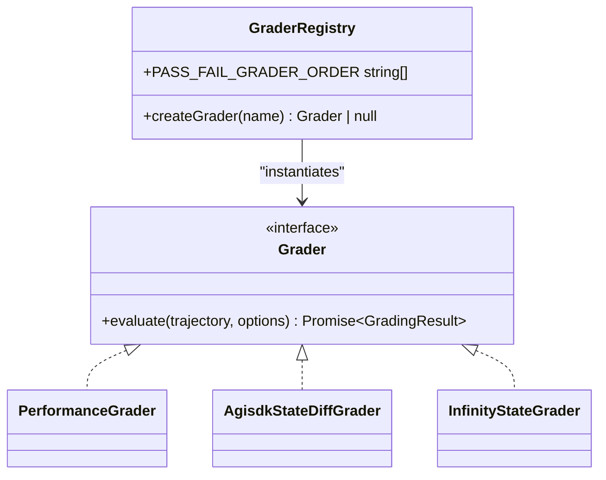
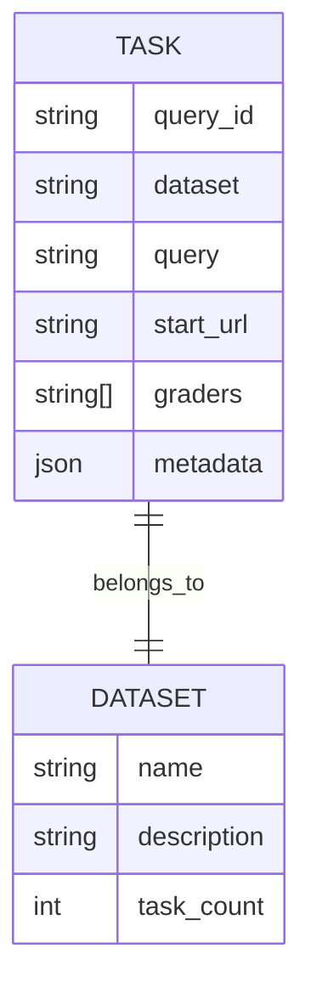
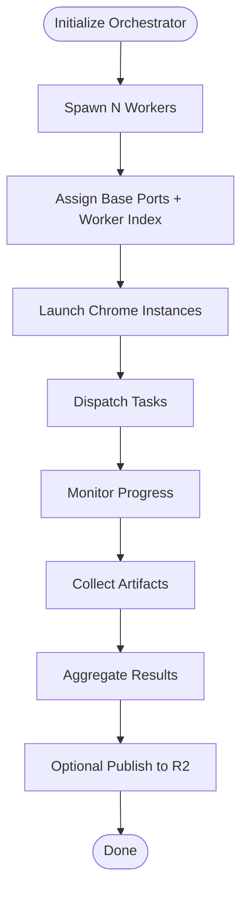
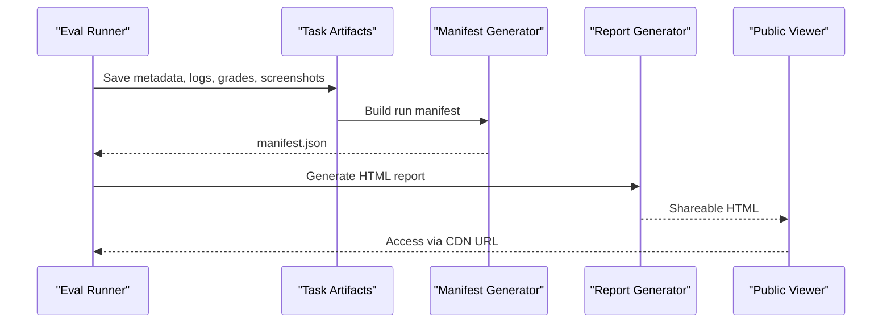
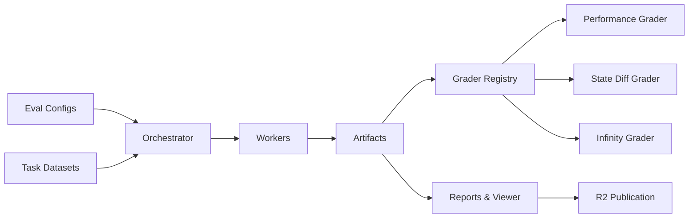

# Evaluation Framework

<cite>
**Referenced Files in This Document**
- [README.md](file://packages/browseros-agent/apps/eval/README.md)
- [performance-grader.ts](file://packages/browseros-agent/apps/eval/src/graders/performance/performance-grader.ts)
- [types.ts](file://packages/browseros-agent/apps/eval/src/graders/performance/types.ts)
- [agisdk-evaluate.py](file://packages/browseros-agent/apps/eval/src/graders/python/agisdk-evaluate.py)
- [grader-registry.ts](file://packages/browseros-agent/apps/eval/src/grading/grader-registry.ts)
- [generate-report.ts](file://packages/browseros-agent/apps/eval/scripts/generate-report.ts)
- [test-clado-api.ts](file://packages/browseros-agent/apps/eval/scripts/test-clado-api.ts)
- [build-consolidated-set.ts](file://packages/browseros-agent/apps/eval/scripts/build-consolidated-set.ts)
</cite>

## Table of Contents
1. [Introduction](#introduction)
2. [Project Structure](#project-structure)
3. [Core Components](#core-components)
4. [Architecture Overview](#architecture-overview)
5. [Detailed Component Analysis](#detailed-component-analysis)
6. [Dependency Analysis](#dependency-analysis)
7. [Performance Considerations](#performance-considerations)
8. [Troubleshooting Guide](#troubleshooting-guide)
9. [Conclusion](#conclusion)
10. [Appendices](#appendices)

## Introduction
The BrowserOS Evaluation Framework is a comprehensive benchmarking and performance measurement system designed to evaluate browser automation agents across standardized datasets. It executes tasks from benchmarks such as WebVoyager, Mind2Web, AGI SDK/REAL Bench, WebArena-Infinity, and WebBench, capturing agent trajectories with screenshots and automatically grading results. The framework supports multiple agent types (single LLM, orchestrator-executor, and Claude Code integration), configurable graders (performance, state-diff, and Infinity verifiers), and flexible output formats suitable for both local analysis and cloud publication.

## Project Structure
The evaluation system is organized around a modular architecture with distinct layers for configuration, execution, grading, and reporting. Key areas include:
- Configuration and presets for datasets and agent/provider settings
- Benchmark datasets and task definitions
- Grading subsystems (performance, state-diff, Infinity)
- Execution orchestration and artifact generation
- Reporting and publication utilities

**Diagram sources**
- [README.md:14-320](file://packages/browseros-agent/apps/eval/README.md#L14-L320)
- [grader-registry.ts:1-26](file://packages/browseros-agent/apps/eval/src/grading/grader-registry.ts#L1-L26)

**Section sources**
- [README.md:14-320](file://packages/browseros-agent/apps/eval/README.md#L14-L320)

## Core Components
- Agent Types: Single LLM agent, orchestrator-executor pair, and Claude Code integration via MCP.
- Graders: Performance grader (multi-axis scoring), AGI SDK state-diff grader, and Infinity state grader.
- Datasets: Standardized task collections including WebVoyager, Mind2Web, AGI SDK/REAL Bench, WebArena-Infinity, and WebBench.
- Execution Settings: Worker count, timeouts, headless/headed mode, and port allocation per worker.
- Output and Publishing: Local artifacts and optional R2 publication with viewer support.

**Section sources**
- [README.md:77-223](file://packages/browseros-agent/apps/eval/README.md#L77-L223)
- [README.md:232-320](file://packages/browseros-agent/apps/eval/README.md#L232-L320)

## Architecture Overview
The evaluation pipeline integrates configuration-driven task execution with automated grading and artifact generation. The orchestrator manages parallel workers, each operating a dedicated Chrome instance. Trajectories are captured as screenshots and logs, then scored by selected graders. Results are aggregated locally and optionally published to R2 for shared viewing.

**Diagram sources**
- [README.md:14-320](file://packages/browseros-agent/apps/eval/README.md#L14-L320)
- [grader-registry.ts:1-26](file://packages/browseros-agent/apps/eval/src/grading/grader-registry.ts#L1-L26)

## Detailed Component Analysis

### Performance Grader
The performance grader evaluates agent behavior along defined axes, producing axis-specific scores and a composite grade. It validates structured responses, normalizes scores to a bounded range, and generates a reasoning summary combining individual axis feedback and missing axes.

**Diagram sources**
- [performance-grader.ts:282-329](file://packages/browseros-agent/apps/eval/src/graders/performance/performance-grader.ts#L282-L329)
- [types.ts:1-52](file://packages/browseros-agent/apps/eval/src/graders/performance/types.ts#L1-L52)

**Section sources**
- [performance-grader.ts:282-329](file://packages/browseros-agent/apps/eval/src/graders/performance/performance-grader.ts#L282-L329)
- [types.ts:1-52](file://packages/browseros-agent/apps/eval/src/graders/performance/types.ts#L1-L52)

### State-Diff Grader (AGI SDK/REAL Bench)
The state-diff grader provides deterministic evaluation by comparing environment states before and after task execution. It produces pass/fail outcomes and per-criterion details, with robust error handling to ensure consistent scoring.

**Diagram sources**
- [agisdk-evaluate.py:106-133](file://packages/browseros-agent/apps/eval/src/graders/python/agisdk-evaluate.py#L106-L133)

**Section sources**
- [agisdk-evaluate.py:106-133](file://packages/browseros-agent/apps/eval/src/graders/python/agisdk-evaluate.py#L106-L133)

### Infinity State Grader
The Infinity grader leverages a verifier script to assess task completion deterministically. It integrates with the broader grading registry and participates in the pass/fail ordering alongside other graders.

**Section sources**
- [grader-registry.ts:1-26](file://packages/browseros-agent/apps/eval/src/grading/grader-registry.ts#L1-L26)

### Grader Registry and Ordering
The grader registry centralizes instantiation and prioritization of graders. It defines a pass/fail order ensuring deterministic evaluation outcomes and supports extensible grader registration.

**Diagram sources**
- [grader-registry.ts:1-26](file://packages/browseros-agent/apps/eval/src/grading/grader-registry.ts#L1-L26)

**Section sources**
- [grader-registry.ts:1-26](file://packages/browseros-agent/apps/eval/src/grading/grader-registry.ts#L1-L26)

### Dataset Formats and Task Management
Tasks are defined in JSONL format with fields for identifiers, dataset provenance, queries, start URLs, and grader selections. The framework supports multiple datasets and allows overriding graders per task or globally.

**Diagram sources**
- [README.md:246-257](file://packages/browseros-agent/apps/eval/README.md#L246-L257)

**Section sources**
- [README.md:246-257](file://packages/browseros-agent/apps/eval/README.md#L246-L257)

### Execution Engine and Parallel Workers
The orchestrator spawns parallel workers, each operating a dedicated Chrome instance with isolated ports. Execution settings control worker concurrency, timeouts, and browser behavior (headless/headed).

**Diagram sources**
- [README.md:224-231](file://packages/browseros-agent/apps/eval/README.md#L224-L231)

**Section sources**
- [README.md:224-231](file://packages/browseros-agent/apps/eval/README.md#L224-L231)

### Reporting and Viewer Integration
Reports summarize pass rates, task-level metadata, and grader outcomes. The viewer consumes a manifest describing artifact paths for public access. The report generator synthesizes diagnostic insights from trajectory artifacts.

**Diagram sources**
- [README.md:259-307](file://packages/browseros-agent/apps/eval/README.md#L259-L307)
- [generate-report.ts:77-110](file://packages/browseros-agent/apps/eval/scripts/generate-report.ts#L77-L110)

**Section sources**
- [README.md:259-307](file://packages/browseros-agent/apps/eval/README.md#L259-L307)
- [generate-report.ts:77-110](file://packages/browseros-agent/apps/eval/scripts/generate-report.ts#L77-L110)

### Tool Evaluation and Executor Testing
The framework includes utilities for evaluating tool performance and testing executor APIs, such as the Clado action model, enabling validation of visual prediction accuracy and latency.

**Section sources**
- [test-clado-api.ts:55-112](file://packages/browseros-agent/apps/eval/scripts/test-clado-api.ts#L55-L112)

### Consolidated Benchmark Sets
Scripts exist to build consolidated benchmark sets from multiple sources, enabling cross-dataset comparisons and unified evaluation campaigns.

**Section sources**
- [build-consolidated-set.ts:1-428](file://packages/browseros-agent/apps/eval/scripts/build-consolidated-set.ts#L1-L428)

## Dependency Analysis
The evaluation framework exhibits clear separation of concerns:
- Configuration drives execution and grading choices
- Grader registry encapsulates grading logic and priorities
- Execution engine manages parallelism and artifact capture
- Reporting and publishing utilities handle output distribution

**Diagram sources**
- [README.md:14-320](file://packages/browseros-agent/apps/eval/README.md#L14-L320)
- [grader-registry.ts:1-26](file://packages/browseros-agent/apps/eval/src/grading/grader-registry.ts#L1-L26)

**Section sources**
- [README.md:14-320](file://packages/browseros-agent/apps/eval/README.md#L14-L320)
- [grader-registry.ts:1-26](file://packages/browseros-agent/apps/eval/src/grading/grader-registry.ts#L1-L26)

## Performance Considerations
- Parallel Workers: Tune worker count to balance throughput and resource utilization; each worker requires dedicated ports and Chrome instances.
- Timeouts: Adjust per-task timeouts for complex tasks; default is generous but can be reduced for faster feedback loops.
- Headless Mode: Enable headless for CI runs; disable for interactive debugging sessions.
- Artifact Volume: Limit excessive screenshot capture for long-running tasks to reduce storage overhead.
- Grader Overhead: Prefer deterministic graders (state-diff) for speed; reserve multi-axis grading for detailed diagnostics.

## Troubleshooting Guide
Common issues and resolutions:
- BrowserOS Binary Path: Ensure the BrowserOS binary path is correct or set the environment variable for custom locations.
- Port Conflicts: Verify no other BrowserOS instances are running; adjust base ports if conflicts persist.
- API Keys: Confirm API key resolution from environment variables; ensure the expected variables are present in the development environment.
- Timeouts: Increase per-task timeout for complex tasks; review task complexity and adjust accordingly.
- Headless vs Headed: Switch to headed mode to observe Chrome behavior during debugging.

**Section sources**
- [README.md:309-320](file://packages/browseros-agent/apps/eval/README.md#L309-L320)

## Conclusion
The BrowserOS Evaluation Framework provides a robust foundation for benchmarking and performance measurement of browser automation agents. Its modular design supports diverse agent architectures, standardized datasets, and flexible grading strategies. By capturing rich trajectories and generating actionable reports, it enables continuous improvement and regression detection in agent development workflows.

## Appendices

### Evaluation Usage Examples
- Quick Start: Load a preset, configure environment variables, and run the dashboard or CLI commands for immediate execution.
- Suite Mode: Run predefined suites with variant overrides for model/provider settings; publish results to R2 for shared viewing.
- CLI Commands: Use run, suite, grade, and publish subcommands for granular control over evaluation lifecycles.

**Section sources**
- [README.md:14-41](file://packages/browseros-agent/apps/eval/README.md#L14-L41)

### Custom Benchmark Creation
- Task Definition: Define tasks in JSONL format with query identifiers, dataset provenance, queries, start URLs, and grader lists.
- Dataset Consolidation: Use consolidation scripts to combine multiple sources into unified benchmark sets for comparative analysis.

**Section sources**
- [README.md:246-257](file://packages/browseros-agent/apps/eval/README.md#L246-L257)
- [build-consolidated-set.ts:1-428](file://packages/browseros-agent/apps/eval/scripts/build-consolidated-set.ts#L1-L428)

### Result Interpretation Techniques
- Pass Rates: Aggregate pass/fail outcomes across tasks to gauge overall performance.
- Grading Details: Review grader-specific outputs and reasoning summaries for targeted improvements.
- Viewer Manifest: Use the manifest to navigate artifacts and reproduce findings in the public viewer.

**Section sources**
- [README.md:259-307](file://packages/browseros-agent/apps/eval/README.md#L259-L307)

### Performance Testing Scenarios
- Regression Detection: Compare pass rates and composite scores across runs to identify performance regressions.
- Optimization Validation: Validate improvements by re-running affected tasks and observing grade deltas.
- Comparative Analysis: Execute the same suite across multiple variants to isolate model and provider impacts.

**Section sources**
- [README.md:61-76](file://packages/browseros-agent/apps/eval/README.md#L61-L76)