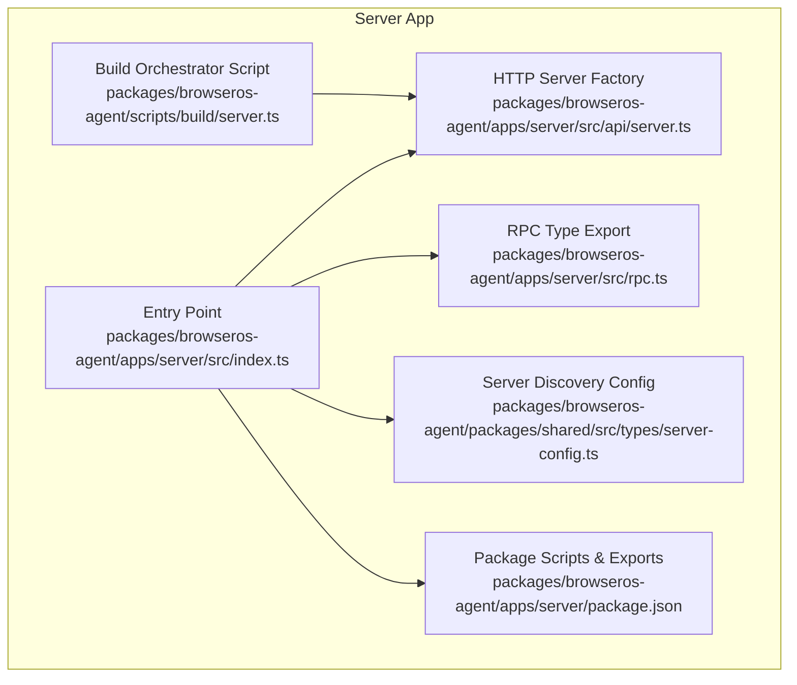
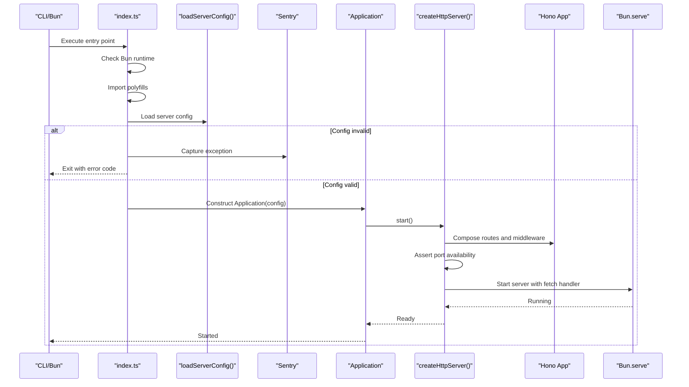
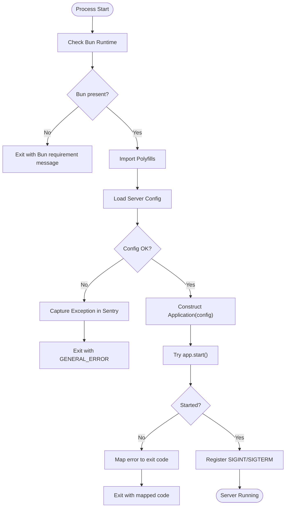
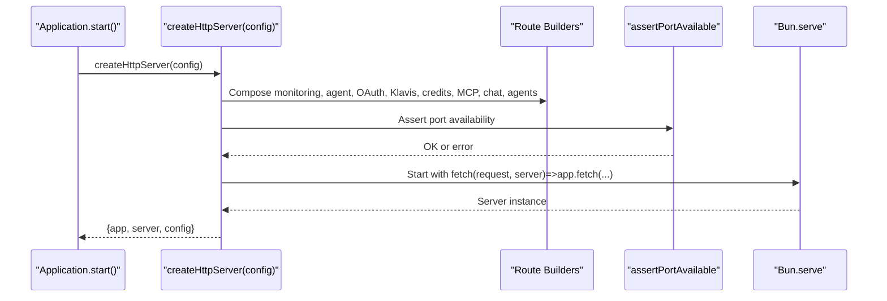
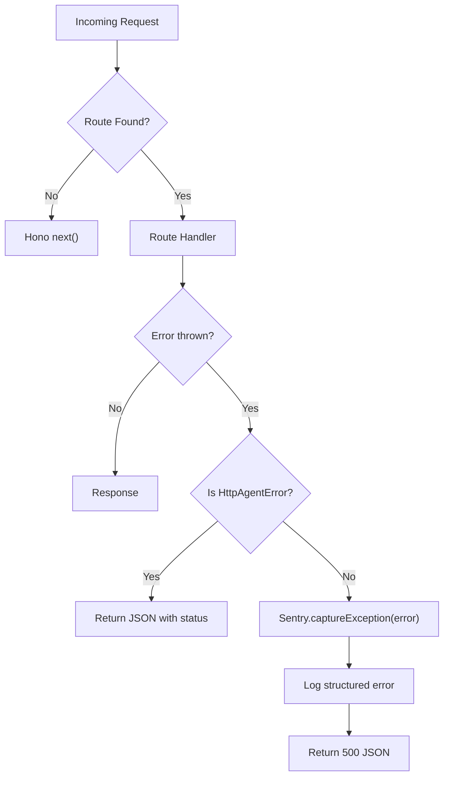
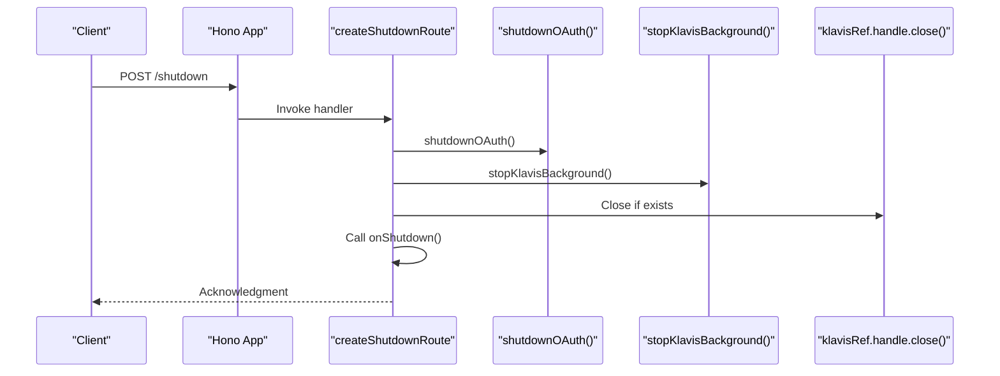
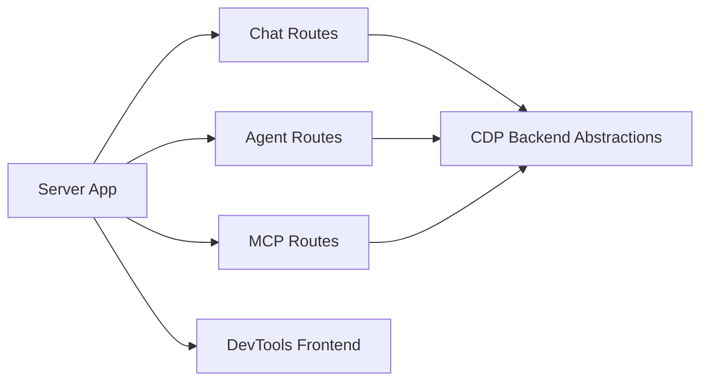
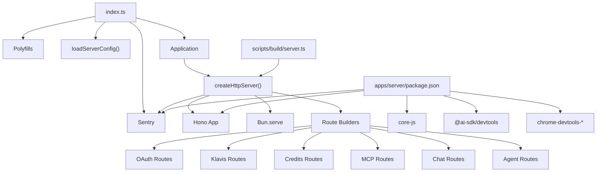

# Server Application

<cite>
**Referenced Files in This Document**
- [index.ts](file://packages/browseros-agent/apps/server/src/index.ts)
- [server.ts](file://packages/browseros-agent/apps/server/src/api/server.ts)
- [rpc.ts](file://packages/browseros-agent/apps/server/src/rpc.ts)
- [server-config.ts](file://packages/browseros-agent/packages/shared/src/types/server-config.ts)
- [server.ts](file://packages/browseros-agent/scripts/build/server.ts)
- [package.json](file://packages/browseros-agent/apps/server/package.json)
</cite>

## Table of Contents
1. [Introduction](#introduction)
2. [Project Structure](#project-structure)
3. [Core Components](#core-components)
4. [Architecture Overview](#architecture-overview)
5. [Detailed Component Analysis](#detailed-component-analysis)
6. [Dependency Analysis](#dependency-analysis)
7. [Performance Considerations](#performance-considerations)
8. [Troubleshooting Guide](#troubleshooting-guide)
9. [Conclusion](#conclusion)

## Introduction
This document describes the BrowserOS server application built on the Bun runtime. It focuses on the entry point script, configuration loading, server initialization and lifecycle, port binding, error handling, polyfills, Sentry integration, application class structure, dependency injection patterns, graceful shutdown, and the relationship to Chromium-based browser integration via CDP.

## Project Structure
The server is implemented as a Bun-based HTTP server using Hono for routing and Bun.Serve for the runtime. It exposes multiple route groups (health, shutdown, status, monitoring, OAuth, Klavis, credits, MCP, chat, agents) and integrates with Sentry for error reporting. The build pipeline is driven by a dedicated build script that orchestrates production resource compilation.

**Diagram sources**
- [index.ts:1-53](file://packages/browseros-agent/apps/server/src/index.ts#L1-L53)
- [server.ts:1-241](file://packages/browseros-agent/apps/server/src/api/server.ts#L1-L241)
- [rpc.ts:1-5](file://packages/browseros-agent/apps/server/src/rpc.ts#L1-L5)
- [server-config.ts:1-19](file://packages/browseros-agent/packages/shared/src/types/server-config.ts#L1-L19)
- [server.ts:1-10](file://packages/browseros-agent/scripts/build/server.ts#L1-L10)
- [package.json:1-136](file://packages/browseros-agent/apps/server/package.json#L1-L136)

**Section sources**
- [index.ts:1-53](file://packages/browseros-agent/apps/server/src/index.ts#L1-L53)
- [server.ts:1-241](file://packages/browseros-agent/apps/server/src/api/server.ts#L1-L241)
- [rpc.ts:1-5](file://packages/browseros-agent/apps/server/src/rpc.ts#L1-L5)
- [server-config.ts:1-19](file://packages/browseros-agent/packages/shared/src/types/server-config.ts#L1-L19)
- [server.ts:1-10](file://packages/browseros-agent/scripts/build/server.ts#L1-L10)
- [package.json:1-136](file://packages/browseros-agent/apps/server/package.json#L1-L136)

## Core Components
- Entry point validates Bun runtime, loads configuration, initializes polyfills, sets up Sentry, constructs the Application, starts it, and registers signal handlers for graceful shutdown.
- HTTP server factory composes route groups, applies CORS and trusted-origin middleware, wires OAuth and Klavis connections, and binds to the configured host and port using Bun.Serve.
- Build script orchestrates production resource builds and exits with non-zero status on errors.
- Package configuration defines Bun-based scripts, exports, and dependencies including Sentry, Hono, and Chromium/CSS-related packages.

Key responsibilities:
- Runtime enforcement and polyfills
- Configuration loading and validation
- Route composition and middleware
- Port availability checks
- Sentry error capture
- Graceful shutdown hooks

**Section sources**
- [index.ts:9-16](file://packages/browseros-agent/apps/server/src/index.ts#L9-L16)
- [index.ts:18-25](file://packages/browseros-agent/apps/server/src/index.ts#L18-L25)
- [index.ts:27-33](file://packages/browseros-agent/apps/server/src/index.ts#L27-L33)
- [index.ts:37-49](file://packages/browseros-agent/apps/server/src/index.ts#L37-L49)
- [index.ts:51-52](file://packages/browseros-agent/apps/server/src/index.ts#L51-L52)
- [server.ts:68-240](file://packages/browseros-agent/apps/server/src/api/server.ts#L68-L240)
- [server.ts:45-66](file://packages/browseros-agent/apps/server/src/api/server.ts#L45-L66)
- [server.ts:179-215](file://packages/browseros-agent/apps/server/src/api/server.ts#L179-L215)
- [server.ts:219-225](file://packages/browseros-agent/apps/server/src/api/server.ts#L219-L225)
- [server.ts:1-10](file://packages/browseros-agent/scripts/build/server.ts#L1-L10)
- [package.json:10-31](file://packages/browseros-agent/apps/server/package.json#L10-L31)
- [package.json:75-116](file://packages/browseros-agent/apps/server/package.json#L75-L116)

## Architecture Overview
The server architecture centers on a single-entry application that:
- Validates the Bun runtime
- Loads and validates configuration
- Initializes polyfills and Sentry
- Constructs the Application and starts it
- Composes Hono routes for health, shutdown, status, monitoring, OAuth, Klavis, credits, MCP, chat, and agents
- Applies CORS and trusted origin middleware
- Starts Bun.Serve bound to host and port
- Registers SIGINT/SIGTERM handlers for graceful shutdown

**Diagram sources**
- [index.ts:9-16](file://packages/browseros-agent/apps/server/src/index.ts#L9-L16)
- [index.ts:18-25](file://packages/browseros-agent/apps/server/src/index.ts#L18-L25)
- [index.ts:27-33](file://packages/browseros-agent/apps/server/src/index.ts#L27-L33)
- [server.ts:68-240](file://packages/browseros-agent/apps/server/src/api/server.ts#L68-L240)
- [server.ts:45-66](file://packages/browseros-agent/apps/server/src/api/server.ts#L45-L66)
- [server.ts:219-225](file://packages/browseros-agent/apps/server/src/api/server.ts#L219-L225)

## Detailed Component Analysis

### Entry Point and Lifecycle
- Bun runtime requirement is enforced early; if missing, the process exits with an error message.
- Polyfills are imported before other modules to ensure environment compatibility.
- Configuration is loaded and validated; invalid configuration triggers Sentry capture and exit with a general error code.
- Application instance is constructed and started; exceptions are caught and mapped to appropriate exit codes (including port conflicts).
- Signal handlers for SIGINT and SIGTERM delegate to the Application’s stop method.

**Diagram sources**
- [index.ts:9-16](file://packages/browseros-agent/apps/server/src/index.ts#L9-L16)
- [index.ts:18-25](file://packages/browseros-agent/apps/server/src/index.ts#L18-L25)
- [index.ts:27-33](file://packages/browseros-agent/apps/server/src/index.ts#L27-L33)
- [index.ts:37-49](file://packages/browseros-agent/apps/server/src/index.ts#L37-L49)
- [index.ts:51-52](file://packages/browseros-agent/apps/server/src/index.ts#L51-L52)

**Section sources**
- [index.ts:9-16](file://packages/browseros-agent/apps/server/src/index.ts#L9-L16)
- [index.ts:18-25](file://packages/browseros-agent/apps/server/src/index.ts#L18-L25)
- [index.ts:27-33](file://packages/browseros-agent/apps/server/src/index.ts#L27-L33)
- [index.ts:37-49](file://packages/browseros-agent/apps/server/src/index.ts#L37-L49)
- [index.ts:51-52](file://packages/browseros-agent/apps/server/src/index.ts#L51-L52)

### HTTP Server Initialization and Port Binding
- The HTTP server factory composes route groups under a Hono app, applies CORS and trusted-origin middleware, and mounts routes for health, shutdown, status, monitoring, OAuth, Klavis, credits, MCP, chat, and agents.
- A port availability check ensures the chosen port is free before starting the server.
- Bun.Serve is invoked with a fetch handler that forwards requests to the Hono app, enabling WebSocket support via the Hono websocket adapter.

**Diagram sources**
- [server.ts:68-240](file://packages/browseros-agent/apps/server/src/api/server.ts#L68-L240)
- [server.ts:45-66](file://packages/browseros-agent/apps/server/src/api/server.ts#L45-L66)
- [server.ts:219-225](file://packages/browseros-agent/apps/server/src/api/server.ts#L219-L225)

**Section sources**
- [server.ts:68-240](file://packages/browseros-agent/apps/server/src/api/server.ts#L68-L240)
- [server.ts:45-66](file://packages/browseros-agent/apps/server/src/api/server.ts#L45-L66)
- [server.ts:219-225](file://packages/browseros-agent/apps/server/src/api/server.ts#L219-L225)

### Error Handling and Sentry Integration
- A global error handler converts HttpAgentError instances into structured JSON responses with appropriate status codes.
- All other unhandled errors are captured by Sentry with contextual tags (route, method), logged with structured metadata, and responded with a generic internal server error payload.
- Sentry is initialized at the entry point and used for configuration load failures and startup exceptions.

**Diagram sources**
- [server.ts:179-215](file://packages/browseros-agent/apps/server/src/api/server.ts#L179-L215)
- [index.ts:30-31](file://packages/browseros-agent/apps/server/src/index.ts#L30-L31)

**Section sources**
- [server.ts:179-215](file://packages/browseros-agent/apps/server/src/api/server.ts#L179-L215)
- [index.ts:30-31](file://packages/browseros-agent/apps/server/src/index.ts#L30-L31)

### Polyfill System and Environment Compatibility
- The entry point imports a polyfill module before other modules to normalize environment APIs for compatibility across platforms and runtimes.
- The package includes core-js as a dependency to provide polyfills for modern JavaScript features.

**Section sources**
- [index.ts:18-19](file://packages/browseros-agent/apps/server/src/index.ts#L18-L19)
- [package.json](file://packages/browseros-agent/apps/server/package.json#L101)

### Graceful Shutdown Procedures
- The shutdown route invokes cleanup routines for OAuth, stops the background Klavis proxy, closes the Klavis transport handle if present, and calls the provided onShutdown callback.
- The process listens for SIGINT and SIGTERM signals and delegates to the Application.stop method.

**Diagram sources**
- [server.ts:120-133](file://packages/browseros-agent/apps/server/src/api/server.ts#L120-L133)
- [server.ts:87-93](file://packages/browseros-agent/apps/server/src/api/server.ts#L87-L93)
- [server.ts:125-129](file://packages/browseros-agent/apps/server/src/api/server.ts#L125-L129)
- [index.ts:51-52](file://packages/browseros-agent/apps/server/src/index.ts#L51-L52)

**Section sources**
- [server.ts:120-133](file://packages/browseros-agent/apps/server/src/api/server.ts#L120-L133)
- [server.ts:87-93](file://packages/browseros-agent/apps/server/src/api/server.ts#L87-L93)
- [server.ts:125-129](file://packages/browseros-agent/apps/server/src/api/server.ts#L125-L129)
- [index.ts:51-52](file://packages/browseros-agent/apps/server/src/index.ts#L51-L52)

### Relationship to Chromium Browser Integration
- The server exposes routes for chat and agents that integrate with a Chromium-based browser backend via CDP (Chrome DevTools Protocol) abstractions.
- The package declares optional dependencies on chrome-devtools-mcp and chrome-devtools-frontend, indicating integration with Chromium tooling and MCP transports.
- The server discovery configuration includes optional fields for CDP port and Chromium version, supporting auto-discovery of browser integration endpoints.

**Diagram sources**
- [server.ts:167-177](file://packages/browseros-agent/apps/server/src/api/server.ts#L167-L177)
- [server.ts:156-166](file://packages/browseros-agent/apps/server/src/api/server.ts#L156-L166)
- [package.json:99-100](file://packages/browseros-agent/apps/server/package.json#L99-L100)
- [package.json](file://packages/browseros-agent/apps/server/package.json#L132)

**Section sources**
- [server.ts:167-177](file://packages/browseros-agent/apps/server/src/api/server.ts#L167-L177)
- [server.ts:156-166](file://packages/browseros-agent/apps/server/src/api/server.ts#L156-L166)
- [package.json:99-100](file://packages/browseros-agent/apps/server/package.json#L99-L100)
- [package.json](file://packages/browseros-agent/apps/server/package.json#L132)
- [server-config.ts:10-18](file://packages/browseros-agent/packages/shared/src/types/server-config.ts#L10-L18)

### Dependency Injection Patterns
- Route builders accept configuration objects (e.g., browser, registry, resourcesDir, executionDir, klavisRef) to decouple route logic from environment specifics.
- The HTTP server factory injects dependencies such as the Klavis client, browser, and OAuth token manager into route handlers.
- The Application class composes these dependencies during startup and passes them to the server factory.

Note: The Application class is instantiated in the entry point and its internal structure is not shown here; however, the dependency passing pattern is evident from the server factory usage.

**Section sources**
- [server.ts:99-114](file://packages/browseros-agent/apps/server/src/api/server.ts#L99-L114)
- [server.ts:156-166](file://packages/browseros-agent/apps/server/src/api/server.ts#L156-L166)
- [server.ts:167-177](file://packages/browseros-agent/apps/server/src/api/server.ts#L167-L177)
- [index.ts](file://packages/browseros-agent/apps/server/src/index.ts#L35)

### Examples and Debugging Techniques
- Server configuration: The server writes a discovery configuration file containing server port, optional CDP port, URL, versions, and identifiers. Use this to auto-discover the server endpoint.
- Custom middleware: Apply CORS and trusted-origin middleware at route group boundaries; mount monitoring routes with origin checks.
- Debugging: Enable AI SDK DevTools logging when enabled in configuration; use Bun watch mode for development; leverage Sentry for error capture and structured logs.

**Section sources**
- [server-config.ts:10-18](file://packages/browseros-agent/packages/shared/src/types/server-config.ts#L10-L18)
- [server.ts:95-97](file://packages/browseros-agent/apps/server/src/api/server.ts#L95-L97)
- [server.ts:116-118](file://packages/browseros-agent/apps/server/src/api/server.ts#L116-L118)
- [server.ts:229-233](file://packages/browseros-agent/apps/server/src/api/server.ts#L229-L233)
- [package.json:11-12](file://packages/browseros-agent/apps/server/package.json#L11-L12)

## Dependency Analysis
The server relies on Bun runtime, Hono for routing, Sentry for error monitoring, and Chromium/CSS tooling for browser integration. The build system is orchestrated by a Bun script.

**Diagram sources**
- [index.ts:18-25](file://packages/browseros-agent/apps/server/src/index.ts#L18-L25)
- [server.ts:68-240](file://packages/browseros-agent/apps/server/src/api/server.ts#L68-L240)
- [server.ts:1-10](file://packages/browseros-agent/scripts/build/server.ts#L1-L10)
- [package.json:75-116](file://packages/browseros-agent/apps/server/package.json#L75-L116)

**Section sources**
- [index.ts:18-25](file://packages/browseros-agent/apps/server/src/index.ts#L18-L25)
- [server.ts:68-240](file://packages/browseros-agent/apps/server/src/api/server.ts#L68-L240)
- [server.ts:1-10](file://packages/browseros-agent/scripts/build/server.ts#L1-L10)
- [package.json:75-116](file://packages/browseros-agent/apps/server/package.json#L75-L116)

## Performance Considerations
- Keep idle timeout disabled for long-running connections as configured.
- Minimize synchronous work in middleware and route handlers.
- Use Bun’s native performance characteristics and avoid unnecessary object allocations in hot paths.
- Monitor Sentry events and logs to identify slow routes or frequent errors.

## Troubleshooting Guide
- Bun runtime missing: The entry point explicitly checks for Bun and exits with guidance if absent.
- Port conflict: Catch port-in-use errors and exit with a dedicated error code; verify the port is free or change the configuration.
- Configuration errors: Invalid configuration is captured by Sentry and causes a general error exit; review configuration files and environment variables.
- Unhandled errors: Global error handler captures and reports via Sentry; inspect logs for stack traces and route/method tags.

**Section sources**
- [index.ts:9-16](file://packages/browseros-agent/apps/server/src/index.ts#L9-L16)
- [index.ts:43-45](file://packages/browseros-agent/apps/server/src/index.ts#L43-L45)
- [index.ts:30-31](file://packages/browseros-agent/apps/server/src/index.ts#L30-L31)
- [server.ts:179-215](file://packages/browseros-agent/apps/server/src/api/server.ts#L179-L215)

## Conclusion
The BrowserOS server application is a Bun-powered HTTP service that integrates Hono routing, Sentry error monitoring, and Chromium-based browser capabilities. Its lifecycle is controlled by a strict entry point, robust configuration loading, graceful shutdown, and a modular route composition pattern. The build pipeline and package configuration support development and production deployments effectively.