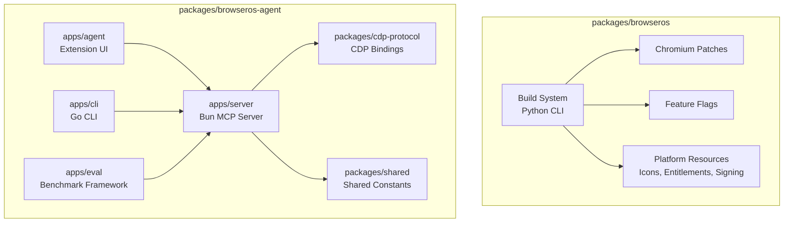
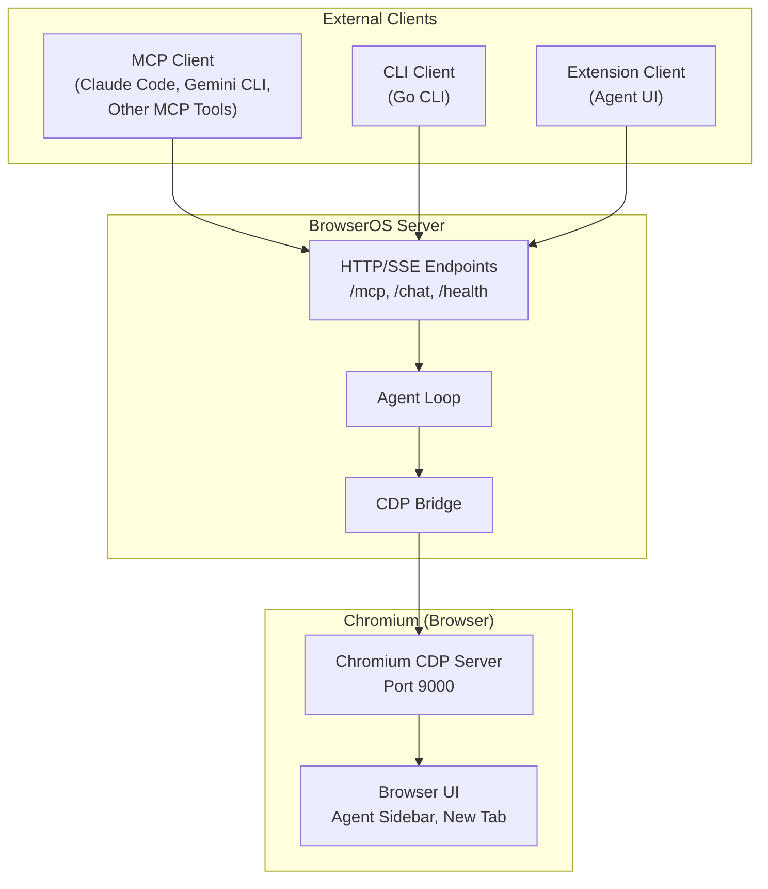
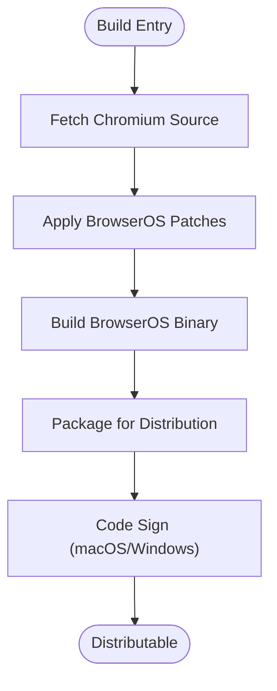
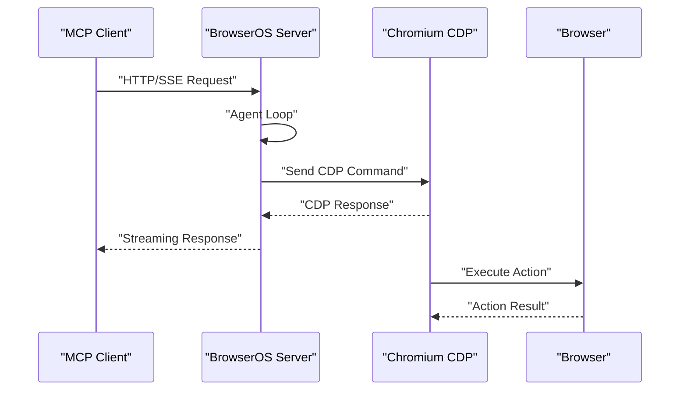
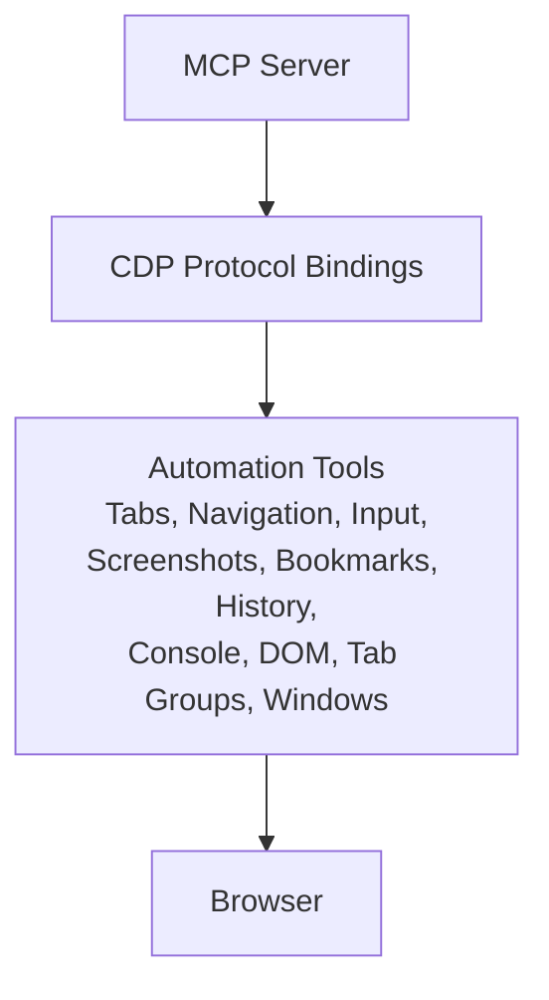
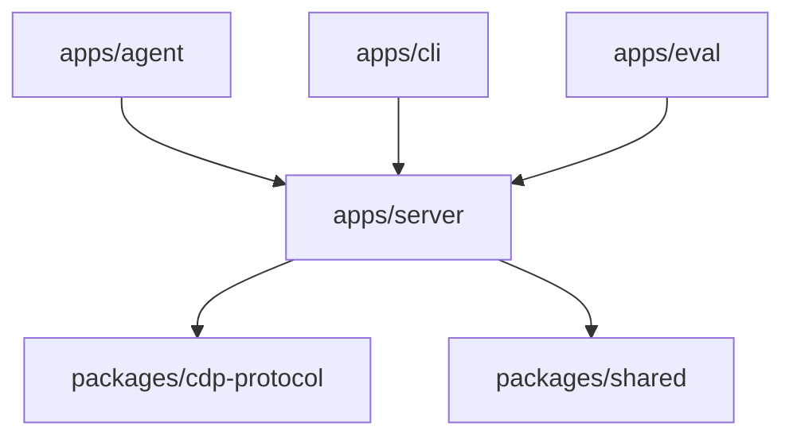

# Architecture Overview

<cite>
**Referenced Files in This Document**
- [README.md](file://README.md)
- [packages/browseros/README.md](file://packages/browseros/README.md)
- [packages/browseros-agent/README.md](file://packages/browseros-agent/README.md)
- [packages/browseros/pyproject.toml](file://packages/browseros/pyproject.toml)
- [packages/browseros/build/config/features.yaml](file://packages/browseros/build/config/features.yaml)
- [packages/browseros/build/config/release.macos.yaml](file://packages/browseros/build/config/release.macos.yaml)
- [packages/browseros/build/config/release.windows.yaml](file://packages/browseros/build/config/release.windows.yaml)
- [packages/browseros/build/config/package.linux.yaml](file://packages/browseros/build/config/package.linux.yaml)
- [packages/browseros-agent/process-compose.yaml](file://packages/browseros-agent/process-compose.yaml)
- [docs/contributing.mdx](file://docs/contributing.mdx)
</cite>

## Table of Contents
1. [Introduction](#introduction)
2. [Project Structure](#project-structure)
3. [Core Components](#core-components)
4. [Architecture Overview](#architecture-overview)
5. [Detailed Component Analysis](#detailed-component-analysis)
6. [Dependency Analysis](#dependency-analysis)
7. [Performance Considerations](#performance-considerations)
8. [Troubleshooting Guide](#troubleshooting-guide)
9. [Conclusion](#conclusion)

## Introduction
BrowserOS is an open-source Chromium fork that integrates AI agents natively, delivering a privacy-first alternative to centralized browser assistants. The system is organized as a monorepo with two primary subsystems:
- Browser (Chromium fork): A customized Chromium build with AI agent integration, MCP server, privacy enhancements, and platform-specific packaging/signing.
- Agent Platform (TypeScript/Go): A Bun-based MCP server and supporting applications that expose browser automation tools, manage agent workflows, and provide CLI and evaluation frameworks.

The architecture emphasizes:
- Clear system boundaries between the browser and agent platform.
- Strong integration via the Chrome DevTools Protocol (CDP) and MCP server.
- Cross-platform build and deployment topology with platform-specific packaging and signing.

## Project Structure
The repository is organized as a monorepo with two main packages:
- packages/browseros: Chromium fork, patches, build system, and packaging/signing modules.
- packages/browseros-agent: Agent platform with server, agent UI, CLI, eval, and shared packages.

High-level structure and responsibilities:
- packages/browseros
  - Chromium patches and new files
  - Build system (Python CLI) with modules for setup, patches, apply, extract, feature flags, package, sign, OTA, and resources
  - Feature flags configuration
  - Platform resources (icons, entitlements, signing)
- packages/browseros-agent
  - apps/server: Bun-based MCP server exposing 53+ browser automation tools and running the agent loop
  - apps/agent: Browser extension UI (WXT + React)
  - apps/cli: Go CLI for controlling BrowserOS from terminal or AI coding agents
  - apps/eval: Benchmark framework for agent evaluation
  - packages/cdp-protocol: Type-safe CDP bindings
  - packages/shared: Shared constants (ports, timeouts, limits)
  - process-compose.yaml: Process orchestration for development

**Diagram sources**
- [packages/browseros/README.md:29-66](file://packages/browseros/README.md#L29-L66)
- [packages/browseros-agent/README.md:5-27](file://packages/browseros-agent/README.md#L5-L27)

**Section sources**
- [README.md:144-178](file://README.md#L144-L178)
- [packages/browseros/README.md:29-66](file://packages/browseros/README.md#L29-L66)
- [packages/browseros-agent/README.md:5-27](file://packages/browseros-agent/README.md#L5-L27)

## Core Components
- Browser (Chromium fork)
  - Build system: Python CLI orchestrating setup, patch application, build, package, and sign steps.
  - Patches: BrowserOS-specific modifications integrated on top of vanilla Chromium.
  - Feature flags: Controlled via YAML to enable/disable BrowserOS features at build time.
  - Packaging/signing: Platform-specific packaging and code signing resources.
- Agent Platform
  - apps/server: Bun server exposing MCP endpoints and running the agent loop; integrates with CDP for browser automation.
  - apps/agent: Extension UI for chat, onboarding, settings, and new tab integration.
  - apps/cli: Go CLI enabling terminal and AI coding agent control of BrowserOS.
  - apps/eval: Benchmark framework for evaluating agent capabilities.
  - packages/cdp-protocol: Type-safe CDP bindings used by the server.
  - packages/shared: Shared constants for ports, timeouts, and limits.

Technology stack differences:
- Browser development (C++/Python): Requires ~100 GB disk space for Chromium source and build artifacts; Python-based build system.
- Agent development (TypeScript/Go): Lightweight development environment; Bun for server and agent; Go for CLI.

**Section sources**
- [packages/browseros/README.md:68-88](file://packages/browseros/README.md#L68-L88)
- [packages/browseros/README.md:90-116](file://packages/browseros/README.md#L90-L116)
- [packages/browseros/README.md:117-127](file://packages/browseros/README.md#L117-L127)
- [packages/browseros-agent/README.md:28-71](file://packages/browseros-agent/README.md#L28-L71)
- [packages/browseros-agent/README.md:91-144](file://packages/browseros-agent/README.md#L91-L144)
- [README.md:188-190](file://README.md#L188-L190)

## Architecture Overview
The BrowserOS architecture comprises two tightly integrated subsystems:
- Browser (Chromium fork) with embedded MCP server and agent UI.
- Agent Platform (TypeScript/Go) providing the MCP server, agent UI, CLI, and evaluation framework.

System boundaries and interactions:
- MCP server boundary: Exposed via HTTP/SSE endpoints for clients such as Claude Code.
- CDP boundary: The server connects to Chromium’s CDP as a client to drive browser automation.
- CLI boundary: Go CLI communicates with the MCP server for remote control.
- Extension boundary: Agent UI extension interacts with the MCP server and browser UI.

Ports and runtime:
- Server port: 9100 (MCP endpoints, agent chat, health)
- CDP port: 9000 (Chromium CDP)
- Extension port: 9300 (legacy compatibility)

**Diagram sources**
- [packages/browseros-agent/README.md:34-62](file://packages/browseros-agent/README.md#L34-L62)
- [packages/browseros-agent/README.md:64-71](file://packages/browseros-agent/README.md#L64-L71)

**Section sources**
- [packages/browseros-agent/README.md:28-71](file://packages/browseros-agent/README.md#L28-L71)

## Detailed Component Analysis

### Browser Build System (packages/browseros)
The build system is a Python CLI that orchestrates the full lifecycle from Chromium source to distributable binaries. Key modules:
- setup: Fetch and prepare Chromium source
- patches: Manage patch application logic
- apply: Apply patches to the Chromium source tree
- extract: Extract patches from modified source
- feature: Feature flag management
- package: Platform-specific packaging
- sign: Code signing for macOS and Windows
- ota: Over-the-air update support
- resources: Resource management (icons, entitlements)

Build commands:
- browseros setup: Fetch and prepare Chromium source
- browseros apply: Apply all patches to Chromium source
- browseros build: Build BrowserOS binary
- browseros package: Package into distributable (DMG, installer, AppImage)
- browseros sign: Code sign the binary (macOS/Windows)

Feature flags:
- Defined in features.yaml and resolved at build time to compile BrowserOS-specific features.

Packaging and signing:
- Platform-specific configurations for macOS, Windows, and Linux.
- macOS signing includes entitlements and notarization resources.

**Diagram sources**
- [packages/browseros/README.md:80-88](file://packages/browseros/README.md#L80-L88)
- [packages/browseros/README.md:117-127](file://packages/browseros/README.md#L117-L127)

**Section sources**
- [packages/browseros/README.md:68-88](file://packages/browseros/README.md#L68-L88)
- [packages/browseros/README.md:90-116](file://packages/browseros/README.md#L90-L116)
- [packages/browseros/README.md:117-127](file://packages/browseros/README.md#L117-L127)
- [packages/browseros/build/config/features.yaml](file://packages/browseros/build/config/features.yaml)
- [packages/browseros/build/config/release.macos.yaml](file://packages/browseros/build/config/release.macos.yaml)
- [packages/browseros/build/config/release.windows.yaml](file://packages/browseros/build/config/release.windows.yaml)
- [packages/browseros/build/config/package.linux.yaml](file://packages/browseros/build/config/package.linux.yaml)

### Agent Platform (packages/browseros-agent)
The agent platform consists of:
- apps/server: Bun server exposing MCP endpoints and running the agent loop; integrates with CDP for browser automation.
- apps/agent: Browser extension UI (WXT + React) for chat, onboarding, settings, and new tab.
- apps/cli: Go CLI for controlling BrowserOS from terminal or AI coding agents.
- apps/eval: Benchmark framework for agent evaluation.
- packages/cdp-protocol: Type-safe CDP bindings used by the server.
- packages/shared: Shared constants for ports, timeouts, and limits.

Development workflow:
- Environment variables for development and production builds.
- Commands for starting, building, testing, and quality checks.

**Diagram sources**
- [packages/browseros-agent/README.md:34-62](file://packages/browseros-agent/README.md#L34-L62)

**Section sources**
- [packages/browseros-agent/README.md:28-71](file://packages/browseros-agent/README.md#L28-L71)
- [packages/browseros-agent/README.md:91-144](file://packages/browseros-agent/README.md#L91-L144)
- [packages/browseros-agent/README.md:146-184](file://packages/browseros-agent/README.md#L146-L184)

### Integration Patterns
- MCP server functionality: Exposes endpoints for browser automation tools and agent chat.
- CDP protocol bindings: Enables precise browser control via typed CDP commands.
- Browser automation capabilities: Tools for tabs, navigation, input, screenshots, bookmarks, history, console, DOM, tab groups, windows, and more.

**Diagram sources**
- [packages/browseros-agent/README.md:48-51](file://packages/browseros-agent/README.md#L48-L51)

**Section sources**
- [packages/browseros-agent/README.md:48-51](file://packages/browseros-agent/README.md#L48-L51)

### Cross-Platform Considerations
- Browser (packages/browseros): Requires ~100 GB disk space; Python-based build system; platform-specific packaging and signing.
- Agent Platform (packages/browseros-agent): Uses Bun for server and agent; Go for CLI; development environment is lightweight.

Build system architecture:
- Python CLI with modular build steps.
- Platform-specific configuration files for macOS, Windows, and Linux.
- Feature flags controlled via YAML.

Deployment topology:
- Development: Local BrowserOS binary with Bun server and agent UI.
- Production: Packaged binaries with platform-specific installers and signing.

**Section sources**
- [README.md:188-190](file://README.md#L188-L190)
- [packages/browseros/README.md:19-28](file://packages/browseros/README.md#L19-L28)
- [packages/browseros/README.md:68-88](file://packages/browseros/README.md#L68-L88)
- [packages/browseros/build/config/release.macos.yaml](file://packages/browseros/build/config/release.macos.yaml)
- [packages/browseros/build/config/release.windows.yaml](file://packages/browseros/build/config/release.windows.yaml)
- [packages/browseros/build/config/package.linux.yaml](file://packages/browseros/build/config/package.linux.yaml)

## Dependency Analysis
The agent platform depends on:
- packages/cdp-protocol for type-safe CDP bindings.
- packages/shared for shared constants.
- apps/server for the MCP server and agent loop.
- apps/agent for the extension UI.
- apps/cli for the Go CLI.
- apps/eval for benchmarking.

**Diagram sources**
- [packages/browseros-agent/README.md:14-27](file://packages/browseros-agent/README.md#L14-L27)

**Section sources**
- [packages/browseros-agent/README.md:14-27](file://packages/browseros-agent/README.md#L14-L27)

## Performance Considerations
- Browser build requires significant disk space (~100 GB) due to Chromium source and build artifacts.
- Agent platform development is lightweight, leveraging Bun and Go for efficient iteration.
- CDP-based automation ensures precise and efficient browser control.

[No sources needed since this section provides general guidance]

## Troubleshooting Guide
Common issues and resolutions:
- Build prerequisites: Ensure Python 3.12+, platform-specific build tools, and sufficient disk space for the browser build.
- Port conflicts: Verify that ports 9100 (server), 9000 (CDP), and 9300 (extension) are available.
- Environment variables: Keep port variables synchronized between server and agent configurations.

**Section sources**
- [packages/browseros/README.md:19-28](file://packages/browseros/README.md#L19-L28)
- [packages/browseros-agent/README.md:64-71](file://packages/browseros-agent/README.md#L64-L71)
- [packages/browseros-agent/README.md:91-144](file://packages/browseros-agent/README.md#L91-L144)

## Conclusion
BrowserOS combines a Chromium-based browser with an AI agent platform to deliver a privacy-focused, extensible system for browser automation and agent workflows. The monorepo structure cleanly separates the browser build system from the agent platform, while integration occurs through the MCP server and CDP protocol. Development environments differ by subsystem—browser development requiring substantial resources and agent development being lightweight—enabling efficient iteration across both areas.

[No sources needed since this section summarizes without analyzing specific files]