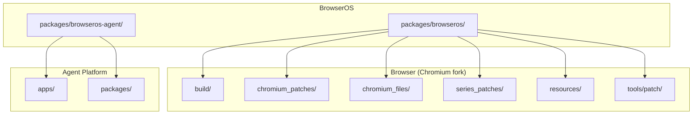
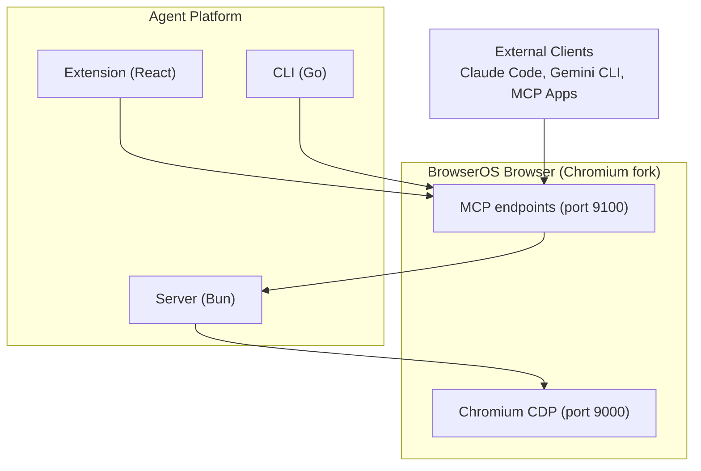
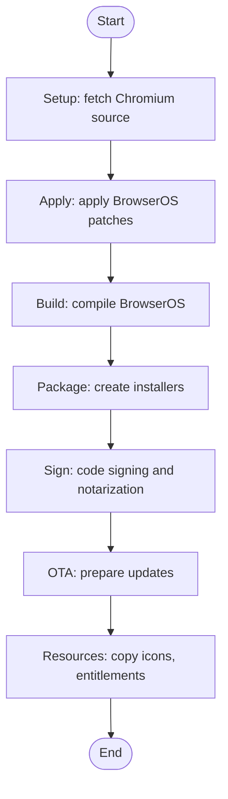
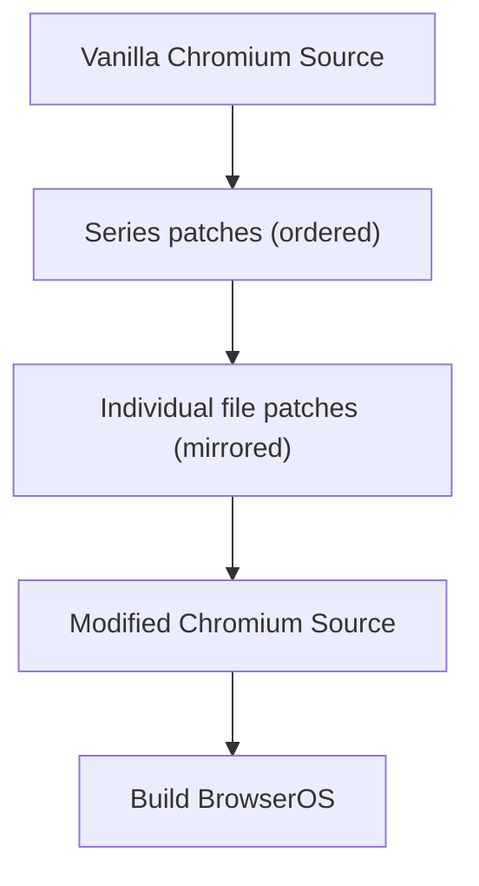
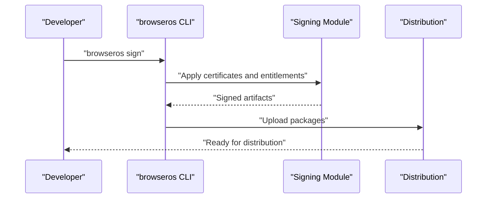
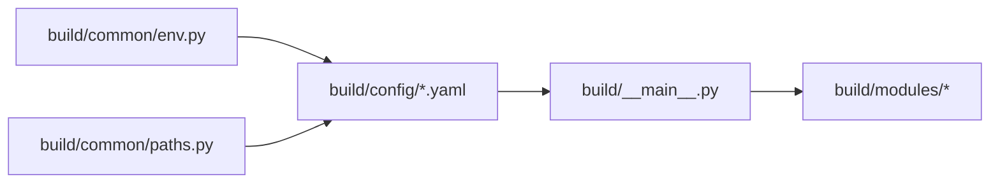

# Browser Development

<cite>
**Referenced Files in This Document**
- [README.md](file://README.md)
- [CONTRIBUTING.md](file://CONTRIBUTING.md)
- [packages/browseros/README.md](file://packages/browseros/README.md)
- [packages/browseros/build/common/env.py](file://packages/browseros/build/common/env.py)
- [packages/browseros/build/common/paths.py](file://packages/browseros/build/common/paths.py)
- [packages/browseros/build/config/debug.yaml](file://packages/browseros/build/config/debug.yaml)
- [packages/browseros/build/config/release.macos.yaml](file://packages/browseros/build/config/release.macos.yaml)
- [packages/browseros/build/config/release.windows.yaml](file://packages/browseros/build/config/release.windows.yaml)
- [packages/browseros/build/config/package.linux.yaml](file://packages/browseros/build/config/package.linux.yaml)
- [packages/browseros/build/config/sign.macos.yaml](file://packages/browseros/build/config/sign.macos.yaml)
- [packages/browseros/build/config/sign.windows.yaml](file://packages/browseros/build/config/sign.windows.yaml)
- [packages/browseros/build/config/download_resources.yaml](file://packages/browseros/build/config/download_resources.yaml)
- [packages/browseros/build/config/copy_resources.yaml](file://packages/browseros/build/config/copy_resources.yaml)
- [packages/browseros/build/docs/nightly-macos-ci.md](file://packages/browseros/build/docs/nightly-macos-ci.md)
- [packages/browseros/chromium_patches/chrome/browser/buildflags.gni](file://packages/browseros/chromium_patches/chrome/browser/buildflags.gni)
- [packages/browseros-agent/README.md](file://packages/browseros-agent/README.md)
- [LICENSE.ungoogled_chromium](file://LICENSE.ungoogled_chromium)
</cite>

## Table of Contents
1. [Introduction](#introduction)
2. [Project Structure](#project-structure)
3. [Core Components](#core-components)
4. [Architecture Overview](#architecture-overview)
5. [Detailed Component Analysis](#detailed-component-analysis)
6. [Dependency Analysis](#dependency-analysis)
7. [Performance Considerations](#performance-considerations)
8. [Troubleshooting Guide](#troubleshooting-guide)
9. [Conclusion](#conclusion)
10. [Appendices](#appendices)

## Introduction
This document explains how BrowserOS builds a Chromium-based browser with integrated AI agent capabilities. It covers the browser package structure, the Python-based build system, patch management for privacy and features, and the resources for icons, entitlements, and signing. It also clarifies the relationship with ungoogled-chromium, outlines build requirements and commands, and describes how the modified Chromium enables the agent platform.

## Project Structure
BrowserOS is a monorepo with two primary subsystems:
- Browser (Chromium fork): Python build system, Chromium patches, and platform resources
- Agent platform: TypeScript/Go server, Chrome extension, CLI, and evaluation tools

**Diagram sources**
- [README.md:144-178](file://README.md#L144-L178)
- [packages/browseros/README.md:29-66](file://packages/browseros/README.md#L29-L66)
- [packages/browseros-agent/README.md:5-27](file://packages/browseros-agent/README.md#L5-L27)

**Section sources**
- [README.md:144-178](file://README.md#L144-L178)
- [packages/browseros/README.md:29-66](file://packages/browseros/README.md#L29-L66)
- [packages/browseros-agent/README.md:5-27](file://packages/browseros-agent/README.md#L5-L27)

## Core Components
- Browser package (Chromium fork):
  - Build system: Python CLI orchestrating setup, patching, building, packaging, signing, OTA, and resource management
  - Patches: Chromium modifications for agent integration, MCP, privacy, branding, and platform features
  - Resources: Icons, entitlements, and signing assets
- Agent platform:
  - Server (Bun): MCP endpoints and agent loop
  - Extension (WXT + React): UI and Chrome API bridge
  - CLI (Go): Terminal control
  - Evaluation framework: Benchmarks

Key build prerequisites and commands are documented for macOS, Linux, and Windows.

**Section sources**
- [packages/browseros/README.md:7-18](file://packages/browseros/README.md#L7-L18)
- [packages/browseros/README.md:19-28](file://packages/browseros/README.md#L19-L28)
- [packages/browseros/README.md:80-88](file://packages/browseros/README.md#L80-L88)
- [CONTRIBUTING.md:93-141](file://CONTRIBUTING.md#L93-L141)
- [README.md:144-178](file://README.md#L144-L178)

## Architecture Overview
The BrowserOS browser integrates the agent platform by embedding MCP endpoints and agent UI into the Chromium runtime. The agent platform communicates with the browser via the Chrome DevTools Protocol (CDP) and exposes a server for external clients.

**Diagram sources**
- [packages/browseros-agent/README.md:33-62](file://packages/browseros-agent/README.md#L33-L62)
- [packages/browseros-agent/README.md:64-71](file://packages/browseros-agent/README.md#L64-L71)

**Section sources**
- [packages/browseros-agent/README.md:28-71](file://packages/browseros-agent/README.md#L28-L71)

## Detailed Component Analysis

### Build System (Python CLI)
The build system is a Python CLI that orchestrates the full pipeline:
- Setup: fetch Chromium source and prepare environment
- Apply: apply BrowserOS patches
- Build: compile Chromium into the BrowserOS binary
- Package: produce platform-specific installers (DMG, MSI, AppImage)
- Sign: code signing and notarization (macOS/Windows)
- OTA: over-the-air update support
- Resources: download and copy icons, entitlements, and signing assets

**Diagram sources**
- [packages/browseros/README.md:80-88](file://packages/browseros/README.md#L80-L88)
- [packages/browseros/README.md:117-124](file://packages/browseros/README.md#L117-L124)

**Section sources**
- [packages/browseros/README.md:68-88](file://packages/browseros/README.md#L68-L88)
- [packages/browseros/README.md:117-124](file://packages/browseros/README.md#L117-L124)

### Patch System and Privacy Enhancements
BrowserOS maintains two patch sets:
- Individual file patches mirrored under chromium_patches/ to match Chromium’s source tree
- Ordered patch series under series_patches/

Privacy enhancements leverage ungoogled-chromium patches. The patch extraction and application process ensures changes remain synchronized with the base Chromium version.

**Diagram sources**
- [packages/browseros/README.md:90-103](file://packages/browseros/README.md#L90-L103)
- [LICENSE.ungoogled_chromium:1-5](file://LICENSE.ungoogled_chromium#L1-L5)

**Section sources**
- [packages/browseros/README.md:90-103](file://packages/browseros/README.md#L90-L103)
- [LICENSE.ungoogled_chromium:1-5](file://LICENSE.ungoogled_chromium#L1-L5)

### Signing and Distribution (macOS, Windows, Linux)
- macOS:
  - Entitlements are managed under resources/entitlements/
  - Designated requirements pin to Team ID for persistent Keychain access
  - Notarization and stapling are part of the signing workflow
- Windows:
  - Code signing certificates are applied during the sign phase
- Linux:
  - Packaging targets are configured per distribution (AppImage, deb)

**Diagram sources**
- [packages/browseros/README.md:117-124](file://packages/browseros/README.md#L117-L124)
- [packages/browseros/build/config/sign.macos.yaml](file://packages/browseros/build/config/sign.macos.yaml)
- [packages/browseros/build/config/sign.windows.yaml](file://packages/browseros/build/config/sign.windows.yaml)
- [packages/browseros/build/config/package.linux.yaml](file://packages/browseros/build/config/package.linux.yaml)

**Section sources**
- [packages/browseros/README.md:117-124](file://packages/browseros/README.md#L117-L124)
- [packages/browseros/build/config/sign.macos.yaml](file://packages/browseros/build/config/sign.macos.yaml)
- [packages/browseros/build/config/sign.windows.yaml](file://packages/browseros/build/config/sign.windows.yaml)
- [packages/browseros/build/config/package.linux.yaml](file://packages/browseros/build/config/package.linux.yaml)

### Build Requirements and Commands
- Disk space: ~100 GB for Chromium source and build artifacts
- Python: 3.12+
- Platform tools:
  - macOS: Xcode + Command Line Tools
  - Linux: build-essential, clang, lld, and Chromium’s Linux dependencies
  - Windows: Visual Studio 2022 + Windows SDK
- Example commands:
  - Debug build (macOS/Linux/Windows)
  - Release build (macOS/Linux/Windows)
  - Full lifecycle: setup → apply → build → package → sign

**Section sources**
- [packages/browseros/README.md:19-28](file://packages/browseros/README.md#L19-L28)
- [CONTRIBUTING.md:93-141](file://CONTRIBUTING.md#L93-L141)

### Relationship with ungoogled-chromium and Base Chromium
- BrowserOS is based on Chromium and incorporates ungoogled-chromium patches for enhanced privacy
- The base Chromium version is pinned and maintained alongside the BrowserOS patch stack
- This ensures compatibility and allows incremental updates when moving to newer Chromium releases

**Section sources**
- [packages/browseros/README.md:11-18](file://packages/browseros/README.md#L11-L18)
- [packages/browseros/README.md:104-116](file://packages/browseros/README.md#L104-L116)
- [LICENSE.ungoogled_chromium:1-5](file://LICENSE.ungoogled_chromium#L1-L5)

### Integration Between Browser Patches and the Agent Platform
BrowserOS patches enable:
- Native AI agent sidebar and new tab integration
- Embedded MCP server endpoints
- Enhanced privacy via ungoogled-chromium
- Custom branding, icons, and entitlements
- Keychain access group management (macOS)
- Sparkle auto-update framework (macOS)

These features collectively allow the agent platform to run seamlessly within the browser, communicating via CDP and exposing MCP endpoints for external clients.

**Section sources**
- [packages/browseros/README.md:11-18](file://packages/browseros/README.md#L11-L18)
- [packages/browseros-agent/README.md:28-71](file://packages/browseros-agent/README.md#L28-L71)

## Dependency Analysis
The build system coordinates multiple modules and configurations:
- Configurations define platform-specific settings for debug, release, signing, and packaging
- Environment resolution loads secrets and paths from the browseros package root
- Paths utilities centralize filesystem locations for the build pipeline

**Diagram sources**
- [packages/browseros/build/common/env.py:20-30](file://packages/browseros/build/common/env.py#L20-L30)
- [packages/browseros/build/common/paths.py:20-30](file://packages/browseros/build/common/paths.py#L20-L30)
- [packages/browseros/build/config/debug.yaml](file://packages/browseros/build/config/debug.yaml)
- [packages/browseros/build/config/release.macos.yaml](file://packages/browseros/build/config/release.macos.yaml)
- [packages/browseros/build/config/release.windows.yaml](file://packages/browseros/build/config/release.windows.yaml)
- [packages/browseros/build/config/package.linux.yaml](file://packages/browseros/build/config/package.linux.yaml)

**Section sources**
- [packages/browseros/build/common/env.py:20-30](file://packages/browseros/build/common/env.py#L20-L30)
- [packages/browseros/build/common/paths.py:20-30](file://packages/browseros/build/common/paths.py#L20-L30)

## Performance Considerations
- Building Chromium requires substantial disk space (~100 GB) and time (1–3 hours depending on hardware)
- Recommended minimum 16 GB RAM for smooth builds
- Use platform-specific build configurations to optimize for your OS

[No sources needed since this section provides general guidance]

## Troubleshooting Guide
Common issues and resolutions:
- Missing platform tools:
  - macOS: install Xcode and Command Line Tools
  - Linux: install build-essential, clang, lld, and Chromium’s Linux dependencies
  - Windows: install Visual Studio 2022 and Windows SDK
- Environment variables and secrets:
  - Ensure .env is present and populated for signing and CI tasks
  - Nightly macOS CI expects signing and notarization variables in packages/browseros/.env
- Resource availability:
  - Verify entitlements and icons are downloaded/copied before packaging
- Patch conflicts:
  - When updating the base Chromium version, resolve conflicts in series_patches/ and chromium_patches/

**Section sources**
- [packages/browseros/README.md:19-28](file://packages/browseros/README.md#L19-L28)
- [packages/browseros/build/docs/nightly-macos-ci.md:71-75](file://packages/browseros/build/docs/nightly-macos-ci.md#L71-L75)
- [packages/browseros/build/config/download_resources.yaml](file://packages/browseros/build/config/download_resources.yaml)
- [packages/browseros/build/config/copy_resources.yaml](file://packages/browseros/build/config/copy_resources.yaml)

## Conclusion
BrowserOS combines a Chromium fork with a powerful agent platform to deliver an open-source, privacy-first browser with AI agent capabilities. The Python-based build system, patch management aligned with ungoogled-chromium, and robust signing/distribution workflows enable reliable development and deployment across macOS, Windows, and Linux. Developers can contribute either to the agent platform (easier setup) or the browser build (more involved but essential for core changes).

[No sources needed since this section summarizes without analyzing specific files]

## Appendices

### Development Setup and Contribution Guidelines
- Agent development (TypeScript/React) requires minimal setup and ~500 MB disk space
- Browser development (C++/Python) requires ~100 GB disk space and platform tools
- First-time build steps:
  - Fetch Chromium source per platform instructions
  - Run browseros setup, apply, build, package, and sign
- Contribution workflow:
  - Open PRs with conventional commit titles, descriptions, and links to issues
  - Sign the CLA on first PR

**Section sources**
- [CONTRIBUTING.md:11-56](file://CONTRIBUTING.md#L11-L56)
- [CONTRIBUTING.md:89-141](file://CONTRIBUTING.md#L89-L141)
- [CONTRIBUTING.md:143-158](file://CONTRIBUTING.md#L143-L158)

### Build Commands Reference
- Install build system: pip install -e .
- Lifecycle commands: setup, apply, build, package, sign
- Platform-specific debug and release builds are configured via YAML files

**Section sources**
- [packages/browseros/README.md:72-88](file://packages/browseros/README.md#L72-L88)
- [packages/browseros/build/config/debug.yaml](file://packages/browseros/build/config/debug.yaml)
- [packages/browseros/build/config/release.macos.yaml](file://packages/browseros/build/config/release.macos.yaml)
- [packages/browseros/build/config/release.windows.yaml](file://packages/browseros/build/config/release.windows.yaml)
- [packages/browseros/build/config/package.linux.yaml](file://packages/browseros/build/config/package.linux.yaml)