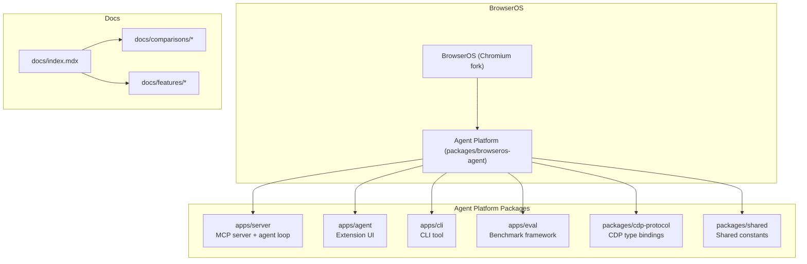
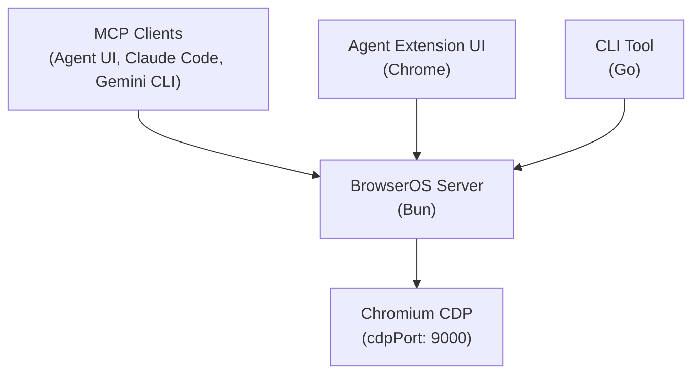
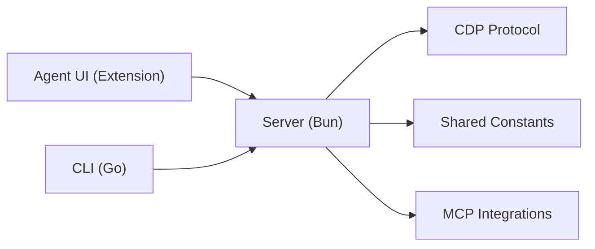

# Comparisons

<cite>
**Referenced Files in This Document**
- [README.md](file://README.md)
- [docs/index.mdx](file://docs/index.mdx)
- [docs/comparisons/chrome-devtools-mcp.mdx](file://docs/comparisons/chrome-devtools-mcp.mdx)
- [docs/comparisons/claude-cowork.mdx](file://docs/comparisons/claude-cowork.mdx)
- [docs/comparisons/openclaw.mdx](file://docs/comparisons/openclaw.mdx)
- [docs/features/cowork.mdx](file://docs/features/cowork.mdx)
- [docs/features/workflows.mdx](file://docs/features/workflows.mdx)
- [docs/features/scheduled-tasks.mdx](file://docs/features/scheduled-tasks.mdx)
- [docs/features/connect-mcps.mdx](file://docs/features/connect-mcps.mdx)
- [docs/features/local-models.mdx](file://docs/features/local-models.mdx)
- [packages/browseros-agent/README.md](file://packages/browseros-agent/README.md)
</cite>

## Table of Contents
1. [Introduction](#introduction)
2. [Project Structure](#project-structure)
3. [Core Components](#core-components)
4. [Architecture Overview](#architecture-overview)
5. [Detailed Component Analysis](#detailed-component-analysis)
6. [Dependency Analysis](#dependency-analysis)
7. [Performance Considerations](#performance-considerations)
8. [Troubleshooting Guide](#troubleshooting-guide)
9. [Conclusion](#conclusion)
10. [Appendices](#appendices)

## Introduction
This document provides a comprehensive comparison of BrowserOS against three primary alternatives: Chrome DevTools MCP, Claude Cowork, and OpenClaw. It highlights BrowserOS’s unique capabilities—AI agent functionality, MCP server, visual workflows, cowork features, scheduled tasks, bring-your-own-keys, local models, and local-first privacy—while mapping competitive advantages in open-source nature, privacy-first design, and extensibility. Decision matrices and persona-targeted use cases are included to guide product selection, along with feature maturity assessments and technical architecture insights.

## Project Structure
BrowserOS is an open-source Chromium-based browser with an integrated agent platform. The repository organizes comparison content under docs/comparisons and feature documentation under docs/features. The agent platform lives under packages/browseros-agent and includes the MCP server, agent UI, CLI, and evaluation framework.

**Diagram sources**
- [README.md:144-178](file://README.md#L144-L178)
- [packages/browseros-agent/README.md:7-27](file://packages/browseros-agent/README.md#L7-L27)
- [docs/index.mdx:1-107](file://docs/index.mdx#L1-L107)

**Section sources**
- [README.md:144-178](file://README.md#L144-L178)
- [packages/browseros-agent/README.md:7-27](file://packages/browseros-agent/README.md#L7-L27)
- [docs/index.mdx:1-107](file://docs/index.mdx#L1-L107)

## Core Components
- AI Agent and MCP Server: BrowserOS ships with a built-in MCP server exposing 53+ browser automation tools and an agent loop. It integrates with Claude Code, Gemini CLI, and other MCP clients.
- Cowork: Combines browser automation with local file operations, enabling agents to research the web and save outputs to a sandboxed folder.
- Workflows: Visual graph builder for building repeatable, reliable browser automations.
- Scheduled Tasks: Run agents on autopilot at daily, hourly, or minute intervals.
- Connect Apps (MCP): Seamless OAuth-based integrations with 40+ services (Gmail, Slack, GitHub, Notion, etc.).
- Bring Your Own Keys and Local Models: Support for multiple LLM providers and local inference via Ollama/LM Studio.
- Privacy-First and Open Source: AGPL-3.0, local-first execution, and transparent source.

**Section sources**
- [README.md:44-62](file://README.md#L44-L62)
- [README.md:124-142](file://README.md#L124-L142)
- [docs/features/cowork.mdx:1-70](file://docs/features/cowork.mdx#L1-L70)
- [docs/features/workflows.mdx:1-25](file://docs/features/workflows.mdx#L1-L25)
- [docs/features/scheduled-tasks.mdx:1-20](file://docs/features/scheduled-tasks.mdx#L1-L20)
- [docs/features/connect-mcps.mdx:1-20](file://docs/features/connect-mcps.mdx#L1-L20)
- [docs/features/local-models.mdx:1-20](file://docs/features/local-models.mdx#L1-L20)

## Architecture Overview
BrowserOS separates the browser (Chromium fork) from the agent platform. The agent platform runs a Bun-based server exposing MCP endpoints and an agent loop, communicating with Chromium via the Chrome DevTools Protocol (CDP). The agent UI is a Chrome extension, and a Go CLI enables terminal control.

**Diagram sources**
- [packages/browseros-agent/README.md:34-62](file://packages/browseros-agent/README.md#L34-L62)
- [packages/browseros-agent/README.md:64-71](file://packages/browseros-agent/README.md#L64-L71)

**Section sources**
- [packages/browseros-agent/README.md:28-71](file://packages/browseros-agent/README.md#L28-L71)

## Detailed Component Analysis

### BrowserOS vs Chrome DevTools MCP
- Scope: Chrome DevTools MCP focuses on debugging and inspection; BrowserOS MCP is a full browser automation and app integration platform.
- Tool Surface: BrowserOS MCP provides 53 tools; Chrome DevTools MCP provides 29 tools.
- Integrations: BrowserOS MCP includes 40+ app integrations; Chrome DevTools MCP has none.
- Setup: BrowserOS MCP is built into the browser with a single URL; Chrome DevTools MCP requires a debug port and a separate Node.js server.
- Session: BrowserOS uses your real browser with cookies/logins/extensions; Chrome DevTools MCP attaches a debug session (some sites block WebDriver-controlled browsers).

Decision matrix:
- Choose BrowserOS MCP when you need broad automation, content extraction, file operations, and app integrations.
- Choose Chrome DevTools MCP when you primarily need debugging and performance inspection.

**Section sources**
- [docs/comparisons/chrome-devtools-mcp.mdx:6-202](file://docs/comparisons/chrome-devtools-mcp.mdx#L6-L202)

### BrowserOS vs Claude Cowork
- Execution Environment: BrowserOS Cowork runs inside your real browser with full web access and 40+ app integrations; Claude Cowork runs inside an isolated VM with restricted internet access.
- Browser Automation: BrowserOS Cowork includes 53+ tools; Claude Cowork lacks browser automation.
- File Operations: Comparable in scope; BrowserOS adds parallel subtasks (coming soon).
- Document Generation: Claude Cowork excels in advanced office document creation; BrowserOS provides basic HTML/Markdown/CSV.
- Pricing: BrowserOS is free with BYOK; Claude Cowork requires a paid subscription.
- Platform: BrowserOS runs on any OS with BrowserOS; Claude Cowork is macOS/Windows x64.

Decision matrix:
- Choose BrowserOS Cowork when tasks involve web navigation, form filling, screenshots, content extraction, or cross-app workflows.
- Choose Claude Cowork when you need polished office documents and stronger isolation.

**Section sources**
- [docs/comparisons/claude-cowork.mdx:6-161](file://docs/comparisons/claude-cowork.mdx#L6-L161)

### BrowserOS vs OpenClaw
- Approach: BrowserOS runs an AI assistant directly inside the browser; OpenClaw is a self-hosted agent you message through chat apps.
- Setup: BrowserOS requires no terminal or daemon; OpenClaw requires Node.js, onboarding wizard, and daemon configuration.
- Browser Automation: BrowserOS provides 53 tools; OpenClaw uses Chrome CDP via a separate process.
- Integrations: BrowserOS offers 40+ built-in integrations; OpenClaw relies on skills-based community plugins.
- Always-on Operation: OpenClaw runs as a daemon; BrowserOS scheduled tasks require the browser to be open.
- Mobile Access: OpenClaw offers companion apps; BrowserOS is a desktop browser.

Decision matrix:
- Choose BrowserOS when you want a no-setup, browser-native assistant with deep automation and integrations.
- Choose OpenClaw when you prefer messaging through chat apps, need an always-on daemon, or want mobile companion apps.

**Section sources**
- [docs/comparisons/openclaw.mdx:6-144](file://docs/comparisons/openclaw.mdx#L6-L144)

### Feature-by-Feature Comparison Highlights
- AI Agent and MCP Server: BrowserOS MCP exposes 53+ tools and integrates with Claude Code/Gemini CLI.
- Visual Workflows: Graph builder for repeatable automations.
- Cowork: Browser automation plus local file operations in a sandboxed folder.
- Scheduled Tasks: Daily/hourly/minute schedules with hidden background execution.
- Connect Apps (MCP): 40+ services via OAuth or API keys.
- Bring Your Own Keys: Multiple providers and OAuth support.
- Local Models: Ollama/LM Studio with recommended context length guidance.
- Privacy-First: Local-first execution, AGPL-3.0, secure OAuth, and granular access controls.

**Section sources**
- [README.md:44-62](file://README.md#L44-L62)
- [docs/features/workflows.mdx:1-25](file://docs/features/workflows.mdx#L1-L25)
- [docs/features/cowork.mdx:1-70](file://docs/features/cowork.mdx#L1-L70)
- [docs/features/scheduled-tasks.mdx:1-20](file://docs/features/scheduled-tasks.mdx#L1-L20)
- [docs/features/connect-mcps.mdx:1-20](file://docs/features/connect-mcps.mdx#L1-L20)
- [docs/features/local-models.mdx:1-20](file://docs/features/local-models.mdx#L1-L20)

### Competitive Advantages
- Open Source: AGPL-3.0 allows inspection, modification, and redistribution.
- Privacy-First: Runs locally; BYOK; secure OAuth; no background access.
- Extensibility: MCP ecosystem, custom servers, and skills; modular agent platform.

**Section sources**
- [README.md:126-138](file://README.md#L126-L138)
- [docs/features/connect-mcps.mdx:293-309](file://docs/features/connect-mcps.mdx#L293-L309)

### Decision Matrices and Personas
- Developer focused on automation:
  - Prefer BrowserOS MCP for broad tool surface and 40+ integrations.
  - Consider Chrome DevTools MCP only for debugging/performance inspection.
- Getting real work done with AI:
  - Choose BrowserOS Cowork for web access, real logins, and cross-app workflows.
  - Choose Claude Cowork for advanced document generation and isolation.
- Everyday AI assistance:
  - Choose BrowserOS for no-setup, browser-native automation.
  - Choose OpenClaw for messaging-centric workflows and always-on daemon.

**Section sources**
- [docs/comparisons/chrome-devtools-mcp.mdx:12-202](file://docs/comparisons/chrome-devtools-mcp.mdx#L12-L202)
- [docs/comparisons/claude-cowork.mdx:12-161](file://docs/comparisons/claude-cowork.mdx#L12-L161)
- [docs/comparisons/openclaw.mdx:12-144](file://docs/comparisons/openclaw.mdx#L12-L144)

### Feature Maturity Assessments
- BrowserOS MCP: Broad coverage; debugging/performance tools coming soon.
- Cowork: Filesystem tools mature; parallel subtasks coming soon.
- Workflows: New feature; visual graph builder with example use cases.
- Scheduled Tasks: Stable with run history and cloud sync.
- Connect Apps (MCP): 40+ built-in integrations; custom servers supported.
- Local Models: Guidance on context length and model recommendations.

**Section sources**
- [docs/comparisons/chrome-devtools-mcp.mdx:121-133](file://docs/comparisons/chrome-devtools-mcp.mdx#L121-L133)
- [docs/features/cowork.mdx:1-70](file://docs/features/cowork.mdx#L1-L70)
- [docs/features/workflows.mdx:1-25](file://docs/features/workflows.mdx#L1-L25)
- [docs/features/scheduled-tasks.mdx:1-20](file://docs/features/scheduled-tasks.mdx#L1-L20)
- [docs/features/connect-mcps.mdx:1-20](file://docs/features/connect-mcps.mdx#L1-L20)
- [docs/features/local-models.mdx:8-22](file://docs/features/local-models.mdx#L8-L22)

### Target Market Positioning and Ideal Use Cases
- BrowserOS MCP: Developers automating browser tasks, integrating with Claude Code/Gemini CLI.
- BrowserOS Cowork: Knowledge workers doing research, form filling, and cross-app coordination.
- OpenClaw: Power users messaging AI through chat apps, needing always-on daemon and mobile access.

**Section sources**
- [docs/comparisons/chrome-devtools-mcp.mdx:6-202](file://docs/comparisons/chrome-devtools-mcp.mdx#L6-L202)
- [docs/comparisons/claude-cowork.mdx:6-161](file://docs/comparisons/claude-cowork.mdx#L6-L161)
- [docs/comparisons/openclaw.mdx:6-144](file://docs/comparisons/openclaw.mdx#L6-L144)

### Technical Advantages and Implementation Choices
- Architecture: Separate browser and agent platform; server communicates with Chromium via CDP.
- Ports: Server (9100), CDP (9000), legacy extension port (9300).
- Development: Bun-based server, WXT/React extension UI, Go CLI, benchmark framework.
- MCP Integration: Built-in server with 53+ tools; custom servers supported.

**Section sources**
- [packages/browseros-agent/README.md:28-71](file://packages/browseros-agent/README.md#L28-L71)
- [packages/browseros-agent/README.md:146-172](file://packages/browseros-agent/README.md#L146-L172)

## Dependency Analysis
BrowserOS’s agent platform is modular, with the server depending on CDP bindings and shared constants. The agent UI depends on the server, and the CLI depends on the server. MCP integrations plug in via OAuth or custom servers.

**Diagram sources**
- [packages/browseros-agent/README.md:14-26](file://packages/browseros-agent/README.md#L14-L26)

**Section sources**
- [packages/browseros-agent/README.md:14-26](file://packages/browseros-agent/README.md#L14-L26)

## Performance Considerations
- Agent Mode requires stronger models due to multi-step reasoning; local LLMs are not yet powerful enough for Agent Mode.
- Chat Mode works well with local models; recommended models depend on available RAM/VRAM.
- Scheduled tasks run in a hidden window with a 10-minute timeout; browser must be open for execution.

**Section sources**
- [docs/index.mdx:61-75](file://docs/index.mdx#L61-L75)
- [docs/features/local-models.mdx:8-22](file://docs/features/local-models.mdx#L8-L22)
- [docs/features/scheduled-tasks.mdx:126-128](file://docs/features/scheduled-tasks.mdx#L126-L128)

## Troubleshooting Guide
- MCP Setup: Use the URL from BrowserOS settings; copy-and-connect from any MCP client.
- Local Models: Ensure adequate context length (≥15K–20K) for Ollama; verify model size and VRAM allocation.
- Scheduled Tasks: Confirm the browser is open; tasks run in a hidden window; review run history for failures.

**Section sources**
- [docs/comparisons/chrome-devtools-mcp.mdx:151-179](file://docs/comparisons/chrome-devtools-mcp.mdx#L151-L179)
- [docs/features/local-models.mdx:14-22](file://docs/features/local-models.mdx#L14-L22)
- [docs/features/scheduled-tasks.mdx:111-124](file://docs/features/scheduled-tasks.mdx#L111-L124)

## Conclusion
BrowserOS distinguishes itself through a comprehensive, privacy-first browser-native AI platform. Its strengths lie in broad browser automation, 40+ app integrations, visual workflows, scheduled tasks, BYOK and local models, and an open-source, extensible architecture. For developer-focused automation, BrowserOS MCP surpasses Chrome DevTools MCP. For getting real work done, BrowserOS Cowork outperforms Claude Cowork in web access and integrations. For everyday AI assistance, BrowserOS offers a no-setup, browser-native alternative to OpenClaw, while OpenClaw complements BrowserOS for always-on messaging and mobile use.

[No sources needed since this section summarizes without analyzing specific files]

## Appendices

### Feature Matrix: BrowserOS vs Alternatives
- BrowserOS MCP vs Chrome DevTools MCP: 53 tools vs 29; 40+ integrations vs none; built-in vs external Node.js server; real browser vs debug session.
- BrowserOS Cowork vs Claude Cowork: 53 tools + integrations vs none; sandboxed folder vs VM; BYOK vs Claude-only; free vs paid.
- BrowserOS vs OpenClaw: 53 tools + integrations vs Chrome CDP; no setup vs Node.js daemon; browser-native vs chat app; 40+ vs skills-based integrations.

**Section sources**
- [docs/comparisons/chrome-devtools-mcp.mdx:12-202](file://docs/comparisons/chrome-devtools-mcp.mdx#L12-L202)
- [docs/comparisons/claude-cowork.mdx:12-161](file://docs/comparisons/claude-cowork.mdx#L12-L161)
- [docs/comparisons/openclaw.mdx:12-144](file://docs/comparisons/openclaw.mdx#L12-L144)