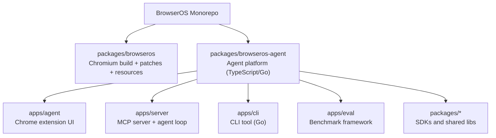
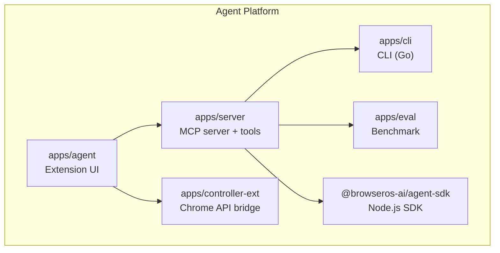
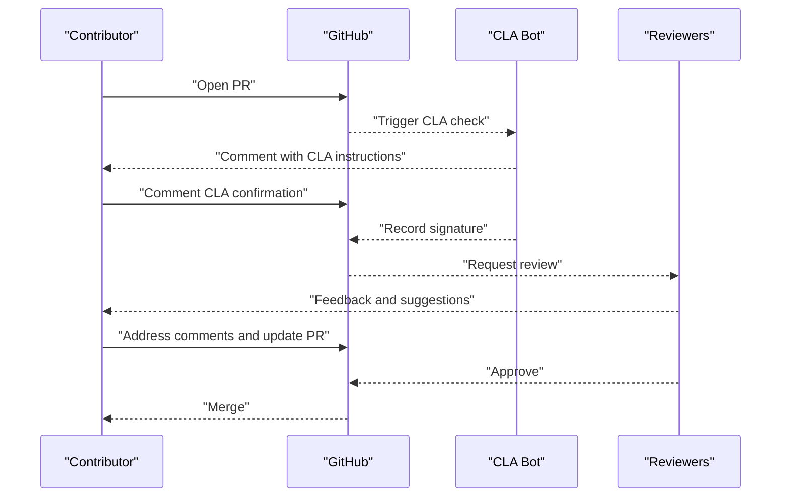
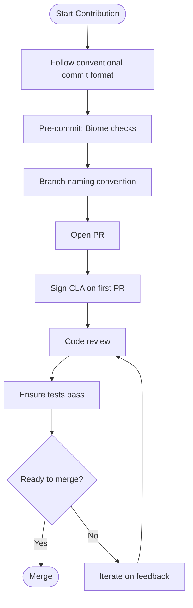
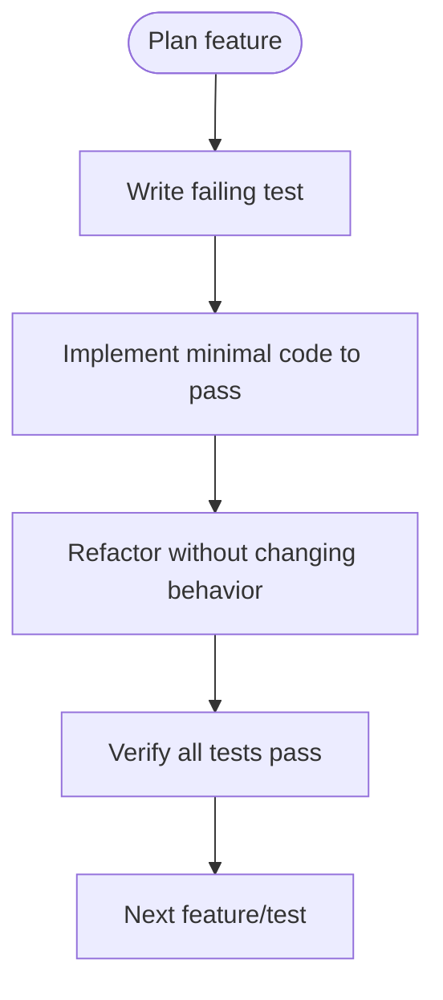
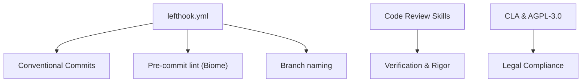

# Contributing

<cite>
**Referenced Files in This Document**
- [CONTRIBUTING.md](file://CONTRIBUTING.md)
- [README.md](file://README.md)
- [CLA.md](file://CLA.md)
- [.github/SECURITY.md](file://.github/SECURITY.md)
- [docs/contributing.mdx](file://docs/contributing.mdx)
- [.claude/skills/receiving-code-review/SKILL.md](file://.claude/skills/receiving-code-review/SKILL.md)
- [.claude/skills/requesting-code-review/SKILL.md](file://.claude/skills/requesting-code-review/SKILL.md)
- [.claude/skills/systematic-debugging/root-cause-tracing.md](file://.claude/skills/systematic-debugging/root-cause-tracing.md)
- [.claude/skills/test-driven-development/SKILL.md](file://.claude/skills/test-driven-development/SKILL.md)
- [.claude/skills/write-docs/SKILL.md](file://.claude/skills/write-docs/SKILL.md)
- [lefthook.yml](file://lefthook.yml)
- [signatures/version1/cla.json](file://signatures/version1/cla.json)
- [.github/ISSUE_TEMPLATE/feature_request.md](file://.github/ISSUE_TEMPLATE/feature_request.md)
</cite>

## Table of Contents
1. [Introduction](#introduction)
2. [Project Structure](#project-structure)
3. [Core Components](#core-components)
4. [Architecture Overview](#architecture-overview)
5. [Detailed Component Analysis](#detailed-component-analysis)
6. [Dependency Analysis](#dependency-analysis)
7. [Performance Considerations](#performance-considerations)
8. [Troubleshooting Guide](#troubleshooting-guide)
9. [Conclusion](#conclusion)
10. [Appendices](#appendices)

## Introduction
This document explains how to contribute effectively to BrowserOS. It covers contribution pathways, development environments, code standards, testing and review processes, CLA and licensing, governance and community channels, and release considerations. Whether you are fixing bugs, proposing features, improving documentation, or building tools, there are clear processes to help you succeed.

## Project Structure
BrowserOS is a monorepo with two primary development paths:
- Agent platform (TypeScript/React, Go, Bun) for browser automation, UI, and MCP server
- Browser (C++/Python) for a custom Chromium build and build system

**Diagram sources**
- [README.md:144-178](file://README.md#L144-L178)

**Section sources**
- [README.md:144-178](file://README.md#L144-L178)
- [docs/contributing.mdx:29-86](file://docs/contributing.mdx#L29-L86)

## Core Components
- Agent platform: Provides the browser extension UI, MCP server, CLI, benchmarking, and SDKs. Best for rapid iteration and most contributor entry points.
- Browser: Custom Chromium build with patches and build scripts. Requires significant disk space and time to build.

Key entry points:
- Agent quick setup and commands are documented in the agent contributing guide.
- Browser build instructions and prerequisites are documented in the browser contributing guide.

**Section sources**
- [CONTRIBUTING.md:58-88](file://CONTRIBUTING.md#L58-L88)
- [CONTRIBUTING.md:89-142](file://CONTRIBUTING.md#L89-L142)
- [docs/contributing.mdx:29-86](file://docs/contributing.mdx#L29-L86)
- [docs/contributing.mdx:88-217](file://docs/contributing.mdx#L88-L217)

## Architecture Overview
The Agent platform is composed of:
- Agent UI (extension)
- Server (MCP tools and agent loop)
- Controller extension (Chrome API bridge)
- CLI (Go)
- Eval (benchmarking)
- SDKs and shared packages

**Diagram sources**
- [README.md:163-177](file://README.md#L163-L177)

**Section sources**
- [README.md:163-177](file://README.md#L163-L177)
- [docs/contributing.mdx:39-41](file://docs/contributing.mdx#L39-L41)

## Detailed Component Analysis

### Contribution Paths and Development Environments
- Agent development (TypeScript/React) is recommended for first-time contributors due to lower setup overhead.
- Browser development (C++/Python) is for contributors working on Chromium-level changes and requires substantial disk space and build time.

Environment setup highlights:
- Agent: Node.js, Yarn/Bun, environment variables, and loading the unpacked extension.
- Browser: Platform-specific toolchains, depot_tools, and Python dependencies via uv.

**Section sources**
- [CONTRIBUTING.md:17-56](file://CONTRIBUTING.md#L17-L56)
- [CONTRIBUTING.md:58-88](file://CONTRIBUTING.md#L58-L88)
- [CONTRIBUTING.md:89-142](file://CONTRIBUTING.md#L89-L142)
- [docs/contributing.mdx:43-86](file://docs/contributing.mdx#L43-L86)
- [docs/contributing.mdx:122-193](file://docs/contributing.mdx#L122-L193)

### Issue Tracking and Feature Requests
- Report bugs with clear reproduction steps, expected vs actual behavior, and environment details.
- Propose features via GitHub Issues or Discord.
- Use the provided feature request template to structure proposals.

**Section sources**
- [CONTRIBUTING.md:230-242](file://CONTRIBUTING.md#L230-L242)
- [.github/ISSUE_TEMPLATE/feature_request.md:1-23](file://.github/ISSUE_TEMPLATE/feature_request.md#L1-L23)

### Pull Request Process and Merge Criteria
- Fork, branch, commit with conventional commit messages, push, and open a PR with a clear description.
- Sign the CLA on your first PR.
- Code review is mandatory before merge; address feedback systematically.

**Diagram sources**
- [CONTRIBUTING.md:143-158](file://CONTRIBUTING.md#L143-L158)
- [CLA.md:46-49](file://CLA.md#L46-L49)
- [.claude/skills/receiving-code-review/SKILL.md:14-25](file://.claude/skills/receiving-code-review/SKILL.md#L14-L25)

**Section sources**
- [CONTRIBUTING.md:143-158](file://CONTRIBUTING.md#L143-L158)
- [CLA.md:46-49](file://CLA.md#L46-L49)
- [.claude/skills/receiving-code-review/SKILL.md:14-25](file://.claude/skills/receiving-code-review/SKILL.md#L14-L25)

### Code Standards and Quality Practices
- TypeScript: strict typing, Zod schemas, path aliases, consistent naming.
- React: Tailwind only, top-level hooks, Zod props, Vitest for testing.
- General: short functions, tests for new features, graceful error handling.
- Pre-commit and branch hygiene enforced via lefthook (conventional commits, Biome checks, file length warnings).

**Diagram sources**
- [lefthook.yml:1-16](file://lefthook.yml#L1-L16)
- [lefthook.yml:17-58](file://lefthook.yml#L17-L58)
- [CONTRIBUTING.md:159-203](file://CONTRIBUTING.md#L159-L203)

**Section sources**
- [CONTRIBUTING.md:159-203](file://CONTRIBUTING.md#L159-L203)
- [lefthook.yml:1-16](file://lefthook.yml#L1-L16)
- [lefthook.yml:17-58](file://lefthook.yml#L17-L58)

### Testing Requirements and TDD
- Adopt test-driven development: write the failing test first, implement minimal code to pass, then refactor.
- Prefer real behavior tests over mocks where possible.
- Use Vitest for React/TypeScript components.
- Use the systematic debugging skill to trace root causes and add instrumentation when needed.

**Diagram sources**
- [.claude/skills/test-driven-development/SKILL.md:47-69](file://.claude/skills/test-driven-development/SKILL.md#L47-L69)

**Section sources**
- [.claude/skills/test-driven-development/SKILL.md:1-372](file://.claude/skills/test-driven-development/SKILL.md#L1-L372)

### Documentation Improvements
- Docs live in the docs directory and use Mintlify.
- Use the documentation skill to structure and write concise feature docs.
- Update navigation in docs/docs.json.

**Section sources**
- [docs/contributing.mdx:21-26](file://docs/contributing.mdx#L21-L26)
- [.claude/skills/write-docs/SKILL.md:1-117](file://.claude/skills/write-docs/SKILL.md#L1-L117)

### Code Review Process
- Request reviews early and often; dispatch a subagent reviewer with precise context.
- Receive reviews with verification and technical rigor; clarify unclear points before implementation.
- Push back when feedback is incorrect or introduces regressions; collaborate to resolve differences.

**Section sources**
- [.claude/skills/requesting-code-review/SKILL.md:1-106](file://.claude/skills/requesting-code-review/SKILL.md#L1-L106)
- [.claude/skills/receiving-code-review/SKILL.md:1-214](file://.claude/skills/receiving-code-review/SKILL.md#L1-L214)

### Security Reporting
- Do not report security issues via public issues or PRs.
- Use the GitHub Security Advisory form with detailed reproduction steps and impact information.

**Section sources**
- [.github/SECURITY.md:1-20](file://.github/SECURITY.md#L1-L20)

### Legal and Licensing (CLA and AGPL-3.0)
- All contributions are subject to the Contributor License Agreement.
- Contributions are licensed under AGPL-3.0; by contributing, you agree to this license.
- A record of signed contributors is maintained.

**Section sources**
- [CLA.md:1-49](file://CLA.md#L1-L49)
- [CONTRIBUTING.md:275-278](file://CONTRIBUTING.md#L275-L278)
- [signatures/version1/cla.json:1-140](file://signatures/version1/cla.json#L1-L140)

### Governance and Community Guidelines
- Community channels: Discord, Slack, GitHub Issues, GitHub Discussions.
- Recognition: Contributors are credited in release notes and README.
- Follow the project’s code of conduct implicitly through respectful collaboration and technical rigor.

**Section sources**
- [CONTRIBUTING.md:261-274](file://CONTRIBUTING.md#L261-L274)
- [README.md:5-8](file://README.md#L5-L8)

### Release Process and Versioning
- Conventional commits drive semantic versioning and changelogs.
- Pre-push branch naming enforces clear feature/fix/release labeling.
- Releases are packaged per platform (macOS, Windows, Linux) and distributed via project assets.

**Section sources**
- [lefthook.yml:1-16](file://lefthook.yml#L1-L16)
- [lefthook.yml:40-58](file://lefthook.yml#L40-L58)
- [README.md:10-21](file://README.md#L10-L21)

### Backward Compatibility Considerations
- When reviewing, verify that suggested changes do not break existing functionality.
- Use YAGNI checks to avoid implementing unused features.
- Maintain compatibility with supported platforms and versions.

**Section sources**
- [.claude/skills/receiving-code-review/SKILL.md:88-122](file://.claude/skills/receiving-code-review/SKILL.md#L88-L122)

### New Contributor Guidance
- Start with the Agent path for quicker iteration.
- Use the documentation skill to improve docs.
- Follow TDD and pre-commit checks to maintain quality.
- Join Discord for mentorship and support.

**Section sources**
- [CONTRIBUTING.md:17-11](file://CONTRIBUTING.md#L17-L11)
- [.claude/skills/write-docs/SKILL.md:1-117](file://.claude/skills/write-docs/SKILL.md#L1-L117)
- [README.md:5-8](file://README.md#L5-L8)

## Dependency Analysis
The repository enforces contribution quality via local tooling and community processes:
- Lefthook enforces commit message format, pre-commit linting, and branch naming.
- Code review skills ensure rigorous verification and collaborative improvement.
- CLA and AGPL-3.0 govern contributions and licensing.

**Diagram sources**
- [lefthook.yml:1-58](file://lefthook.yml#L1-L58)
- [.claude/skills/receiving-code-review/SKILL.md:1-214](file://.claude/skills/receiving-code-review/SKILL.md#L1-L214)
- [CLA.md:1-49](file://CLA.md#L1-L49)

**Section sources**
- [lefthook.yml:1-58](file://lefthook.yml#L1-L58)
- [.claude/skills/receiving-code-review/SKILL.md:1-214](file://.claude/skills/receiving-code-review/SKILL.md#L1-L214)
- [CLA.md:1-49](file://CLA.md#L1-L49)

## Performance Considerations
- Browser builds are resource-intensive; use ccache, sufficient CPU cores, and prefer debug builds for development.
- Keep functions short and tests focused to reduce CI time and improve maintainability.

[No sources needed since this section provides general guidance]

## Troubleshooting Guide
Common issues and resolutions:
- Build failures due to missing platform dependencies: follow the Chromium build guide for your OS.
- Out of disk space: ensure at least 100GB free for Chromium source.
- UV command not found: restart your terminal after installation.
- Unclear review feedback: ask for clarification before implementing.

**Section sources**
- [docs/contributing.mdx:207-217](file://docs/contributing.mdx#L207-L217)

## Conclusion
BrowserOS welcomes contributions across the Agent platform and Browser build. By following the contribution pathways, adhering to code standards, practicing TDD, engaging in rigorous code review, and complying with the CLA and AGPL-3.0, you can make meaningful impact. Use the documented tools and community channels to get help and recognition.

[No sources needed since this section summarizes without analyzing specific files]

## Appendices

### Appendix A: Contribution Types and Guidelines
- Bug fixes: reproduce clearly, include environment details, and link related issues.
- Feature development: propose via feature request template, implement with tests, and document.
- Documentation: concise, practical, and visually supported.
- Translations: coordinate via community channels.
- Testing: adopt TDD, write real behavior tests, and add benchmarks where appropriate.

**Section sources**
- [CONTRIBUTING.md:230-260](file://CONTRIBUTING.md#L230-L260)
- [.claude/skills/test-driven-development/SKILL.md:1-372](file://.claude/skills/test-driven-development/SKILL.md#L1-L372)
- [.claude/skills/write-docs/SKILL.md:72-117](file://.claude/skills/write-docs/SKILL.md#L72-L117)

### Appendix B: Development Paths
- Agent platform: TypeScript/React, Bun, Chrome APIs, MCP server, CLI, SDKs.
- Browser platform: C++, Python, Chromium patches, build scripts, signing.

**Section sources**
- [docs/contributing.mdx:29-86](file://docs/contributing.mdx#L29-L86)
- [docs/contributing.mdx:88-217](file://docs/contributing.mdx#L88-L217)

### Appendix C: Community Resources
- Discord: real-time chat and support
- Slack: join the team
- GitHub Issues: bug reports and feature requests
- GitHub Discussions: general questions

**Section sources**
- [CONTRIBUTING.md:261-268](file://CONTRIBUTING.md#L261-L268)
- [README.md:5-8](file://README.md#L5-L8)