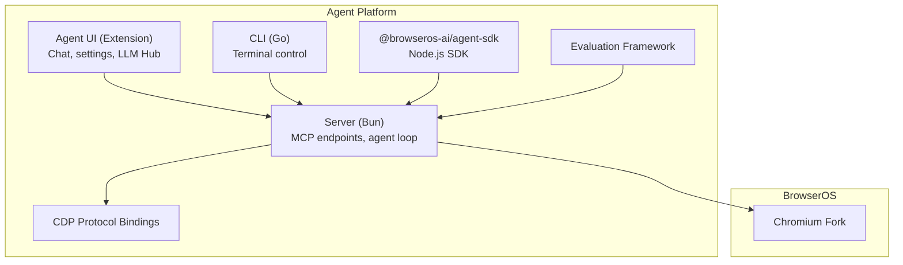
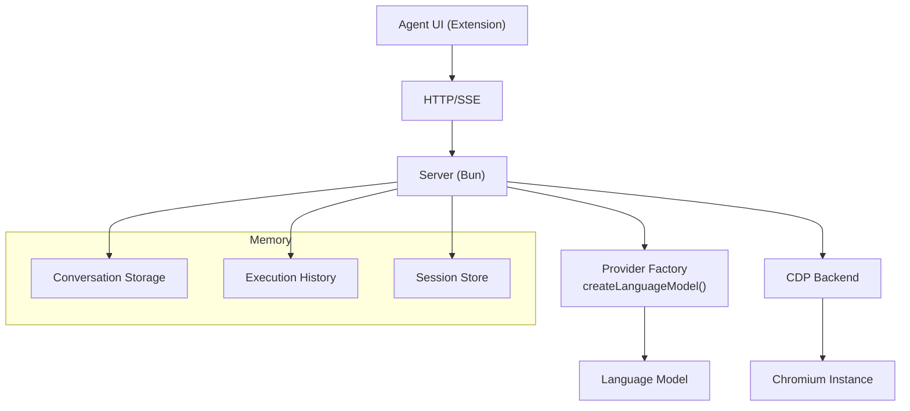
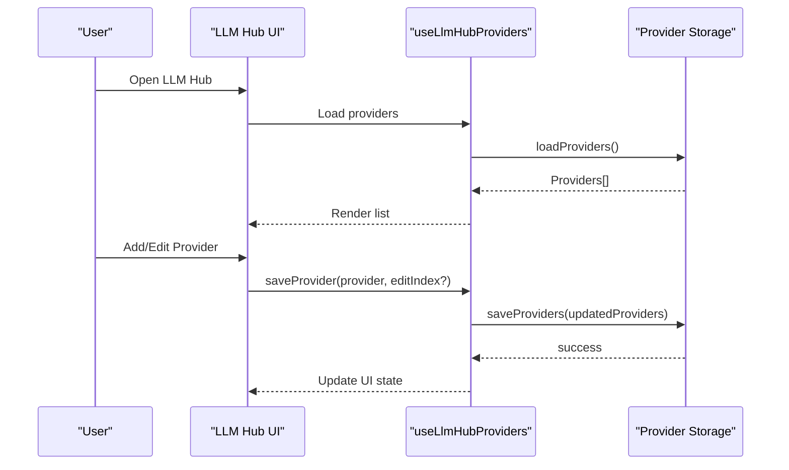
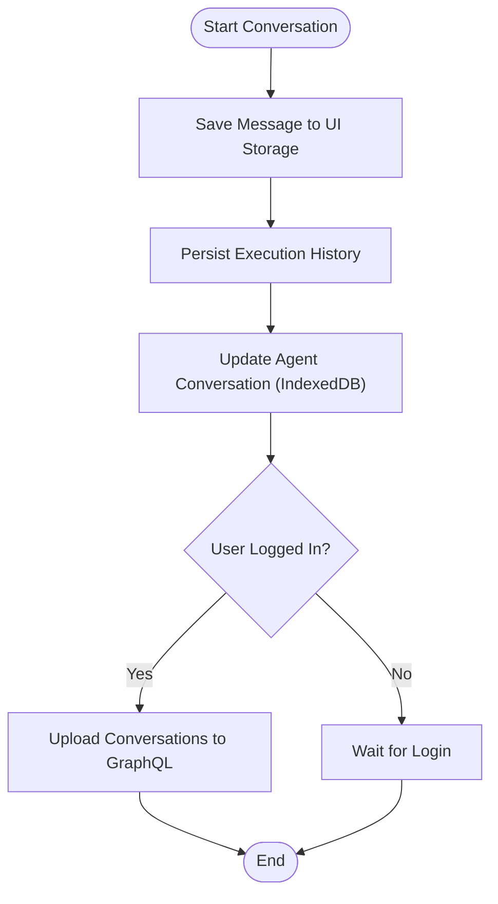
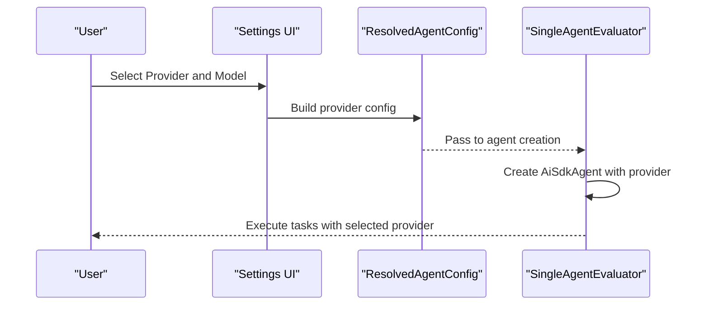
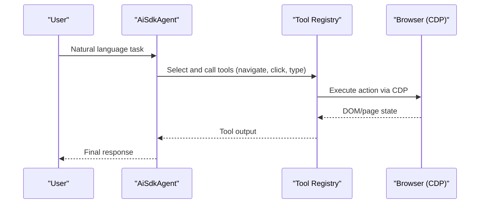
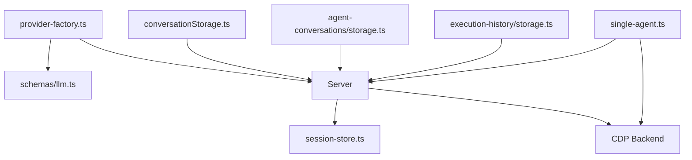

# AI Agent Platform

<cite>
**Referenced Files in This Document**
- [README.md](file://README.md)
- [packages/browseros-agent/README.md](file://packages/browseros-agent/README.md)
- [packages/browseros-agent/apps/server/src/agent/provider-factory.ts](file://packages/browseros-agent/apps/server/src/agent/provider-factory.ts)
- [packages/browseros-agent/packages/shared/src/schemas/llm.ts](file://packages/browseros-agent/packages/shared/src/schemas/llm.ts)
- [packages/browseros-agent/apps/agent/lib/conversations/conversationStorage.ts](file://packages/browseros-agent/apps/agent/lib/conversations/conversationStorage.ts)
- [packages/browseros-agent/apps/agent/lib/agent-conversations/storage.ts](file://packages/browseros-agent/apps/agent/lib/agent-conversations/storage.ts)
- [packages/browseros-agent/apps/agent/lib/execution-history/storage.ts](file://packages/browseros-agent/apps/agent/lib/execution-history/storage.ts)
- [packages/browseros-agent/apps/server/src/agent/session-store.ts](file://packages/browseros-agent/apps/server/src/agent/session-store.ts)
- [packages/browseros-agent/apps/agent/entrypoints/app/llm-hub/useLlmHubProviders.ts](file://packages/browseros-agent/apps/agent/entrypoints/app/llm-hub/useLlmHubProviders.ts)
- [packages/browseros-agent/apps/agent/entrypoints/app/llm-hub/AddHubProviderDialog.tsx](file://packages/browseros-agent/apps/agent/entrypoints/app/llm-hub/AddHubProviderDialog.tsx)
- [packages/browseros-agent/apps/agent/entrypoints/app/llm-hub/HubProvidersList.tsx](file://packages/browseros-agent/apps/agent/entrypoints/app/llm-hub/HubProvidersList.tsx)
- [packages/browseros-agent/apps/agent/entrypoints/app/llm-hub/HubProviderRow.tsx](file://packages/browseros-agent/apps/agent/entrypoints/app/llm-hub/HubProviderRow.tsx)
- [packages/browseros-agent/apps/agent/entrypoints/app/llm-hub/LlmHubPage.tsx](file://packages/browseros-agent/apps/agent/entrypoints/app/llm-hub/LlmHubPage.tsx)
- [packages/browseros-agent/apps/eval/src/agents/single-agent.ts](file://packages/browseros-agent/apps/eval/src/agents/single-agent.ts)
- [packages/browseros-agent/apps/eval/src/graders/performance/axes.ts](file://packages/browseros-agent/apps/eval/src/graders/performance/axes.ts)
- [docs/features/bring-your-own-llm.mdx](file://docs/features/bring-your-own-llm.mdx)
</cite>

## Table of Contents
1. [Introduction](#introduction)
2. [Project Structure](#project-structure)
3. [Core Components](#core-components)
4. [Architecture Overview](#architecture-overview)
5. [Detailed Component Analysis](#detailed-component-analysis)
6. [Dependency Analysis](#dependency-analysis)
7. [Performance Considerations](#performance-considerations)
8. [Troubleshooting Guide](#troubleshooting-guide)
9. [Conclusion](#conclusion)
10. [Appendices](#appendices)

## Introduction
This document describes the AI Agent Platform that powers BrowserOS’s intelligent automation capabilities. It explains the AI SDK agent architecture, multi-provider LLM integration (OpenAI, Anthropic, Gemini, Azure OpenAI, AWS Bedrock, OpenRouter, Ollama, LM Studio), and memory management systems. It documents the LLM Hub that enables side-by-side comparison of different AI models, Bring Your Own LLM functionality, and the agent’s ability to execute complex browser automation tasks through natural language commands. Practical examples of agent workflows, memory persistence across conversations, provider switching, configuration options, authentication methods, performance tuning, troubleshooting, and optimization strategies are included.

## Project Structure
The BrowserOS repository is a monorepo with two main subsystems:
- Browser subsystem: Chromium fork with build system and resources.
- Agent platform: TypeScript/Go packages implementing the MCP server, agent UI, CLI, and evaluation framework.

Key areas for the AI Agent Platform:
- Server: Bun-based HTTP server exposing MCP endpoints, agent chat, health checks, and the agent loop.
- Agent UI: Chrome extension providing chat, settings, and LLM Hub.
- CLI: Go-based tool to control BrowserOS from the terminal.
- Evaluation: Benchmarking framework for agent tasks.
- Shared packages: Type-safe CDP bindings and shared constants.
- Agent SDK: Node.js SDK enabling browser automation with natural language.

**Diagram sources**
- [packages/browseros-agent/README.md:28-62](file://packages/browseros-agent/README.md#L28-L62)
- [README.md:144-178](file://README.md#L144-L178)

**Section sources**
- [README.md:144-178](file://README.md#L144-L178)
- [packages/browseros-agent/README.md:5-27](file://packages/browseros-agent/README.md#L5-L27)

## Core Components
- LLM Provider Factory: Creates language models for Anthropic, OpenAI, Google, Azure, Bedrock, OpenRouter, Ollama, LM Studio, BrowserOS, OpenAI-Compatible, Moonshot, ChatGPT Pro, GitHub Copilot, and Qwen Code. Validates required credentials per provider.
- LLM Configuration Schema: Defines provider, model, optional API keys, base URLs, AWS region and credentials, Azure resource name, and provider-specific options (e.g., reasoning effort and summary).
- Memory and Sessions: Conversation storage (UI and agent), execution history, and server-side session store for agent lifecycles.
- LLM Hub: UI module allowing users to configure and compare multiple LLM providers side-by-side.
- Evaluation: Single-agent evaluator and benchmarking utilities for agent performance.

**Section sources**
- [packages/browseros-agent/apps/server/src/agent/provider-factory.ts:223-233](file://packages/browseros-agent/apps/server/src/agent/provider-factory.ts#L223-L233)
- [packages/browseros-agent/packages/shared/src/schemas/llm.ts:75-104](file://packages/browseros-agent/packages/shared/src/schemas/llm.ts#L75-L104)
- [packages/browseros-agent/apps/agent/lib/conversations/conversationStorage.ts:16-96](file://packages/browseros-agent/apps/agent/lib/conversations/conversationStorage.ts#L16-L96)
- [packages/browseros-agent/apps/agent/lib/agent-conversations/storage.ts:6-31](file://packages/browseros-agent/apps/agent/lib/agent-conversations/storage.ts#L6-L31)
- [packages/browseros-agent/apps/agent/lib/execution-history/storage.ts:52-146](file://packages/browseros-agent/apps/agent/lib/execution-history/storage.ts#L52-L146)
- [packages/browseros-agent/apps/server/src/agent/session-store.ts:16-44](file://packages/browseros-agent/apps/server/src/agent/session-store.ts#L16-L44)
- [packages/browseros-agent/apps/agent/entrypoints/app/llm-hub/useLlmHubProviders.ts:1-42](file://packages/browseros-agent/apps/agent/entrypoints/app/llm-hub/useLlmHubProviders.ts#L1-L42)

## Architecture Overview
The agent platform integrates an MCP server with a browser automation pipeline. The UI communicates with the server over HTTP/SSE, while the server uses the Chrome DevTools Protocol (CDP) to control the browser. The provider factory selects and configures the appropriate LLM based on user settings.

**Diagram sources**
- [packages/browseros-agent/README.md:34-62](file://packages/browseros-agent/README.md#L34-L62)
- [packages/browseros-agent/apps/server/src/agent/provider-factory.ts:223-233](file://packages/browseros-agent/apps/server/src/agent/provider-factory.ts#L223-L233)
- [packages/browseros-agent/apps/agent/lib/conversations/conversationStorage.ts:16-96](file://packages/browseros-agent/apps/agent/lib/conversations/conversationStorage.ts#L16-L96)
- [packages/browseros-agent/apps/agent/lib/execution-history/storage.ts:52-146](file://packages/browseros-agent/apps/agent/lib/execution-history/storage.ts#L52-L146)
- [packages/browseros-agent/apps/server/src/agent/session-store.ts:16-44](file://packages/browseros-agent/apps/server/src/agent/session-store.ts#L16-L44)

## Detailed Component Analysis

### LLM Provider Integration
The provider factory centralizes LLM creation across providers. It validates required credentials and constructs language models using provider-specific SDKs. Supported providers include Anthropic, OpenAI, Google, Azure, Bedrock, OpenRouter, Ollama, LM Studio, BrowserOS, OpenAI-Compatible, Moonshot, ChatGPT Pro, GitHub Copilot, and Qwen Code.

```mermaid
classDiagram
class ProviderFactory {
+createLanguageModel(config) LanguageModel
}
class AnthropicFactory {
+createAnthropicFactory(config) ProviderFactory
}
class OpenAIFactory {
+createOpenAIFactory(config) ProviderFactory
}
class GoogleFactory {
+createGoogleFactory(config) ProviderFactory
}
class AzureFactory {
+createAzureFactory(config) ProviderFactory
}
class BedrockFactory {
+createBedrockFactory(config) ProviderFactory
}
class OpenRouterFactory {
+createOpenRouterFactory(config) ProviderFactory
}
class OllamaFactory {
+createOllamaFactory(config) ProviderFactory
}
class LMStudioFactory {
+createLMStudioFactory(config) ProviderFactory
}
class BrowserOSFactory {
+createBrowserOSFactory(config) ProviderFactory
}
class OpenAICompatibleFactory {
+createOpenAICompatibleFactory(config) ProviderFactory
}
class MoonshotFactory {
+createMoonshotFactory(config) ProviderFactory
}
class ChatGPTProFactory {
+createChatGPTProFactory(config) ProviderFactory
}
class GitHubCopilotFactory {
+createGitHubCopilotFactory(config) ProviderFactory
}
class QwenCodeFactory {
+createQwenCodeFactory(config) ProviderFactory
}
ProviderFactory --> AnthropicFactory
ProviderFactory --> OpenAIFactory
ProviderFactory --> GoogleFactory
ProviderFactory --> AzureFactory
ProviderFactory --> BedrockFactory
ProviderFactory --> OpenRouterFactory
ProviderFactory --> OllamaFactory
ProviderFactory --> LMStudioFactory
ProviderFactory --> BrowserOSFactory
ProviderFactory --> OpenAICompatibleFactory
ProviderFactory --> MoonshotFactory
ProviderFactory --> ChatGPTProFactory
ProviderFactory --> GitHubCopilotFactory
ProviderFactory --> QwenCodeFactory
```

**Diagram sources**
- [packages/browseros-agent/apps/server/src/agent/provider-factory.ts:223-233](file://packages/browseros-agent/apps/server/src/agent/provider-factory.ts#L223-L233)

**Section sources**
- [packages/browseros-agent/apps/server/src/agent/provider-factory.ts:26-233](file://packages/browseros-agent/apps/server/src/agent/provider-factory.ts#L26-L233)
- [packages/browseros-agent/packages/shared/src/schemas/llm.ts:75-104](file://packages/browseros-agent/packages/shared/src/schemas/llm.ts#L75-L104)

### LLM Hub: Multi-Provider Comparison
The LLM Hub allows configuring multiple providers and comparing their responses side-by-side. The UI exposes hooks and components to manage provider entries, including adding, editing, and deleting providers.

**Diagram sources**
- [packages/browseros-agent/apps/agent/entrypoints/app/llm-hub/useLlmHubProviders.ts:13-42](file://packages/browseros-agent/apps/agent/entrypoints/app/llm-hub/useLlmHubProviders.ts#L13-L42)
- [packages/browseros-agent/apps/agent/entrypoints/app/llm-hub/AddHubProviderDialog.tsx:51-103](file://packages/browseros-agent/apps/agent/entrypoints/app/llm-hub/AddHubProviderDialog.tsx#L51-L103)
- [packages/browseros-agent/apps/agent/entrypoints/app/llm-hub/HubProvidersList.tsx:1-41](file://packages/browseros-agent/apps/agent/entrypoints/app/llm-hub/HubProvidersList.tsx#L1-L41)
- [packages/browseros-agent/apps/agent/entrypoints/app/llm-hub/HubProviderRow.tsx:1-40](file://packages/browseros-agent/apps/agent/entrypoints/app/llm-hub/HubProviderRow.tsx#L1-L40)
- [packages/browseros-agent/apps/agent/entrypoints/app/llm-hub/LlmHubPage.tsx:19-47](file://packages/browseros-agent/apps/agent/entrypoints/app/llm-hub/LlmHubPage.tsx#L19-L47)

**Section sources**
- [packages/browseros-agent/apps/agent/entrypoints/app/llm-hub/useLlmHubProviders.ts:1-42](file://packages/browseros-agent/apps/agent/entrypoints/app/llm-hub/useLlmHubProviders.ts#L1-L42)
- [packages/browseros-agent/apps/agent/entrypoints/app/llm-hub/AddHubProviderDialog.tsx:51-103](file://packages/browseros-agent/apps/agent/entrypoints/app/llm-hub/AddHubProviderDialog.tsx#L51-L103)
- [packages/browseros-agent/apps/agent/entrypoints/app/llm-hub/HubProvidersList.tsx:1-41](file://packages/browseros-agent/apps/agent/entrypoints/app/llm-hub/HubProvidersList.tsx#L1-L41)
- [packages/browseros-agent/apps/agent/entrypoints/app/llm-hub/HubProviderRow.tsx:1-40](file://packages/browseros-agent/apps/agent/entrypoints/app/llm-hub/HubProviderRow.tsx#L1-L40)
- [packages/browseros-agent/apps/agent/entrypoints/app/llm-hub/LlmHubPage.tsx:19-47](file://packages/browseros-agent/apps/agent/entrypoints/app/llm-hub/LlmHubPage.tsx#L19-L47)

### Memory Management and Persistence
The platform persists conversations and execution history across sessions:
- UI conversation storage: Indexed in local storage with automatic cleanup and cloud sync triggers upon login.
- Agent conversation storage: IndexedDB-backed with keys scoped by agentId and sessionKey.
- Execution history: Tracks tasks executed during a conversation with CRUD operations and reactive watchers.
- Server session store: Manages agent sessions keyed by conversationId.

**Diagram sources**
- [packages/browseros-agent/apps/agent/lib/conversations/conversationStorage.ts:49-96](file://packages/browseros-agent/apps/agent/lib/conversations/conversationStorage.ts#L49-L96)
- [packages/browseros-agent/apps/agent/lib/agent-conversations/storage.ts:6-31](file://packages/browseros-agent/apps/agent/lib/agent-conversations/storage.ts#L6-L31)
- [packages/browseros-agent/apps/agent/lib/execution-history/storage.ts:52-146](file://packages/browseros-agent/apps/agent/lib/execution-history/storage.ts#L52-L146)

**Section sources**
- [packages/browseros-agent/apps/agent/lib/conversations/conversationStorage.ts:16-96](file://packages/browseros-agent/apps/agent/lib/conversations/conversationStorage.ts#L16-L96)
- [packages/browseros-agent/apps/agent/lib/agent-conversations/storage.ts:6-31](file://packages/browseros-agent/apps/agent/lib/agent-conversations/storage.ts#L6-L31)
- [packages/browseros-agent/apps/agent/lib/execution-history/storage.ts:52-146](file://packages/browseros-agent/apps/agent/lib/execution-history/storage.ts#L52-L146)
- [packages/browseros-agent/apps/server/src/agent/session-store.ts:16-44](file://packages/browseros-agent/apps/server/src/agent/session-store.ts#L16-L44)

### Bring Your Own LLM and Provider Switching
Users can connect cloud providers (Anthropic, OpenAI, Gemini, Azure OpenAI, AWS Bedrock, OpenRouter, OpenAI-Compatible) or local models (Ollama, LM Studio). The UI includes a model switcher to change providers during a session. The evaluation framework demonstrates constructing agent configurations with resolved provider settings.

**Diagram sources**
- [packages/browseros-agent/apps/eval/src/agents/single-agent.ts:36-97](file://packages/browseros-agent/apps/eval/src/agents/single-agent.ts#L36-L97)
- [docs/features/bring-your-own-llm.mdx:107-264](file://docs/features/bring-your-own-llm.mdx#L107-L264)

**Section sources**
- [packages/browseros-agent/apps/eval/src/agents/single-agent.ts:36-97](file://packages/browseros-agent/apps/eval/src/agents/single-agent.ts#L36-L97)
- [docs/features/bring-your-own-llm.mdx:107-264](file://docs/features/bring-your-own-llm.mdx#L107-L264)

### Agent Workflows and Browser Automation
Agents execute multi-step browser tasks by interpreting natural language instructions and invoking browser tools. The evaluation framework demonstrates building an agent with a conversationId, model, and browser context, then running the agent loop with tool registry integration.

**Diagram sources**
- [packages/browseros-agent/apps/eval/src/agents/single-agent.ts:92-105](file://packages/browseros-agent/apps/eval/src/agents/single-agent.ts#L92-L105)
- [packages/browseros-agent/apps/eval/src/graders/performance/axes.ts:62-73](file://packages/browseros-agent/apps/eval/src/graders/performance/axes.ts#L62-L73)

**Section sources**
- [packages/browseros-agent/apps/eval/src/agents/single-agent.ts:92-105](file://packages/browseros-agent/apps/eval/src/agents/single-agent.ts#L92-L105)
- [packages/browseros-agent/apps/eval/src/graders/performance/axes.ts:62-73](file://packages/browseros-agent/apps/eval/src/graders/performance/axes.ts#L62-L73)

## Dependency Analysis
The server depends on provider factories and shared schemas to construct language models. UI components depend on storage modules for persistence. The evaluation framework depends on the server-side agent and browser backends.

**Diagram sources**
- [packages/browseros-agent/apps/server/src/agent/provider-factory.ts:223-233](file://packages/browseros-agent/apps/server/src/agent/provider-factory.ts#L223-L233)
- [packages/browseros-agent/packages/shared/src/schemas/llm.ts:75-104](file://packages/browseros-agent/packages/shared/src/schemas/llm.ts#L75-L104)
- [packages/browseros-agent/apps/server/src/agent/session-store.ts:16-44](file://packages/browseros-agent/apps/server/src/agent/session-store.ts#L16-L44)
- [packages/browseros-agent/apps/agent/lib/conversations/conversationStorage.ts:16-96](file://packages/browseros-agent/apps/agent/lib/conversations/conversationStorage.ts#L16-L96)
- [packages/browseros-agent/apps/agent/lib/agent-conversations/storage.ts:6-31](file://packages/browseros-agent/apps/agent/lib/agent-conversations/storage.ts#L6-L31)
- [packages/browseros-agent/apps/agent/lib/execution-history/storage.ts:52-146](file://packages/browseros-agent/apps/agent/lib/execution-history/storage.ts#L52-L146)
- [packages/browseros-agent/apps/eval/src/agents/single-agent.ts:36-97](file://packages/browseros-agent/apps/eval/src/agents/single-agent.ts#L36-L97)

**Section sources**
- [packages/browseros-agent/apps/server/src/agent/provider-factory.ts:223-233](file://packages/browseros-agent/apps/server/src/agent/provider-factory.ts#L223-L233)
- [packages/browseros-agent/packages/shared/src/schemas/llm.ts:75-104](file://packages/browseros-agent/packages/shared/src/schemas/llm.ts#L75-L104)
- [packages/browseros-agent/apps/server/src/agent/session-store.ts:16-44](file://packages/browseros-agent/apps/server/src/agent/session-store.ts#L16-L44)
- [packages/browseros-agent/apps/agent/lib/conversations/conversationStorage.ts:16-96](file://packages/browseros-agent/apps/agent/lib/conversations/conversationStorage.ts#L16-L96)
- [packages/browseros-agent/apps/agent/lib/agent-conversations/storage.ts:6-31](file://packages/browseros-agent/apps/agent/lib/agent-conversations/storage.ts#L6-L31)
- [packages/browseros-agent/apps/agent/lib/execution-history/storage.ts:52-146](file://packages/browseros-agent/apps/agent/lib/execution-history/storage.ts#L52-L146)
- [packages/browseros-agent/apps/eval/src/agents/single-agent.ts:36-97](file://packages/browseros-agent/apps/eval/src/agents/single-agent.ts#L36-L97)

## Performance Considerations
- Cost optimization: Prefer free-tier providers (e.g., Gemini Flash) for Chat Mode; reserve higher-capability models (e.g., Claude Opus 4.5, GPT-5) for Agent Mode.
- Context window sizing: Match context windows to provider capabilities to avoid truncation and retries.
- Reasoning controls: Adjust provider-specific reasoning effort and summaries to balance accuracy and cost.
- Local models: Use Ollama or LM Studio for sensitive workloads; note that local models may lack the reasoning strength needed for complex agent tasks.
- Rate limiting: Respect provider rate limits; queue long-running tasks and use scheduled tasks for periodic automation.

[No sources needed since this section provides general guidance]

## Troubleshooting Guide
Common LLM integration issues and resolutions:
- Missing API keys or invalid credentials: Ensure apiKey, resourceName (Azure), region, accessKeyId, secretAccessKey, and sessionToken are configured per provider.
- Base URL misconfiguration: Verify base URLs for Ollama, LM Studio, OpenRouter, and Azure/OpenAI-compatible endpoints.
- Authentication failures (OAuth): For ChatGPT Pro, GitHub Copilot, and Qwen Code, ensure OAuth tokens are present and valid.
- Provider not supported: Confirm provider is included in the provider factory and schema.
- Session errors: Check server session store and ensure conversationId consistency across agent lifecycle.

**Section sources**
- [packages/browseros-agent/apps/server/src/agent/provider-factory.ts:26-233](file://packages/browseros-agent/apps/server/src/agent/provider-factory.ts#L26-L233)
- [packages/browseros-agent/packages/shared/src/schemas/llm.ts:75-104](file://packages/browseros-agent/packages/shared/src/schemas/llm.ts#L75-L104)
- [packages/browseros-agent/apps/server/src/agent/session-store.ts:16-44](file://packages/browseros-agent/apps/server/src/agent/session-store.ts#L16-L44)

## Conclusion
The AI Agent Platform integrates a robust LLM provider ecosystem with persistent memory and a powerful browser automation engine. The provider factory, LLM Hub, and memory systems enable flexible, cost-effective, and privacy-preserving AI-assisted browser workflows. Users can compare providers, switch models dynamically, and leverage both cloud and local models tailored to their needs.

[No sources needed since this section summarizes without analyzing specific files]

## Appendices

### Configuration Options and Authentication Methods
- Cloud providers: API key, OAuth, or IAM credentials depending on provider.
- Local providers: Base URL and optional API key.
- Provider-specific fields: apiKey, baseUrl, resourceName (Azure), region, accessKeyId, secretAccessKey, sessionToken, reasoningEffort, reasoningSummary.

**Section sources**
- [packages/browseros-agent/packages/shared/src/schemas/llm.ts:75-104](file://packages/browseros-agent/packages/shared/src/schemas/llm.ts#L75-L104)
- [packages/browseros-agent/apps/server/src/agent/provider-factory.ts:26-233](file://packages/browseros-agent/apps/server/src/agent/provider-factory.ts#L26-L233)
- [docs/features/bring-your-own-llm.mdx:107-264](file://docs/features/bring-your-own-llm.mdx#L107-L264)