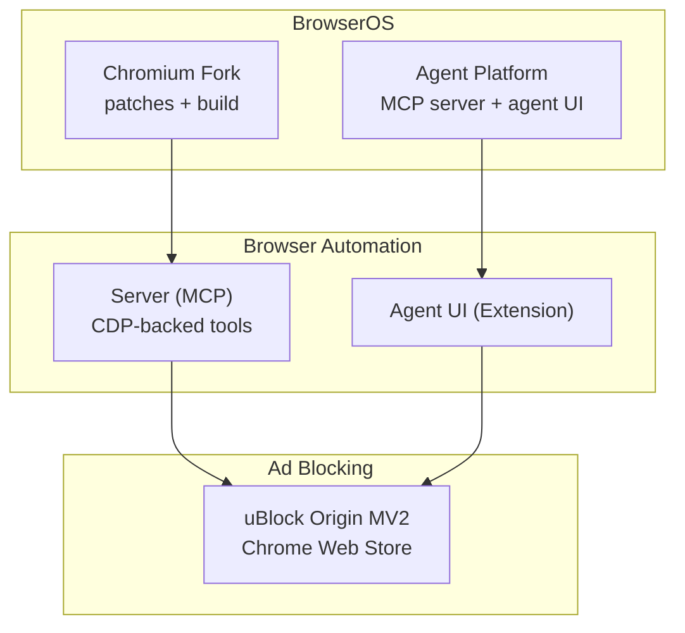
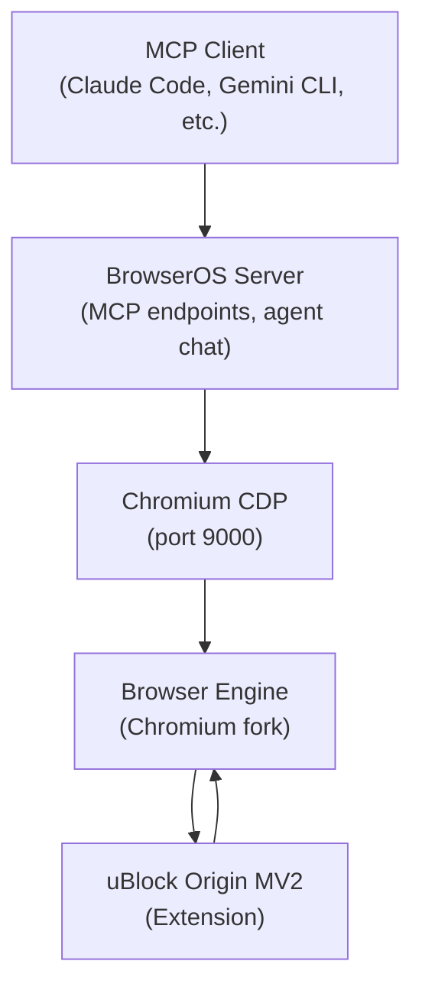
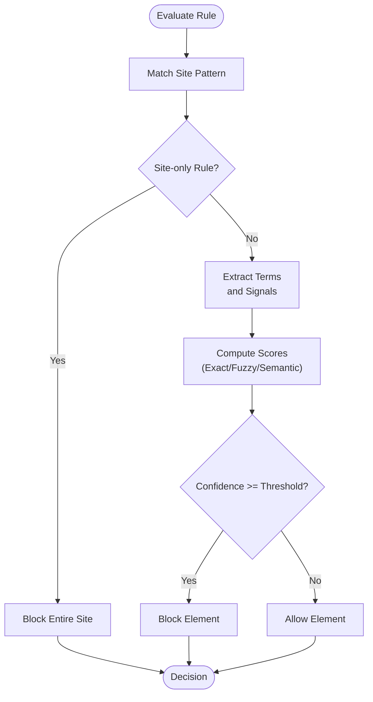
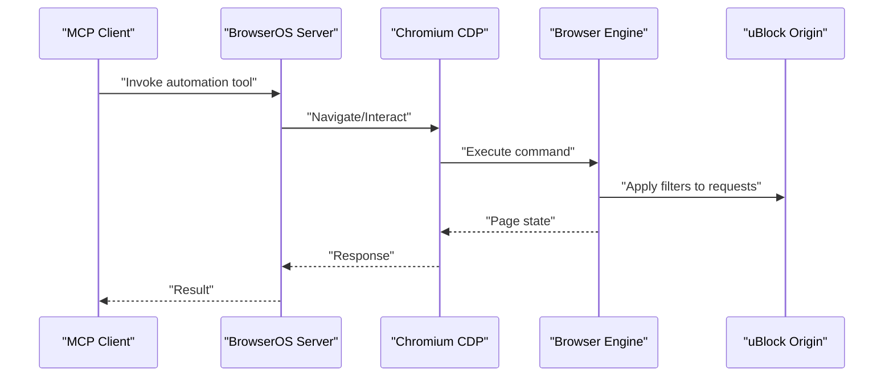
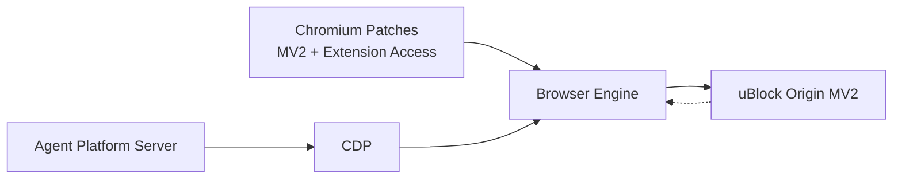

# Ad Blocking System

<cite>
**Referenced Files in This Document**
- [README.md](file://README.md)
- [ad-blocking.mdx](file://docs/features/ad-blocking.mdx)
- [browseros_constants.h](file://packages/browseros/chromium_patches/chrome/browser/browseros/core/browseros_constants.h)
- [chrome_content_browser_client.cc](file://packages/browseros/chromium_patches/chrome/browser/chrome_content_browser_client.cc)
- [acl-scorer.ts](file://packages/browseros-agent/apps/server/src/tools/acl/acl-scorer.ts)
- [README.md](file://packages/browseros-agent/README.md)
</cite>

## Table of Contents
1. [Introduction](#introduction)
2. [Project Structure](#project-structure)
3. [Core Components](#core-components)
4. [Architecture Overview](#architecture-overview)
5. [Detailed Component Analysis](#detailed-component-analysis)
6. [Dependency Analysis](#dependency-analysis)
7. [Performance Considerations](#performance-considerations)
8. [Troubleshooting Guide](#troubleshooting-guide)
9. [Conclusion](#conclusion)
10. [Appendices](#appendices)

## Introduction
This document explains the Ad Blocking System in BrowserOS, focusing on how BrowserOS integrates uBlock Origin with Manifest V2 support to deliver robust ad and tracker blocking. It also covers how the ad blocking system operates within BrowserOS’s browser automation environment, its impact on page loading performance, and how to configure filtering rules, manage subscriptions, and maintain compatibility with modern web standards. Practical guidance is included for automation scenarios, performance tuning, and resolving blocked-content issues.

## Project Structure
BrowserOS is a monorepo with two primary subsystems:
- Browser (Chromium fork) with patches enabling extended functionality
- Agent platform (TypeScript/Go) providing the MCP server, agent UI, CLI, and automation tools

The ad blocking capability leverages uBlock Origin installed from the Chrome Web Store. BrowserOS re-enables Manifest V2 support so the full uBlock Origin extension runs natively, providing stronger filtering than Chrome’s current “Lite” variant.

**Section sources**
- [README.md: 144-178:144-178](file://README.md#L144-L178)
- [README.md: 58](file://README.md#L58)

## Core Components
- uBlock Origin MV2 integration: BrowserOS enables Manifest V2 so the full uBlock Origin extension can be installed and run without restrictions.
- Performance metrics: Independent testing demonstrates BrowserOS blocks significantly more ads and trackers compared to Chrome, reducing load times and bandwidth usage.
- Automation compatibility: The agent platform and browser automation tools operate alongside ad blocking without interference.

Key implementation highlights:
- Manifest V2 support re-enabled in the Chromium fork to allow uBlock Origin installation and operation.
- Extension routing and access controls are managed to ensure proper integration with BrowserOS internals.
- Documentation confirms the strong ad-blocking effectiveness and outlines the benefits for performance and privacy.

**Section sources**
- [ad-blocking.mdx: 6-16:6-16](file://docs/features/ad-blocking.mdx#L6-L16)
- [ad-blocking.mdx: 18-40:18-40](file://docs/features/ad-blocking.mdx#L18-L40)
- [README.md: 137](file://README.md#L137)

## Architecture Overview
BrowserOS separates concerns between the browser engine and the agent platform. The MCP server exposes automation tools backed by the Chrome DevTools Protocol (CDP), while the agent UI provides a Chrome extension interface. uBlock Origin is installed as a standard extension and interacts with page requests through the browser engine.

**Diagram sources**
- [README.md: 42-62:42-62](file://README.md#L42-L62)
- [README.md: 64-71:64-71](file://README.md#L64-L71)

**Section sources**
- [README.md: 28-62:28-62](file://README.md#L28-L62)

## Detailed Component Analysis

### uBlock Origin MV2 Integration
- Purpose: Provide comprehensive ad/tracker blocking using the full uBlock Origin extension.
- Installation: Available from the Chrome Web Store; installs seamlessly on BrowserOS.
- Effectiveness: Independent testing shows BrowserOS blocks a substantially higher percentage of ads and trackers than Chrome.

Operational characteristics:
- Full filtering rule support via MV2 manifests.
- Subscription-based filters and custom rules supported.
- Whitelisting/blacklisting via uBlock Origin’s built-in mechanisms.

**Section sources**
- [ad-blocking.mdx: 6-16:6-16](file://docs/features/ad-blocking.mdx#L6-L16)
- [ad-blocking.mdx: 18-40:18-40](file://docs/features/ad-blocking.mdx#L18-L40)

### BrowserOS Chromium Patches and Extension Access
- Extension service worker connectivity: Patches enable controlled local network access for BrowserOS-managed extensions, facilitating integration with internal services.
- Extension metadata: Constants define BrowserOS-specific extension identities and labeling, including placeholders for uBlock Origin when installed from the store.

These changes ensure that BrowserOS-managed extensions and third-party extensions (like uBlock Origin) can coexist and communicate as needed.

**Section sources**
- [chrome_content_browser_client.cc: 86-91:86-91](file://packages/browseros/chromium_patches/chrome/browser/chrome_content_browser_client.cc#L86-L91)
- [browseros_constants.h: 167-206:167-206](file://packages/browseros/chromium_patches/chrome/browser/browseros/core/browseros_constants.h#L167-L206)

### Filtering Rule Management and Automation Compatibility
While the agent platform includes a legacy ACL scoring pipeline (reference-only), the primary ad blocking mechanism relies on uBlock Origin. The ACL scoring logic demonstrates how rules can be evaluated across site patterns, selectors, and textual content, and how decisions are made based on weighted confidence thresholds. This illustrates the kind of rule evaluation that underpins effective ad blocking.

Key concepts:
- Site pattern matching to target domains.
- Selector-based targeting for precise element blocking.
- Textual matching and semantic similarity to detect relevant content.
- Confidence thresholds to decide whether to block.

**Diagram sources**
- [acl-scorer.ts: 145-184:145-184](file://packages/browseros-agent/apps/server/src/tools/acl/acl-scorer.ts#L145-L184)
- [acl-scorer.ts: 348-402:348-402](file://packages/browseros-agent/apps/server/src/tools/acl/acl-scorer.ts#L348-L402)

**Section sources**
- [acl-scorer.ts: 11-51:11-51](file://packages/browseros-agent/apps/server/src/tools/acl/acl-scorer.ts#L11-L51)
- [acl-scorer.ts: 348-402:348-402](file://packages/browseros-agent/apps/server/src/tools/acl/acl-scorer.ts#L348-L402)

### Browser Automation and Ad Blocking Coexistence
- Ports and connectivity: The server listens on port 9100 and connects to Chromium CDP on port 9000, independent of ad blocking.
- Extension routing: BrowserOS-managed extensions are recognized and can access local resources when needed.
- Impact on automation: Since ad blocking occurs at the browser engine level, automation tools continue to function normally, interacting with pages as usual.

**Diagram sources**
- [README.md: 64-71:64-71](file://README.md#L64-L71)
- [README.md: 42-62:42-62](file://README.md#L42-L62)

**Section sources**
- [README.md: 64-71:64-71](file://README.md#L64-L71)
- [README.md: 42-62:42-62](file://README.md#L42-L62)

## Dependency Analysis
- BrowserOS Chromium patches enable MV2 support and controlled extension access.
- Agent platform depends on CDP to expose automation tools; ad blocking is handled by the browser engine.
- uBlock Origin is a third-party extension installed from the Chrome Web Store and operates independently of the agent platform.

**Diagram sources**
- [browseros_constants.h: 167-206:167-206](file://packages/browseros/chromium_patches/chrome/browser/browseros/core/browseros_constants.h#L167-L206)
- [chrome_content_browser_client.cc: 86-91:86-91](file://packages/browseros/chromium_patches/chrome/browser/chrome_content_browser_client.cc#L86-L91)
- [README.md: 42-62:42-62](file://README.md#L42-L62)

**Section sources**
- [browseros_constants.h: 167-206:167-206](file://packages/browseros/chromium_patches/chrome/browser/browseros/core/browseros_constants.h#L167-L206)
- [chrome_content_browser_client.cc: 86-91:86-91](file://packages/browseros/chromium_patches/chrome/browser/chrome_content_browser_client.cc#L86-L91)
- [README.md: 42-62:42-62](file://README.md#L42-L62)

## Performance Considerations
- Reduced ad/tracker traffic improves page load times and reduces bandwidth consumption.
- Independent testing demonstrates BrowserOS blocks a significantly higher proportion of ads and trackers compared to Chrome, translating to measurable performance gains.
- Keep uBlock Origin filters updated to minimize unnecessary blocking and optimize performance.

Practical tips:
- Regularly update filter lists to balance protection and compatibility.
- Use uBlock Origin’s “My Filters” to fine-tune blocking for problematic sites.
- Monitor page performance and adjust filters if specific sites misbehave.

**Section sources**
- [ad-blocking.mdx: 18-40:18-40](file://docs/features/ad-blocking.mdx#L18-L40)

## Troubleshooting Guide
Common issues and resolutions:
- Blocked content appears incorrectly:
  - Use uBlock Origin’s “Whitelist” feature to permit specific domains or elements.
  - Temporarily disable filters for the page to isolate the cause.
- Automation fails on blocked pages:
  - Verify that the automation targets are not being blocked by selectors or network requests.
  - Confirm that the page is reachable and functional outside of automation.
- Filter updates not applying:
  - Ensure uBlock Origin is updated and filter lists refreshed.
  - Check for custom rules that may conflict with desired behavior.

Guidance aligned with BrowserOS architecture:
- BrowserOS-managed extensions and third-party extensions (including uBlock Origin) can coexist; ensure proper permissions and routing.
- The agent platform communicates via CDP; automation tools remain unaffected by ad blocking.

**Section sources**
- [ad-blocking.mdx: 6-16:6-16](file://docs/features/ad-blocking.mdx#L6-L16)
- [README.md: 42-62:42-62](file://README.md#L42-L62)

## Conclusion
BrowserOS delivers robust ad and tracker blocking by reinstating Manifest V2 support for uBlock Origin, enabling the full extension to operate natively. This provides significantly stronger protection than Chrome’s current “Lite” variant, improving performance and privacy. The agent platform and automation tools remain fully compatible with ad blocking, operating seamlessly through CDP. Users can leverage uBlock Origin’s subscription lists and custom rules to tailor protection for diverse browsing scenarios while maintaining compatibility with modern web standards.

## Appendices

### Setup Instructions for uBlock Origin
- Install uBlock Origin from the Chrome Web Store; it works out of the box on BrowserOS.
- Configure filter lists and customize rules as needed.

**Section sources**
- [ad-blocking.mdx: 14-16:14-16](file://docs/features/ad-blocking.mdx#L14-L16)

### Managing Filter Subscriptions and Custom Rules
- Import and manage filter subscriptions through uBlock Origin’s dashboard.
- Add custom rules in “My Filters” for targeted blocking or exceptions.

**Section sources**
- [ad-blocking.mdx: 6-16:6-16](file://docs/features/ad-blocking.mdx#L6-L16)

### Maintaining Compatibility with Modern Web Standards
- Keep uBlock Origin updated to ensure compatibility with evolving web technologies.
- Review and adjust custom rules periodically to avoid breaking legitimate site functionality.

**Section sources**
- [ad-blocking.mdx: 18-40:18-40](file://docs/features/ad-blocking.mdx#L18-L40)