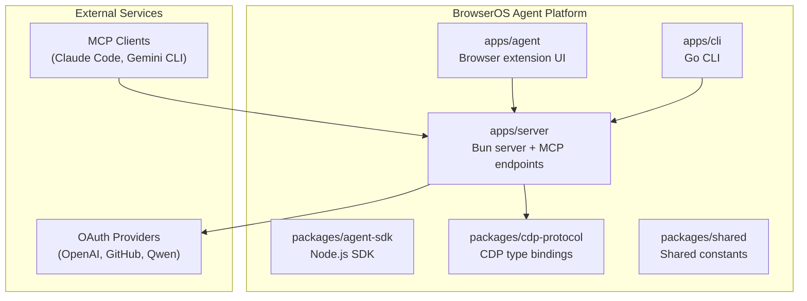
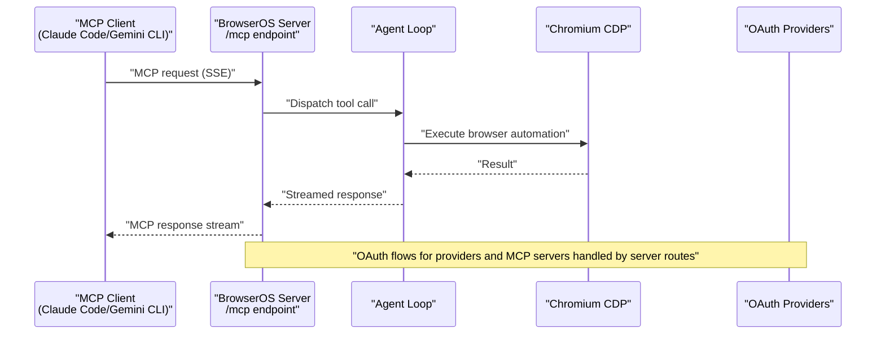
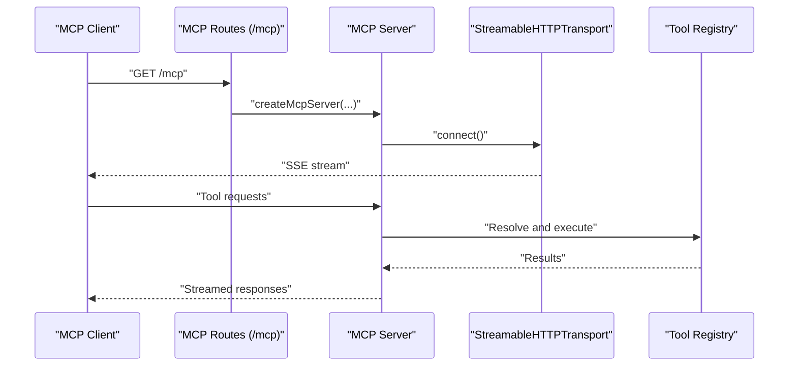
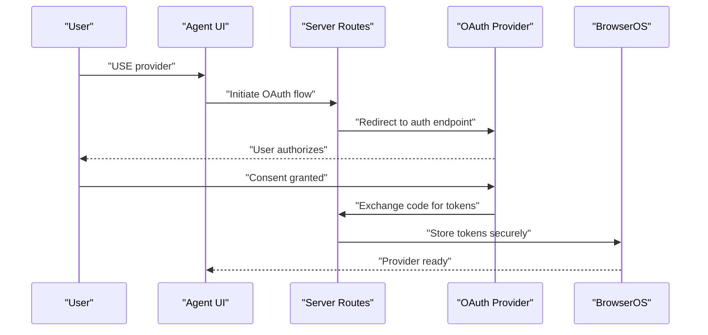
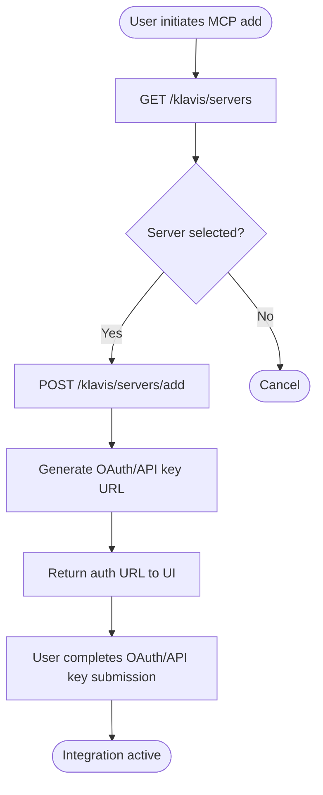
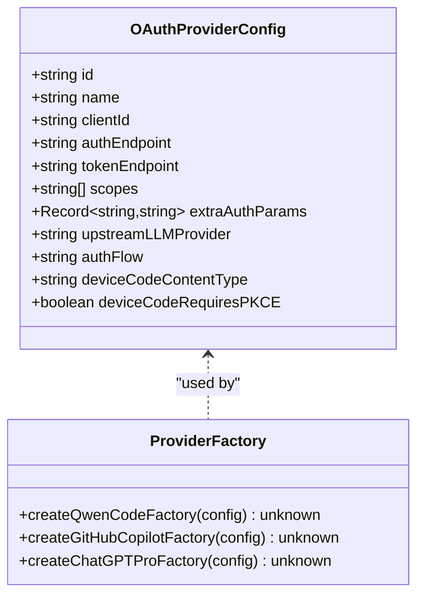
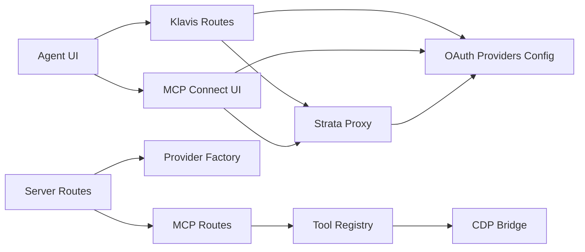

# App Integrations

<cite>
**Referenced Files in This Document**
- [README.md](file://README.md)
- [packages/browseros-agent/README.md](file://packages/browseros-agent/README.md)
- [docs/features/connect-mcps.mdx](file://docs/features/connect-mcps.mdx)
- [docs/features/github-copilot-oauth.mdx](file://docs/features/github-copilot-oauth.mdx)
- [docs/features/chatgpt-pro-oauth.mdx](file://docs/features/chatgpt-pro-oauth.mdx)
- [docs/features/qwen-code-oauth.mdx](file://docs/features/qwen-code-oauth.mdx)
- [packages/browseros-agent/apps/server/src/api/routes/klavis.ts](file://packages/browseros-agent/apps/server/src/api/routes/klavis.ts)
- [packages/browseros-agent/apps/server/src/api/services/klavis/strata-proxy.ts](file://packages/browseros-agent/apps/server/src/api/services/klavis/strata-proxy.ts)
- [packages/browseros-agent/apps/server/src/lib/clients/oauth/providers.ts](file://packages/browseros-agent/apps/server/src/lib/clients/oauth/providers.ts)
- [packages/browseros-agent/apps/agent/entrypoints/app/connect-mcp/ConnectMCP.tsx](file://packages/browseros-agent/apps/agent/entrypoints/app/connect-mcp/ConnectMCP.tsx)
- [packages/browseros-agent/apps/agent/entrypoints/app/ai-settings/BrowserOsAiPane.tsx](file://packages/browseros-agent/apps/agent/entrypoints/app/ai-settings/BrowserOsAiPane.tsx)
- [packages/browseros-agent/apps/server/src/api/routes/mcp.ts](file://packages/browseros-agent/apps/server/src/api/routes/mcp.ts)
- [packages/browseros-agent/apps/server/src/agent/provider-factory.ts](file://packages/browseros-agent/apps/server/src/agent/provider-factory.ts)
</cite>

## Table of Contents
1. [Introduction](#introduction)
2. [Project Structure](#project-structure)
3. [Core Components](#core-components)
4. [Architecture Overview](#architecture-overview)
5. [Detailed Component Analysis](#detailed-component-analysis)
6. [Dependency Analysis](#dependency-analysis)
7. [Performance Considerations](#performance-considerations)
8. [Troubleshooting Guide](#troubleshooting-guide)
9. [Conclusion](#conclusion)
10. [Appendices](#appendices)

## Introduction
This document explains how BrowserOS integrates with external applications and services, focusing on:
- The Model Context Protocol (MCP) connection system for integrating with Claude Code, Gemini CLI, and other MCP-compatible tools.
- OAuth integrations with GitHub Copilot, ChatGPT Pro/Plus, and Qwen Code for enhanced development workflows.
- Authentication mechanisms, token management, and security considerations for each integration.
- Practical setup instructions, configuration of authentication flows, and managing multiple integrations simultaneously.
- Proxy mechanisms, integration architecture, and performance optimization strategies.
- Common integration challenges, debugging connection problems, and maintaining compatibility across updates.

## Project Structure
BrowserOS is a monorepo with two main subsystems:
- The browser (Chromium fork) and the agent platform (TypeScript/Go).
- The agent platform includes:
  - An MCP server exposing 53+ browser automation tools and running the agent loop.
  - A browser extension UI (WXT + React) for chat and settings.
  - A Go CLI for controlling BrowserOS from the terminal or AI coding agents.
  - Shared packages for CDP protocol bindings and shared constants.

**Diagram sources**
- [packages/browseros-agent/README.md:28-71](file://packages/browseros-agent/README.md#L28-L71)

**Section sources**
- [packages/browseros-agent/README.md:1-188](file://packages/browseros-agent/README.md#L1-L188)
- [README.md:144-178](file://README.md#L144-L178)

## Core Components
- MCP Server and Routes: Exposes MCP endpoints, manages sessions, and streams responses. It integrates with the browser automation tools and orchestrates agent actions.
- OAuth Provider Configurations: Centralized provider definitions for ChatGPT Pro/Plus, GitHub Copilot, and Qwen Code, including endpoints, scopes, and flow types.
- Klavis Integration Layer: Generates OAuth URLs, manages user integrations, and supports adding/removing MCP servers and API keys.
- Agent UI and MCP Connector: Provides UI flows to initiate OAuth, manage integrations, and connect MCP servers.
- Provider Factories: Construct LLM clients for each provider using OAuth tokens and provider-specific base URLs.

**Section sources**
- [packages/browseros-agent/README.md:28-71](file://packages/browseros-agent/README.md#L28-L71)
- [packages/browseros-agent/apps/server/src/lib/clients/oauth/providers.ts:1-68](file://packages/browseros-agent/apps/server/src/lib/clients/oauth/providers.ts#L1-L68)
- [packages/browseros-agent/apps/server/src/api/routes/klavis.ts:1-208](file://packages/browseros-agent/apps/server/src/api/routes/klavis.ts#L1-L208)
- [packages/browseros-agent/apps/agent/entrypoints/app/connect-mcp/ConnectMCP.tsx:67-125](file://packages/browseros-agent/apps/agent/entrypoints/app/connect-mcp/ConnectMCP.tsx#L67-L125)
- [packages/browseros-agent/apps/agent/entrypoints/app/ai-settings/BrowserOsAiPane.tsx:59-215](file://packages/browseros-agent/apps/agent/entrypoints/app/ai-settings/BrowserOsAiPane.tsx#L59-L215)
- [packages/browseros-agent/apps/server/src/agent/provider-factory.ts:155-200](file://packages/browseros-agent/apps/server/src/agent/provider-factory.ts#L155-L200)

## Architecture Overview
BrowserOS exposes an MCP server that:
- Receives requests from MCP clients (e.g., Claude Code, Gemini CLI).
- Streams responses via HTTP/SSE.
- Bridges to Chromium’s Chrome DevTools Protocol (CDP) to execute browser automation tools.
- Manages OAuth integrations for AI providers and MCP servers.

**Diagram sources**
- [packages/browseros-agent/README.md:34-62](file://packages/browseros-agent/README.md#L34-L62)
- [packages/browseros-agent/apps/server/src/api/routes/mcp.ts:37-111](file://packages/browseros-agent/apps/server/src/api/routes/mcp.ts#L37-L111)

**Section sources**
- [packages/browseros-agent/README.md:28-71](file://packages/browseros-agent/README.md#L28-L71)
- [packages/browseros-agent/apps/server/src/api/routes/mcp.ts:1-111](file://packages/browseros-agent/apps/server/src/api/routes/mcp.ts#L1-L111)

## Detailed Component Analysis

### MCP Connection System
BrowserOS integrates with external MCP-compatible tools (e.g., Claude Code, Gemini CLI) through:
- An HTTP/SSE endpoint serving MCP requests.
- A tool registry backed by Chromium CDP for browser automation.
- A session-aware server that streams responses and logs metrics.

**Diagram sources**
- [packages/browseros-agent/apps/server/src/api/routes/mcp.ts:37-111](file://packages/browseros-agent/apps/server/src/api/routes/mcp.ts#L37-L111)

**Section sources**
- [docs/features/connect-mcps.mdx:1-309](file://docs/features/connect-mcps.mdx#L1-L309)
- [packages/browseros-agent/apps/server/src/api/routes/mcp.ts:1-111](file://packages/browseros-agent/apps/server/src/api/routes/mcp.ts#L1-L111)

### OAuth Integrations: GitHub Copilot, ChatGPT Pro/Plus, Qwen Code
BrowserOS supports three OAuth-based AI providers:
- GitHub Copilot: Device code flow.
- ChatGPT Pro/Plus: Standard OAuth with PKCE.
- Qwen Code: Device code flow with PKCE and form-encoded token exchange.

**Diagram sources**
- [packages/browseros-agent/apps/agent/entrypoints/app/ai-settings/BrowserOsAiPane.tsx:59-215](file://packages/browseros-agent/apps/agent/entrypoints/app/ai-settings/BrowserOsAiPane.tsx#L59-L215)
- [packages/browseros-agent/apps/server/src/lib/clients/oauth/providers.ts:1-68](file://packages/browseros-agent/apps/server/src/lib/clients/oauth/providers.ts#L1-L68)
- [packages/browseros-agent/apps/server/src/agent/provider-factory.ts:155-200](file://packages/browseros-agent/apps/server/src/agent/provider-factory.ts#L155-L200)

**Section sources**
- [docs/features/github-copilot-oauth.mdx:1-61](file://docs/features/github-copilot-oauth.mdx#L1-L61)
- [docs/features/chatgpt-pro-oauth.mdx:1-57](file://docs/features/chatgpt-pro-oauth.mdx#L1-L57)
- [docs/features/qwen-code-oauth.mdx:1-40](file://docs/features/qwen-code-oauth.mdx#L1-L40)
- [packages/browseros-agent/apps/agent/entrypoints/app/ai-settings/BrowserOsAiPane.tsx:59-215](file://packages/browseros-agent/apps/agent/entrypoints/app/ai-settings/BrowserOsAiPane.tsx#L59-L215)
- [packages/browseros-agent/apps/server/src/lib/clients/oauth/providers.ts:1-68](file://packages/browseros-agent/apps/server/src/lib/clients/oauth/providers.ts#L1-L68)
- [packages/browseros-agent/apps/server/src/agent/provider-factory.ts:155-200](file://packages/browseros-agent/apps/server/src/agent/provider-factory.ts#L155-L200)

### MCP Server Management and Proxy Mechanisms
BrowserOS maintains a curated list of MCP servers and generates per-user OAuth/API key URLs via a proxy service:
- Lists supported MCP servers.
- Generates OAuth URLs for user strata.
- Retrieves user integrations and statuses.
- Adds/removes MCP servers and submits API keys for API-key-based servers.

**Diagram sources**
- [packages/browseros-agent/apps/server/src/api/routes/klavis.ts:46-208](file://packages/browseros-agent/apps/server/src/api/routes/klavis.ts#L46-L208)
- [packages/browseros-agent/apps/server/src/api/services/klavis/strata-proxy.ts:297-345](file://packages/browseros-agent/apps/server/src/api/services/klavis/strata-proxy.ts#L297-L345)
- [packages/browseros-agent/apps/agent/entrypoints/app/connect-mcp/ConnectMCP.tsx:67-125](file://packages/browseros-agent/apps/agent/entrypoints/app/connect-mcp/ConnectMCP.tsx#L67-L125)

**Section sources**
- [packages/browseros-agent/apps/server/src/api/routes/klavis.ts:1-208](file://packages/browseros-agent/apps/server/src/api/routes/klavis.ts#L1-L208)
- [packages/browseros-agent/apps/server/src/api/services/klavis/strata-proxy.ts:297-345](file://packages/browseros-agent/apps/server/src/api/services/klavis/strata-proxy.ts#L297-L345)
- [packages/browseros-agent/apps/agent/entrypoints/app/connect-mcp/ConnectMCP.tsx:67-125](file://packages/browseros-agent/apps/agent/entrypoints/app/connect-mcp/ConnectMCP.tsx#L67-L125)

### Authentication Mechanisms and Token Management
- OAuth Provider Configurations define endpoints, scopes, and flow types for each provider.
- Provider factories construct LLM clients using OAuth tokens and provider-specific base URLs.
- UI components coordinate device code and PKCE flows, track events, and expose disconnect actions.

**Diagram sources**
- [packages/browseros-agent/apps/server/src/lib/clients/oauth/providers.ts:1-68](file://packages/browseros-agent/apps/server/src/lib/clients/oauth/providers.ts#L1-L68)
- [packages/browseros-agent/apps/server/src/agent/provider-factory.ts:155-200](file://packages/browseros-agent/apps/server/src/agent/provider-factory.ts#L155-L200)

**Section sources**
- [packages/browseros-agent/apps/server/src/lib/clients/oauth/providers.ts:1-68](file://packages/browseros-agent/apps/server/src/lib/clients/oauth/providers.ts#L1-L68)
- [packages/browseros-agent/apps/server/src/agent/provider-factory.ts:155-200](file://packages/browseros-agent/apps/server/src/agent/provider-factory.ts#L155-L200)
- [packages/browseros-agent/apps/agent/entrypoints/app/ai-settings/BrowserOsAiPane.tsx:59-215](file://packages/browseros-agent/apps/agent/entrypoints/app/ai-settings/BrowserOsAiPane.tsx#L59-L215)

### Practical Setup Examples
- Connect Apps (built-in and custom MCP servers):
  - Use the UI to add built-in apps or add custom MCP servers with an SSE URL.
  - For OAuth-protected remote MCP servers, use local proxy tools to handle OAuth and forward requests.
- OAuth providers:
  - GitHub Copilot: Device code flow via UI.
  - ChatGPT Pro/Plus: Standard OAuth with PKCE.
  - Qwen Code: Device code flow with PKCE and form-encoded token exchange.

**Section sources**
- [docs/features/connect-mcps.mdx:250-291](file://docs/features/connect-mcps.mdx#L250-L291)
- [docs/features/github-copilot-oauth.mdx:8-31](file://docs/features/github-copilot-oauth.mdx#L8-L31)
- [docs/features/chatgpt-pro-oauth.mdx:8-23](file://docs/features/chatgpt-pro-oauth.mdx#L8-L23)
- [docs/features/qwen-code-oauth.mdx:8-23](file://docs/features/qwen-code-oauth.mdx#L8-L23)

## Dependency Analysis
The integration architecture exhibits clear separation of concerns:
- UI depends on server routes for OAuth initiation and MCP server management.
- Server routes depend on OAuth provider configurations and provider factories.
- MCP routes depend on the tool registry and CDP bridge.
- Klavis proxy mediates OAuth/API key generation and user integration state.

**Diagram sources**
- [packages/browseros-agent/apps/server/src/api/routes/klavis.ts:46-208](file://packages/browseros-agent/apps/server/src/api/routes/klavis.ts#L46-L208)
- [packages/browseros-agent/apps/server/src/lib/clients/oauth/providers.ts:1-68](file://packages/browseros-agent/apps/server/src/lib/clients/oauth/providers.ts#L1-L68)
- [packages/browseros-agent/apps/server/src/api/services/klavis/strata-proxy.ts:297-345](file://packages/browseros-agent/apps/server/src/api/services/klavis/strata-proxy.ts#L297-L345)
- [packages/browseros-agent/apps/server/src/agent/provider-factory.ts:155-200](file://packages/browseros-agent/apps/server/src/agent/provider-factory.ts#L155-L200)
- [packages/browseros-agent/apps/server/src/api/routes/mcp.ts:37-111](file://packages/browseros-agent/apps/server/src/api/routes/mcp.ts#L37-L111)

**Section sources**
- [packages/browseros-agent/apps/server/src/api/routes/klavis.ts:1-208](file://packages/browseros-agent/apps/server/src/api/routes/klavis.ts#L1-L208)
- [packages/browseros-agent/apps/server/src/api/services/klavis/strata-proxy.ts:297-345](file://packages/browseros-agent/apps/server/src/api/services/klavis/strata-proxy.ts#L297-L345)
- [packages/browseros-agent/apps/server/src/lib/clients/oauth/providers.ts:1-68](file://packages/browseros-agent/apps/server/src/lib/clients/oauth/providers.ts#L1-L68)
- [packages/browseros-agent/apps/server/src/agent/provider-factory.ts:155-200](file://packages/browseros-agent/apps/server/src/agent/provider-factory.ts#L155-L200)
- [packages/browseros-agent/apps/server/src/api/routes/mcp.ts:1-111](file://packages/browseros-agent/apps/server/src/api/routes/mcp.ts#L1-L111)

## Performance Considerations
- SSE Streaming: MCP responses are streamed over SSE to reduce latency and improve responsiveness during long-running tool executions.
- Caching and Metrics: Server routes log metrics and maintain caches for user integrations to avoid redundant lookups.
- Headless and Test Modes: Environment variables support headless operation for tests and CI environments.
- Port Configuration: Consistent port configuration ensures minimal overhead and predictable routing between UI, server, and CDP.

[No sources needed since this section provides general guidance]

## Troubleshooting Guide
Common issues and resolutions:
- MCP connection fails:
  - Verify the server is running and reachable on the configured port.
  - Confirm the client is using the correct SSE endpoint and session configuration.
- OAuth flow errors:
  - Ensure the provider configuration matches the upstream endpoints and scopes.
  - For device code flows, confirm the device code is entered and PKCE is handled when required.
- API key-based MCP servers:
  - Submit the API key via the designated endpoint and ensure the key URL matches the server’s requirements.
- Disconnection:
  - Use the provider disconnect action to revoke tokens and remove integrations from the system.

**Section sources**
- [packages/browseros-agent/apps/server/src/api/routes/mcp.ts:83-107](file://packages/browseros-agent/apps/server/src/api/routes/mcp.ts#L83-L107)
- [packages/browseros-agent/apps/server/src/lib/clients/oauth/providers.ts:1-68](file://packages/browseros-agent/apps/server/src/lib/clients/oauth/providers.ts#L1-L68)
- [packages/browseros-agent/apps/server/src/api/routes/klavis.ts:140-171](file://packages/browseros-agent/apps/server/src/api/routes/klavis.ts#L140-L171)
- [packages/browseros-agent/apps/agent/entrypoints/app/ai-settings/BrowserOsAiPane.tsx:59-215](file://packages/browseros-agent/apps/agent/entrypoints/app/ai-settings/BrowserOsAiPane.tsx#L59-L215)

## Conclusion
BrowserOS delivers a robust integration framework:
- MCP connectivity enables seamless control from Claude Code, Gemini CLI, and other MCP clients.
- OAuth integrations streamline access to GitHub Copilot, ChatGPT Pro/Plus, and Qwen Code with secure token management.
- The Klavis proxy and server routes provide scalable mechanisms for generating auth URLs, managing integrations, and handling API keys.
- The architecture emphasizes privacy, on-demand access, and local token storage, while offering performance benefits through streaming and caching.

[No sources needed since this section summarizes without analyzing specific files]

## Appendices

### Setup Instructions by Provider
- GitHub Copilot:
  - Use the UI to initiate device code authorization and select your account.
  - After authorization, the provider appears in settings and is ready to use.
- ChatGPT Pro/Plus:
  - Initiate OAuth from the UI, sign in with your OpenAI account, and accept authorization.
  - Configure provider settings and select a model.
- Qwen Code:
  - Initiate device code authorization via the UI, sign in with your Alibaba Cloud/Qwen account, and accept authorization.
  - Choose a model from the available options.

**Section sources**
- [docs/features/github-copilot-oauth.mdx:8-31](file://docs/features/github-copilot-oauth.mdx#L8-L31)
- [docs/features/chatgpt-pro-oauth.mdx:8-23](file://docs/features/chatgpt-pro-oauth.mdx#L8-L23)
- [docs/features/qwen-code-oauth.mdx:8-23](file://docs/features/qwen-code-oauth.mdx#L8-L23)

### Best Practices for Secure Integration Management
- Prefer OAuth over API keys when available to minimize credential exposure.
- Keep OAuth tokens local and scoped to the minimum required permissions.
- Regularly review and disconnect unused integrations.
- Monitor telemetry and logs for anomalies in provider usage.

**Section sources**
- [docs/features/connect-mcps.mdx:293-309](file://docs/features/connect-mcps.mdx#L293-L309)