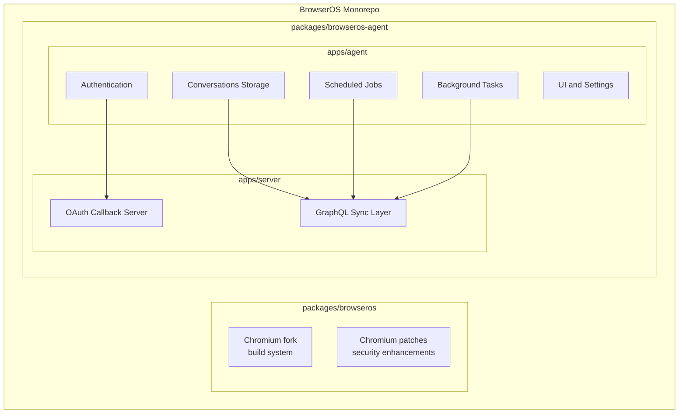
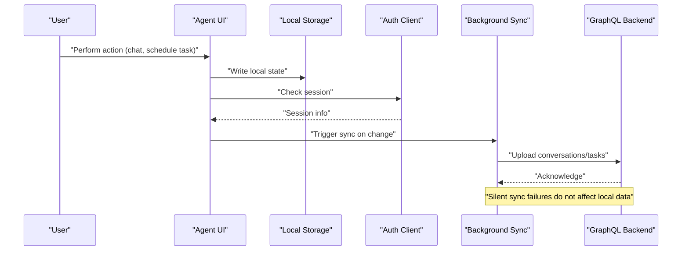
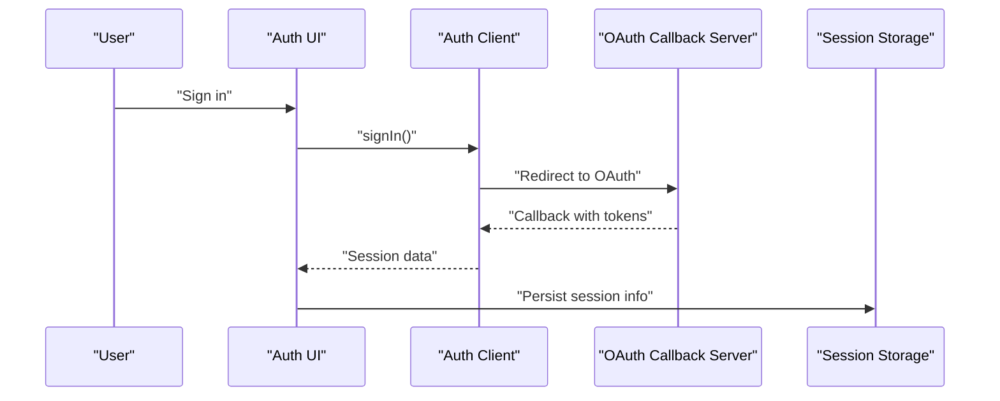
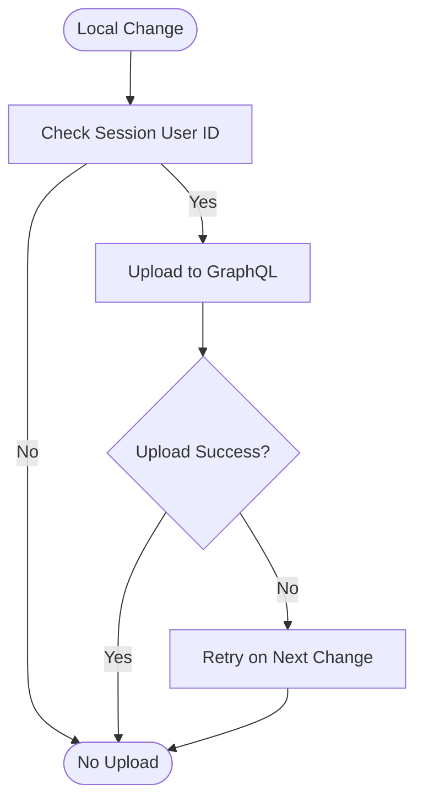
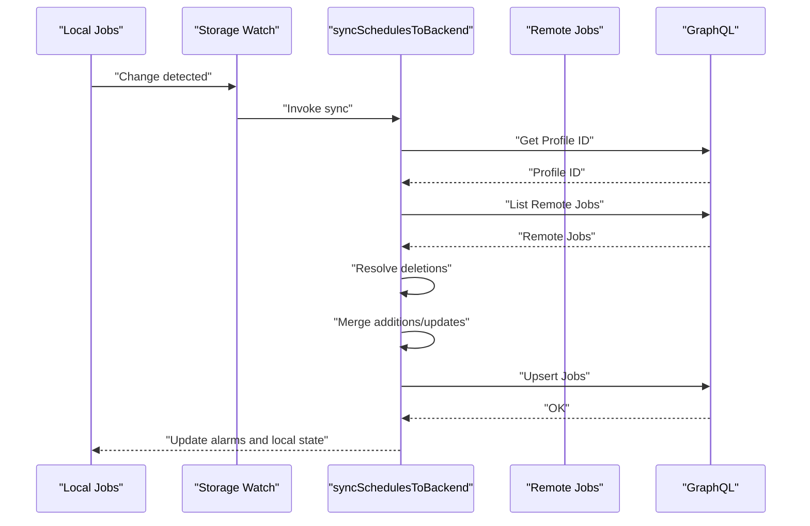
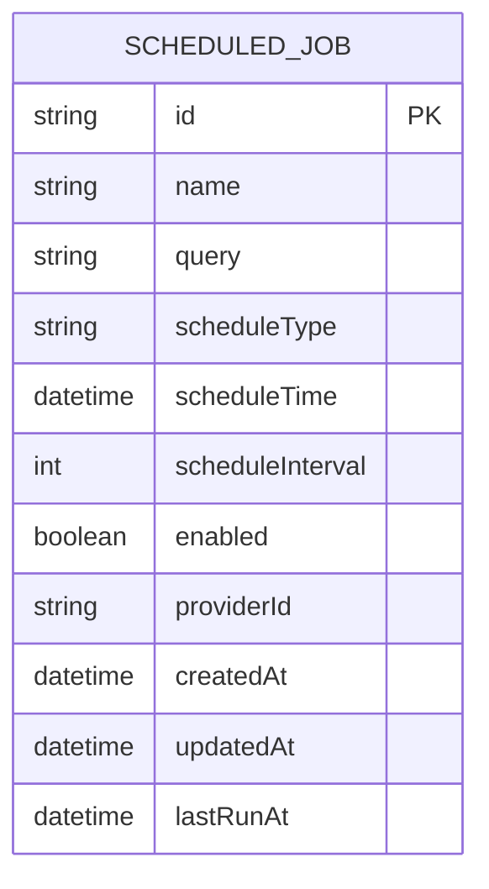
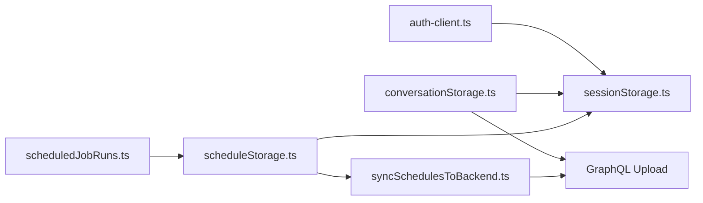

# Cloud Sync Capabilities

<cite>
**Referenced Files in This Document**
- [README.md](file://README.md)
- [sync-to-cloud.mdx](file://docs/features/sync-to-cloud.mdx)
- [scheduleStorage.ts](file://packages/browseros-agent/apps/agent/lib/schedules/scheduleStorage.ts)
- [syncSchedulesToBackend.ts](file://packages/browseros-agent/apps/agent/lib/schedules/syncSchedulesToBackend.ts)
- [conversationStorage.ts](file://packages/browseros-agent/apps/agent/lib/conversations/conversationStorage.ts)
- [sessionStorage.ts](file://packages/browseros-agent/apps/agent/lib/auth/sessionStorage.ts)
- [auth-client.ts](file://packages/browseros-agent/apps/agent/lib/auth/auth-client.ts)
- [AuthProvider.tsx](file://packages/browseros-agent/apps/agent/lib/auth/AuthProvider.tsx)
- [scheduledJobRuns.ts](file://packages/browseros-agent/apps/agent/entrypoints/background/scheduledJobRuns.ts)
- [types.ts](file://packages/browseros-agent/apps/agent/entrypoints/app/scheduled-tasks/types.ts)
- [chrome_decryptor_win.cc](file://packages/browseros/chromium_patches/chrome/utility/importer/browseros/chrome_decryptor_win.cc)
- [chrome_decryptor_mac.mm](file://packages/browseros/chromium_patches/chrome/utility/importer/browseros/chrome_decryptor_mac.mm)
- [callback-server.ts](file://packages/browseros-agent/apps/server/src/lib/clients/oauth/callback-server.ts)
</cite>

## Table of Contents
1. [Introduction](#introduction)
2. [Project Structure](#project-structure)
3. [Core Components](#core-components)
4. [Architecture Overview](#architecture-overview)
5. [Detailed Component Analysis](#detailed-component-analysis)
6. [Dependency Analysis](#dependency-analysis)
7. [Performance Considerations](#performance-considerations)
8. [Troubleshooting Guide](#troubleshooting-guide)
9. [Conclusion](#conclusion)
10. [Appendices](#appendices)

## Introduction
This document explains BrowserOS cloud sync capabilities with a focus on cross-device synchronization and data persistence. It covers how workflows, configurations, memory contexts, and user preferences are synchronized across devices using a local-first approach, along with encryption mechanisms, authentication requirements, and security measures. Practical setup examples, conflict resolution strategies, offline mode behavior, configuration options, and disaster recovery procedures are included.

## Project Structure
BrowserOS is a monorepo with two primary subsystems:
- Browser (Chromium fork) with build system and patches
- Agent platform (TypeScript/Go) containing the UI, scheduling, authentication, and cloud sync logic

The cloud sync functionality is implemented in the agent platform, primarily in the agent app and server components.

**Section sources**
- [README.md:144-178](file://README.md#L144-L178)

## Core Components
- Authentication and session management: Provides secure sign-in using magic links or OAuth and persists session info locally.
- Conversations storage: Manages local conversation history and uploads to cloud when signed in.
- Scheduled jobs: Synchronizes scheduled tasks across devices with conflict resolution based on timestamps.
- Background sync: Watches local storage changes and pushes updates to the backend.
- Offline-first behavior: Ensures local data remains intact and sync resumes automatically when connectivity is restored.

**Section sources**
- [sessionStorage.ts:1-37](file://packages/browseros-agent/apps/agent/lib/auth/sessionStorage.ts#L1-L37)
- [auth-client.ts:1-9](file://packages/browseros-agent/apps/agent/lib/auth/auth-client.ts#L1-L9)
- [conversationStorage.ts:1-79](file://packages/browseros-agent/apps/agent/lib/conversations/conversationStorage.ts#L1-L79)
- [scheduleStorage.ts:1-187](file://packages/browseros-agent/apps/agent/lib/schedules/scheduleStorage.ts#L1-L187)
- [syncSchedulesToBackend.ts:83-237](file://packages/browseros-agent/apps/agent/lib/schedules/syncSchedulesToBackend.ts#L83-L237)

## Architecture Overview
BrowserOS uses a local-first architecture:
- All actions are saved locally first and work offline.
- Signed-in users trigger background sync to cloud.
- On new devices, data is pulled from cloud and merged with local state.

**Diagram sources**
- [conversationStorage.ts:23-33](file://packages/browseros-agent/apps/agent/lib/conversations/conversationStorage.ts#L23-L33)
- [scheduleStorage.ts:164-187](file://packages/browseros-agent/apps/agent/lib/schedules/scheduleStorage.ts#L164-L187)
- [syncSchedulesToBackend.ts:84-237](file://packages/browseros-agent/apps/agent/lib/schedules/syncSchedulesToBackend.ts#L84-L237)

## Detailed Component Analysis

### Authentication and Session Management
- Magic-link and OAuth sign-in integrate with a client library and persist session info in local storage.
- Analytics identity is updated upon successful sign-in or reset when signed out.

**Diagram sources**
- [auth-client.ts:5-8](file://packages/browseros-agent/apps/agent/lib/auth/auth-client.ts#L5-L8)
- [callback-server.ts:167-192](file://packages/browseros-agent/apps/server/src/lib/clients/oauth/callback-server.ts#L167-L192)
- [sessionStorage.ts:17-37](file://packages/browseros-agent/apps/agent/lib/auth/sessionStorage.ts#L17-L37)
- [AuthProvider.tsx:7-32](file://packages/browseros-agent/apps/agent/lib/auth/AuthProvider.tsx#L7-L32)

**Section sources**
- [auth-client.ts:1-9](file://packages/browseros-agent/apps/agent/lib/auth/auth-client.ts#L1-L9)
- [sessionStorage.ts:1-37](file://packages/browseros-agent/apps/agent/lib/auth/sessionStorage.ts#L1-L37)
- [AuthProvider.tsx:1-32](file://packages/browseros-agent/apps/agent/lib/auth/AuthProvider.tsx#L1-L32)
- [callback-server.ts:167-192](file://packages/browseros-agent/apps/server/src/lib/clients/oauth/callback-server.ts#L167-L192)

### Conversations Sync
- Local conversation storage maintains a rolling window of recent conversations.
- When signed in, conversations are uploaded to the cloud in the background.
- Upload occurs on local changes and when a user ID is present.

**Diagram sources**
- [conversationStorage.ts:23-33](file://packages/browseros-agent/apps/agent/lib/conversations/conversationStorage.ts#L23-L33)
- [conversationStorage.ts:49-79](file://packages/browseros-agent/apps/agent/lib/conversations/conversationStorage.ts#L49-L79)

**Section sources**
- [conversationStorage.ts:1-79](file://packages/browseros-agent/apps/agent/lib/conversations/conversationStorage.ts#L1-L79)

### Scheduled Tasks Sync
- Local scheduled jobs are watched and synced to the backend.
- Conflict resolution uses timestamps to determine the authoritative version.
- Pending deletions are tracked and executed against the backend.

**Diagram sources**
- [scheduleStorage.ts:164-187](file://packages/browseros-agent/apps/agent/lib/schedules/scheduleStorage.ts#L164-L187)
- [syncSchedulesToBackend.ts:84-237](file://packages/browseros-agent/apps/agent/lib/schedules/syncSchedulesToBackend.ts#L84-L237)

**Section sources**
- [scheduleStorage.ts:1-187](file://packages/browseros-agent/apps/agent/lib/schedules/scheduleStorage.ts#L1-L187)
- [syncSchedulesToBackend.ts:1-237](file://packages/browseros-agent/apps/agent/lib/schedules/syncSchedulesToBackend.ts#L1-L237)
- [scheduledJobRuns.ts:37-87](file://packages/browseros-agent/apps/agent/entrypoints/background/scheduledJobRuns.ts#L37-L87)
- [types.ts:1-13](file://packages/browseros-agent/apps/agent/entrypoints/app/scheduled-tasks/types.ts#L1-L13)

### Data Model for Scheduled Jobs

**Diagram sources**
- [syncSchedulesToBackend.ts:15-73](file://packages/browseros-agent/apps/agent/lib/schedules/syncSchedulesToBackend.ts#L15-L73)

## Dependency Analysis
- Authentication depends on a public API base URL and magic-link plugin.
- Sync components depend on session info and GraphQL operations for conversations and schedules.
- Background tasks manage alarms and enforce local limits on job runs.

**Diagram sources**
- [auth-client.ts:5-8](file://packages/browseros-agent/apps/agent/lib/auth/auth-client.ts#L5-L8)
- [sessionStorage.ts:10-15](file://packages/browseros-agent/apps/agent/lib/auth/sessionStorage.ts#L10-L15)
- [conversationStorage.ts:6-6](file://packages/browseros-agent/apps/agent/lib/conversations/conversationStorage.ts#L6-L6)
- [scheduleStorage.ts:3-7](file://packages/browseros-agent/apps/agent/lib/schedules/scheduleStorage.ts#L3-L7)
- [syncSchedulesToBackend.ts:2-11](file://packages/browseros-agent/apps/agent/lib/schedules/syncSchedulesToBackend.ts#L2-L11)
- [scheduledJobRuns.ts:39-52](file://packages/browseros-agent/apps/agent/entrypoints/background/scheduledJobRuns.ts#L39-L52)

**Section sources**
- [auth-client.ts:1-9](file://packages/browseros-agent/apps/agent/lib/auth/auth-client.ts#L1-L9)
- [sessionStorage.ts:1-37](file://packages/browseros-agent/apps/agent/lib/auth/sessionStorage.ts#L1-L37)
- [conversationStorage.ts:1-79](file://packages/browseros-agent/apps/agent/lib/conversations/conversationStorage.ts#L1-L79)
- [scheduleStorage.ts:1-187](file://packages/browseros-agent/apps/agent/lib/schedules/scheduleStorage.ts#L1-L187)
- [syncSchedulesToBackend.ts:1-237](file://packages/browseros-agent/apps/agent/lib/schedules/syncSchedulesToBackend.ts#L1-L237)
- [scheduledJobRuns.ts:1-87](file://packages/browseros-agent/apps/agent/entrypoints/background/scheduledJobRuns.ts#L1-L87)

## Performance Considerations
- Local-first design ensures immediate responsiveness and offline capability.
- Background sync minimizes network overhead by uploading only when changes occur and when signed in.
- Timestamp-based conflict resolution avoids unnecessary overwrites and reduces merge conflicts.
- Local limits on conversation counts prevent excessive local storage growth.

[No sources needed since this section provides general guidance]

## Troubleshooting Guide
Common sync issues and resolutions:
- Sync failures are silent and do not affect local data. They resume automatically when connectivity is restored.
- If scheduled tasks appear inconsistent across devices, confirm that both devices are signed in and that sufficient time has elapsed for sync to propagate.
- For authentication issues, verify the OAuth callback server is reachable and that the public API base URL is correctly configured.

**Section sources**
- [sync-to-cloud.mdx:101-120](file://docs/features/sync-to-cloud.mdx#L101-L120)
- [auth-client.ts:5-8](file://packages/browseros-agent/apps/agent/lib/auth/auth-client.ts#L5-L8)

## Conclusion
BrowserOS cloud sync delivers a seamless, secure, and resilient cross-device experience. Its local-first architecture, combined with targeted cloud synchronization and robust conflict resolution, ensures data integrity and availability while preserving user privacy. Authentication is session-based and optional for basic usage, with sensitive credentials excluded from cloud sync.

[No sources needed since this section summarizes without analyzing specific files]

## Appendices

### What Gets Synced
- Conversations: Full chat history synced in real time; local cache capped at a fixed number.
- AI model settings: Provider configurations sync across devices; API keys remain local.
- Scheduled tasks: Task setup synchronizes bidirectionally; results stay local.
- Profile: Name, avatar, and account preferences sync across devices.

**Section sources**
- [sync-to-cloud.mdx:48-84](file://docs/features/sync-to-cloud.mdx#L48-L84)

### What Stays Local
- API keys and secrets for LLM providers
- Memory (core facts and daily notes)
- SOUL.md (assistant personality)
- Theme (light/dark mode)
- Workspace folder selection
- Connected MCP servers
- Workflows
- Scheduled task results (run output stays on the device where the task ran)

**Section sources**
- [sync-to-cloud.mdx:70-84](file://docs/features/sync-to-cloud.mdx#L70-L84)

### Setup Examples
- Sign in using a magic link or Google OAuth from the sidebar.
- After sign-in, data syncs automatically in the background.
- On a new device, sign in to restore conversations, settings, and scheduled tasks.

**Section sources**
- [sync-to-cloud.mdx:27-47](file://docs/features/sync-to-cloud.mdx#L27-L47)

### Conflict Resolution Strategies
- Scheduled tasks: Latest timestamp wins.
- Silent sync failures: Local data unaffected; sync resumes on next change.

**Section sources**
- [sync-to-cloud.mdx:101-103](file://docs/features/sync-to-cloud.mdx#L101-L103)
- [sync-to-cloud.mdx:117-119](file://docs/features/sync-to-cloud.mdx#L117-L119)

### Offline Mode Functionality
- Fully functional offline; local writes persist regardless of connectivity.
- Sync resumes automatically when connectivity is restored.

**Section sources**
- [sync-to-cloud.mdx:85-99](file://docs/features/sync-to-cloud.mdx#L85-L99)

### Configuration Options
- Sync frequency: Automatic on local changes when signed in.
- Bandwidth optimization: Minimal overhead; only changed data is uploaded.
- Selective synchronization: Conversations and scheduled tasks sync; sensitive data remains local.

**Section sources**
- [conversationStorage.ts:23-33](file://packages/browseros-agent/apps/agent/lib/conversations/conversationStorage.ts#L23-L33)
- [scheduleStorage.ts:164-187](file://packages/browseros-agent/apps/agent/lib/schedules/scheduleStorage.ts#L164-L187)
- [sync-to-cloud.mdx:48-84](file://docs/features/sync-to-cloud.mdx#L48-L84)

### Integration Between Cloud Sync and Local Storage
- Local storage acts as the source of truth; cloud sync is a background process.
- On sign-in, local state is merged with cloud data, resolving conflicts via timestamps.

**Section sources**
- [syncSchedulesToBackend.ts:129-173](file://packages/browseros-agent/apps/agent/lib/schedules/syncSchedulesToBackend.ts#L129-L173)
- [conversationStorage.ts:23-33](file://packages/browseros-agent/apps/agent/lib/conversations/conversationStorage.ts#L23-L33)

### Backup Mechanisms and Disaster Recovery
- Conversations are backed up to the cloud; clearing local data or switching machines does not erase history.
- Restore by signing in on a new device.

**Section sources**
- [sync-to-cloud.mdx:16-18](file://docs/features/sync-to-cloud.mdx#L16-L18)

### Security Measures
- API keys, access keys, and tokens are excluded from cloud sync.
- Session-based authentication using magic links or Google OAuth.
- Sync failures are silent and do not expose local data.

**Section sources**
- [sync-to-cloud.mdx:105-120](file://docs/features/sync-to-cloud.mdx#L105-L120)

### Encryption Mechanisms
- Chromium-derived encryption for imported data on Windows and macOS is handled by OS-level cryptographic APIs and AES variants.
- These mechanisms apply to imported browser data and complement the cloud sync design.

**Section sources**
- [chrome_decryptor_win.cc:85-167](file://packages/browseros/chromium_patches/chrome/utility/importer/browseros/chrome_decryptor_win.cc#L85-L167)
- [chrome_decryptor_mac.mm:90-193](file://packages/browseros/chromium_patches/chrome/utility/importer/browseros/chrome_decryptor_mac.mm#L90-L193)