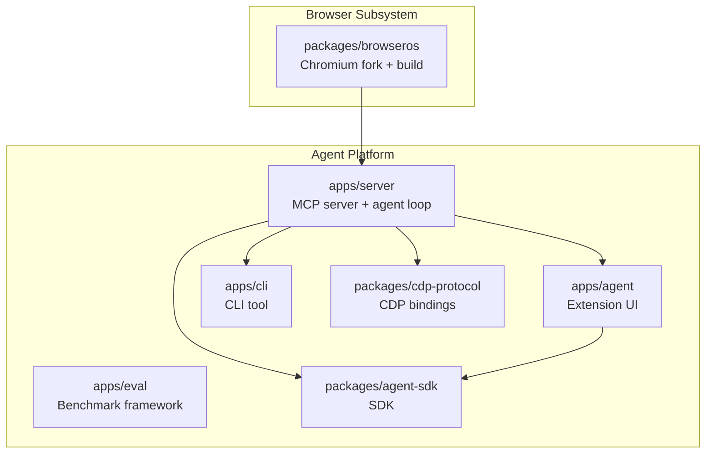
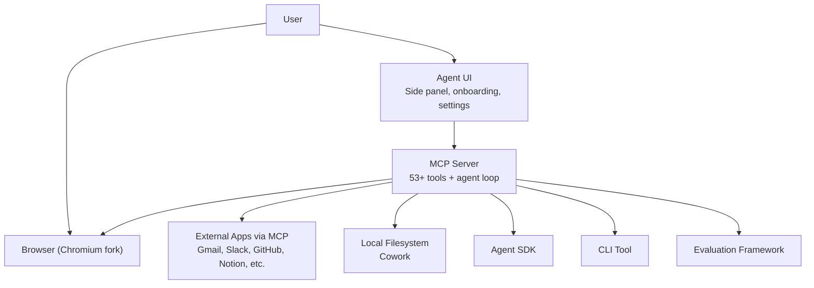
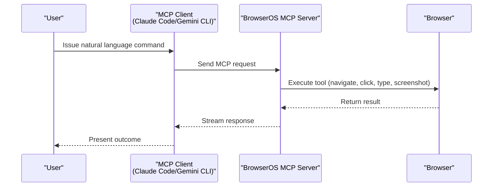
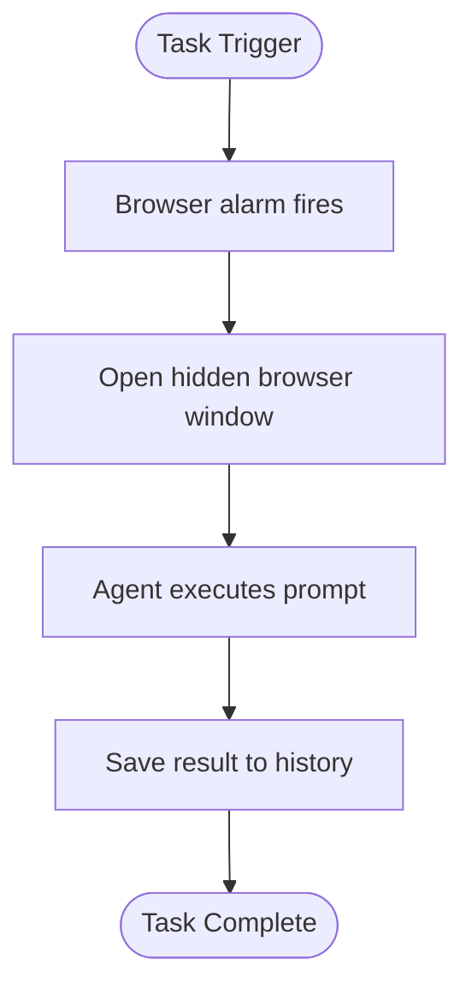
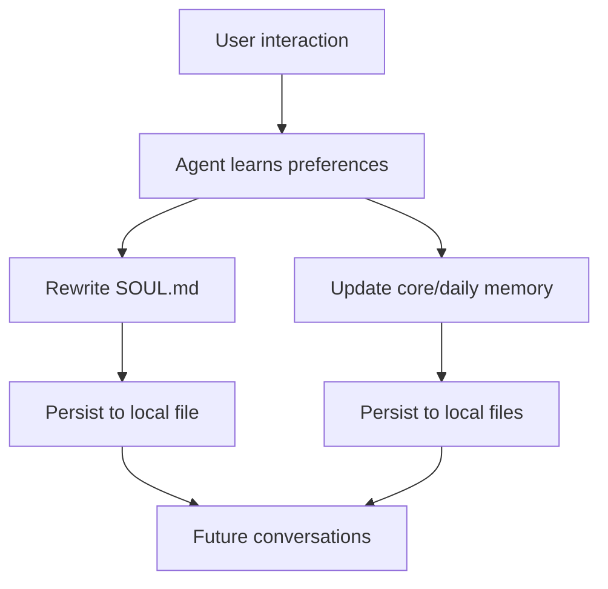
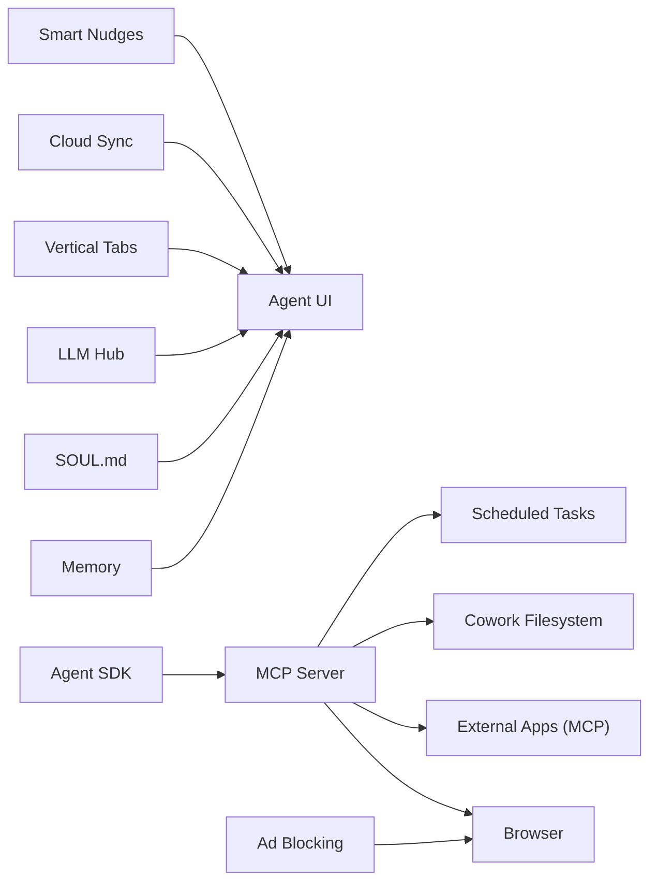

# Core Features

<cite>
**Referenced Files in This Document**
- [README.md](file://README.md)
- [docs/index.mdx](file://docs/index.mdx)
- [docs/features/use-with-claude-code.mdx](file://docs/features/use-with-claude-code.mdx)
- [docs/features/workflows.mdx](file://docs/features/workflows.mdx)
- [docs/features/cowork.mdx](file://docs/features/cowork.mdx)
- [docs/features/scheduled-tasks.mdx](file://docs/features/scheduled-tasks.mdx)
- [docs/features/memory.mdx](file://docs/features/memory.mdx)
- [docs/features/soul.mdx](file://docs/features/soul.mdx)
- [docs/features/llm-chat-hub.mdx](file://docs/features/llm-chat-hub.mdx)
- [docs/features/vertical-tabs.mdx](file://docs/features/vertical-tabs.mdx)
- [docs/features/ad-blocking.mdx](file://docs/features/ad-blocking.mdx)
- [docs/features/sync-to-cloud.mdx](file://docs/features/sync-to-cloud.mdx)
- [docs/features/smart-nudges.mdx](file://docs/features/smart-nudges.mdx)
- [packages/browseros-agent/apps/server/src/agent/prompt.ts](file://packages/browseros-agent/apps/server/src/agent/prompt.ts)
</cite>

## Table of Contents
1. [Introduction](#introduction)
2. [Project Structure](#project-structure)
3. [Core Components](#core-components)
4. [Architecture Overview](#architecture-overview)
5. [Detailed Component Analysis](#detailed-component-analysis)
6. [Dependency Analysis](#dependency-analysis)
7. [Performance Considerations](#performance-considerations)
8. [Troubleshooting Guide](#troubleshooting-guide)
9. [Conclusion](#conclusion)
10. [Appendices](#appendices)

## Introduction
BrowserOS is an open-source Chromium-based browser that runs AI agents natively on your machine. It emphasizes privacy-first browsing, integrates AI for both chat and autonomous agent mode, and provides a comprehensive toolkit for building repeatable browser automations. The platform offers:
- 53+ browser automation tools with natural language instructions
- MCP server for controlling the browser and 40+ apps from Claude Code, Gemini CLI, or any MCP client
- Visual workflow builder for repeatable automations
- Cowork feature combining browser automation with local file operations
- Scheduled tasks for automated agent execution
- Persistent memory and evolving personality (SOUL.md)
- LLM Chat Hub for comparing multiple AI responses
- Vertical tabs, ad blocking with uBlock Origin + MV2 support, cloud sync, and smart nudges

These capabilities combine to deliver an integrated AI-powered browsing experience that scales from quick tasks to complex cross-application workflows.

**Section sources**
- [README.md:44-62](file://README.md#L44-L62)
- [docs/index.mdx:14-26](file://docs/index.mdx#L14-L26)

## Project Structure
BrowserOS is organized as a monorepo with two main subsystems:
- Browser (Chromium fork): patches, build system, signing
- Agent platform (TypeScript/Go): MCP server, agent UI, CLI, evaluation framework, SDKs

Key packages and roles:
- packages/browseros: Chromium fork + build system
- packages/browseros-agent/apps/server: Bun server exposing 53+ MCP tools and running the AI agent loop
- packages/browseros-agent/apps/agent: Browser extension (new tab, side panel chat, onboarding, settings)
- packages/browseros-agent/apps/cli: Go CLI for controlling BrowserOS from terminal or AI coding agents
- packages/browseros-agent/apps/eval: Benchmark framework (WebVoyager, Mind2Web)
- packages/browseros-agent/packages/agent-sdk: Node.js SDK for browser automation with natural language
- packages/browseros-agent/packages/cdp-protocol: Type-safe Chrome DevTools Protocol bindings

**Diagram sources**
- [README.md:144-178](file://README.md#L144-L178)

**Section sources**
- [README.md:144-178](file://README.md#L144-L178)

## Core Components
This section outlines the platform’s primary capabilities and how they fit together.

- 53+ browser automation tools with natural language
  - Includes navigation, clicking, typing, data extraction, screenshots, DOM inspection, and more
  - Tools are exposed via the MCP server and agent SDK
  - Natural language guidance and best practices are documented for reliable automation

- MCP server for Claude Code, Gemini CLI, and other clients
  - Built-in server enables browser control and app integrations without extra setup
  - Supports authenticated access to logged-in pages and cross-app workflows

- Visual workflow builder
  - Graph-based builder for repeatable automations
  - Save and run workflows reliably across sessions

- Cowork: browser + file operations
  - Combine web research with local file writes, edits, searches, and shell commands
  - Sandboxed to a chosen folder with strict access controls

- Scheduled tasks
  - Run agent prompts automatically on daily, hourly, or minute schedules
  - Hidden execution window ensures non-intrusive automation

- Memory and SOUL.md
  - Persistent memory across conversations with core and daily notes
  - Evolving personality file (SOUL.md) shaped by interactions

- LLM Chat Hub
  - Compare Claude, ChatGPT, and Gemini responses side-by-side on any page
  - Quick access to page context, screenshots, and provider switching

- Vertical tabs, ad blocking, cloud sync, and smart nudges
  - Vertical tabs for side-panel tab management
  - Full ad blocking with uBlock Origin + MV2 support
  - Cloud sync for conversations, settings, and scheduled tasks
  - Smart nudges for app connections and scheduling suggestions

**Section sources**
- [README.md:44-62](file://README.md#L44-L62)
- [docs/features/use-with-claude-code.mdx:1-145](file://docs/features/use-with-claude-code.mdx#L1-L145)
- [docs/features/workflows.mdx:1-35](file://docs/features/workflows.mdx#L1-L35)
- [docs/features/cowork.mdx:1-223](file://docs/features/cowork.mdx#L1-L223)
- [docs/features/scheduled-tasks.mdx:1-148](file://docs/features/scheduled-tasks.mdx#L1-L148)
- [docs/features/memory.mdx:1-129](file://docs/features/memory.mdx#L1-L129)
- [docs/features/soul.mdx:1-127](file://docs/features/soul.mdx#L1-L127)
- [docs/features/llm-chat-hub.mdx:1-69](file://docs/features/llm-chat-hub.mdx#L1-L69)
- [docs/features/vertical-tabs.mdx:1-61](file://docs/features/vertical-tabs.mdx#L1-L61)
- [docs/features/ad-blocking.mdx:1-40](file://docs/features/ad-blocking.mdx#L1-L40)
- [docs/features/sync-to-cloud.mdx:1-121](file://docs/features/sync-to-cloud.mdx#L1-L121)
- [docs/features/smart-nudges.mdx:1-118](file://docs/features/smart-nudges.mdx#L1-L118)
- [packages/browseros-agent/apps/server/src/agent/prompt.ts:304-327](file://packages/browseros-agent/apps/server/src/agent/prompt.ts#L304-L327)

## Architecture Overview
BrowserOS integrates browser automation, AI agents, and external app connectivity through a layered architecture:
- Browser layer: Chromium fork with patches and build system
- Agent platform: MCP server, agent UI, CLI, SDK, and evaluation framework
- External integrations: 40+ apps via MCP, OAuth, and custom servers
- User-facing features: Workflows, Cowork, Scheduled Tasks, Memory, SOUL.md, LLM Hub, Vertical Tabs, Ad Blocking, Cloud Sync, Smart Nudges

**Diagram sources**
- [README.md:144-178](file://README.md#L144-L178)
- [docs/features/use-with-claude-code.mdx:1-145](file://docs/features/use-with-claude-code.mdx#L1-L145)
- [docs/features/cowork.mdx:1-223](file://docs/features/cowork.mdx#L1-L223)

## Detailed Component Analysis

### 53+ Browser Automation Tools with Natural Language
- Capabilities include navigation, clicking, typing, data extraction, DOM queries, screenshots, and debugging helpers
- Guidance emphasizes preferring element IDs, structured snapshots, and reliable selectors
- Tools are surfaced through the MCP server and agent SDK for use in both chat and agent modes

Practical examples:
- Navigate to a page, click a link, fill a form, and take a screenshot
- Extract page content, links, or DOM nodes; evaluate runtime JS variables
- Debug by capturing console logs or taking visual snapshots

**Section sources**
- [packages/browseros-agent/apps/server/src/agent/prompt.ts:304-327](file://packages/browseros-agent/apps/server/src/agent/prompt.ts#L304-L327)

### MCP Server for Claude Code, Gemini CLI, and Other Clients
- Built-in server exposes browser control and 40+ app integrations
- One-line setup via CLI; works with Claude Code, Gemini CLI, Codex, Claude Desktop, and OpenClaw
- Enables authenticated access to logged-in pages and cross-application workflows

Sequence of operation:

**Diagram sources**
- [docs/features/use-with-claude-code.mdx:56-126](file://docs/features/use-with-claude-code.mdx#L56-L126)

**Section sources**
- [docs/features/use-with-claude-code.mdx:1-145](file://docs/features/use-with-claude-code.mdx#L1-L145)

### Visual Workflow Builder
- Build repeatable automations as visual graphs
- Save and run workflows reliably; suitable for complex, multi-step tasks
- Designed for scenarios where reliability and reusability outweigh dynamic interpretation

Use cases:
- Multi-step form filling from spreadsheet data
- Cross-tab workflows requiring precise sequencing
- Parallel actions and conditional logic

**Section sources**
- [docs/features/workflows.mdx:1-35](file://docs/features/workflows.mdx#L1-L35)

### Cowork: Browser + Local File Operations
- Combine web research with local file writes, edits, searches, and shell commands
- Sandboxed to a selected folder; no path traversal or parent directory access
- Ideal for research, report generation, and codebase exploration

Filesystem tools:
- Read/write/edit files
- Run shell commands
- Search content with regex or literal patterns
- Find files by glob patterns
- List directories with sizes and sorting

Example workflow:
- Research top stories on a news site, summarize findings, and write an HTML report to a chosen folder

**Section sources**
- [docs/features/cowork.mdx:1-223](file://docs/features/cowork.mdx#L1-L223)

### Scheduled Tasks
- Run agent prompts automatically on daily, hourly, or minute schedules
- Hidden execution window ensures non-intrusive automation
- Results appear on the New Tab page and in the task’s run history

Execution flow:

**Diagram sources**
- [docs/features/scheduled-tasks.mdx:109-124](file://docs/features/scheduled-tasks.mdx#L109-L124)

**Section sources**
- [docs/features/scheduled-tasks.mdx:1-148](file://docs/features/scheduled-tasks.mdx#L1-L148)

### Memory Persistence and SOUL.md Personality
- Memory: two-tier system with core facts and daily notes; persists across conversations
- SOUL.md: evolving personality file shaped by interactions; reflects tone, boundaries, and preferences
- Both are stored locally and never uploaded to the cloud

**Diagram sources**
- [docs/features/memory.mdx:1-129](file://docs/features/memory.mdx#L1-L129)
- [docs/features/soul.mdx:1-127](file://docs/features/soul.mdx#L1-L127)

**Section sources**
- [docs/features/memory.mdx:1-129](file://docs/features/memory.mdx#L1-L129)
- [docs/features/soul.mdx:1-127](file://docs/features/soul.mdx#L1-L127)

### LLM Chat Hub
- Compare Claude, ChatGPT, and Gemini responses side-by-side on any page
- Quick access to page context, screenshots, and provider switching
- Toolbar buttons and keyboard shortcuts streamline access

**Section sources**
- [docs/features/llm-chat-hub.mdx:1-69](file://docs/features/llm-chat-hub.mdx#L1-L69)

### Vertical Tabs
- Side-panel tab management for clean, organized browsing
- Full-width labels, drag-and-drop reordering, and collapsible panel
- Integrates with tab groups for visual separation

**Section sources**
- [docs/features/vertical-tabs.mdx:1-61](file://docs/features/vertical-tabs.mdx#L1-L61)

### Ad Blocking with uBlock Origin + MV2 Support
- Full ad blocking via uBlock Origin (not Lite)
- 10x more protection than Chrome on equivalent tests
- Works out-of-the-box on BrowserOS due to restored MV2 support

**Section sources**
- [docs/features/ad-blocking.mdx:1-40](file://docs/features/ad-blocking.mdx#L1-L40)

### Cloud Sync
- Sign in to sync conversations, AI model settings, and scheduled tasks across devices
- Local-first approach: data saved locally first, then synced in the background
- Sensitive credentials (API keys) and memory/personality files remain local

**Section sources**
- [docs/features/sync-to-cloud.mdx:1-121](file://docs/features/sync-to-cloud.mdx#L1-L121)

### Smart Nudges
- Context-aware suggestions for app connections and scheduling
- Appears once per app per conversation; respects user decisions
- Enhances productivity by surfacing helpful actions at the right moment

**Section sources**
- [docs/features/smart-nudges.mdx:1-118](file://docs/features/smart-nudges.mdx#L1-L118)

## Dependency Analysis
High-level dependencies among core features:
- MCP server depends on the browser automation SDK and CDP bindings
- Agent UI consumes the MCP server for browser control and app integrations
- Cowork relies on filesystem tools and sandboxed access
- Scheduled tasks depend on the browser alarm system and hidden execution window
- Memory and SOUL.md are independent local persistence layers
- LLM Hub is a UI feature that leverages provider configurations
- Vertical tabs, ad blocking, and cloud sync are UI/platform enhancements

**Diagram sources**
- [README.md:144-178](file://README.md#L144-L178)
- [docs/features/cowork.mdx:1-223](file://docs/features/cowork.mdx#L1-L223)
- [docs/features/scheduled-tasks.mdx:1-148](file://docs/features/scheduled-tasks.mdx#L1-L148)
- [docs/features/memory.mdx:1-129](file://docs/features/memory.mdx#L1-L129)
- [docs/features/soul.mdx:1-127](file://docs/features/soul.mdx#L1-L127)
- [docs/features/llm-chat-hub.mdx:1-69](file://docs/features/llm-chat-hub.mdx#L1-L69)
- [docs/features/vertical-tabs.mdx:1-61](file://docs/features/vertical-tabs.mdx#L1-L61)
- [docs/features/ad-blocking.mdx:1-40](file://docs/features/ad-blocking.mdx#L1-L40)
- [docs/features/sync-to-cloud.mdx:1-121](file://docs/features/sync-to-cloud.mdx#L1-L121)
- [docs/features/smart-nudges.mdx:1-118](file://docs/features/smart-nudges.mdx#L1-L118)

## Performance Considerations
- Local execution: All tasks run on your machine to preserve privacy and reduce latency
- Hidden execution: Scheduled tasks run in a hidden browser window to avoid UI overhead
- Sandboxing: Cowork limits filesystem access to a single folder to prevent accidental IO overhead
- Cloud sync: Background sync minimizes impact on daily usage; sensitive data remains local
- Ad blocking: Reduced network requests improve page load times and lower bandwidth usage

[No sources needed since this section provides general guidance]

## Troubleshooting Guide
- MCP connection issues
  - Verify the MCP server URL from settings and ensure the client uses the correct transport
  - Confirm permissions for browser actions when using Claude Code

- Scheduled tasks not running
  - Ensure BrowserOS is open; tasks run when the browser is available
  - Check timeouts and retry failed runs

- Cloud sync problems
  - Confirm sign-in status and connectivity; sync resumes automatically when online
  - Remember that API keys and memory/personality files are intentionally not synced

- Ad blocking effectiveness
  - Install the full uBlock Origin extension; Lite versions are not supported

**Section sources**
- [docs/features/use-with-claude-code.mdx:56-126](file://docs/features/use-with-claude-code.mdx#L56-L126)
- [docs/features/scheduled-tasks.mdx:126-128](file://docs/features/scheduled-tasks.mdx#L126-L128)
- [docs/features/sync-to-cloud.mdx:85-99](file://docs/features/sync-to-cloud.mdx#L85-L99)
- [docs/features/ad-blocking.mdx:14-16](file://docs/features/ad-blocking.mdx#L14-L16)

## Conclusion
BrowserOS delivers a cohesive, privacy-first AI-powered browsing experience. Its 53+ automation tools, MCP server, visual workflows, Cowork, scheduled tasks, memory, SOUL.md, LLM Hub, vertical tabs, ad blocking, cloud sync, and smart nudges integrate to support both quick tasks and complex, repeatable automations. Together, these features enable users to automate web interactions, connect apps, manage context, and scale AI-assisted workflows across devices.

[No sources needed since this section summarizes without analyzing specific files]

## Appendices
- Practical examples by feature
  - MCP server: Open a logged-in page, extract structured data, capture screenshots, and automate form submissions
  - Workflows: Build a multi-step data entry process with conditional branching
  - Cowork: Research topics, aggregate findings, and write reports to your project folder
  - Scheduled tasks: Daily briefings, price monitoring, social media rounds, and cross-app workflows
  - Memory + SOUL.md: Maintain consistent personality and knowledge across conversations
  - LLM Hub: Compare model responses side-by-side for decision-making
  - Vertical tabs: Organize dozens of tabs with full titles and drag-and-drop reordering
  - Ad blocking: Install uBlock Origin for superior protection compared to Chrome
  - Cloud sync: Access your conversations and tasks from any device
  - Smart nudges: Connect apps and schedule tasks without manual setup

[No sources needed since this section aggregates use cases without analyzing specific files]