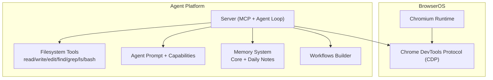
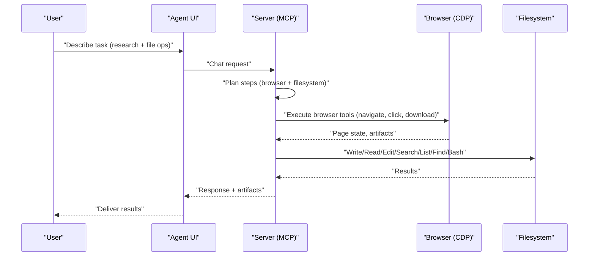
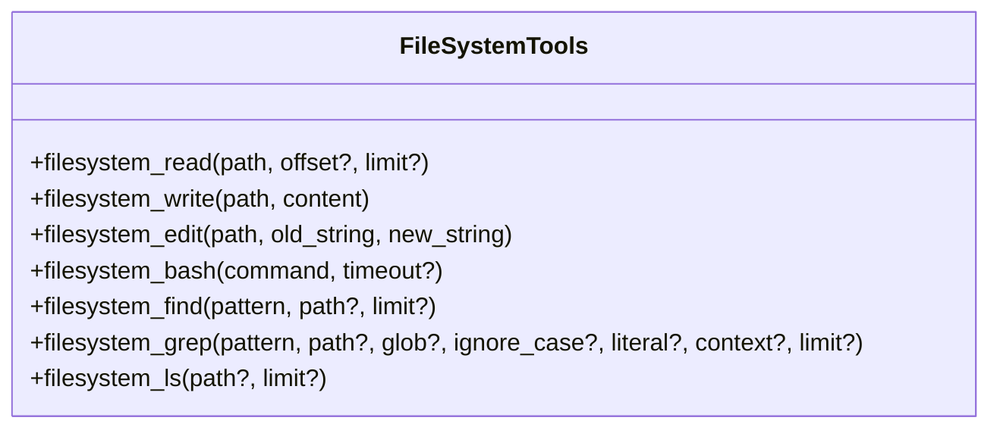
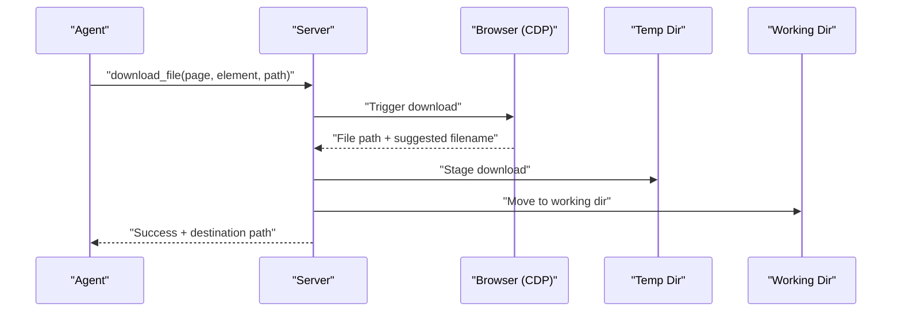
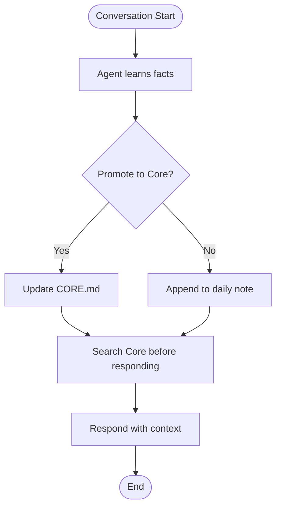
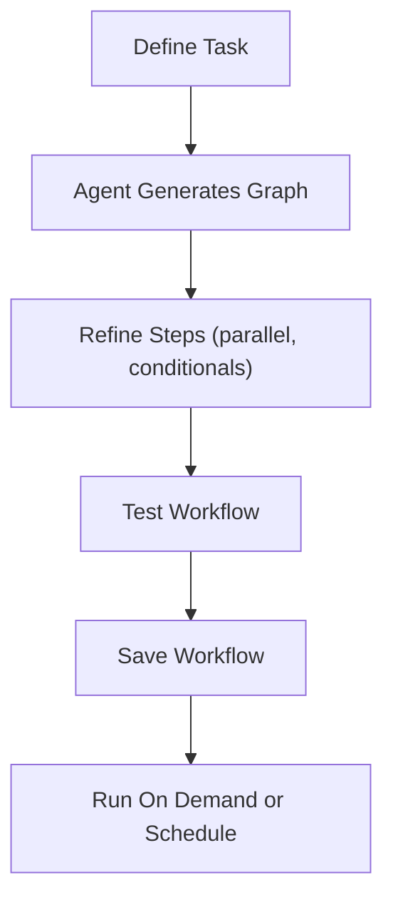
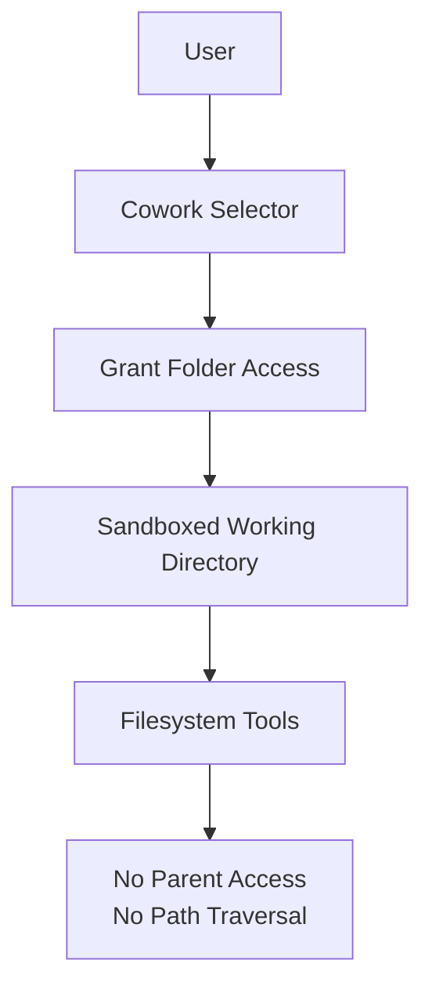
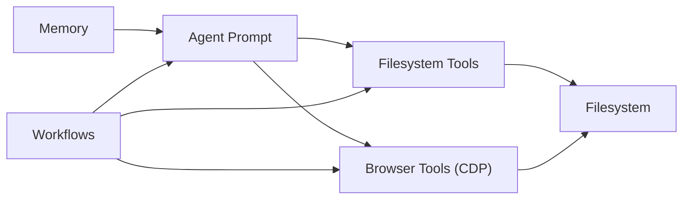

# Cowork Automation

<cite>
**Referenced Files in This Document**
- [README.md](file://README.md)
- [docs/features/cowork.mdx](file://docs/features/cowork.mdx)
- [docs/features/memory.mdx](file://docs/features/memory.mdx)
- [docs/features/workflows.mdx](file://docs/features/workflows.mdx)
- [docs/comparisons/claude-cowork.mdx](file://docs/comparisons/claude-cowork.mdx)
- [packages/browseros-agent/README.md](file://packages/browseros-agent/README.md)
- [packages/browseros-agent/packages/shared/src/constants/paths.ts](file://packages/browseros-agent/packages/shared/src/constants/paths.ts)
- [packages/browseros-agent/apps/server/src/agent/prompt.ts](file://packages/browseros-agent/apps/server/src/agent/prompt.ts)
- [packages/browseros-agent/apps/server/src/tools/filesystem/build-toolset.ts](file://packages/browseros-agent/apps/server/src/tools/filesystem/build-toolset.ts)
- [packages/browseros-agent/apps/server/src/tools/filesystem/read.ts](file://packages/browseros-agent/apps/server/src/tools/filesystem/read.ts)
- [packages/browseros-agent/apps/server/src/tools/filesystem/write.ts](file://packages/browseros-agent/apps/server/src/tools/filesystem/write.ts)
- [packages/browseros-agent/apps/server/src/tools/filesystem/edit.ts](file://packages/browseros-agent/apps/server/src/tools/filesystem/edit.ts)
- [packages/browseros-agent/apps/server/src/tools/filesystem/bash.ts](file://packages/browseros-agent/apps/server/src/tools/filesystem/bash.ts)
- [packages/browseros-agent/apps/server/src/tools/filesystem/find.ts](file://packages/browseros-agent/apps/server/src/tools/filesystem/find.ts)
- [packages/browseros-agent/apps/server/src/tools/filesystem/grep.ts](file://packages/browseros-agent/apps/server/src/tools/filesystem/grep.ts)
- [packages/browseros-agent/apps/server/src/tools/filesystem/ls.ts](file://packages/browseros-agent/apps/server/src/tools/filesystem/ls.ts)
- [packages/browseros-agent/apps/server/src/tools/page-actions.ts](file://packages/browseros-agent/apps/server/src/tools/page-actions.ts)
- [packages/browseros-agent/apps/server/tests/tools/dom.test.ts](file://packages/browseros-agent/apps/server/tests/tools/dom.test.ts)
</cite>

## Table of Contents
1. [Introduction](#introduction)
2. [Project Structure](#project-structure)
3. [Core Components](#core-components)
4. [Architecture Overview](#architecture-overview)
5. [Detailed Component Analysis](#detailed-component-analysis)
6. [Dependency Analysis](#dependency-analysis)
7. [Performance Considerations](#performance-considerations)
8. [Troubleshooting Guide](#troubleshooting-guide)
9. [Conclusion](#conclusion)
10. [Appendices](#appendices)

## Introduction
Cowork Automation in BrowserOS enables AI agents to seamlessly combine browser automation with local file operations. This integration allows agents to research the web, gather insights, and synthesize them into reports or actionable artifacts saved directly to your local filesystem. The system provides a sandboxed workspace for file operations while maintaining strict isolation boundaries, ensuring that agents can only access the selected folder and cannot traverse outside it. This document explains how BrowserOS’s Cowork feature integrates browser automation and filesystem operations, how memory persists context across sessions, and how to configure and secure the environment for robust research and report-generation workflows.

## Project Structure
BrowserOS is a monorepo with two primary subsystems:
- Browser (Chromium fork): Provides the browser runtime and CDP connectivity.
- Agent platform (TypeScript/Go): Exposes MCP tools, runs the agent loop, and orchestrates browser and filesystem operations.

Key areas relevant to Cowork:
- Agent platform documentation and feature pages (docs/features/cowork.mdx, docs/features/memory.mdx, docs/features/workflows.mdx)
- Agent platform architecture and ports (packages/browseros-agent/README.md)
- Filesystem toolset and prompts (packages/browseros-agent/apps/server/src/tools/filesystem/*, packages/browseros-agent/apps/server/src/agent/prompt.ts)
- Shared constants (packages/browseros-agent/packages/shared/src/constants/paths.ts)

**Diagram sources**
- [packages/browseros-agent/README.md:28-62](file://packages/browseros-agent/README.md#L28-L62)
- [packages/browseros-agent/apps/server/src/agent/prompt.ts:149-181](file://packages/browseros-agent/apps/server/src/agent/prompt.ts#L149-L181)
- [packages/browseros-agent/packages/shared/src/constants/paths.ts:9-21](file://packages/browseros-agent/packages/shared/src/constants/paths.ts#L9-L21)

**Section sources**
- [README.md:144-178](file://README.md#L144-L178)
- [packages/browseros-agent/README.md:28-62](file://packages/browseros-agent/README.md#L28-L62)

## Core Components
- Filesystem tools: Seven MCP tools enable reading, writing, editing, searching, finding, listing, and executing shell commands within a sandboxed working directory.
- Browser automation: 53+ browser tools (navigation, clicking, typing, screenshots, downloads, etc.) orchestrated by the agent loop.
- Memory: Persistent memory across conversations stored locally as Markdown files, enabling context continuity for research tasks.
- Workflows: Visual graph builder for building repeatable automations combining browser and filesystem steps.
- Sandbox: Folder-level isolation ensures agents cannot access files outside the selected working directory.

Practical outcomes:
- Research workflows: Scrape web content, aggregate findings, and generate reports saved to your folder.
- Data synthesis: Combine browser-extracted data with local files to produce consolidated outputs.
- Automated report generation: Save HTML, Markdown, CSV, and other formats directly from browser sessions.

**Section sources**
- [docs/features/cowork.mdx:6-42](file://docs/features/cowork.mdx#L6-L42)
- [docs/features/cowork.mdx:71-156](file://docs/features/cowork.mdx#L71-L156)
- [docs/features/memory.mdx:8-25](file://docs/features/memory.mdx#L8-L25)
- [docs/features/workflows.mdx:6-24](file://docs/features/workflows.mdx#L6-L24)

## Architecture Overview
The agent platform exposes MCP endpoints and an agent loop that coordinates browser automation via CDP and filesystem operations via the sandboxed workspace. The prompt informs the agent of available capabilities, including browser tools and the presence of a workspace when Cowork is enabled.

**Diagram sources**
- [packages/browseros-agent/README.md:34-62](file://packages/browseros-agent/README.md#L34-L62)
- [packages/browseros-agent/apps/server/src/agent/prompt.ts:149-181](file://packages/browseros-agent/apps/server/src/agent/prompt.ts#L149-L181)

## Detailed Component Analysis

### Filesystem Toolset
The filesystem toolset is built dynamically and includes seven tools:
- filesystem_read: Read files with pagination support.
- filesystem_write: Create or overwrite files; auto-create parent directories.
- filesystem_edit: Targeted find-and-replace edits with fallback fuzzy matching.
- filesystem_bash: Execute shell commands with timeouts and output truncation.
- filesystem_find: Glob-based file discovery with smart filtering of build directories.
- filesystem_grep: Regex or literal content search with size and binary-file safeguards.
- filesystem_ls: List directory contents with sorting and size reporting.

**Diagram sources**
- [packages/browseros-agent/apps/server/src/tools/filesystem/build-toolset.ts:11-17](file://packages/browseros-agent/apps/server/src/tools/filesystem/build-toolset.ts#L11-L17)
- [packages/browseros-agent/apps/server/src/tools/filesystem/read.ts:14](file://packages/browseros-agent/apps/server/src/tools/filesystem/read.ts#L14)
- [packages/browseros-agent/apps/server/src/tools/filesystem/write.ts:...:1-200](file://packages/browseros-agent/apps/server/src/tools/filesystem/write.ts#L1-L200)
- [packages/browseros-agent/apps/server/src/tools/filesystem/edit.ts:13](file://packages/browseros-agent/apps/server/src/tools/filesystem/edit.ts#L13)
- [packages/browseros-agent/apps/server/src/tools/filesystem/bash.ts:10](file://packages/browseros-agent/apps/server/src/tools/filesystem/bash.ts#L10)
- [packages/browseros-agent/apps/server/src/tools/filesystem/find.ts:10](file://packages/browseros-agent/apps/server/src/tools/filesystem/find.ts#L10)
- [packages/browseros-agent/apps/server/src/tools/filesystem/grep.ts:15](file://packages/browseros-agent/apps/server/src/tools/filesystem/grep.ts#L15)
- [packages/browseros-agent/apps/server/src/tools/filesystem/ls.ts:6](file://packages/browseros-agent/apps/server/src/tools/filesystem/ls.ts#L6)

**Section sources**
- [docs/features/cowork.mdx:75-156](file://docs/features/cowork.mdx#L75-L156)
- [packages/browseros-agent/apps/server/src/tools/filesystem/build-toolset.ts:11-17](file://packages/browseros-agent/apps/server/src/tools/filesystem/build-toolset.ts#L11-L17)

### Browser Automation and Download Pipeline
Browser automation integrates with filesystem operations through actions like saving PDFs, taking screenshots, and downloading files. Downloads are staged in a temporary directory and then moved into the working directory, ensuring controlled placement and cleanup.

**Diagram sources**
- [packages/browseros-agent/apps/server/src/tools/page-actions.ts:124-149](file://packages/browseros-agent/apps/server/src/tools/page-actions.ts#L124-L149)

**Section sources**
- [packages/browseros-agent/apps/server/src/tools/page-actions.ts:124-149](file://packages/browseros-agent/apps/server/src/tools/page-actions.ts#L124-L149)
- [packages/browseros-agent/apps/server/tests/tools/dom.test.ts:111-144](file://packages/browseros-agent/apps/server/tests/tools/dom.test.ts#L111-L144)

### Memory Persistence Across Sessions
Memory stores persistent facts (Core memory) and daily session notes, enabling the agent to recall context across conversations. Memory files are stored locally and never uploaded to the cloud, supporting long-term research continuity.

**Diagram sources**
- [docs/features/memory.mdx:31-56](file://docs/features/memory.mdx#L31-L56)
- [docs/features/memory.mdx:88-96](file://docs/features/memory.mdx#L88-L96)

**Section sources**
- [docs/features/memory.mdx:8-25](file://docs/features/memory.mdx#L8-L25)
- [docs/features/memory.mdx:31-56](file://docs/features/memory.mdx#L31-L56)
- [docs/features/memory.mdx:88-96](file://docs/features/memory.mdx#L88-L96)

### Workflows Orchestration
Workflows let you build reliable, repeatable automations combining browser and filesystem steps. You describe the task, the agent generates a visual graph, and you can test and save the workflow for later execution.

**Diagram sources**
- [docs/features/workflows.mdx:25-45](file://docs/features/workflows.mdx#L25-L45)

**Section sources**
- [docs/features/workflows.mdx:6-24](file://docs/features/workflows.mdx#L6-L24)
- [docs/features/workflows.mdx:25-45](file://docs/features/workflows.mdx#L25-L45)

### Sandbox and Security Boundaries
Cowork operates within a sandboxed working directory. Access is granted only to the selected folder, preventing path traversal and cross-directory access. Users can revoke access at any time by selecting “No folder.”

**Diagram sources**
- [docs/features/cowork.mdx:43-69](file://docs/features/cowork.mdx#L43-L69)

**Section sources**
- [docs/features/cowork.mdx:61-69](file://docs/features/cowork.mdx#L61-L69)

## Dependency Analysis
- Agent prompt declares browser and filesystem capabilities, including the presence of a workspace when Cowork is enabled.
- Filesystem tools are composed into a toolset and exposed via MCP endpoints.
- Browser actions depend on CDP connectivity; downloads integrate with filesystem movement into the working directory.
- Memory and workflows complement each other: memory provides context continuity, while workflows encode reliable sequences.

**Diagram sources**
- [packages/browseros-agent/apps/server/src/agent/prompt.ts:149-181](file://packages/browseros-agent/apps/server/src/agent/prompt.ts#L149-L181)
- [packages/browseros-agent/apps/server/src/tools/filesystem/build-toolset.ts:11-17](file://packages/browseros-agent/apps/server/src/tools/filesystem/build-toolset.ts#L11-L17)

**Section sources**
- [packages/browseros-agent/apps/server/src/agent/prompt.ts:149-181](file://packages/browseros-agent/apps/server/src/agent/prompt.ts#L149-L181)
- [packages/browseros-agent/apps/server/src/tools/filesystem/build-toolset.ts:11-17](file://packages/browseros-agent/apps/server/src/tools/filesystem/build-toolset.ts#L11-L17)

## Performance Considerations
- Limit reads: Use filesystem_read with offset and limit to avoid oversized payloads.
- Constrain searches: Use filesystem_find with glob patterns and filesystem_grep with appropriate limits to reduce I/O overhead.
- Batch operations: Prefer writing aggregated content in fewer filesystem_write calls rather than many small writes.
- Command timeouts: Set reasonable timeouts for filesystem_bash to prevent long-running commands from blocking the agent.
- Downloads: Stage downloads in a temporary directory and move them into the working directory to minimize contention and ensure atomic placement.

[No sources needed since this section provides general guidance]

## Troubleshooting Guide
Common issues and resolutions:
- Workspace disabled: If the workspace is revoked, filesystem tools become unavailable. Re-enable by selecting a folder again.
- Path errors: Use filesystem_ls and filesystem_find to verify paths and file availability before attempting operations.
- Read limits: Respect the per-call line and size caps for filesystem_read; paginate with offset and limit.
- Bash failures: Check command output and exit codes; ensure commands are available in the environment and within the working directory.
- Download issues: Verify download triggers and confirm the destination path exists; ensure permissions allow moving files into the working directory.

**Section sources**
- [packages/browseros-agent/apps/server/src/agent/prompt.ts:434-464](file://packages/browseros-agent/apps/server/src/agent/prompt.ts#L434-L464)
- [packages/browseros-agent/apps/server/src/tools/filesystem/read.ts:38-60](file://packages/browseros-agent/apps/server/src/tools/filesystem/read.ts#L38-L60)
- [packages/browseros-agent/apps/server/src/tools/page-actions.ts:124-149](file://packages/browseros-agent/apps/server/src/tools/page-actions.ts#L124-L149)

## Conclusion
Cowork Automation in BrowserOS unifies browser automation and local file operations into cohesive research and synthesis workflows. With sandboxed filesystem access, persistent memory, and visual workflows, agents can autonomously research the web, analyze local files, and generate reports—all while maintaining strong privacy and security boundaries. By leveraging the documented tools and best practices, teams can build reliable, repeatable automations that span both web and file domains.

[No sources needed since this section summarizes without analyzing specific files]

## Appendices

### Practical Examples
- Research and report generation: Navigate to news sites, extract stories and comments, and save an HTML report to your folder.
- Competitive research: Aggregate posts from multiple social platforms and compile a daily digest.
- Web scraping to files: Extract structured data from product pages and save as markdown or CSV.
- Codebase exploration: Search for TODO comments and generate a summary report.
- Log analysis: Grep through logs for recent errors and summarize findings.

**Section sources**
- [docs/features/cowork.mdx:158-208](file://docs/features/cowork.mdx#L158-L208)

### Configuration Options
- Ports and environment variables: Configure server and CDP ports, analytics, and Sentry settings.
- Paths: Centralized paths for BrowserOS data, cache, sessions, and tool output directories.
- Workspace selection: Choose a folder for the agent to operate in; revoke access by selecting “No folder.”

**Section sources**
- [packages/browseros-agent/README.md:64-144](file://packages/browseros-agent/README.md#L64-L144)
- [packages/browseros-agent/packages/shared/src/constants/paths.ts:9-21](file://packages/browseros-agent/packages/shared/src/constants/paths.ts#L9-L21)
- [docs/features/cowork.mdx:43-69](file://docs/features/cowork.mdx#L43-L69)

### Best Practices
- Sensitive data handling: Keep secrets out of memory files; rely on environment variables or secure vaults external to BrowserOS.
- File permissions: Ensure the working directory is writable and owned by the user; avoid world-writable locations.
- Performance: Use glob filters, context-aware searches, and paginated reads to optimize throughput.
- Security: Maintain the sandbox; avoid symlinks or paths that could bypass isolation; periodically review access grants.

**Section sources**
- [docs/features/cowork.mdx:210-223](file://docs/features/cowork.mdx#L210-L223)
- [docs/features/memory.mdx:113-129](file://docs/features/memory.mdx#L113-L129)

### Comparison with Other Solutions
- BrowserOS Cowork vs. Claude Cowork: BrowserOS offers 53+ browser automation tools, 40+ app integrations, and full internet access, while Claude Cowork focuses on document generation within a VM with restricted access.

**Section sources**
- [docs/comparisons/claude-cowork.mdx:14-161](file://docs/comparisons/claude-cowork.mdx#L14-L161)