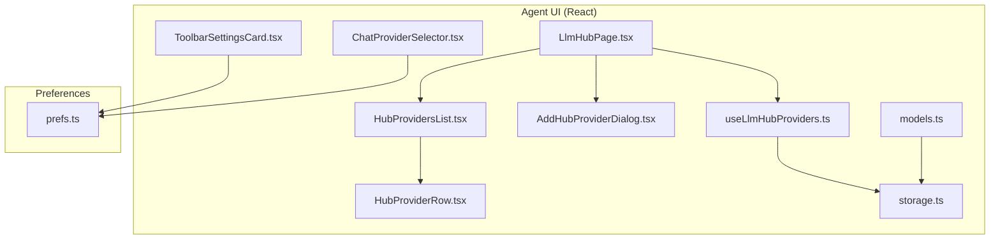
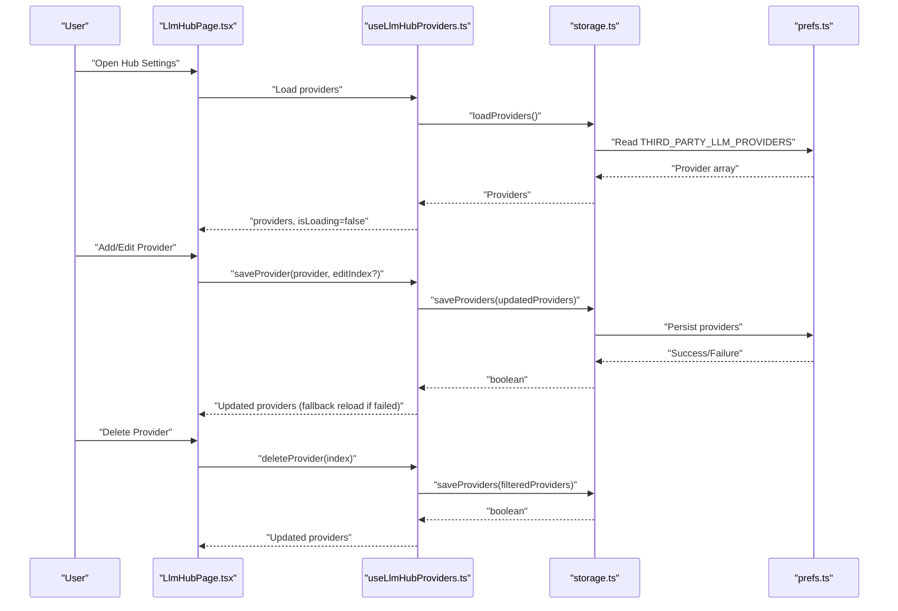
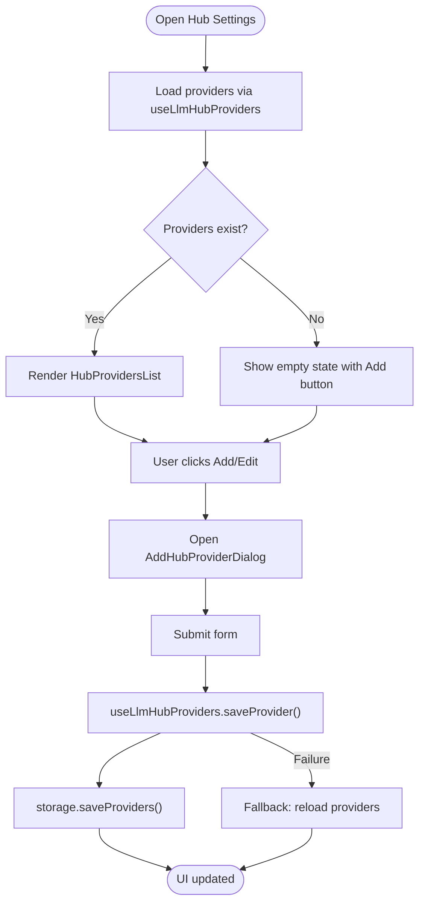
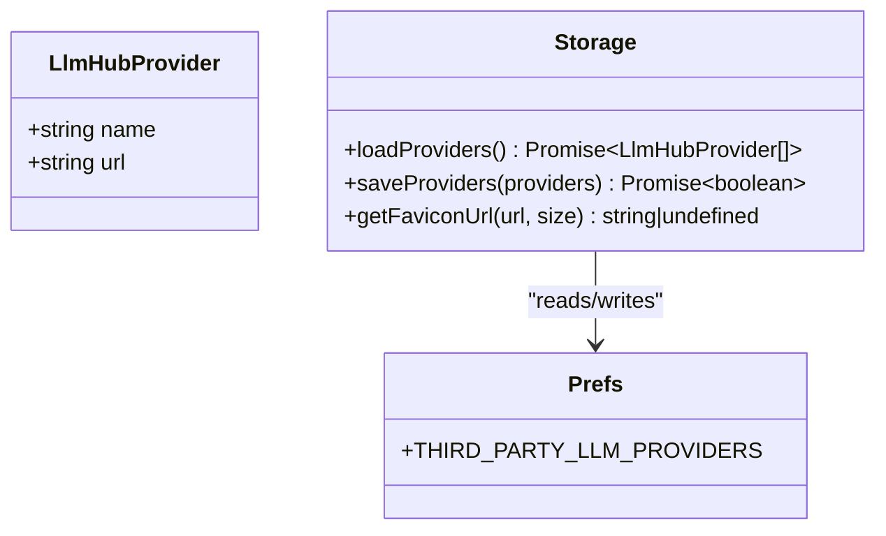
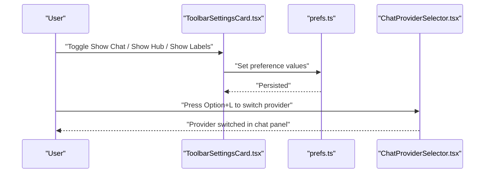
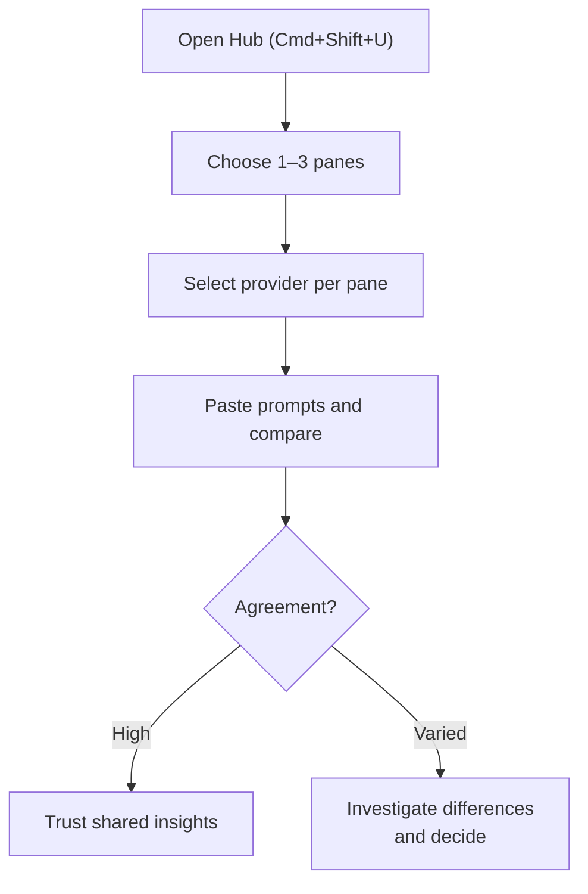
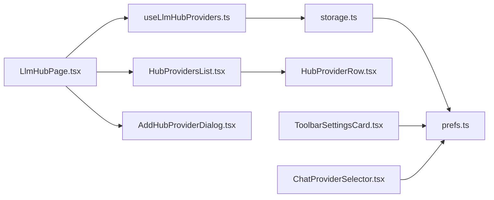

# LLM Chat Hub

<cite>
**Referenced Files in This Document**
- [README.md](file://README.md)
- [docs/features/llm-chat-hub.mdx](file://docs/features/llm-chat-hub.mdx)
- [docs/features/memory.mdx](file://docs/features/memory.mdx)
- [packages/browseros-agent/apps/agent/lib/llm-hub/storage.ts](file://packages/browseros-agent/apps/agent/lib/llm-hub/storage.ts)
- [packages/browseros-agent/apps/agent/lib/llm-hub/useLlmHubProviders.ts](file://packages/browseros-agent/apps/agent/lib/llm-hub/useLlmHubProviders.ts)
- [packages/browseros-agent/apps/agent/entrypoints/app/llm-hub/models.ts](file://packages/browseros-agent/apps/agent/entrypoints/app/llm-hub/models.ts)
- [packages/browseros-agent/apps/agent/entrypoints/app/llm-hub/LlmHubPage.tsx](file://packages/browseros-agent/apps/agent/entrypoints/app/llm-hub/LlmHubPage.tsx)
- [packages/browseros-agent/apps/agent/entrypoints/app/llm-hub/HubProvidersList.tsx](file://packages/browseros-agent/apps/agent/entrypoints/app/llm-hub/HubProvidersList.tsx)
- [packages/browseros-agent/apps/agent/entrypoints/app/llm-hub/AddHubProviderDialog.tsx](file://packages/browseros-agent/apps/agent/entrypoints/app/llm-hub/AddHubProviderDialog.tsx)
- [packages/browseros-agent/apps/agent/entrypoints/app/llm-hub/HubProviderRow.tsx](file://packages/browseros-agent/apps/agent/entrypoints/app/llm-hub/HubProviderRow.tsx)
- [packages/browseros-agent/apps/agent/lib/browseros/prefs.ts](file://packages/browseros-agent/apps/agent/lib/browseros/prefs.ts)
- [packages/browseros-agent/apps/agent/components/chat/ChatProviderSelector.tsx](file://packages/browseros-agent/apps/agent/components/chat/ChatProviderSelector.tsx)
- [packages/browseros-agent/apps/agent/components/chat/ChatProviderSelector.helpers.ts](file://packages/browseros-agent/apps/agent/components/chat/ChatProviderSelector.helpers.ts)
- [packages/browseros-agent/apps/agent/entrypoints/app/customization/ToolbarSettingsCard.tsx](file://packages/browseros-agent/apps/agent/entrypoints/app/customization/ToolbarSettingsCard.tsx)
</cite>

## Table of Contents
1. [Introduction](#introduction)
2. [Project Structure](#project-structure)
3. [Core Components](#core-components)
4. [Architecture Overview](#architecture-overview)
5. [Detailed Component Analysis](#detailed-component-analysis)
6. [Dependency Analysis](#dependency-analysis)
7. [Performance Considerations](#performance-considerations)
8. [Troubleshooting Guide](#troubleshooting-guide)
9. [Conclusion](#conclusion)
10. [Appendices](#appendices)

## Introduction
The LLM Chat Hub in BrowserOS provides a unified, multi-provider interface for side-by-side comparison of AI responses across multiple LLMs. It enables users to manage multiple AI conversations simultaneously, switch providers instantly, and compare outputs from providers such as Claude, ChatGPT, Gemini, OpenAI, Anthropic, Google Gemini, Ollama, and LM Studio. The Hub complements the broader LLM Hub feature that supports curated third-party provider URLs, while the Chat panel offers quick provider switching and contextual page features.

Key capabilities include:
- Unified provider management for third-party chat providers
- Multi-pane comparison interface for simultaneous queries
- Provider switching and keyboard shortcuts
- Persistent memory to maintain context across comparisons
- Customizable toolbar visibility and labels

## Project Structure
The LLM Chat Hub UI is implemented as part of the agent UI (React + WXT) inside the BrowserOS agent package. The relevant files include:
- Provider storage and hooks for persisted configuration
- UI pages and dialogs for adding/editing providers
- Provider row rendering and list display
- Preferences integration for toolbar visibility
- Chat provider selector for switching providers in the chat panel

**Diagram sources**
- [packages/browseros-agent/apps/agent/entrypoints/app/llm-hub/LlmHubPage.tsx:1-83](file://packages/browseros-agent/apps/agent/entrypoints/app/llm-hub/LlmHubPage.tsx#L1-L83)
- [packages/browseros-agent/apps/agent/entrypoints/app/llm-hub/HubProvidersList.tsx:1-41](file://packages/browseros-agent/apps/agent/entrypoints/app/llm-hub/HubProvidersList.tsx#L1-L41)
- [packages/browseros-agent/apps/agent/entrypoints/app/llm-hub/HubProviderRow.tsx:1-63](file://packages/browseros-agent/apps/agent/entrypoints/app/llm-hub/HubProviderRow.tsx#L1-L63)
- [packages/browseros-agent/apps/agent/entrypoints/app/llm-hub/AddHubProviderDialog.tsx:51-103](file://packages/browseros-agent/apps/agent/entrypoints/app/llm-hub/AddHubProviderDialog.tsx#L51-L103)
- [packages/browseros-agent/apps/agent/entrypoints/app/llm-hub/models.ts:1-5](file://packages/browseros-agent/apps/agent/entrypoints/app/llm-hub/models.ts#L1-L5)
- [packages/browseros-agent/apps/agent/lib/llm-hub/useLlmHubProviders.ts:1-42](file://packages/browseros-agent/apps/agent/lib/llm-hub/useLlmHubProviders.ts#L1-L42)
- [packages/browseros-agent/apps/agent/lib/llm-hub/storage.ts:1-50](file://packages/browseros-agent/apps/agent/lib/llm-hub/storage.ts#L1-L50)
- [packages/browseros-agent/apps/agent/lib/browseros/prefs.ts:1-17](file://packages/browseros-agent/apps/agent/lib/browseros/prefs.ts#L1-L17)
- [packages/browseros-agent/apps/agent/entrypoints/app/customization/ToolbarSettingsCard.tsx:1-110](file://packages/browseros-agent/apps/agent/entrypoints/app/customization/ToolbarSettingsCard.tsx#L1-L110)
- [packages/browseros-agent/apps/agent/components/chat/ChatProviderSelector.tsx](file://packages/browseros-agent/apps/agent/components/chat/ChatProviderSelector.tsx)

**Section sources**
- [README.md:44-62](file://README.md#L44-L62)
- [docs/features/llm-chat-hub.mdx:1-69](file://docs/features/llm-chat-hub.mdx#L1-L69)

## Core Components
- Provider storage and model
  - LlmHubProvider interface defines name and URL for third-party providers
  - Storage functions load and save providers using BrowserOS preferences
  - Favicon resolution utility generates favicons for provider URLs
- Provider management hook
  - useLlmHubProviders encapsulates loading, saving, and deleting providers
  - Handles optimistic UI updates and reload fallbacks on save failure
- UI pages and dialogs
  - LlmHubPage orchestrates provider list, add/edit dialog, and delete confirmation
  - HubProvidersList renders the list with loader and empty-state UX
  - AddHubProviderDialog manages form validation, normalization, and event tracking
  - HubProviderRow displays provider details with favicon and actions
- Preferences integration
  - prefs.ts centralizes preference keys for toolbar visibility and other settings
  - ToolbarSettingsCard toggles visibility of Chat and Hub buttons and toolbar labels
- Chat provider switching
  - ChatProviderSelector provides UI and helpers for cycling and selecting providers in the chat panel

**Section sources**
- [packages/browseros-agent/apps/agent/lib/llm-hub/storage.ts:1-50](file://packages/browseros-agent/apps/agent/lib/llm-hub/storage.ts#L1-L50)
- [packages/browseros-agent/apps/agent/lib/llm-hub/useLlmHubProviders.ts:1-42](file://packages/browseros-agent/apps/agent/lib/llm-hub/useLlmHubProviders.ts#L1-L42)
- [packages/browseros-agent/apps/agent/entrypoints/app/llm-hub/models.ts:1-5](file://packages/browseros-agent/apps/agent/entrypoints/app/llm-hub/models.ts#L1-L5)
- [packages/browseros-agent/apps/agent/entrypoints/app/llm-hub/LlmHubPage.tsx:1-83](file://packages/browseros-agent/apps/agent/entrypoints/app/llm-hub/LlmHubPage.tsx#L1-L83)
- [packages/browseros-agent/apps/agent/entrypoints/app/llm-hub/HubProvidersList.tsx:1-41](file://packages/browseros-agent/apps/agent/entrypoints/app/llm-hub/HubProvidersList.tsx#L1-L41)
- [packages/browseros-agent/apps/agent/entrypoints/app/llm-hub/AddHubProviderDialog.tsx:51-103](file://packages/browseros-agent/apps/agent/entrypoints/app/llm-hub/AddHubProviderDialog.tsx#L51-L103)
- [packages/browseros-agent/apps/agent/entrypoints/app/llm-hub/HubProviderRow.tsx:1-63](file://packages/browseros-agent/apps/agent/entrypoints/app/llm-hub/HubProviderRow.tsx#L1-L63)
- [packages/browseros-agent/apps/agent/lib/browseros/prefs.ts:1-17](file://packages/browseros-agent/apps/agent/lib/browseros/prefs.ts#L1-L17)
- [packages/browseros-agent/apps/agent/entrypoints/app/customization/ToolbarSettingsCard.tsx:1-110](file://packages/browseros-agent/apps/agent/entrypoints/app/customization/ToolbarSettingsCard.tsx#L1-L110)
- [packages/browseros-agent/apps/agent/components/chat/ChatProviderSelector.tsx](file://packages/browseros-agent/apps/agent/components/chat/ChatProviderSelector.tsx)

## Architecture Overview
The LLM Chat Hub architecture combines a preference-backed provider registry with a React UI for configuration and a chat panel for provider switching. The Hub page coordinates provider CRUD operations, while the chat panel provides quick switching among configured providers.

**Diagram sources**
- [packages/browseros-agent/apps/agent/entrypoints/app/llm-hub/LlmHubPage.tsx:1-83](file://packages/browseros-agent/apps/agent/entrypoints/app/llm-hub/LlmHubPage.tsx#L1-L83)
- [packages/browseros-agent/apps/agent/lib/llm-hub/useLlmHubProviders.ts:1-42](file://packages/browseros-agent/apps/agent/lib/llm-hub/useLlmHubProviders.ts#L1-L42)
- [packages/browseros-agent/apps/agent/lib/llm-hub/storage.ts:1-50](file://packages/browseros-agent/apps/agent/lib/llm-hub/storage.ts#L1-L50)
- [packages/browseros-agent/apps/agent/lib/browseros/prefs.ts:1-17](file://packages/browseros-agent/apps/agent/lib/browseros/prefs.ts#L1-L17)

## Detailed Component Analysis

### Provider Management UI
The Hub page composes the provider list, dialog, and delete confirmation flow. It delegates persistence to the provider hook and uses optimistic updates for responsive UX.

**Diagram sources**
- [packages/browseros-agent/apps/agent/entrypoints/app/llm-hub/LlmHubPage.tsx:1-83](file://packages/browseros-agent/apps/agent/entrypoints/app/llm-hub/LlmHubPage.tsx#L1-L83)
- [packages/browseros-agent/apps/agent/lib/llm-hub/useLlmHubProviders.ts:1-42](file://packages/browseros-agent/apps/agent/lib/llm-hub/useLlmHubProviders.ts#L1-L42)
- [packages/browseros-agent/apps/agent/entrypoints/app/llm-hub/AddHubProviderDialog.tsx:51-103](file://packages/browseros-agent/apps/agent/entrypoints/app/llm-hub/AddHubProviderDialog.tsx#L51-L103)
- [packages/browseros-agent/apps/agent/lib/llm-hub/storage.ts:1-50](file://packages/browseros-agent/apps/agent/lib/llm-hub/storage.ts#L1-L50)

**Section sources**
- [packages/browseros-agent/apps/agent/entrypoints/app/llm-hub/LlmHubPage.tsx:1-83](file://packages/browseros-agent/apps/agent/entrypoints/app/llm-hub/LlmHubPage.tsx#L1-L83)
- [packages/browseros-agent/apps/agent/entrypoints/app/llm-hub/HubProvidersList.tsx:1-41](file://packages/browseros-agent/apps/agent/entrypoints/app/llm-hub/HubProvidersList.tsx#L1-L41)
- [packages/browseros-agent/apps/agent/entrypoints/app/llm-hub/AddHubProviderDialog.tsx:51-103](file://packages/browseros-agent/apps/agent/entrypoints/app/llm-hub/AddHubProviderDialog.tsx#L51-L103)
- [packages/browseros-agent/apps/agent/entrypoints/app/llm-hub/HubProviderRow.tsx:1-63](file://packages/browseros-agent/apps/agent/entrypoints/app/llm-hub/HubProviderRow.tsx#L1-L63)

### Provider Storage and Model
The provider model and storage layer define the contract and persistence mechanism. The model supports arbitrary third-party provider URLs, and the storage layer persists them under a dedicated preference key.

**Diagram sources**
- [packages/browseros-agent/apps/agent/lib/llm-hub/storage.ts:1-50](file://packages/browseros-agent/apps/agent/lib/llm-hub/storage.ts#L1-L50)
- [packages/browseros-agent/apps/agent/lib/browseros/prefs.ts:1-17](file://packages/browseros-agent/apps/agent/lib/browseros/prefs.ts#L1-L17)

**Section sources**
- [packages/browseros-agent/apps/agent/lib/llm-hub/storage.ts:1-50](file://packages/browseros-agent/apps/agent/lib/llm-hub/storage.ts#L1-L50)
- [packages/browseros-agent/apps/agent/lib/browseros/prefs.ts:1-17](file://packages/browseros-agent/apps/agent/lib/browseros/prefs.ts#L1-L17)

### Chat Provider Switching
The chat panel allows instant provider switching and integrates with toolbar customization. Users can toggle visibility of the Chat and Hub buttons and choose whether to show labels.

**Diagram sources**
- [packages/browseros-agent/apps/agent/entrypoints/app/customization/ToolbarSettingsCard.tsx:1-110](file://packages/browseros-agent/apps/agent/entrypoints/app/customization/ToolbarSettingsCard.tsx#L1-L110)
- [packages/browseros-agent/apps/agent/lib/browseros/prefs.ts:1-17](file://packages/browseros-agent/apps/agent/lib/browseros/prefs.ts#L1-L17)
- [packages/browseros-agent/apps/agent/components/chat/ChatProviderSelector.tsx](file://packages/browseros-agent/apps/agent/components/chat/ChatProviderSelector.tsx)
- [packages/browseros-agent/apps/agent/components/chat/ChatProviderSelector.helpers.ts](file://packages/browseros-agent/apps/agent/components/chat/ChatProviderSelector.helpers.ts)

**Section sources**
- [docs/features/llm-chat-hub.mdx:16-69](file://docs/features/llm-chat-hub.mdx#L16-L69)
- [packages/browseros-agent/apps/agent/entrypoints/app/customization/ToolbarSettingsCard.tsx:1-110](file://packages/browseros-agent/apps/agent/entrypoints/app/customization/ToolbarSettingsCard.tsx#L1-L110)
- [packages/browseros-agent/apps/agent/components/chat/ChatProviderSelector.tsx](file://packages/browseros-agent/apps/agent/components/chat/ChatProviderSelector.tsx)

### Multi-Pane Comparison Workflow
The Hub enables side-by-side comparisons across multiple panes. Users select panes, choose providers per pane, and compare outputs. This “LLM council” approach helps identify agreement and divergence among providers.

**Diagram sources**
- [docs/features/llm-chat-hub.mdx:48-60](file://docs/features/llm-chat-hub.mdx#L48-L60)

**Section sources**
- [docs/features/llm-chat-hub.mdx:48-60](file://docs/features/llm-chat-hub.mdx#L48-L60)

## Dependency Analysis
The Hub’s dependencies center around preference-backed persistence and UI composition. The provider hook depends on storage, which in turn depends on the BrowserOS adapter and preference keys. The Hub page composes list, dialog, and confirmation components, while toolbar customization toggles visibility preferences.

**Diagram sources**
- [packages/browseros-agent/apps/agent/entrypoints/app/llm-hub/LlmHubPage.tsx:1-83](file://packages/browseros-agent/apps/agent/entrypoints/app/llm-hub/LlmHubPage.tsx#L1-L83)
- [packages/browseros-agent/apps/agent/lib/llm-hub/useLlmHubProviders.ts:1-42](file://packages/browseros-agent/apps/agent/lib/llm-hub/useLlmHubProviders.ts#L1-L42)
- [packages/browseros-agent/apps/agent/lib/llm-hub/storage.ts:1-50](file://packages/browseros-agent/apps/agent/lib/llm-hub/storage.ts#L1-L50)
- [packages/browseros-agent/apps/agent/lib/browseros/prefs.ts:1-17](file://packages/browseros-agent/apps/agent/lib/browseros/prefs.ts#L1-L17)
- [packages/browseros-agent/apps/agent/entrypoints/app/llm-hub/HubProvidersList.tsx:1-41](file://packages/browseros-agent/apps/agent/entrypoints/app/llm-hub/HubProvidersList.tsx#L1-L41)
- [packages/browseros-agent/apps/agent/entrypoints/app/llm-hub/HubProviderRow.tsx:1-63](file://packages/browseros-agent/apps/agent/entrypoints/app/llm-hub/HubProviderRow.tsx#L1-L63)
- [packages/browseros-agent/apps/agent/entrypoints/app/llm-hub/AddHubProviderDialog.tsx:51-103](file://packages/browseros-agent/apps/agent/entrypoints/app/llm-hub/AddHubProviderDialog.tsx#L51-L103)
- [packages/browseros-agent/apps/agent/entrypoints/app/customization/ToolbarSettingsCard.tsx:1-110](file://packages/browseros-agent/apps/agent/entrypoints/app/customization/ToolbarSettingsCard.tsx#L1-L110)
- [packages/browseros-agent/apps/agent/components/chat/ChatProviderSelector.tsx](file://packages/browseros-agent/apps/agent/components/chat/ChatProviderSelector.tsx)

**Section sources**
- [packages/browseros-agent/apps/agent/lib/llm-hub/storage.ts:1-50](file://packages/browseros-agent/apps/agent/lib/llm-hub/storage.ts#L1-L50)
- [packages/browseros-agent/apps/agent/lib/browseros/prefs.ts:1-17](file://packages/browseros-agent/apps/agent/lib/browseros/prefs.ts#L1-L17)

## Performance Considerations
- Minimize redundant loads: The provider hook loads once on mount and falls back to reload on save failures to avoid stale UI.
- Debounce or batch UI updates: When adding many providers, group updates to reduce re-renders.
- Favor optimistic UI: Update state immediately upon save and roll back on failure to keep the interface responsive.
- Network efficiency: Normalize URLs in the dialog to avoid duplicates and extra requests for favicons.
- Rendering cost: Memoize favicon computation in provider rows to avoid repeated URL parsing.

[No sources needed since this section provides general guidance]

## Troubleshooting Guide
- Providers not appearing
  - Verify the preference key for third-party providers contains the expected array.
  - Confirm the save operation succeeded; if not, the hook reloads providers to reflect persistence.
- Cannot add or edit provider
  - Ensure the URL is normalized (scheme and trailing slash handled in the dialog).
  - Reopen the dialog if submission fails; the form resets and the dialog closes.
- Deleting a provider fails
  - Retry the delete; the hook persists the updated list and reloads on failure.
- Toolbar buttons missing
  - Toggle “Show Chat Button” and “Show Hub Button” in customization settings.
  - Ensure “Show Button Labels” is enabled if labels are desired.
- Provider switching not working
  - Use the keyboard shortcut to cycle providers in the chat panel.
  - Confirm the provider is selected in each pane when using the Hub.

**Section sources**
- [packages/browseros-agent/apps/agent/lib/llm-hub/useLlmHubProviders.ts:1-42](file://packages/browseros-agent/apps/agent/lib/llm-hub/useLlmHubProviders.ts#L1-L42)
- [packages/browseros-agent/apps/agent/entrypoints/app/llm-hub/AddHubProviderDialog.tsx:51-103](file://packages/browseros-agent/apps/agent/entrypoints/app/llm-hub/AddHubProviderDialog.tsx#L51-L103)
- [packages/browseros-agent/apps/agent/entrypoints/app/customization/ToolbarSettingsCard.tsx:1-110](file://packages/browseros-agent/apps/agent/entrypoints/app/customization/ToolbarSettingsCard.tsx#L1-L110)
- [docs/features/llm-chat-hub.mdx:16-69](file://docs/features/llm-chat-hub.mdx#L16-L69)

## Conclusion
The LLM Chat Hub in BrowserOS delivers a practical, privacy-preserving solution for multi-provider AI comparison. It combines a preference-backed provider registry with a clean UI for configuration, a chat panel for quick provider switching, and a Hub for side-by-side comparisons. Together with persistent memory, users can maintain context across comparisons and make informed decisions by evaluating multiple AI perspectives.

[No sources needed since this section summarizes without analyzing specific files]

## Appendices

### Practical Examples and Decision-Making
- Example workflow: Compare pricing across providers for a product by pasting identical prompts into each pane and reviewing outputs.
- Decision technique: Identify consensus responses and investigate divergent answers to understand reasoning differences.
- Quality assessment: Evaluate completeness, clarity, and actionable insights; prefer providers that align with domain-specific expertise.

[No sources needed since this section provides general guidance]

### Configuration Options
- Provider selection
  - Third-party provider URLs managed in Hub settings
  - Chat panel provider switching via keyboard shortcut
- Response filtering
  - Use the chat panel’s copy and screenshot features to capture context for precise prompts
- Comparison metrics
  - Agreement rate, response length, and relevance to prompt
  - Manual scoring per pane for qualitative assessments

[No sources needed since this section provides general guidance]