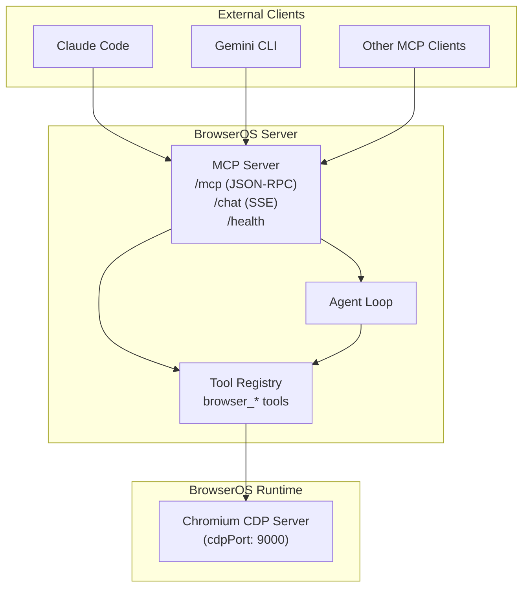
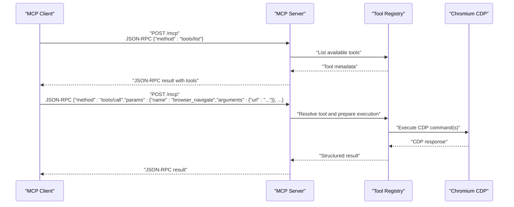
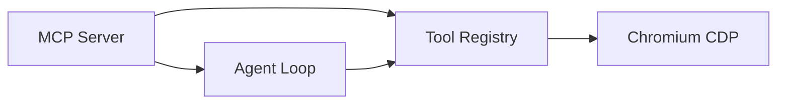
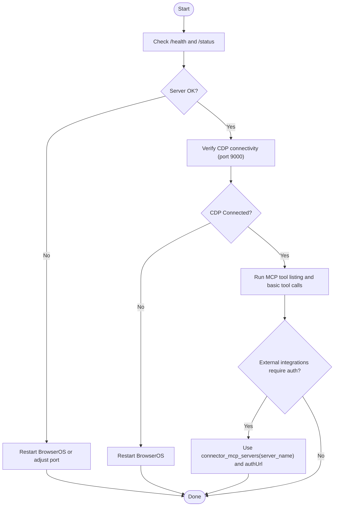

# MCP Server

<cite>
**Referenced Files in This Document**
- [README.md](file://README.md)
- [packages/browseros-agent/README.md](file://packages/browseros-agent/README.md)
- [packages/browseros-agent/scripts/dev/mcp-test.sh](file://packages/browseros-agent/scripts/dev/mcp-test.sh)
- [packages/browseros-agent/apps/server/tests/server.integration.test.ts](file://packages/browseros-agent/apps/server/tests/server.integration.test.ts)
- [packages/browseros-agent/apps/server/src/api/services/mcp/mcp-prompt.ts](file://packages/browseros-agent/apps/server/src/api/services/mcp/mcp-prompt.ts)
- [docs/features/connect-mcps.mdx](file://docs/features/connect-mcps.mdx)
- [docs/troubleshooting/mcp-server-restart.png](file://docs/troubleshooting/mcp-server-restart.png)
- [docs/images/enable-mcp-server.png](file://docs/images/enable-mcp-server.png)
- [docs/images/features--browseros-mcp-settings.png](file://docs/images/features--browseros-mcp-settings.png)
- [docs/images/mcp-click-on-settings-icon.png](file://docs/images/mcp-click-on-settings-icon.png)
- [docs/images/mcp-note-down-the-port.png](file://docs/images/mcp-note-down-the-port.png)
- [docs/images/changelog/0.39.0-sync-mcp.png](file://docs/images/changelog/0.39.0-sync-mcp.png)
- [docs/comparisons/chrome-devtools-mcp.mdx](file://docs/comparisons/chrome-devtools-mcp.mdx)
</cite>

## Table of Contents
1. [Introduction](#introduction)
2. [Project Structure](#project-structure)
3. [Core Components](#core-components)
4. [Architecture Overview](#architecture-overview)
5. [Detailed Component Analysis](#detailed-component-analysis)
6. [Dependency Analysis](#dependency-analysis)
7. [Performance Considerations](#performance-considerations)
8. [Troubleshooting Guide](#troubleshooting-guide)
9. [Conclusion](#conclusion)
10. [Appendices](#appendices)

## Introduction
This document explains the MCP Server functionality in BrowserOS, focusing on how it enables external Model Context Protocol (MCP) clients (such as Claude Code, Gemini CLI, or any compliant client) to control the browser environment. It covers the gateway architecture that translates MCP requests into browser automation commands, the Chrome DevTools Protocol (CDP) backend integration for low-level browser control, and the tool registry system that exposes browser automation capabilities as MCP tools. Practical examples demonstrate connecting external clients, defining custom tools, and extending MCP functionality. The document also outlines protocol specifications, authentication mechanisms, security considerations, common integration scenarios, debugging MCP connections, and performance optimization for remote agent control.

## Project Structure
BrowserOS is a monorepo with two main subsystems:
- Browser (Chromium fork): Provides the browser runtime and CDP server.
- Agent Platform (TypeScript/Go): Includes the MCP server, agent UI, CLI, and evaluation framework.

Key locations for MCP Server:
- Agent Platform: packages/browseros-agent
  - apps/server: Bun server exposing MCP tools and running the agent loop
  - packages/cdp-protocol: Type-safe CDP bindings used by the server
  - packages/shared: Shared constants (ports, timeouts, limits)
  - apps/agent: Browser extension UI (WXT + React)
  - apps/cli: Go CLI for controlling BrowserOS from the terminal or AI coding agents
  - apps/eval: Benchmark framework (WebVoyager, Mind2Web)

Ports:
- Server HTTP (MCP, chat, health): 9100 (BROWSEROS_SERVER_PORT)
- CDP server (BrowserOS runs Chromium with CDP): 9000 (BROWSEROS_CDP_PORT)
- Legacy extension port: 9300 (kept for compatibility)

Development and production environment variables are defined in the agent platform README, including analytics and observability keys.

**Section sources**
- [README.md:144-190](file://README.md#L144-L190)
- [packages/browseros-agent/README.md:28-188](file://packages/browseros-agent/README.md#L28-L188)

## Core Components
- MCP Server (HTTP + SSE): Exposes MCP endpoints for tool discovery and invocation, plus agent chat streaming and health/status endpoints.
- Tool Registry: A collection of browser automation tools backed by CDP, including navigation, tab management, input, screenshots, bookmarks, history, console, DOM queries, and window management.
- CDP Backend: Connects to the Chromium CDP server (running inside BrowserOS) to execute low-level browser actions.
- Agent Loop: Orchestrates tool execution, observation, and verification cycles.
- CLI and Agent UI: Provide complementary control surfaces and integration points.

Practical examples:
- Listing tools and invoking browser automation tools via HTTP POST to the /mcp endpoint.
- Using a shell script to exercise the MCP server and observe responses.
- Integration tests validating health, status, and tool listing.

**Section sources**
- [packages/browseros-agent/README.md:28-188](file://packages/browseros-agent/README.md#L28-L188)
- [packages/browseros-agent/scripts/dev/mcp-test.sh:1-143](file://packages/browseros-agent/scripts/dev/mcp-test.sh#L1-L143)
- [packages/browseros-agent/apps/server/tests/server.integration.test.ts:43-91](file://packages/browseros-agent/apps/server/tests/server.integration.test.ts#L43-L91)

## Architecture Overview
The MCP Server acts as a gateway translating JSON-RPC-based MCP requests into CDP commands executed against the embedded Chromium instance. External clients (e.g., Claude Code, Gemini CLI) communicate over HTTP/SSE to the server’s /mcp endpoint. The server maintains a tool registry of browser automation capabilities and routes tool invocations to the CDP backend.

**Diagram sources**
- [packages/browseros-agent/README.md:34-62](file://packages/browseros-agent/README.md#L34-L62)
- [packages/browseros-agent/README.md:64-71](file://packages/browseros-agent/README.md#L64-L71)

**Section sources**
- [packages/browseros-agent/README.md:34-62](file://packages/browseros-agent/README.md#L34-L62)
- [packages/browseros-agent/README.md:64-71](file://packages/browseros-agent/README.md#L64-L71)

## Detailed Component Analysis

### MCP Endpoint and Tool Registry
- Endpoint: POST /mcp with JSON-RPC payload supporting methods like tools/list and tools/call.
- Tool Discovery: clients call tools/list to enumerate available browser automation tools.
- Tool Invocation: clients call tools/call with a tool name (e.g., browser_get_active_tab, browser_navigate, browser_list_tabs) and arguments.
- Example usage is demonstrated in the test script and integration tests.

**Diagram sources**
- [packages/browseros-agent/scripts/dev/mcp-test.sh:13-143](file://packages/browseros-agent/scripts/dev/mcp-test.sh#L13-L143)
- [packages/browseros-agent/apps/server/tests/server.integration.test.ts:86-91](file://packages/browseros-agent/apps/server/tests/server.integration.test.ts#L86-L91)

**Section sources**
- [packages/browseros-agent/scripts/dev/mcp-test.sh:13-143](file://packages/browseros-agent/scripts/dev/mcp-test.sh#L13-L143)
- [packages/browseros-agent/apps/server/tests/server.integration.test.ts:86-91](file://packages/browseros-agent/apps/server/tests/server.integration.test.ts#L86-L91)

### Health and Status Endpoints
- /health responds with 200 OK and a status payload indicating server health.
- /status responds with 200 OK and a payload indicating whether CDP is connected.

These endpoints are useful for monitoring and automated checks during integration.

**Section sources**
- [packages/browseros-agent/apps/server/tests/server.integration.test.ts:62-84](file://packages/browseros-agent/apps/server/tests/server.integration.test.ts#L62-L84)

### MCP Instructions and Best Practices
The MCP instructions define the recommended observation-act-verify cycle and guidance for handling obstacles and errors. They emphasize taking snapshots before interacting, using element IDs returned by snapshots, and re-snapshotting after navigation.

**Section sources**
- [packages/browseros-agent/apps/server/src/api/services/mcp/mcp-prompt.ts:1-33](file://packages/browseros-agent/apps/server/src/api/services/mcp/mcp-prompt.ts#L1-L33)

### External Integrations (Klavis Strata)
Beyond browser automation, the MCP server supports external service integrations (e.g., Gmail, Slack, GitHub, Notion, Google Calendar, Jira, Linear, Figma, Salesforce). Before using these integrations, clients should verify service connectivity via connector_mcp_servers(server_name) and follow the returned authUrl if authentication is required.

**Section sources**
- [packages/browseros-agent/apps/server/src/api/services/mcp/mcp-prompt.ts:26-33](file://packages/browseros-agent/apps/server/src/api/services/mcp/mcp-prompt.ts#L26-L33)

### Practical Examples

- Connecting an external client:
  - Configure the client to target the BrowserOS MCP server at http://127.0.0.1:9100/mcp.
  - Use JSON-RPC over HTTP with Accept: application/json, text/event-stream for streaming responses.

- Defining custom tools:
  - Extend the tool registry with new browser automation capabilities backed by CDP.
  - Ensure tool names follow the browser_* convention and return structured results consumable by clients.

- Extending MCP functionality:
  - Add new endpoints (e.g., /mcp-custom) or augment existing ones with additional capabilities.
  - Integrate with external services by adding connectors and ensuring proper authentication flows.

**Section sources**
- [packages/browseros-agent/scripts/dev/mcp-test.sh:13-143](file://packages/browseros-agent/scripts/dev/mcp-test.sh#L13-L143)
- [packages/browseros-agent/README.md:28-188](file://packages/browseros-agent/README.md#L28-L188)

## Dependency Analysis
- MCP Server depends on:
  - Tool Registry: Provides browser automation tools.
  - Agent Loop: Coordinates tool execution and verification.
  - CDP Backend: Executes low-level browser commands.
- Ports and environment variables:
  - BROWSEROS_SERVER_PORT (default 9100) for MCP/health/chat.
  - BROWSEROS_CDP_PORT (default 9000) for Chromium CDP server.
  - Analytics and observability keys (PostHog, Sentry) configured via environment variables.

**Diagram sources**
- [packages/browseros-agent/README.md:64-71](file://packages/browseros-agent/README.md#L64-L71)

**Section sources**
- [packages/browseros-agent/README.md:64-71](file://packages/browseros-agent/README.md#L64-L71)

## Performance Considerations
- Minimize unnecessary snapshots and re-snapshots to reduce DOM traversal overhead.
- Batch tool invocations where possible to reduce round-trips.
- Use streaming responses (SSE) for long-running operations to improve responsiveness.
- Monitor CDP connection health and reconnect if disconnected.
- Tune timeouts and retries for network-bound operations.

## Troubleshooting Guide
Common issues and resolutions:
- MCP server not reachable:
  - Verify the server is running and listening on the configured port (default 9100).
  - Confirm firewall and network settings allow inbound connections.
- CDP connection failures:
  - Ensure the Chromium instance is running and the CDP server is accessible on port 9000.
  - Restart the BrowserOS process if CDP disconnects.
- Authentication and external integrations:
  - Use connector_mcp_servers(server_name) to verify service connectivity.
  - Follow the returned authUrl to authenticate and retry verification.
- Debugging MCP connections:
  - Use the provided shell script to list tools and invoke basic browser automation commands.
  - Check /health and /status endpoints for quick diagnostics.

**Section sources**
- [packages/browseros-agent/apps/server/tests/server.integration.test.ts:62-84](file://packages/browseros-agent/apps/server/tests/server.integration.test.ts#L62-L84)
- [packages/browseros-agent/scripts/dev/mcp-test.sh:13-143](file://packages/browseros-agent/scripts/dev/mcp-test.sh#L13-L143)
- [packages/browseros-agent/apps/server/src/api/services/mcp/mcp-prompt.ts:26-33](file://packages/browseros-agent/apps/server/src/api/services/mcp/mcp-prompt.ts#L26-L33)

## Conclusion
The MCP Server in BrowserOS provides a robust gateway for external clients to control the browser environment through a standardized protocol. By leveraging a rich tool registry backed by CDP, it enables precise browser automation and integrates with external services. Following the recommended observation-act-verify cycle, using the provided endpoints and scripts, and adhering to the troubleshooting steps ensures reliable integration and operation.

## Appendices

### Protocol Specifications
- Endpoint: POST /mcp
- Content-Type: application/json
- Accept: application/json, text/event-stream (for streaming)
- Methods:
  - tools/list: Enumerate available tools
  - tools/call: Invoke a tool by name with arguments

Example payloads and responses are demonstrated in the test script and integration tests.

**Section sources**
- [packages/browseros-agent/scripts/dev/mcp-test.sh:13-143](file://packages/browseros-agent/scripts/dev/mcp-test.sh#L13-L143)
- [packages/browseros-agent/apps/server/tests/server.integration.test.ts:86-91](file://packages/browseros-agent/apps/server/tests/server.integration.test.ts#L86-L91)

### Authentication Mechanisms and Security Considerations
- Authentication for external integrations:
  - Use connector_mcp_servers(server_name) to verify service connectivity.
  - Follow the returned authUrl to authenticate and confirm connectivity.
- Security:
  - Restrict access to the MCP server port (default 9100) to trusted networks.
  - Prefer local connections (127.0.0.1) when possible.
  - Monitor and log MCP activity for auditing.
  - Keep BrowserOS updated to benefit from security patches.

**Section sources**
- [packages/browseros-agent/apps/server/src/api/services/mcp/mcp-prompt.ts:26-33](file://packages/browseros-agent/apps/server/src/api/services/mcp/mcp-prompt.ts#L26-L33)

### Common Integration Scenarios
- Control BrowserOS from Claude Code or Gemini CLI:
  - Configure the client to point to http://127.0.0.1:9100/mcp.
  - Use tools/list to discover capabilities and tools/call to execute actions.
- Automate research workflows:
  - Navigate to sources, extract content, and integrate with external services for saving or reporting.
- Build reusable tools:
  - Encapsulate sequences of browser actions into custom tools for repeated use.

**Section sources**
- [packages/browseros-agent/README.md:28-188](file://packages/browseros-agent/README.md#L28-L188)
- [docs/features/connect-mcps.mdx](file://docs/features/connect-mcps.mdx)

### Additional Resources
- MCP Server enablement and settings screenshots:
  - Enable MCP server, locate settings icon, note the port.
- MCP server restart guidance:
  - Troubleshooting image for restarting the MCP server.

**Section sources**
- [docs/images/enable-mcp-server.png](file://docs/images/enable-mcp-server.png)
- [docs/images/mcp-click-on-settings-icon.png](file://docs/images/mcp-click-on-settings-icon.png)
- [docs/images/mcp-note-down-the-port.png](file://docs/images/mcp-note-down-the-port.png)
- [docs/troubleshooting/mcp-server-restart.png](file://docs/troubleshooting/mcp-server-restart.png)
- [docs/images/changelog/0.39.0-sync-mcp.png](file://docs/images/changelog/0.39.0-sync-mcp.png)