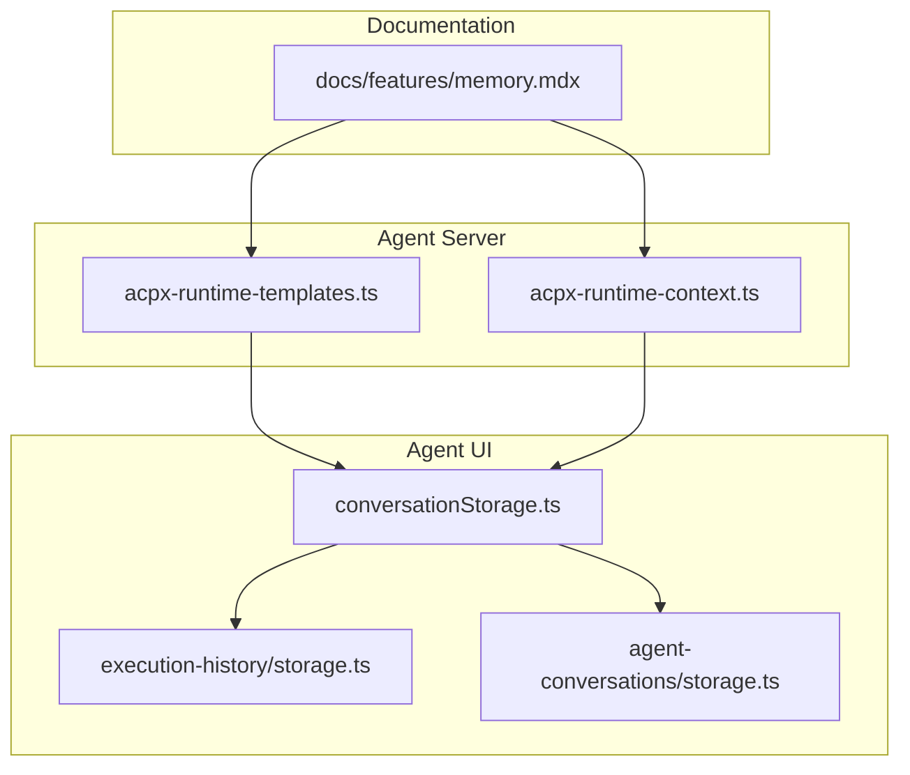
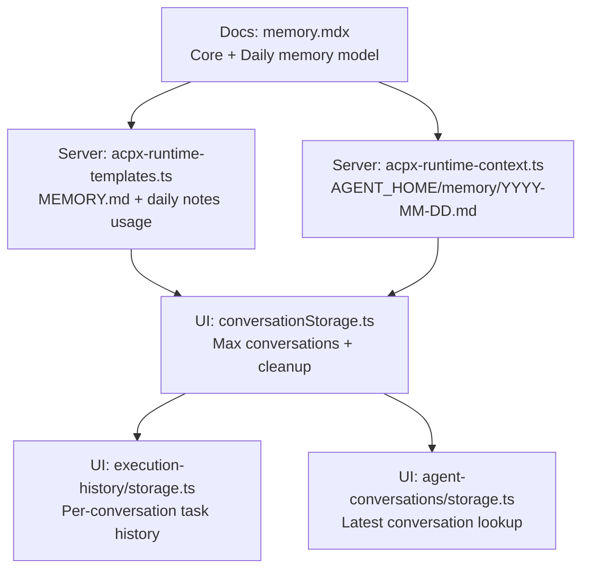
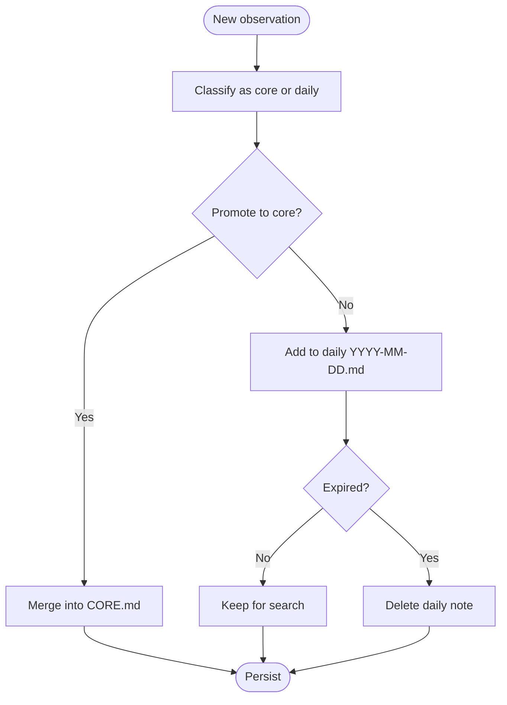
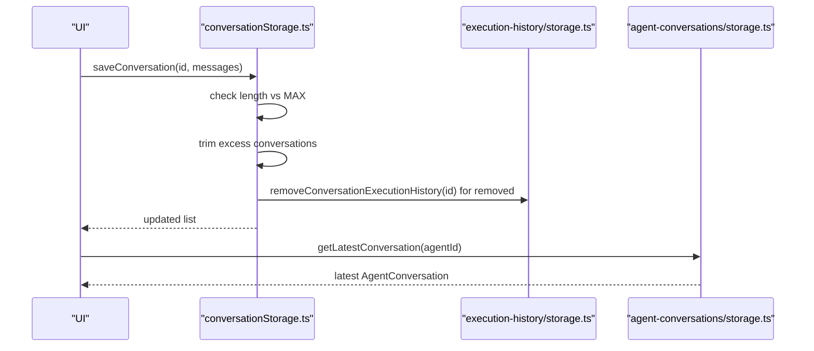
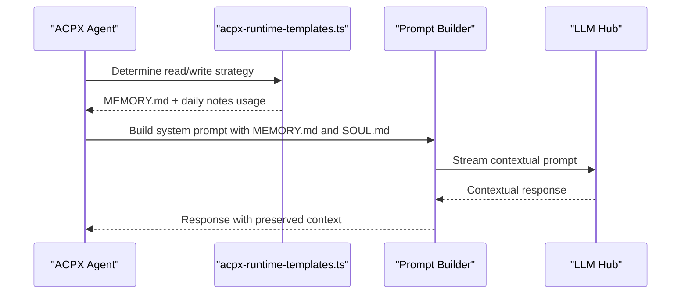
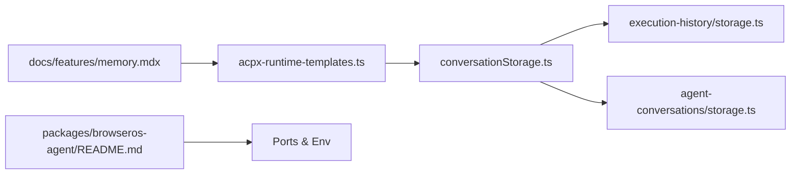

# Memory System

<cite>
**Referenced Files in This Document**
- [memory.mdx](file://docs/features/memory.mdx)
- [acpx-runtime-templates.ts](file://packages/browseros-agent/apps/server/src/lib/agents/acpx-runtime-templates.ts)
- [acpx-runtime-context.ts](file://packages/browseros-agent/apps/server/src/lib/agents/acpx-runtime-context.ts)
- [storage.ts](file://packages/browseros-agent/apps/agent/lib/execution-history/storage.ts)
- [storage.ts](file://packages/browseros-agent/apps/agent/lib/conversations/conversationStorage.ts)
- [storage.ts](file://packages/browseros-agent/apps/agent/lib/agent-conversations/storage.ts)
- [prompt.test.ts](file://packages/browseros-agent/apps/server/tests/agent/prompt.test.ts)
- [README.md](file://packages/browseros-agent/README.md)
</cite>

## Table of Contents
1. [Introduction](#introduction)
2. [Project Structure](#project-structure)
3. [Core Components](#core-components)
4. [Architecture Overview](#architecture-overview)
5. [Detailed Component Analysis](#detailed-component-analysis)
6. [Dependency Analysis](#dependency-analysis)
7. [Performance Considerations](#performance-considerations)
8. [Troubleshooting Guide](#troubleshooting-guide)
9. [Conclusion](#conclusion)
10. [Appendices](#appendices)

## Introduction
This document explains BrowserOS’s Memory System with a focus on context preservation and conversation history management. It covers how memory persists across conversations, maintains context for complex multi-step tasks, and enables intelligent session continuation. It documents the memory storage architecture, data structures used for context retention, integration with workflows and LLM interactions, pruning strategies, storage optimization, privacy controls, and practical examples such as maintaining research context and preserving workflow state. It also outlines configuration options for retention periods, storage limits, and cleanup policies, and describes the relationship between memory and the LLM hub for contextual AI responses.

## Project Structure
The Memory System spans documentation and implementation across the BrowserOS documentation and the agent server and UI packages. The documentation defines the conceptual memory model (core memory and daily notes), while the agent server and UI implement persistence, pruning, and integration with LLM prompts and workflows.

**Diagram sources**
- [memory.mdx:1-129](file://docs/features/memory.mdx#L1-L129)
- [acpx-runtime-templates.ts:44-134](file://packages/browseros-agent/apps/server/src/lib/agents/acpx-runtime-templates.ts#L44-L134)
- [acpx-runtime-context.ts:133-143](file://packages/browseros-agent/apps/server/src/lib/agents/acpx-runtime-context.ts#L133-L143)
- [conversationStorage.ts:1-96](file://packages/browseros-agent/apps/agent/lib/conversations/conversationStorage.ts#L1-L96)
- [execution-history/storage.ts:52-146](file://packages/browseros-agent/apps/agent/lib/execution-history/storage.ts#L52-L146)
- [agent-conversations/storage.ts:1-31](file://packages/browseros-agent/apps/agent/lib/agent-conversations/storage.ts#L1-L31)

**Section sources**
- [memory.mdx:1-129](file://docs/features/memory.mdx#L1-L129)
- [acpx-runtime-templates.ts:44-134](file://packages/browseros-agent/apps/server/src/lib/agents/acpx-runtime-templates.ts#L44-L134)
- [acpx-runtime-context.ts:133-143](file://packages/browseros-agent/apps/server/src/lib/agents/acpx-runtime-context.ts#L133-L143)
- [conversationStorage.ts:1-96](file://packages/browseros-agent/apps/agent/lib/conversations/conversationStorage.ts#L1-L96)
- [execution-history/storage.ts:52-146](file://packages/browseros-agent/apps/agent/lib/execution-history/storage.ts#L52-L146)
- [agent-conversations/storage.ts:1-31](file://packages/browseros-agent/apps/agent/lib/agent-conversations/storage.ts#L1-L31)

## Core Components
- Two-tier memory model:
  - Core memory: permanent facts (stored in a single file) that persist across sessions and are never automatically deleted.
  - Daily memory: session notes and recent events (stored in dated files) that auto-expire after a period and can be promoted to core memory.
- Conversation history and execution tracking:
  - Per-conversation execution history is persisted and pruned when conversations are removed.
  - UI-level conversation storage enforces a cap on the number of stored conversations and triggers cleanup of associated execution history.
- LLM integration:
  - Runtime templates define how agents read and write memory, including promotion rules and daily note usage.
  - Prompt tests confirm that memory and identity tools are not advertised in regular mode, but SOUL content is appended to prompts.

**Section sources**
- [memory.mdx:27-128](file://docs/features/memory.mdx#L27-L128)
- [acpx-runtime-templates.ts:44-134](file://packages/browseros-agent/apps/server/src/lib/agents/acpx-runtime-templates.ts#L44-L134)
- [prompt.test.ts:648-678](file://packages/browseros-agent/apps/server/tests/agent/prompt.test.ts#L648-L678)
- [conversationStorage.ts:8-96](file://packages/browseros-agent/apps/agent/lib/conversations/conversationStorage.ts#L8-L96)
- [execution-history/storage.ts:52-146](file://packages/browseros-agent/apps/agent/lib/execution-history/storage.ts#L52-L146)

## Architecture Overview
The Memory System integrates three layers:
- Conceptual memory model (documentation) defines core and daily memory semantics.
- Server runtime templates define how agents read/write memory and daily notes.
- UI storage manages conversation lifecycle, execution history, and pruning.

**Diagram sources**
- [memory.mdx:27-128](file://docs/features/memory.mdx#L27-L128)
- [acpx-runtime-templates.ts:44-134](file://packages/browseros-agent/apps/server/src/lib/agents/acpx-runtime-templates.ts#L44-L134)
- [acpx-runtime-context.ts:133-143](file://packages/browseros-agent/apps/server/src/lib/agents/acpx-runtime-context.ts#L133-L143)
- [conversationStorage.ts:1-96](file://packages/browseros-agent/apps/agent/lib/conversations/conversationStorage.ts#L1-L96)
- [execution-history/storage.ts:52-146](file://packages/browseros-agent/apps/agent/lib/execution-history/storage.ts#L52-L146)
- [agent-conversations/storage.ts:1-31](file://packages/browseros-agent/apps/agent/lib/agent-conversations/storage.ts#L1-L31)

## Detailed Component Analysis

### Memory Model and Pruning Strategy
- Core memory:
  - Single-file persistence for durable facts.
  - New facts are merged into existing core memory and saved.
- Daily memory:
  - Dated files per day for session notes and candidate memories.
  - Automatic expiration after a retention period.
  - Promotion rules move stable patterns to core memory.
- Pruning:
  - Expiration deletes daily notes after retention period.
  - Promotion removes transient entries from daily notes and writes to core memory.

**Diagram sources**
- [memory.mdx:31-55](file://docs/features/memory.mdx#L31-L55)
- [acpx-runtime-templates.ts:44-134](file://packages/browseros-agent/apps/server/src/lib/agents/acpx-runtime-templates.ts#L44-L134)

**Section sources**
- [memory.mdx:27-128](file://docs/features/memory.mdx#L27-L128)
- [acpx-runtime-templates.ts:44-134](file://packages/browseros-agent/apps/server/src/lib/agents/acpx-runtime-templates.ts#L44-L134)

### Conversation History Persistence and Cleanup
- Per-conversation execution history:
  - Upsert tasks into conversation history.
  - Retrieve, watch, and remove conversation execution history.
- UI conversation storage:
  - Enforces a maximum number of stored conversations.
  - On adding a new conversation beyond the limit, older ones are trimmed.
  - Removal of a conversation triggers removal of its execution history.
- Latest conversation retrieval:
  - IndexedDB-backed storage keyed by agent and session.

**Diagram sources**
- [conversationStorage.ts:49-84](file://packages/browseros-agent/apps/agent/lib/conversations/conversationStorage.ts#L49-L84)
- [execution-history/storage.ts:75-110](file://packages/browseros-agent/apps/agent/lib/execution-history/storage.ts#L75-L110)
- [agent-conversations/storage.ts:10-24](file://packages/browseros-agent/apps/agent/lib/agent-conversations/storage.ts#L10-L24)

**Section sources**
- [execution-history/storage.ts:52-146](file://packages/browseros-agent/apps/agent/lib/execution-history/storage.ts#L52-L146)
- [conversationStorage.ts:1-96](file://packages/browseros-agent/apps/agent/lib/conversations/conversationStorage.ts#L1-L96)
- [agent-conversations/storage.ts:1-31](file://packages/browseros-agent/apps/agent/lib/agent-conversations/storage.ts#L1-L31)

### LLM Hub Integration and Contextual Responses
- Runtime templates specify:
  - Read MEMORY.md for durable context.
  - Search daily notes when MEMORY.md is insufficient.
  - Write and promote only stable patterns.
- Prompt tests confirm:
  - Memory and identity tools are not advertised in regular mode.
  - SOUL content is appended to prompts without exposing soul tools.

**Diagram sources**
- [acpx-runtime-templates.ts:35-41](file://packages/browseros-agent/apps/server/src/lib/agents/acpx-runtime-templates.ts#L35-L41)
- [acpx-runtime-templates.ts:110-114](file://packages/browseros-agent/apps/server/src/lib/agents/acpx-runtime-templates.ts#L110-L114)
- [prompt.test.ts:655-678](file://packages/browseros-agent/apps/server/tests/agent/prompt.test.ts#L655-L678)

**Section sources**
- [acpx-runtime-templates.ts:35-41](file://packages/browseros-agent/apps/server/src/lib/agents/acpx-runtime-templates.ts#L35-L41)
- [acpx-runtime-templates.ts:110-114](file://packages/browseros-agent/apps/server/src/lib/agents/acpx-runtime-templates.ts#L110-L114)
- [prompt.test.ts:655-678](file://packages/browseros-agent/apps/server/tests/agent/prompt.test.ts#L655-L678)

### Practical Examples
- Maintaining research context:
  - Daily notes capture findings and links; stable insights are promoted to core memory for future sessions.
- Preserving workflow state:
  - Execution history tracks tasks per conversation; trimming and cleanup preserve recent workflows while limiting storage.
- Enabling seamless conversation flow:
  - Latest conversation retrieval and continuous context from MEMORY.md improve continuity across turns.

**Section sources**
- [memory.mdx:57-86](file://docs/features/memory.mdx#L57-L86)
- [acpx-runtime-templates.ts:110-114](file://packages/browseros-agent/apps/server/src/lib/agents/acpx-runtime-templates.ts#L110-L114)
- [conversationStorage.ts:10-24](file://packages/browseros-agent/apps/agent/lib/conversations/conversationStorage.ts#L10-L24)

## Dependency Analysis
- Documentation drives server templates:
  - The conceptual memory model informs runtime behavior and daily note usage.
- Server templates drive UI storage:
  - Read/write rules influence how the UI persists and prunes conversations and execution history.
- Ports and environment:
  - The agent server exposes MCP endpoints and chat streaming, integrating with the UI and external tools.

**Diagram sources**
- [memory.mdx:1-129](file://docs/features/memory.mdx#L1-L129)
- [acpx-runtime-templates.ts:44-134](file://packages/browseros-agent/apps/server/src/lib/agents/acpx-runtime-templates.ts#L44-L134)
- [conversationStorage.ts:1-96](file://packages/browseros-agent/apps/agent/lib/conversations/conversationStorage.ts#L1-L96)
- [execution-history/storage.ts:52-146](file://packages/browseros-agent/apps/agent/lib/execution-history/storage.ts#L52-L146)
- [agent-conversations/storage.ts:1-31](file://packages/browseros-agent/apps/agent/lib/agent-conversations/storage.ts#L1-L31)
- [README.md:64-71](file://packages/browseros-agent/README.md#L64-L71)

**Section sources**
- [README.md:64-71](file://packages/browseros-agent/README.md#L64-L71)

## Performance Considerations
- Storage limits:
  - UI conversation storage caps the number of stored conversations to control memory footprint.
- Pruning:
  - Daily notes auto-expire after a retention period to prevent indefinite growth.
  - Promotion reduces daily note volume by moving stable facts to core memory.
- Efficient retrieval:
  - Latest conversation lookup uses indexed keys to minimize scans.
- Streaming and caching:
  - Prompt building appends SOUL content without exposing retired tools, reducing overhead.

[No sources needed since this section provides general guidance]

## Troubleshooting Guide
- Memory not persisting across sessions:
  - Verify core memory file exists and is not corrupted.
  - Confirm daily note retention period and promotion rules are functioning.
- Excessive disk usage:
  - Check conversation count against the maximum limit and prune old conversations.
  - Review daily notes for unnecessary entries and promote stable facts to core memory.
- LLM context missing:
  - Ensure MEMORY.md and daily notes are present under the agent home path.
  - Confirm that prompts append SOUL content and do not advertise retired memory tools.
- Conversation history not cleaned up:
  - Validate removal of execution history when conversations are deleted.
  - Confirm that latest conversation retrieval returns the intended session.

**Section sources**
- [memory.mdx:88-128](file://docs/features/memory.mdx#L88-L128)
- [conversationStorage.ts:43-84](file://packages/browseros-agent/apps/agent/lib/conversations/conversationStorage.ts#L43-L84)
- [execution-history/storage.ts:75-110](file://packages/browseros-agent/apps/agent/lib/execution-history/storage.ts#L75-L110)
- [prompt.test.ts:655-678](file://packages/browseros-agent/apps/server/tests/agent/prompt.test.ts#L655-L678)

## Conclusion
BrowserOS’s Memory System combines a two-tier conceptual model with robust UI and server implementations to preserve context across conversations, support complex workflows, and enable intelligent session continuation. Core memory ensures durable facts remain available, while daily notes capture transient context with automatic pruning. The system integrates with LLM prompts via runtime templates and maintains privacy by keeping memory files local. With configurable limits and cleanup policies, it balances continuity and performance for large conversation histories.

[No sources needed since this section summarizes without analyzing specific files]

## Appendices

### Configuration Options and Policies
- Retention periods:
  - Daily notes auto-expire after a defined period; promote stable facts to core memory.
- Storage limits:
  - Maximum number of stored conversations enforced in UI storage.
- Cleanup policies:
  - Removal of conversations triggers deletion of associated execution history.
  - Latest conversation retrieval uses indexed keys for efficient access.

**Section sources**
- [memory.mdx:16-18](file://docs/features/memory.mdx#L16-L18)
- [memory.mdx:49-49](file://docs/features/memory.mdx#L49-L49)
- [conversationStorage.ts:8-8](file://packages/browseros-agent/apps/agent/lib/conversations/conversationStorage.ts#L8-L8)
- [conversationStorage.ts:74-74](file://packages/browseros-agent/apps/agent/lib/conversations/conversationStorage.ts#L74-L74)
- [execution-history/storage.ts:75-82](file://packages/browseros-agent/apps/agent/lib/execution-history/storage.ts#L75-L82)
- [agent-conversations/storage.ts:10-24](file://packages/browseros-agent/apps/agent/lib/agent-conversations/storage.ts#L10-L24)