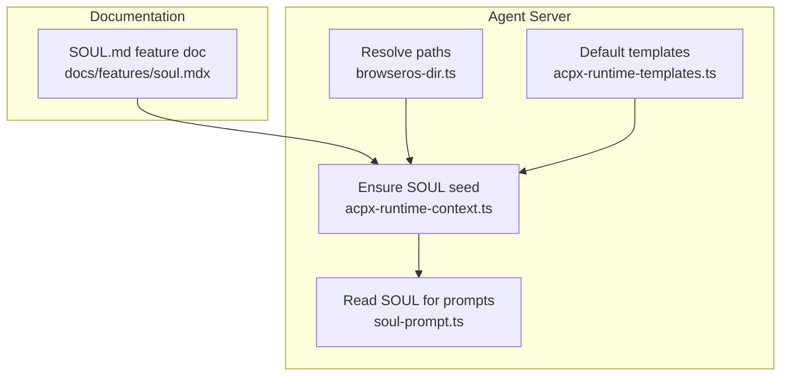
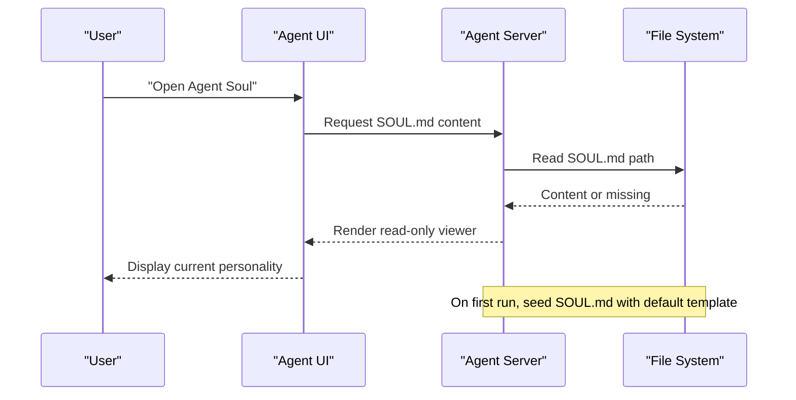
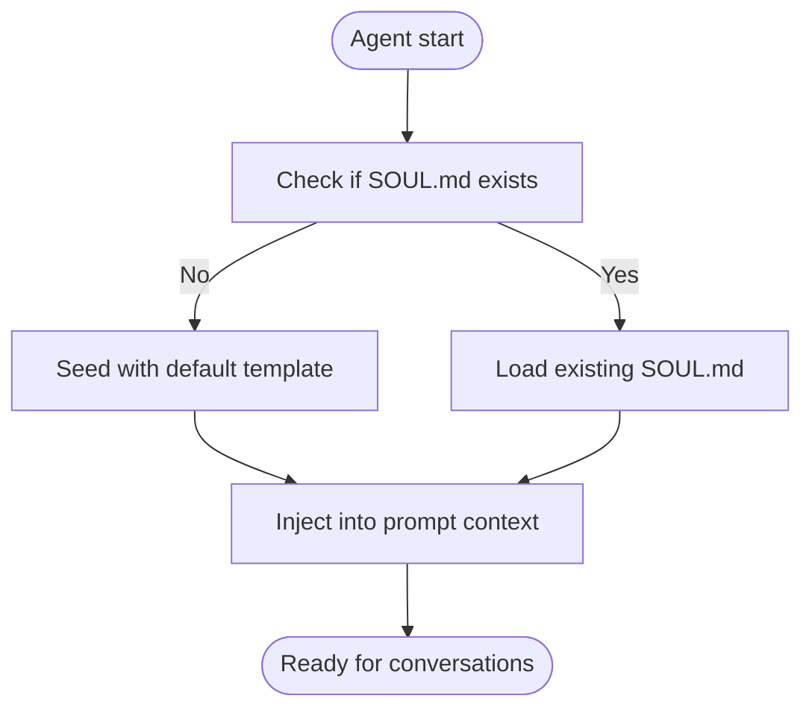
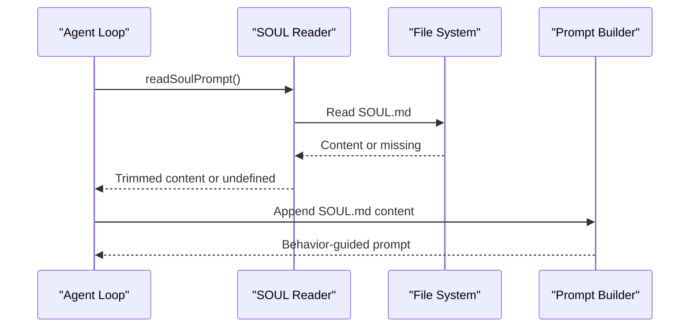
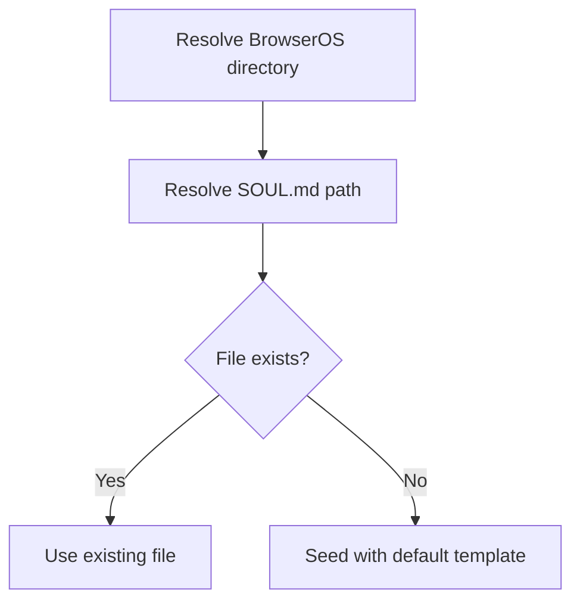
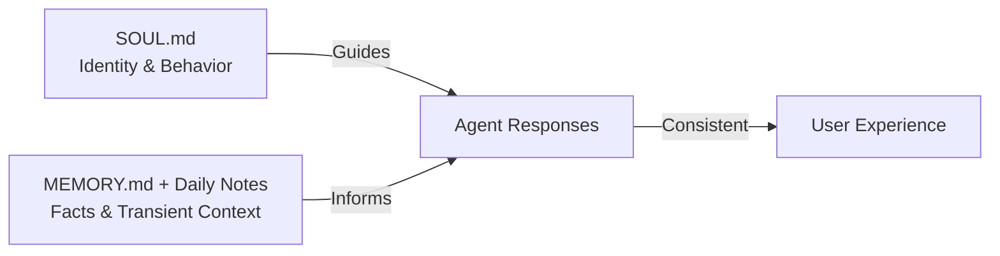
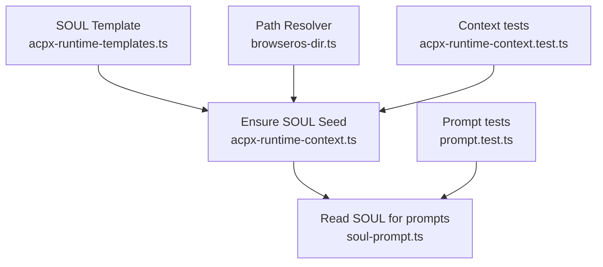

# SOUL.md Personality System

<cite>
**Referenced Files in This Document**
- [soul.mdx](file://docs/features/soul.mdx)
- [README.md](file://README.md)
- [acpx-runtime-context.ts](file://packages/browseros-agent/apps/server/src/lib/agents/acpx-runtime-context.ts)
- [acpx-runtime-templates.ts](file://packages/browseros-agent/apps/server/src/lib/agents/acpx-runtime-templates.ts)
- [soul-prompt.ts](file://packages/browseros-agent/apps/server/src/agent/soul-prompt.ts)
- [browseros-dir.ts](file://packages/browseros-agent/apps/server/src/lib/browseros-dir.ts)
- [prompt.test.ts](file://packages/browseros-agent/apps/server/tests/agent/prompt.test.ts)
- [acpx-runtime-context.test.ts](file://packages/browseros-agent/apps/server/tests/lib/agents/acpx-runtime-context.test.ts)
</cite>

## Table of Contents
1. [Introduction](#introduction)
2. [Project Structure](#project-structure)
3. [Core Components](#core-components)
4. [Architecture Overview](#architecture-overview)
5. [Detailed Component Analysis](#detailed-component-analysis)
6. [Dependency Analysis](#dependency-analysis)
7. [Performance Considerations](#performance-considerations)
8. [Troubleshooting Guide](#troubleshooting-guide)
9. [Conclusion](#conclusion)
10. [Appendices](#appendices)

## Introduction
The SOUL.md Personality System defines the AI agent’s identity, behavior, communication style, and boundaries in BrowserOS. It is a single Markdown file that the agent reads before every conversation to maintain consistent personality across sessions. The system separates personality (SOUL.md) from factual knowledge (MEMORY.md and daily notes), ensuring that evolving knowledge does not overwrite the agent’s core identity and preferences.

Key goals:
- Provide a persistent personality layer that adapts to user preferences
- Keep personality distinct from memory to avoid mixing identity with facts
- Enable the agent to learn and refine its style, boundaries, and operating rules over time
- Offer a simple, editable file that can be viewed and optionally modified by the user

**Section sources**
- [soul.mdx:1-127](file://docs/features/soul.mdx#L1-L127)

## Project Structure
The SOUL.md system spans documentation and implementation across the BrowserOS documentation and the agent server:

- Documentation: The feature guide explains what SOUL.md is, how it works, where it lives, and how it differs from memory.
- Implementation: The server resolves the SOUL.md path, seeds it with a default template if missing, and injects its content into prompts without exposing special UI/tooling.

**Diagram sources**
- [soul.mdx:1-127](file://docs/features/soul.mdx#L1-L127)
- [browseros-dir.ts:70-74](file://packages/browseros-agent/apps/server/src/lib/browseros-dir.ts#L70-L74)
- [acpx-runtime-context.ts:67-72](file://packages/browseros-agent/apps/server/src/lib/agents/acpx-runtime-context.ts#L67-L72)
- [acpx-runtime-templates.ts:6-42](file://packages/browseros-agent/apps/server/src/lib/agents/acpx-runtime-templates.ts#L6-L42)
- [soul-prompt.ts:10-25](file://packages/browseros-agent/apps/server/src/agent/soul-prompt.ts#L10-L25)

**Section sources**
- [README.md:144-178](file://README.md#L144-L178)
- [soul.mdx:1-127](file://docs/features/soul.mdx#L1-L127)
- [browseros-dir.ts:1-126](file://packages/browseros-agent/apps/server/src/lib/browseros-dir.ts#L1-L126)
- [acpx-runtime-context.ts:1-286](file://packages/browseros-agent/apps/server/src/lib/agents/acpx-runtime-context.ts#L1-L286)
- [acpx-runtime-templates.ts:1-161](file://packages/browseros-agent/apps/server/src/lib/agents/acpx-runtime-templates.ts#L1-L161)
- [soul-prompt.ts:1-26](file://packages/browseros-agent/apps/server/src/agent/soul-prompt.ts#L1-L26)

## Core Components
- SOUL.md file: A Markdown file containing personality, boundaries, communication style, and operating rules. It is stored locally and can be viewed in the UI.
- Default template: A built-in template seeded into the agent’s home directory if none exists.
- Prompt integration: The agent reads SOUL.md and appends its content to the prompt context for behavior-guided responses.
- Path resolution: The server resolves the user-managed SOUL.md location under the BrowserOS directory.

Key behaviors:
- First-run seeding of SOUL.md with a default template
- Passive injection of SOUL.md content into prompts without exposing special tools
- Clear separation between personality and memory

**Section sources**
- [soul.mdx:69-96](file://docs/features/soul.mdx#L69-L96)
- [acpx-runtime-context.ts:67-72](file://packages/browseros-agent/apps/server/src/lib/agents/acpx-runtime-context.ts#L67-L72)
- [acpx-runtime-templates.ts:6-42](file://packages/browseros-agent/apps/server/src/lib/agents/acpx-runtime-templates.ts#L6-L42)
- [soul-prompt.ts:10-25](file://packages/browseros-agent/apps/server/src/agent/soul-prompt.ts#L10-L25)
- [browseros-dir.ts:70-74](file://packages/browseros-agent/apps/server/src/lib/browseros-dir.ts#L70-L74)

## Architecture Overview
The SOUL.md system integrates with the agent loop as follows:
- On initialization, the server ensures SOUL.md exists under the agent’s home directory using a default template.
- During prompt construction, the agent reads SOUL.md and includes its content as passive context.
- The UI exposes a read-only viewer for SOUL.md to help users understand and occasionally adjust their agent’s personality.

**Diagram sources**
- [soul.mdx:40-47](file://docs/features/soul.mdx#L40-L47)
- [browseros-dir.ts:70-74](file://packages/browseros-agent/apps/server/src/lib/browseros-dir.ts#L70-L74)
- [acpx-runtime-context.ts:67-72](file://packages/browseros-agent/apps/server/src/lib/agents/acpx-runtime-context.ts#L67-L72)

## Detailed Component Analysis

### SOUL.md Definition and Lifecycle
- Creation: On first run, the server creates SOUL.md under the agent’s home directory if it does not exist.
- Default content: The server uses a built-in template that establishes core truths, boundaries, vibe, and continuity guidance.
- Persistence: The file persists locally and is read on every conversation to maintain continuity.

**Diagram sources**
- [acpx-runtime-context.ts:67-72](file://packages/browseros-agent/apps/server/src/lib/agents/acpx-runtime-context.ts#L67-L72)
- [acpx-runtime-templates.ts:6-42](file://packages/browseros-agent/apps/server/src/lib/agents/acpx-runtime-templates.ts#L6-L42)

**Section sources**
- [acpx-runtime-context.ts:67-72](file://packages/browseros-agent/apps/server/src/lib/agents/acpx-runtime-context.ts#L67-L72)
- [acpx-runtime-templates.ts:6-42](file://packages/browseros-agent/apps/server/src/lib/agents/acpx-runtime-templates.ts#L6-L42)

### Prompt Integration and Behavior Influence
- The agent reads SOUL.md and appends its content to the prompt context to guide behavior and style.
- Tests confirm that SOUL.md content is appended to prompts without exposing special soul tools.
- This ensures personality influences responses without leaking internal tooling.

**Diagram sources**
- [soul-prompt.ts:10-25](file://packages/browseros-agent/apps/server/src/agent/soul-prompt.ts#L10-L25)
- [prompt.test.ts:669-687](file://packages/browseros-agent/apps/server/tests/agent/prompt.test.ts#L669-L687)

**Section sources**
- [soul-prompt.ts:10-25](file://packages/browseros-agent/apps/server/src/agent/soul-prompt.ts#L10-L25)
- [prompt.test.ts:665-687](file://packages/browseros-agent/apps/server/tests/agent/prompt.test.ts#L665-L687)

### Path Resolution and Storage Location
- The server resolves the BrowserOS directory and locates SOUL.md under the user-managed directory.
- The documentation specifies OS-specific locations for convenience.

**Diagram sources**
- [browseros-dir.ts:9-18](file://packages/browseros-agent/apps/server/src/lib/browseros-dir.ts#L9-L18)
- [browseros-dir.ts:70-74](file://packages/browseros-agent/apps/server/src/lib/browseros-dir.ts#L70-L74)

**Section sources**
- [browseros-dir.ts:9-18](file://packages/browseros-agent/apps/server/src/lib/browseros-dir.ts#L9-L18)
- [browseros-dir.ts:70-74](file://packages/browseros-agent/apps/server/src/lib/browseros-dir.ts#L70-L74)
- [soul.mdx:69-79](file://docs/features/soul.mdx#L69-L79)

### Personality vs Memory Separation
- SOUL.md governs identity, behavior, style, rules, and boundaries.
- MEMORY.md and daily notes capture facts, preferences, and transient context.
- This separation ensures personality remains stable even as factual knowledge changes.

**Diagram sources**
- [soul.mdx:81-96](file://docs/features/soul.mdx#L81-L96)
- [acpx-runtime-templates.ts:44-75](file://packages/browseros-agent/apps/server/src/lib/agents/acpx-runtime-templates.ts#L44-L75)

**Section sources**
- [soul.mdx:81-96](file://docs/features/soul.mdx#L81-L96)
- [acpx-runtime-templates.ts:44-75](file://packages/browseros-agent/apps/server/src/lib/agents/acpx-runtime-templates.ts#L44-L75)

### Practical Examples and Use Cases
- Research assistant: Emphasize directness, preference for primary sources, and trade-off explanations.
- Customer support: Establish boundaries around external actions, politeness with efficiency, and escalation rules.
- Creative collaborator: Encourage opinionated input, iterative refinement, and structured feedback loops.

These examples illustrate how personality traits influence conversation flow and decision-making by shaping the agent’s communication style and boundaries.

[No sources needed since this section provides conceptual examples]

## Dependency Analysis
The SOUL.md system depends on:
- Path resolution utilities to locate the file
- Template seeding to initialize the file on first run
- Prompt integration to include personality in behavior
- Tests to validate prompt inclusion and behavior

**Diagram sources**
- [acpx-runtime-templates.ts:6-42](file://packages/browseros-agent/apps/server/src/lib/agents/acpx-runtime-templates.ts#L6-L42)
- [acpx-runtime-context.ts:67-72](file://packages/browseros-agent/apps/server/src/lib/agents/acpx-runtime-context.ts#L67-L72)
- [browseros-dir.ts:70-74](file://packages/browseros-agent/apps/server/src/lib/browseros-dir.ts#L70-L74)
- [soul-prompt.ts:10-25](file://packages/browseros-agent/apps/server/src/agent/soul-prompt.ts#L10-L25)
- [prompt.test.ts:669-687](file://packages/browseros-agent/apps/server/tests/agent/prompt.test.ts#L669-L687)
- [acpx-runtime-context.test.ts:92-107](file://packages/browseros-agent/apps/server/tests/lib/agents/acpx-runtime-context.test.ts#L92-L107)

**Section sources**
- [acpx-runtime-context.ts:67-72](file://packages/browseros-agent/apps/server/src/lib/agents/acpx-runtime-context.ts#L67-L72)
- [soul-prompt.ts:10-25](file://packages/browseros-agent/apps/server/src/agent/soul-prompt.ts#L10-L25)
- [prompt.test.ts:665-687](file://packages/browseros-agent/apps/server/tests/agent/prompt.test.ts#L665-L687)
- [acpx-runtime-context.test.ts:92-107](file://packages/browseros-agent/apps/server/tests/lib/agents/acpx-runtime-context.test.ts#L92-L107)

## Performance Considerations
- File I/O: Reading SOUL.md is lightweight and cached by the runtime; ensure the file remains small and readable.
- Atomic writes: Use atomic replacement patterns to avoid partial reads during updates.
- Prompt size: Keep personality concise to minimize prompt overhead while preserving clarity.

[No sources needed since this section provides general guidance]

## Troubleshooting Guide
Common issues and resolutions:
- SOUL.md not found: The server seeds it automatically on first run. Verify the BrowserOS directory and permissions.
- Empty or missing content: The reader trims whitespace and treats empty content as missing; ensure the file is properly saved.
- Prompt not reflecting changes: Confirm the prompt pipeline reads SOUL.md and that tests pass for prompt inclusion.

Validation references:
- First-run seeding and content presence
- Prompt inclusion tests for SOUL.md content
- Error logging for read failures

**Section sources**
- [acpx-runtime-context.ts:67-72](file://packages/browseros-agent/apps/server/src/lib/agents/acpx-runtime-context.ts#L67-L72)
- [acpx-runtime-context.test.ts:92-107](file://packages/browseros-agent/apps/server/tests/lib/agents/acpx-runtime-context.test.ts#L92-L107)
- [soul-prompt.ts:10-25](file://packages/browseros-agent/apps/server/src/agent/soul-prompt.ts#L10-L25)
- [prompt.test.ts:669-687](file://packages/browseros-agent/apps/server/tests/agent/prompt.test.ts#L669-L687)

## Conclusion
The SOUL.md Personality System provides a robust, file-based mechanism for defining and evolving an AI agent’s identity and behavior. By separating personality from memory, BrowserOS ensures consistent, user-aligned interactions that adapt over time. The implementation cleanly integrates with the agent loop, supports easy viewing and occasional editing, and maintains reliability through seeding and atomic file operations.

[No sources needed since this section summarizes without analyzing specific files]

## Appendices

### Best Practices for Personality Design
- Keep personality concise and actionable
- Focus on communication style, boundaries, and operating principles
- Avoid embedding user facts in SOUL.md; use MEMORY.md and daily notes for facts
- Periodically review and refine personality to reflect evolving preferences

**Section sources**
- [soul.mdx:81-96](file://docs/features/soul.mdx#L81-L96)
- [acpx-runtime-templates.ts:55-75](file://packages/browseros-agent/apps/server/src/lib/agents/acpx-runtime-templates.ts#L55-L75)

### Ethical Considerations
- Respect user boundaries and private information
- Avoid impersonation or sending unreviewed content
- Maintain transparency when changing personality rules
- Keep personality aligned with user values and professional standards

**Section sources**
- [acpx-runtime-templates.ts:25-42](file://packages/browseros-agent/apps/server/src/lib/agents/acpx-runtime-templates.ts#L25-L42)
- [acpx-runtime-templates.ts:135-159](file://packages/browseros-agent/apps/server/src/lib/agents/acpx-runtime-templates.ts#L135-L159)

### Community Contributions
- Share personality patterns and templates for common roles (research, support, collaboration)
- Contribute improvements to the default template and prompt integration
- Report issues and propose enhancements via the project’s contribution channels

**Section sources**
- [README.md:179-188](file://README.md#L179-L188)