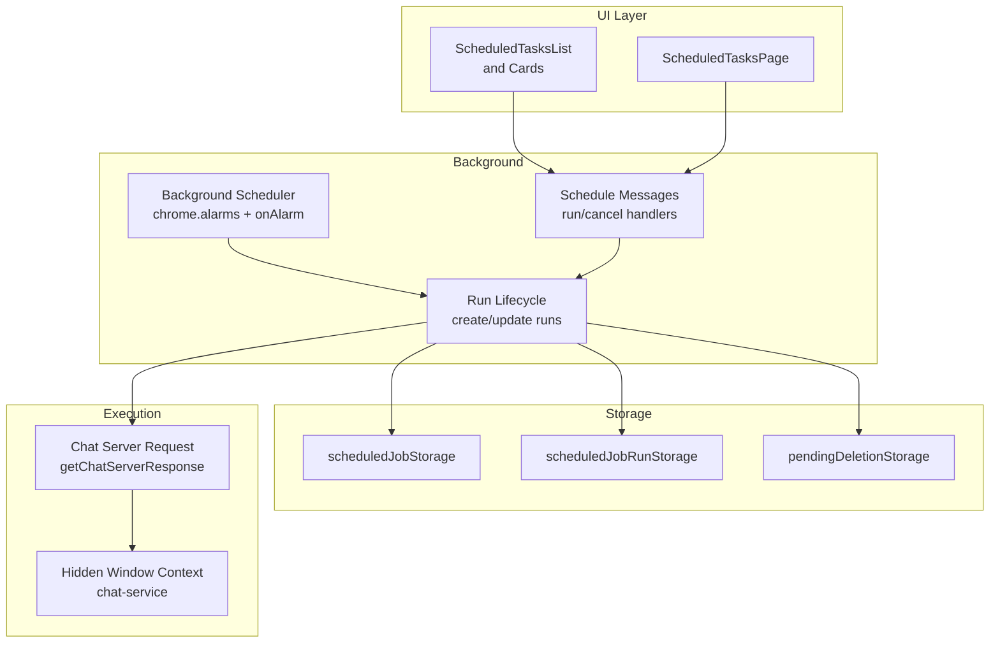
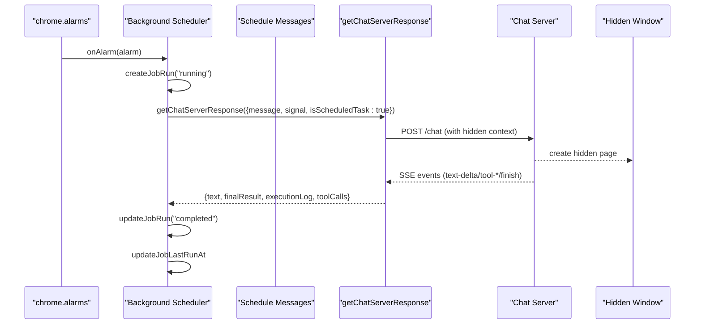
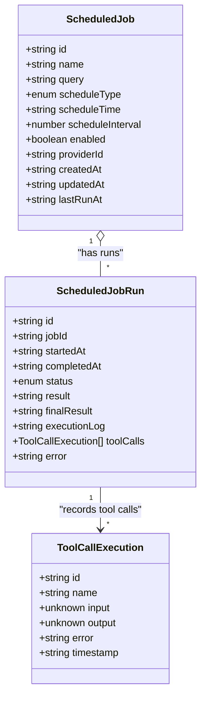
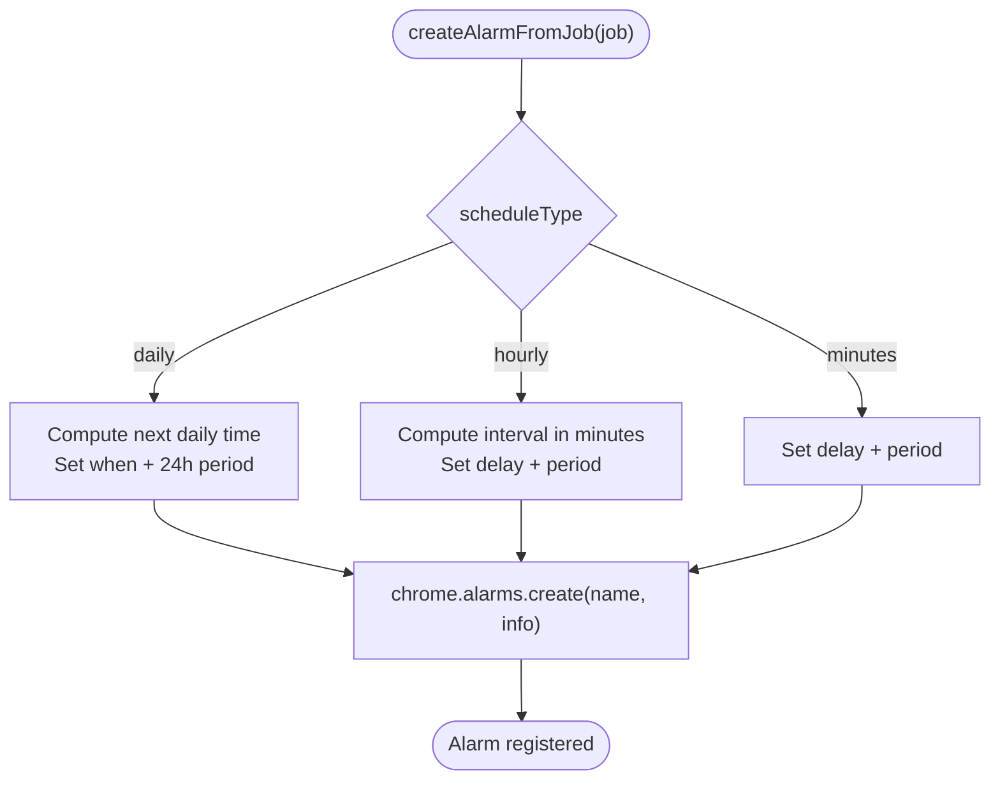
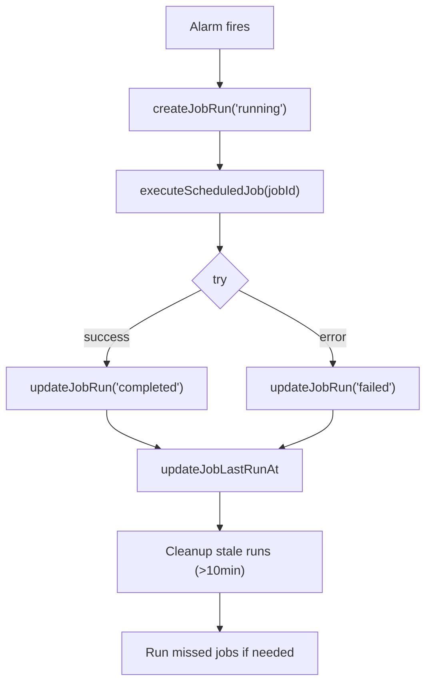
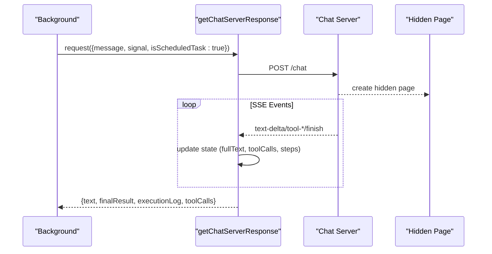
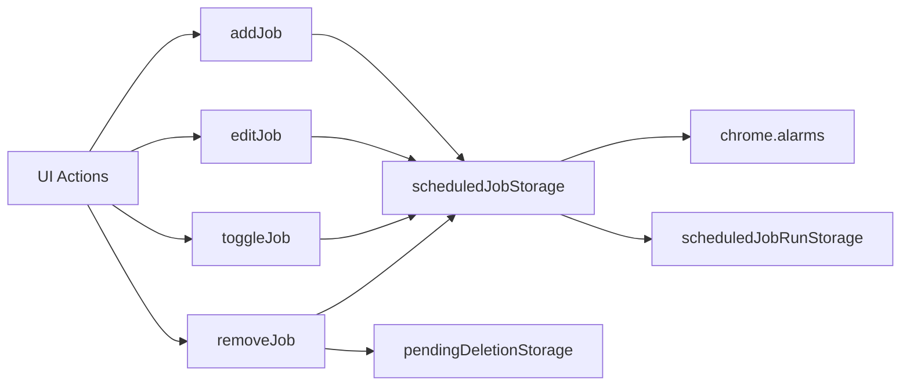
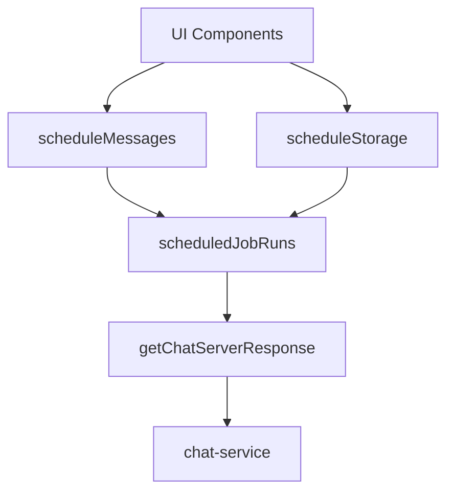

# Scheduled Tasks

<cite>
**Referenced Files in This Document**
- [scheduled-tasks.mdx](file://docs/features/scheduled-tasks.mdx)
- [scheduleTypes.ts](file://packages/browseros-agent/apps/agent/lib/schedules/scheduleTypes.ts)
- [createAlarmFromJob.ts](file://packages/browseros-agent/apps/agent/lib/schedules/createAlarmFromJob.ts)
- [scheduleStorage.ts](file://packages/browseros-agent/apps/agent/lib/schedules/scheduleStorage.ts)
- [scheduledJobRuns.ts](file://packages/browseros-agent/apps/agent/entrypoints/background/scheduledJobRuns.ts)
- [scheduleMessages.ts](file://packages/browseros-agent/apps/agent/lib/messaging/schedules/scheduleMessages.ts)
- [getChatServerResponse.ts](file://packages/browseros-agent/apps/agent/lib/schedules/getChatServerResponse.ts)
- [chat-service.ts](file://packages/browseros-agent/apps/server/src/api/services/chat-service.ts)
- [sync-to-cloud.mdx](file://docs/features/sync-to-cloud.mdx)
- [memory.mdx](file://docs/features/memory.mdx)
</cite>

## Table of Contents
1. [Introduction](#introduction)
2. [Project Structure](#project-structure)
3. [Core Components](#core-components)
4. [Architecture Overview](#architecture-overview)
5. [Detailed Component Analysis](#detailed-component-analysis)
6. [Dependency Analysis](#dependency-analysis)
7. [Performance Considerations](#performance-considerations)
8. [Troubleshooting Guide](#troubleshooting-guide)
9. [Conclusion](#conclusion)
10. [Appendices](#appendices)

## Introduction
This document explains BrowserOS’s Scheduled Tasks system: how workflows and automations are scheduled and executed at hourly, daily, or minute-based intervals. It covers the scheduling engine, the browser alarm integration, the task queue and run lifecycle, execution logging, cancellation, and failure handling. It also documents how scheduled tasks integrate with workflows, vertical tabs, and memory persistence, along with practical examples, configuration options, monitoring, and best practices.

## Project Structure
The Scheduled Tasks feature spans UI components, background execution logic, storage, and server-side orchestration:
- UI and state: React components and hooks manage task lists, runs, and actions.
- Background scheduler: Listens to browser alarms and orchestrates task execution.
- Storage: Local persistence for jobs and runs; optional cloud sync for configurations.
- Execution pipeline: Streams UI events from the chat server to capture tool calls and execution logs.
- Server integration: Creates hidden browser contexts for scheduled runs.

**Diagram sources**
- [scheduledJobRuns.ts:16-240](file://packages/browseros-agent/apps/agent/entrypoints/background/scheduledJobRuns.ts#L16-L240)
- [scheduleStorage.ts:11-30](file://packages/browseros-agent/apps/agent/lib/schedules/scheduleStorage.ts#L11-L30)
- [getChatServerResponse.ts:92-163](file://packages/browseros-agent/apps/agent/lib/schedules/getChatServerResponse.ts#L92-L163)
- [chat-service.ts:160-201](file://packages/browseros-agent/apps/server/src/api/services/chat-service.ts#L160-L201)

**Section sources**
- [scheduled-tasks.mdx:1-148](file://docs/features/scheduled-tasks.mdx#L1-L148)

## Core Components
- ScheduledJob and ScheduledJobRun types define the shape of persisted tasks and runs.
- Alarm creation maps schedule types to browser alarms.
- Storage utilities manage jobs, runs, and deletion queues.
- Background scheduler handles alarm events, run lifecycle, cancellation, and missed run detection.
- Messaging protocol exposes run and cancel operations to the UI.
- Execution pipeline streams UI events to capture tool calls and execution logs.
- Server creates a hidden browser context for scheduled runs.

**Section sources**
- [scheduleTypes.ts:1-36](file://packages/browseros-agent/apps/agent/lib/schedules/scheduleTypes.ts#L1-L36)
- [createAlarmFromJob.ts:1-43](file://packages/browseros-agent/apps/agent/lib/schedules/createAlarmFromJob.ts#L1-L43)
- [scheduleStorage.ts:1-188](file://packages/browseros-agent/apps/agent/lib/schedules/scheduleStorage.ts#L1-L188)
- [scheduledJobRuns.ts:1-241](file://packages/browseros-agent/apps/agent/entrypoints/background/scheduledJobRuns.ts#L1-L241)
- [scheduleMessages.ts:1-27](file://packages/browseros-agent/apps/agent/lib/messaging/schedules/scheduleMessages.ts#L1-L27)
- [getChatServerResponse.ts:1-279](file://packages/browseros-agent/apps/agent/lib/schedules/getChatServerResponse.ts#L1-L279)
- [chat-service.ts:160-201](file://packages/browseros-agent/apps/server/src/api/services/chat-service.ts#L160-L201)

## Architecture Overview
The system uses browser alarms to trigger scheduled tasks. On each trigger, the background service:
- Creates a run record
- Starts an abort controller for cancellation
- Calls the chat server with a special flag to run in a hidden context
- Streams UI events to collect tool calls and execution steps
- Updates run status, result, and logs
- Cleans up stale runs and reschedules alarms on startup

**Diagram sources**
- [scheduledJobRuns.ts:103-148](file://packages/browseros-agent/apps/agent/entrypoints/background/scheduledJobRuns.ts#L103-L148)
- [getChatServerResponse.ts:92-163](file://packages/browseros-agent/apps/agent/lib/schedules/getChatServerResponse.ts#L92-L163)
- [chat-service.ts:160-201](file://packages/browseros-agent/apps/server/src/api/services/chat-service.ts#L160-L201)

## Detailed Component Analysis

### Data Model and Types
- ScheduledJob: identifier, name, prompt/query, schedule type (daily/hourly/minutes), optional schedule time, optional interval, enablement flag, provider override, timestamps, last run marker.
- ScheduledJobRun: run identity, associated job, timestamps, status, result, final result, execution log, tool calls, error.
- ToolCallExecution: per-tool call identity, name, input, output, error, timestamp.

**Diagram sources**
- [scheduleTypes.ts:1-36](file://packages/browseros-agent/apps/agent/lib/schedules/scheduleTypes.ts#L1-L36)

**Section sources**
- [scheduleTypes.ts:1-36](file://packages/browseros-agent/apps/agent/lib/schedules/scheduleTypes.ts#L1-L36)

### Alarm-Based Scheduling Engine
- Converts schedule configuration into browser alarms:
  - Daily: compute next occurrence at the configured time and repeat every 24 hours.
  - Hourly: delay and repeat by N hours.
  - Minutes: delay and repeat by N minutes.
- Ensures alarms are recreated on startup or when missing.

**Diagram sources**
- [createAlarmFromJob.ts:18-43](file://packages/browseros-agent/apps/agent/lib/schedules/createAlarmFromJob.ts#L18-L43)

**Section sources**
- [createAlarmFromJob.ts:1-43](file://packages/browseros-agent/apps/agent/lib/schedules/createAlarmFromJob.ts#L1-L43)

### Task Queue Management and Run Lifecycle
- Run records are capped per job (last 15 runs).
- On each alarm, a new run is created with status “running”.
- Abort controllers support cancellation from the UI.
- Failure handling marks runs as failed with error messages.
- Stale runs (older than 10 minutes) are auto-cleaned.
- Missed run detection executes overdue jobs after startup.

**Diagram sources**
- [scheduledJobRuns.ts:16-200](file://packages/browseros-agent/apps/agent/entrypoints/background/scheduledJobRuns.ts#L16-L200)

**Section sources**
- [scheduledJobRuns.ts:10-241](file://packages/browseros-agent/apps/agent/entrypoints/background/scheduledJobRuns.ts#L10-L241)

### Execution Pipeline and Logging
- getChatServerResponse streams UI events from the server:
  - Tracks full text, tool-call inputs/outputs, errors, and finish markers.
  - Aggregates execution steps and tool call records.
  - Returns final result, execution log, and tool calls for persistence.
- chat-service creates a hidden browser context for scheduled tasks, ensuring non-intrusive execution.

**Diagram sources**
- [getChatServerResponse.ts:202-279](file://packages/browseros-agent/apps/agent/lib/schedules/getChatServerResponse.ts#L202-L279)
- [chat-service.ts:160-201](file://packages/browseros-agent/apps/server/src/api/services/chat-service.ts#L160-L201)

**Section sources**
- [getChatServerResponse.ts:92-163](file://packages/browseros-agent/apps/agent/lib/schedules/getChatServerResponse.ts#L92-L163)
- [chat-service.ts:160-201](file://packages/browseros-agent/apps/server/src/api/services/chat-service.ts#L160-L201)

### Storage and Cloud Sync
- Jobs and runs are persisted locally; deletions are queued separately.
- Enabling a job creates an alarm; disabling clears it.
- Editing a job updates storage and reschedules alarms accordingly.
- Cloud sync propagates schedule configurations across devices; run results remain local.

**Diagram sources**
- [scheduleStorage.ts:43-117](file://packages/browseros-agent/apps/agent/lib/schedules/scheduleStorage.ts#L43-L117)

**Section sources**
- [scheduleStorage.ts:1-188](file://packages/browseros-agent/apps/agent/lib/schedules/scheduleStorage.ts#L1-L188)
- [sync-to-cloud.mdx:61-63](file://docs/features/sync-to-cloud.mdx#L61-L63)

### Monitoring and User Interface
- Users can view runs, test tasks manually, retry failed runs, and cancel currently running ones.
- Results appear on the New Tab page and in the task’s run history.
- The UI surfaces last 15 runs per task and allows viewing full outputs.

**Section sources**
- [scheduled-tasks.mdx:91-108](file://docs/features/scheduled-tasks.mdx#L91-L108)

## Dependency Analysis
- UI depends on storage hooks and schedule messages to manage jobs and runs.
- Background scheduler depends on alarms, storage, and messaging.
- Execution depends on the chat server and hidden window context.
- Storage is independent but integrates with background and UI layers.

**Diagram sources**
- [scheduleMessages.ts:23-27](file://packages/browseros-agent/apps/agent/lib/messaging/schedules/scheduleMessages.ts#L23-L27)
- [scheduleStorage.ts:1-188](file://packages/browseros-agent/apps/agent/lib/schedules/scheduleStorage.ts#L1-L188)
- [scheduledJobRuns.ts:1-241](file://packages/browseros-agent/apps/agent/entrypoints/background/scheduledJobRuns.ts#L1-L241)
- [getChatServerResponse.ts:92-163](file://packages/browseros-agent/apps/agent/lib/schedules/getChatServerResponse.ts#L92-L163)
- [chat-service.ts:160-201](file://packages/browseros-agent/apps/server/src/api/services/chat-service.ts#L160-L201)

**Section sources**
- [scheduleMessages.ts:1-27](file://packages/browseros-agent/apps/agent/lib/messaging/schedules/scheduleMessages.ts#L1-L27)
- [scheduleStorage.ts:1-188](file://packages/browseros-agent/apps/agent/lib/schedules/scheduleStorage.ts#L1-L188)
- [scheduledJobRuns.ts:1-241](file://packages/browseros-agent/apps/agent/entrypoints/background/scheduledJobRuns.ts#L1-L241)
- [getChatServerResponse.ts:1-279](file://packages/browseros-agent/apps/agent/lib/schedules/getChatServerResponse.ts#L1-L279)
- [chat-service.ts:160-201](file://packages/browseros-agent/apps/server/src/api/services/chat-service.ts#L160-L201)

## Performance Considerations
- Long-running tasks: Scheduled tasks have a 10-minute timeout. If exceeded, runs are marked failed. Prefer breaking tasks into smaller steps or reducing scope.
- Concurrency: Only one run per job is active at a time; subsequent runs are queued implicitly by the run cap and alarm scheduling.
- Resource allocation: The hidden window context reduces interference with foreground tabs. Keep prompts scoped to avoid unnecessary network or rendering work.
- Missed run detection: After startup, the system checks for overdue jobs and executes them once, preventing backlog accumulation.
- Storage caps: Run history is limited to 15 entries per job to keep memory footprint predictable.

[No sources needed since this section provides general guidance]

## Troubleshooting Guide
Common issues and resolutions:
- Task does not run at the expected time
  - Verify the job is enabled and that alarms exist for the job.
  - On startup or install, alarms are synced; if missing, they are recreated.
- Task appears stuck as “running”
  - Stale runs older than 10 minutes are automatically marked failed.
  - Check for network interruptions or server-side errors captured in the run’s error field.
- Cannot cancel a running task
  - Use the cancel action from the UI; the background cancels via abort controller.
  - If the run is not found or already completed, cancellation returns an error.
- Cloud sync shows outdated schedule
  - Only schedule setup (name, prompt, schedule type, timing) syncs; run results remain local.
- Hidden window not opening
  - The server creates a hidden page for scheduled tasks; ensure permissions and server availability.

**Section sources**
- [scheduledJobRuns.ts:16-241](file://packages/browseros-agent/apps/agent/entrypoints/background/scheduledJobRuns.ts#L16-L241)
- [scheduleStorage.ts:61-93](file://packages/browseros-agent/apps/agent/lib/schedules/scheduleStorage.ts#L61-L93)
- [sync-to-cloud.mdx:61-63](file://docs/features/sync-to-cloud.mdx#L61-L63)

## Conclusion
BrowserOS’s Scheduled Tasks system provides a robust, browser-native scheduling engine that integrates alarms, background execution, and hidden-page contexts to run workflows reliably. With structured run lifecycles, cancellation, timeouts, and cloud-synced configurations, it supports practical automation scenarios while maintaining privacy and performance.

[No sources needed since this section summarizes without analyzing specific files]

## Appendices

### Practical Examples
- Morning briefing: Daily at a specific time, summarize calendar events and research attendees.
- LinkedIn automation: Daily accept connection requests.
- Price monitoring: Hourly check product prices and place orders when thresholds are met.
- Competitor tracking: Daily check competitor sites for announcements or pricing changes.
- Social media digest: Evening aggregation of top posts across platforms.
- Cross-app workflow: Combine calendar, Slack, and Notion in a single daily routine.

**Section sources**
- [scheduled-tasks.mdx:66-87](file://docs/features/scheduled-tasks.mdx#L66-L87)

### Configuration Options and Behavior
- Schedule types
  - Daily: specify a time of day; repeats every 24 hours.
  - Hourly: specify interval in hours (1–24).
  - Minutes: specify interval in minutes (1–60).
- Enable/disable: toggle immediate activation/deactivation.
- Provider override: select a specific LLM provider for a task.
- Cloud sync: schedule setup syncs across devices; run results stay local.
- Privacy: tasks run locally in a hidden window; nothing is sent to external servers.

**Section sources**
- [scheduled-tasks.mdx:52-90](file://docs/features/scheduled-tasks.mdx#L52-L90)
- [sync-to-cloud.mdx:61-63](file://docs/features/sync-to-cloud.mdx#L61-L63)

### Integration with Workflows and Vertical Tabs
- Workflows: Scheduled tasks can be complex prompts that orchestrate multiple steps; the execution log captures tool calls and steps.
- Vertical tabs: When enabled MCP servers or custom servers are present, the browser context includes active tab/window metadata for targeted automation.

**Section sources**
- [getChatServerResponse.ts:116-140](file://packages/browseros-agent/apps/agent/lib/schedules/getChatServerResponse.ts#L116-L140)

### Memory Persistence and Privacy
- Memory persists facts and daily notes locally; it remains on-device even with cloud sync enabled.
- Scheduled task results and outputs are stored locally on the device where the task ran.

**Section sources**
- [memory.mdx:1-128](file://docs/features/memory.mdx#L1-L128)
- [sync-to-cloud.mdx:70-81](file://docs/features/sync-to-cloud.mdx#L70-L81)