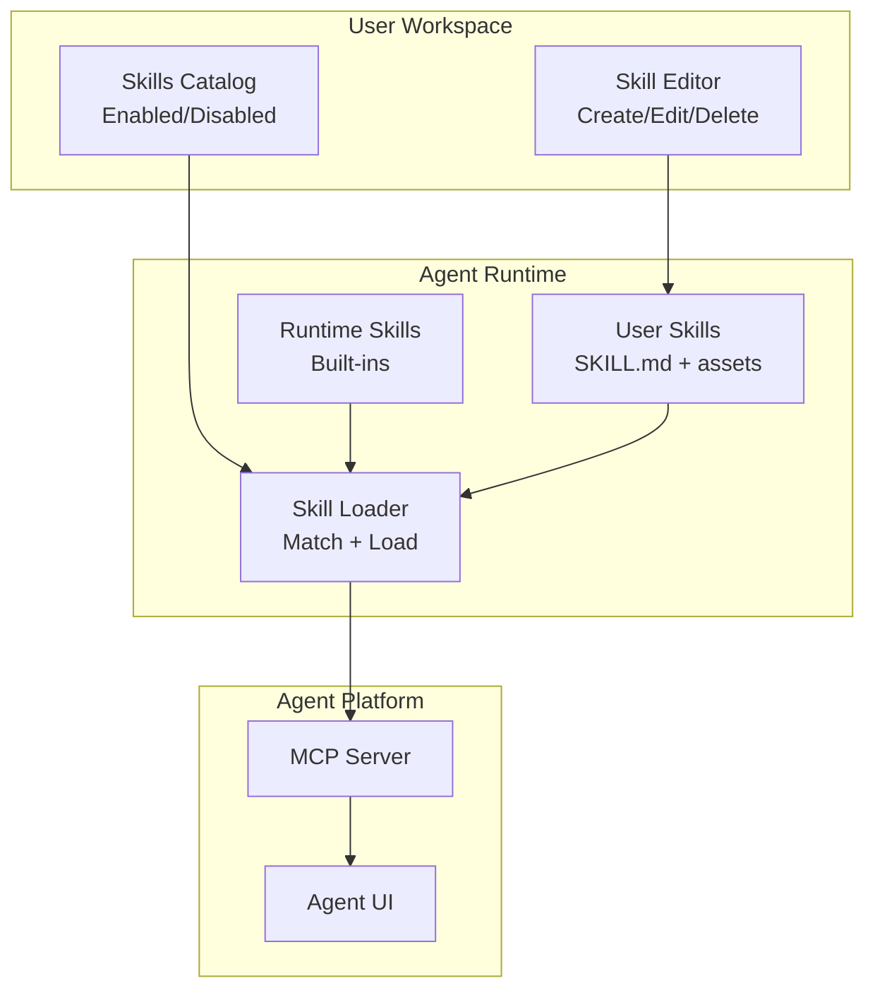
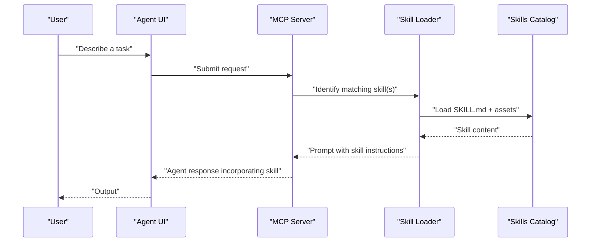
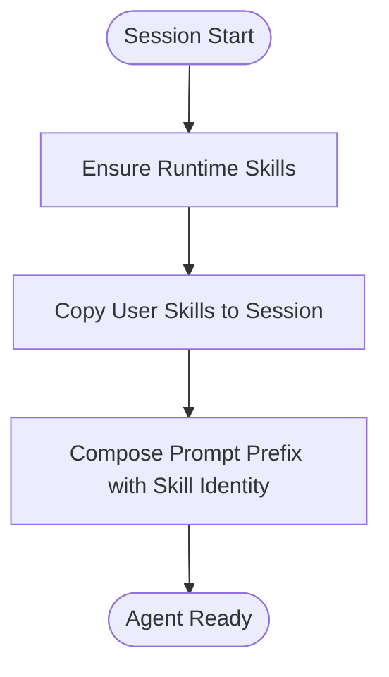
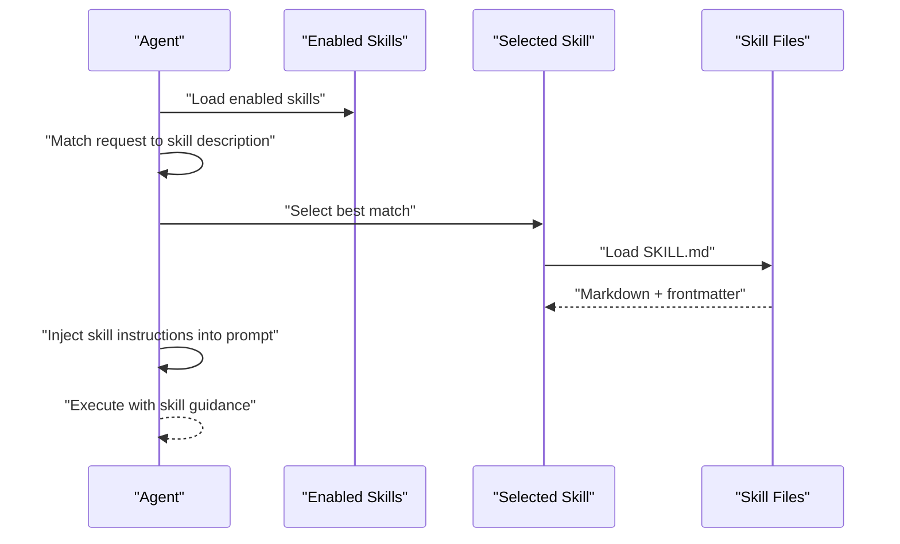
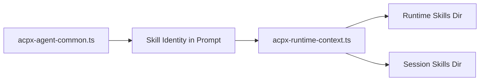

# Skills Framework

<cite>
**Referenced Files in This Document**
- [README.md](file://README.md)
- [skills.mdx](file://docs/features/skills.mdx)
- [workflows.mdx](file://docs/features/workflows.mdx)
- [acpx-agent-common.ts](file://packages/browseros-agent/apps/server/src/lib/agents/acpx-agent-common.ts)
- [acpx-runtime-context.ts](file://packages/browseros-agent/apps/server/src/lib/agents/acpx-runtime-context.ts)
- [SKILL.md](file://.claude/skills/writing-skills/SKILL.md)
- [SKILL.md](file://.claude/skills/systematic-debugging/SKILL.md)
- [SKILL.md](file://.claude/skills/test-driven-development/SKILL.md)
- [SKILL.md](file://.claude/skills/brainstorming/SKILL.md)
</cite>

## Table of Contents
1. [Introduction](#introduction)
2. [Project Structure](#project-structure)
3. [Core Components](#core-components)
4. [Architecture Overview](#architecture-overview)
5. [Detailed Component Analysis](#detailed-component-analysis)
6. [Dependency Analysis](#dependency-analysis)
7. [Performance Considerations](#performance-considerations)
8. [Troubleshooting Guide](#troubleshooting-guide)
9. [Conclusion](#conclusion)
10. [Appendices](#appendices)

## Introduction
This document explains the Skills Framework that powers BrowserOS’s modular automation capabilities. It focuses on how skills enable developers to create, share, and compose reusable automation instructions that the agent loads and executes when tasks match a skill’s description. The framework integrates with the agent runtime, supports a portable skill format, and provides patterns for composing complex browser automation workflows from smaller components. It also covers skill registration, parameter passing, result handling, memory context, and workflow orchestration.

## Project Structure
BrowserOS organizes skills as Markdown-based instruction sets with optional supporting files. The runtime ensures built-in skills are available and manages user-enabled skills. The agent platform exposes an MCP server and UI, and the documentation site provides user-facing guides for creating and managing skills.

**Diagram sources**
- [acpx-runtime-context.ts:73-140](file://packages/browseros-agent/apps/server/src/lib/agents/acpx-runtime-context.ts#L73-L140)
- [acpx-agent-common.ts:16-69](file://packages/browseros-agent/apps/server/src/lib/agents/acpx-agent-common.ts#L16-L69)
- [skills.mdx:10-22](file://docs/features/skills.mdx#L10-L22)

**Section sources**
- [README.md:44-61](file://README.md#L44-L61)
- [skills.mdx:162-172](file://docs/features/skills.mdx#L162-L172)
- [acpx-runtime-context.ts:73-140](file://packages/browseros-agent/apps/server/src/lib/agents/acpx-runtime-context.ts#L73-L140)

## Core Components
- Skills as instruction sets: Each skill is a Markdown file with YAML frontmatter and optional supporting files. The agent loads the main skill file and references to supporting files only when needed.
- Skill catalog and matching: The agent loads enabled skills and selects the most relevant skill based on the user’s request description.
- Runtime and user skills: Built-in runtime skills are ensured and placed into a runtime skills directory; user skills are stored under the user’s skills directory.
- Integration with agent platform: The agent runtime composes prompts and invokes skills during conversations.

Key implementation references:
- Runtime skills management and copying to user skills directory
- Skill loader that matches tasks to skills and loads instructions
- Agent integration that includes skill identity in prompt composition

**Section sources**
- [skills.mdx:110-161](file://docs/features/skills.mdx#L110-L161)
- [acpx-runtime-context.ts:73-140](file://packages/browseros-agent/apps/server/src/lib/agents/acpx-runtime-context.ts#L73-L140)
- [acpx-agent-common.ts:16-69](file://packages/browseros-agent/apps/server/src/lib/agents/acpx-agent-common.ts#L16-L69)

## Architecture Overview
The Skills Framework sits between the user-facing UI and the agent runtime. It provides:
- A portable skill format aligned with the Agent Skills specification
- A runtime that ensures built-in skills and copies user skills into a session-aware directory
- A loader that matches incoming tasks to applicable skills and injects their instructions into the agent prompt

**Diagram sources**
- [skills.mdx:10-22](file://docs/features/skills.mdx#L10-L22)
- [acpx-runtime-context.ts:73-140](file://packages/browseros-agent/apps/server/src/lib/agents/acpx-runtime-context.ts#L73-L140)
- [acpx-agent-common.ts:16-69](file://packages/browseros-agent/apps/server/src/lib/agents/acpx-agent-common.ts#L16-L69)

## Detailed Component Analysis

### Skill Registration and Lifecycle
- Built-in runtime skills are written to a runtime skills directory and logged for session awareness.
- User skills are copied into a session skills directory under the agent’s home to ensure availability during the session.
- The agent composes a prompt prefix that includes the set of active skill names, enabling contextual injection of skill behavior.

**Diagram sources**
- [acpx-runtime-context.ts:73-140](file://packages/browseros-agent/apps/server/src/lib/agents/acpx-runtime-context.ts#L73-L140)
- [acpx-agent-common.ts:16-69](file://packages/browseros-agent/apps/server/src/lib/agents/acpx-agent-common.ts#L16-L69)

**Section sources**
- [acpx-runtime-context.ts:73-140](file://packages/browseros-agent/apps/server/src/lib/agents/acpx-runtime-context.ts#L73-L140)
- [acpx-agent-common.ts:16-69](file://packages/browseros-agent/apps/server/src/lib/agents/acpx-agent-common.ts#L16-L69)

### Skill Matching and Execution
- The agent loads a catalog of enabled skills and uses the skill description to match incoming tasks.
- When a match occurs, the agent loads the skill’s instructions and incorporates them into the prompt for that interaction.
- The skill content may reference supporting files (scripts, references, assets) which are loaded on demand.

**Diagram sources**
- [skills.mdx:10-22](file://docs/features/skills.mdx#L10-L22)
- [skills.mdx:110-161](file://docs/features/skills.mdx#L110-L161)

**Section sources**
- [skills.mdx:10-22](file://docs/features/skills.mdx#L10-L22)
- [skills.mdx:110-161](file://docs/features/skills.mdx#L110-L161)

### Parameter Passing and Result Handling
- Parameter passing: The skill description acts as a trigger. The agent uses the matched skill’s instructions to guide the response; parameters are embedded within the user’s request and the skill’s instructions.
- Result handling: The agent produces a response shaped by the skill’s guidance. There is no explicit return mechanism from skills; results are emitted as part of the agent’s output stream.

**Section sources**
- [skills.mdx:10-22](file://docs/features/skills.mdx#L10-L22)

### Memory System and Context Preservation
- The runtime logs that memory skills are available in the BrowserOS ACPX context and encourages using the memory skill when the user requests memory-related actions.
- This indicates that memory is integrated into the skill ecosystem and can be invoked by skills that need persistent context.

**Section sources**
- [acpx-runtime-context.ts:135-140](file://packages/browseros-agent/apps/server/src/lib/agents/acpx-runtime-context.ts#L135-L140)

### Workflow Orchestration and Composition
- Workflows provide a visual graph builder for complex, repeatable automations. While distinct from skills, workflows can be composed with skills: skills provide reusable instruction sets that workflows can incorporate as nodes or steps.
- Use cases for workflows include data entry, outreach, price monitoring, and bulk unsubscribes—tasks that benefit from both structured orchestration and reusable skill guidance.

**Section sources**
- [workflows.mdx:16-23](file://docs/features/workflows.mdx#L16-L23)
- [workflows.mdx:53-66](file://docs/features/workflows.mdx#L53-L66)

### Practical Patterns and Examples
Common skill patterns observed in the example skills:
- Technique skills: Provide step-by-step procedures (e.g., condition-based waiting, root cause tracing).
- Pattern skills: Offer mental models and decision frameworks (e.g., systematic debugging).
- Reference skills: Provide APIs and tool references (e.g., superpowers references).
- Discipline-enforcing skills: Enforce rules and resist rationalization under pressure (e.g., test-driven development).

These patterns inform how to structure skill content, including flowcharts for non-obvious decisions, cross-references to other skills, and concise descriptions optimized for discovery.

**Section sources**
- [.claude/skills/systematic-debugging/SKILL.md:1-297](file://.claude/skills/systematic-debugging/SKILL.md#L1-L297)
- [.claude/skills/test-driven-development/SKILL.md:1-372](file://.claude/skills/test-driven-development/SKILL.md#L1-L372)
- [.claude/skills/brainstorming/SKILL.md:1-165](file://.claude/skills/brainstorming/SKILL.md#L1-L165)
- [.claude/skills/writing-skills/SKILL.md:1-656](file://.claude/skills/writing-skills/SKILL.md#L1-L656)

### Custom Skill Development
- File format: Use YAML frontmatter for metadata and Markdown for instructions. Include supporting files (scripts, references, assets) as needed.
- Discovery: Optimize descriptions to focus on “when to use” rather than summarizing the process. Include keywords for searchability.
- Organization: Keep content concise, use cross-references, and move heavy references to separate files.

**Section sources**
- [skills.mdx:110-161](file://docs/features/skills.mdx#L110-L161)
- [.claude/skills/writing-skills/SKILL.md:140-198](file://.claude/skills/writing-skills/SKILL.md#L140-L198)

### Skill Marketplace and Sharing
- The Agent Skills specification enables portability across agents that support the standard.
- Users can manage skills locally; sharing and distribution are facilitated by the specification’s portability.

**Section sources**
- [skills.mdx:8-8](file://docs/features/skills.mdx#L8-L8)
- [skills.mdx:191-193](file://docs/features/skills.mdx#L191-L193)

### Best Practices for Skill Design
- Clarity and specificity in descriptions
- Focused scope per skill
- Examples and cross-references
- Supporting files for heavy references

**Section sources**
- [skills.mdx:174-189](file://docs/features/skills.mdx#L174-L189)

### Performance Optimization
- Load on demand: Only load supporting files when referenced by instructions.
- Token efficiency: Keep frequently loaded skills concise to minimize context usage.

**Section sources**
- [skills.mdx:160-160](file://docs/features/skills.mdx#L160-L160)
- [.claude/skills/writing-skills/SKILL.md:213-221](file://.claude/skills/writing-skills/SKILL.md#L213-L221)

### Error Handling Strategies
- Use discipline-enforcing skills to resist rationalization and ensure robust adherence to processes.
- Apply systematic debugging to identify root causes before implementing fixes.

**Section sources**
- [.claude/skills/systematic-debugging/SKILL.md:16-23](file://.claude/skills/systematic-debugging/SKILL.md#L16-L23)
- [.claude/skills/test-driven-development/SKILL.md:31-46](file://.claude/skills/test-driven-development/SKILL.md#L31-L46)

### Debugging Techniques and Testing Methodologies
- TDD adaptation for skills: RED (baseline), GREEN (minimal skill), REFACTOR (close loopholes).
- Pressure scenarios with subagents to validate compliance under stress.
- Rationalization tables and red flags to prevent workarounds.

**Section sources**
- [.claude/skills/writing-skills/SKILL.md:533-561](file://.claude/skills/writing-skills/SKILL.md#L533-L561)
- [.claude/skills/writing-skills/SKILL.md:596-634](file://.claude/skills/writing-skills/SKILL.md#L596-L634)

### Version Management and Evolution
- Use metadata fields (e.g., version) in the skill frontmatter to track changes.
- Maintain backward compatibility when evolving skills and update descriptions to reflect new capabilities.

**Section sources**
- [skills.mdx:132-142](file://docs/features/skills.mdx#L132-L142)

## Dependency Analysis
The agent runtime depends on:
- Runtime skills directory for built-in skills
- User skills directory for session availability
- Prompt composition that includes active skill identities

**Diagram sources**
- [acpx-runtime-context.ts:73-140](file://packages/browseros-agent/apps/server/src/lib/agents/acpx-runtime-context.ts#L73-L140)
- [acpx-agent-common.ts:16-69](file://packages/browseros-agent/apps/server/src/lib/agents/acpx-agent-common.ts#L16-L69)

**Section sources**
- [acpx-runtime-context.ts:73-140](file://packages/browseros-agent/apps/server/src/lib/agents/acpx-runtime-context.ts#L73-L140)
- [acpx-agent-common.ts:16-69](file://packages/browseros-agent/apps/server/src/lib/agents/acpx-agent-common.ts#L16-L69)

## Performance Considerations
- Keep frequently loaded skills concise to reduce token consumption.
- Use cross-references to external files for heavy content.
- Avoid embedding redundant examples and streamline descriptions.

[No sources needed since this section provides general guidance]

## Troubleshooting Guide
- If a skill is not being applied, verify the skill description triggers on the intended request and that the skill is enabled.
- Use systematic debugging to trace root causes when skills behave unexpectedly.
- Apply TDD-like cycles to validate and refine skills under pressure.

**Section sources**
- [.claude/skills/systematic-debugging/SKILL.md:245-257](file://.claude/skills/systematic-debugging/SKILL.md#L245-L257)
- [.claude/skills/writing-skills/SKILL.md:444-458](file://.claude/skills/writing-skills/SKILL.md#L444-L458)

## Conclusion
The Skills Framework in BrowserOS provides a portable, modular foundation for building reusable automation instructions. By structuring skills around clear descriptions, concise instructions, and on-demand loading, developers can compose complex browser automation workflows from smaller components. The integration with the agent runtime, memory system, and workflows enables powerful, reliable automation that scales across teams and use cases.

[No sources needed since this section summarizes without analyzing specific files]

## Appendices

### Appendix A: Skill File Format Summary
- YAML frontmatter for metadata
- Markdown instructions
- Optional supporting files (scripts, references, assets)
- Portable across agents supporting the Agent Skills specification

**Section sources**
- [skills.mdx:110-161](file://docs/features/skills.mdx#L110-L161)
- [skills.mdx:132-142](file://docs/features/skills.mdx#L132-L142)