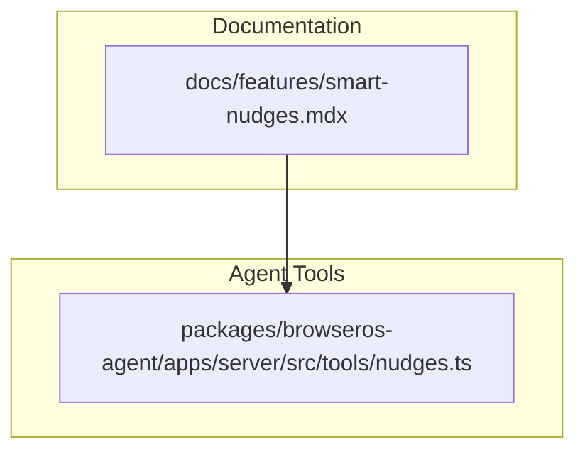
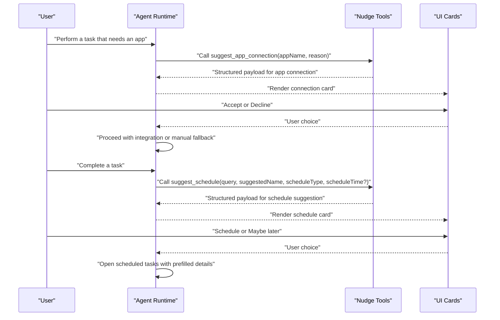
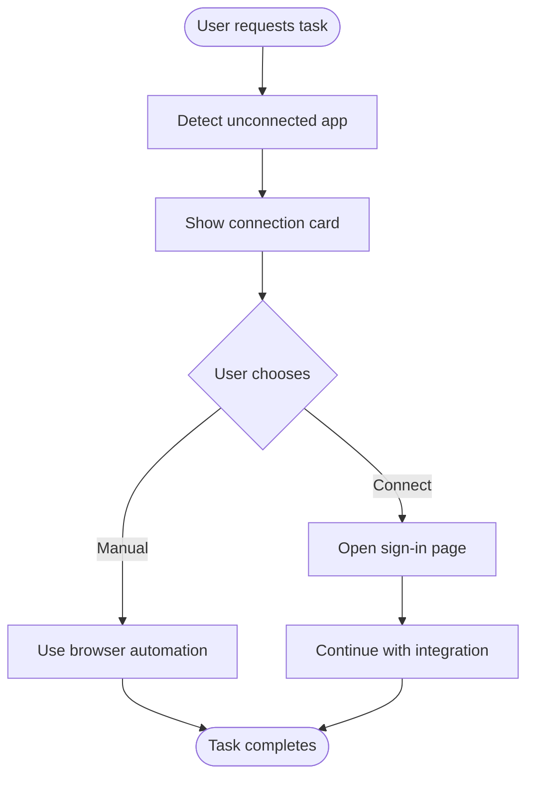
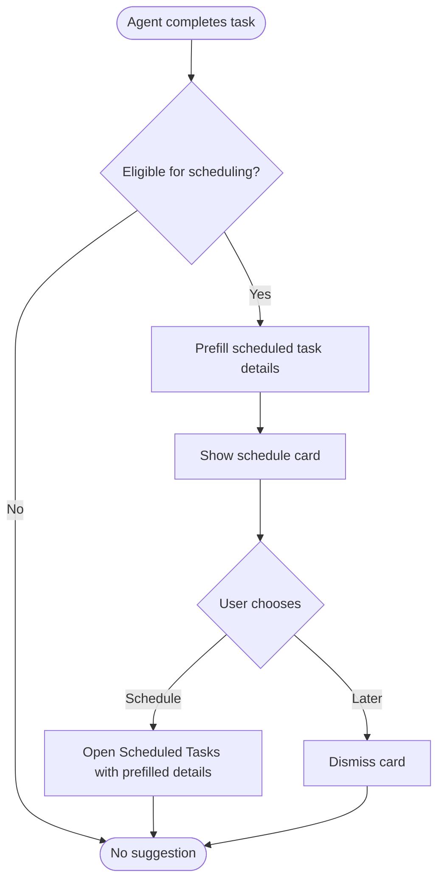
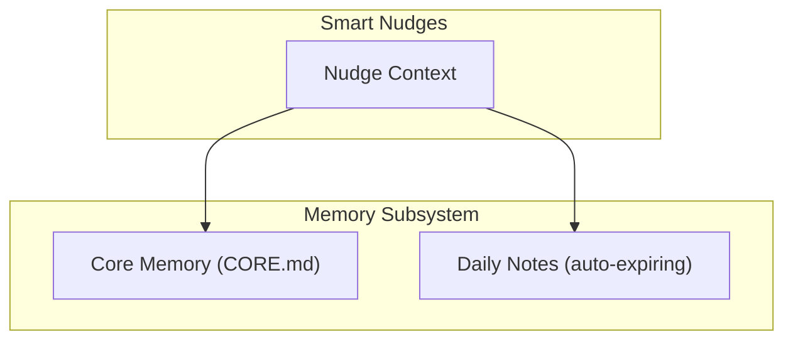
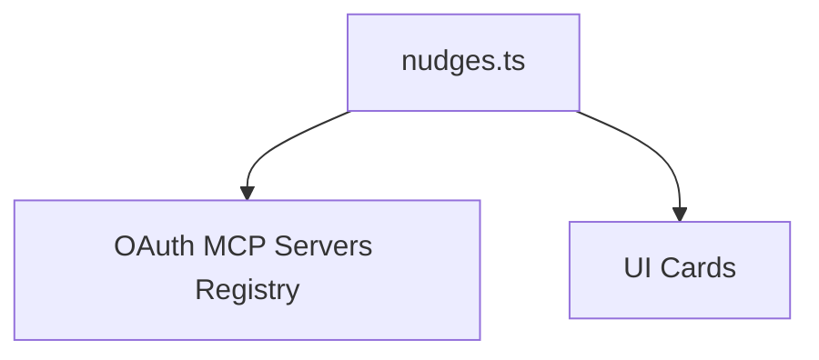

# Smart Nudges System

<cite>
**Referenced Files in This Document**
- [smart-nudges.mdx](file://docs/features/smart-nudges.mdx)
- [nudges.ts](file://packages/browseros-agent/apps/server/src/tools/nudges.ts)
- [memory.mdx](file://docs/features/memory.mdx)
- [memory.ts](file://packages/browseros-agent/packages/cdp-protocol/src/generated/domain-apis/memory.ts)
- [memory.ts](file://packages/browseros-agent/packages/cdp-protocol/src/generated/domains/memory.ts)
</cite>

## Table of Contents
1. [Introduction](#introduction)
2. [Project Structure](#project-structure)
3. [Core Components](#core-components)
4. [Architecture Overview](#architecture-overview)
5. [Detailed Component Analysis](#detailed-component-analysis)
6. [Dependency Analysis](#dependency-analysis)
7. [Performance Considerations](#performance-considerations)
8. [Troubleshooting Guide](#troubleshooting-guide)
9. [Conclusion](#conclusion)
10. [Appendices](#appendices)

## Introduction
The Smart Nudges System in BrowserOS delivers contextual suggestions and recommendations at the right moment to improve user productivity. It provides two primary suggestion types:
- App Connection nudges: Prompt users to connect external applications when a requested task requires integration access.
- Schedule Suggestion nudges: Propose automating recurring tasks by suggesting a schedule after the agent completes a suitable task.

These nudges appear as interactive cards during a conversation, allowing users to accept or decline without interrupting their workflow. The system emphasizes user control, privacy, and seamless integration with BrowserOS's broader capabilities.

## Project Structure
The Smart Nudges System spans documentation and agent tooling:
- Documentation defines user-facing behavior, suggestion types, and privacy guarantees.
- Agent tooling exposes structured tools for generating suggestion payloads that the UI renders as interactive cards.

**Diagram sources**
- [smart-nudges.mdx:1-118](file://docs/features/smart-nudges.mdx#L1-L118)
- [nudges.ts:1-66](file://packages/browseros-agent/apps/server/src/tools/nudges.ts#L1-L66)

**Section sources**
- [smart-nudges.mdx:1-118](file://docs/features/smart-nudges.mdx#L1-L118)
- [nudges.ts:1-66](file://packages/browseros-agent/apps/server/src/tools/nudges.ts#L1-L66)

## Core Components
- App Connection Tool: Generates a structured suggestion payload for connecting an external application when a task requires integration access. It includes the app name and a concise reason for connecting.
- Schedule Suggestion Tool: Generates a structured suggestion payload for scheduling a task after the agent completes a suitable recurring task. It includes the original query, a suggested task name, schedule type (daily or hourly), and an optional suggested time for daily tasks.

Both tools are defined via a framework that standardizes tool metadata, input schemas, and response formatting. The resulting payloads are rendered as interactive cards in the UI.

**Section sources**
- [nudges.ts:7-39](file://packages/browseros-agent/apps/server/src/tools/nudges.ts#L7-L39)
- [nudges.ts:41-65](file://packages/browseros-agent/apps/server/src/tools/nudges.ts#L41-L65)

## Architecture Overview
The Smart Nudges System integrates with the agent runtime to detect opportunities and present actionable suggestions. The flow is:

**Diagram sources**
- [nudges.ts:7-39](file://packages/browseros-agent/apps/server/src/tools/nudges.ts#L7-L39)
- [nudges.ts:41-65](file://packages/browseros-agent/apps/server/src/tools/nudges.ts#L41-L65)

## Detailed Component Analysis

### App Connection Nudge
- Trigger: When a user requests a task involving an external app that is not currently connected.
- Behavior: Presents a card explaining why connecting the app helps and offers two actions: Connect or Do it manually.
- Outcome:
  - Connect: Opens the app's sign-in page; upon authorization, the agent continues with full integration access.
  - Do it manually: The agent remembers the choice and uses browser automation instead for that task.
- Persistence: Declined apps are stored locally so the agent does not re-prompt unless reconnected from settings.

**Diagram sources**
- [smart-nudges.mdx:10-47](file://docs/features/smart-nudges.mdx#L10-L47)
- [nudges.ts:41-65](file://packages/browseros-agent/apps/server/src/tools/nudges.ts#L41-L65)

**Section sources**
- [smart-nudges.mdx:10-47](file://docs/features/smart-nudges.mdx#L10-L47)
- [nudges.ts:41-65](file://packages/browseros-agent/apps/server/src/tools/nudges.ts#L41-L65)

### Schedule Suggestion Nudge
- Trigger: After the agent completes a task that could run on a recurring schedule (e.g., news gathering, monitoring, report building).
- Behavior: Presents a card with a suggested task name and schedule (daily or hourly), optionally including a suggested time for daily tasks.
- Outcome:
  - Schedule this task: Opens the Scheduled Tasks page with prefilled details for review and confirmation.
  - Maybe later: Dismisses the card; users can create the scheduled task manually later.
- Direct scheduling: Users can also request scheduling directly, prompting the agent to infer parameters and show the card immediately.

**Diagram sources**
- [smart-nudges.mdx:49-93](file://docs/features/smart-nudges.mdx#L49-L93)
- [nudges.ts:7-39](file://packages/browseros-agent/apps/server/src/tools/nudges.ts#L7-L39)

**Section sources**
- [smart-nudges.mdx:49-93](file://docs/features/smart-nudges.mdx#L49-L93)
- [nudges.ts:7-39](file://packages/browseros-agent/apps/server/src/tools/nudges.ts#L7-L39)

### Privacy and User Control
- Nothing is sent without explicit approval: The agent only suggests a connection; no data is shared with the app until the user authorizes.
- Choices are remembered locally: Declined apps are stored on the device so the agent will not ask again unless reconnected from settings.
- Local storage: All memory and related data remain on the user's machine, ensuring privacy and user control.

**Section sources**
- [smart-nudges.mdx:108-117](file://docs/features/smart-nudges.mdx#L108-L117)

### Integration with Memory Systems
While the Smart Nudges System focuses on contextual suggestions during a conversation, BrowserOS's Memory system supports long-term personalization and context retention across sessions. The memory subsystem stores:
- Core memory: Permanent facts about the user (name, role, projects, tools, preferences).
- Daily memory: Session notes and recent events, auto-expiring after 30 days.

**Diagram sources**
- [memory.mdx:27-56](file://docs/features/memory.mdx#L27-L56)
- [memory.mdx:88-96](file://docs/features/memory.mdx#L88-L96)

**Section sources**
- [memory.mdx:1-129](file://docs/features/memory.mdx#L1-L129)

### Relationship Between Smart Nudges and User Experience
Smart Nudges enhance user experience by:
- Reducing friction: Presenting helpful actions at the right time without interrupting focus.
- Increasing productivity: Encouraging integration adoption and automation of recurring tasks.
- Maintaining control: Allowing users to accept, decline, or defer suggestions.
- Preserving privacy: Ensuring no data sharing occurs without explicit consent.

**Section sources**
- [smart-nudges.mdx:6-11](file://docs/features/smart-nudges.mdx#L6-L11)

## Dependency Analysis
The Smart Nudges System depends on:
- Agent tooling: Structured tools that produce standardized suggestion payloads.
- OAuth MCP servers: A registry of supported apps used for app connection suggestions.
- UI rendering: Cards that interpret suggestion payloads and collect user decisions.

**Diagram sources**
- [nudges.ts:1-66](file://packages/browseros-agent/apps/server/src/tools/nudges.ts#L1-L66)

**Section sources**
- [nudges.ts:1-66](file://packages/browseros-agent/apps/server/src/tools/nudges.ts#L1-L66)

## Performance Considerations
- Lightweight payloads: Suggestion payloads include only essential fields, minimizing overhead.
- Conditional appearance: Nudges avoid interrupting scheduled tasks or chat-only modes, reducing unnecessary UI churn.
- Local persistence: Declined choices are stored locally to prevent repeated prompts, improving responsiveness.

**Section sources**
- [smart-nudges.mdx:95-107](file://docs/features/smart-nudges.mdx#L95-L107)

## Troubleshooting Guide
Common scenarios and resolutions:
- App connection not appearing:
  - Verify the requested task requires an integration and the app is supported.
  - Confirm the app is not already connected or previously declined.
- Schedule suggestion not appearing:
  - Ensure the task was completed and is eligible for automation.
  - Check that the mode is not chat-only or a background scheduled task.
- Privacy concerns:
  - Remember that no data is shared until you explicitly approve a connection.
  - Declined choices are stored locally and will not be prompted again unless reconnected.

**Section sources**
- [smart-nudges.mdx:104-117](file://docs/features/smart-nudges.mdx#L104-L117)

## Conclusion
The Smart Nudges System in BrowserOS provides timely, context-aware suggestions that improve user productivity while preserving privacy and user control. Through structured tools and clear UX patterns, it encourages integration adoption and automation of recurring tasks, integrating seamlessly with BrowserOS's broader ecosystem.

## Appendices
- Supported apps: The system supports all built-in integrations, including numerous third-party services. See the Connect Apps feature for the full list.
- Direct scheduling: Users can request scheduling directly, enabling immediate proposal generation without waiting for an automatic suggestion.

**Section sources**
- [smart-nudges.mdx:45-47](file://docs/features/smart-nudges.mdx#L45-L47)
- [smart-nudges.mdx:69-82](file://docs/features/smart-nudges.mdx#L69-L82)