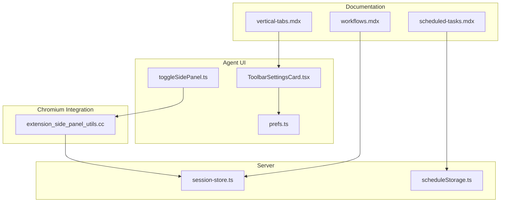
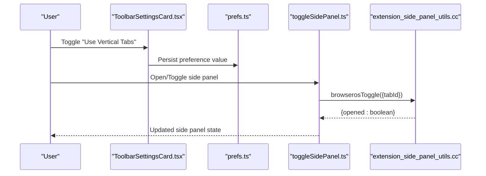
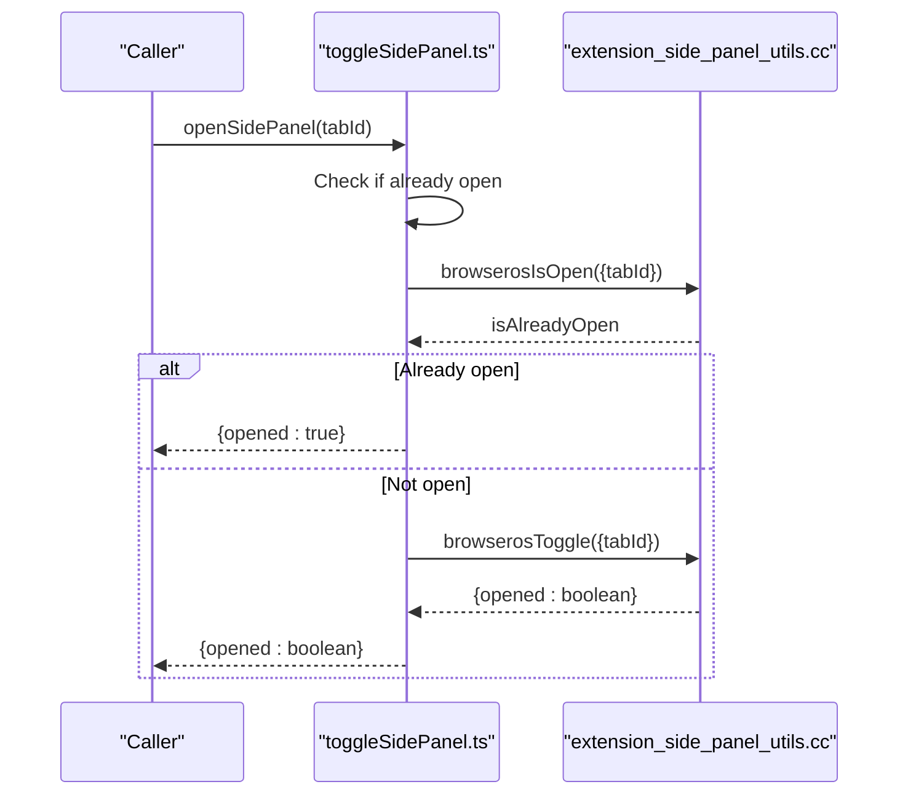
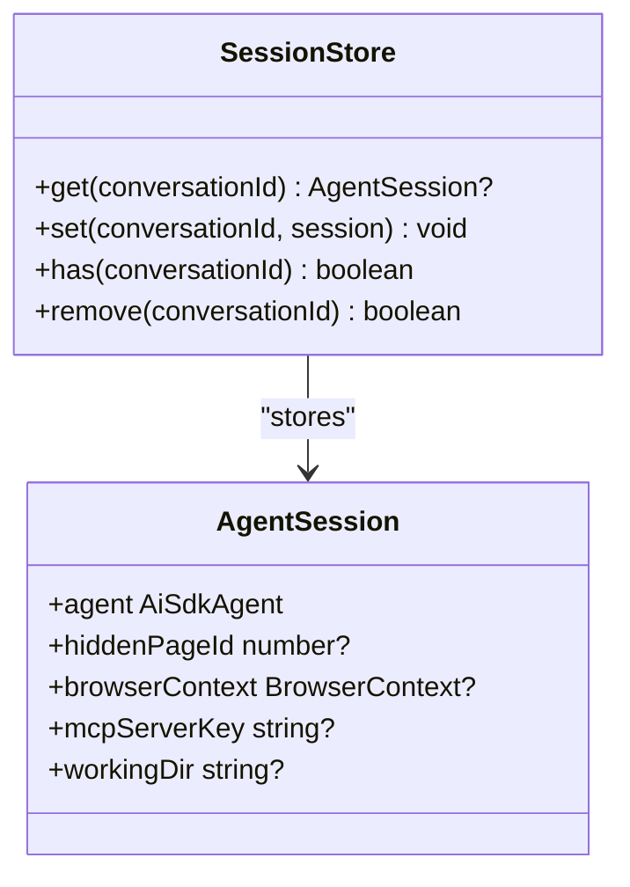
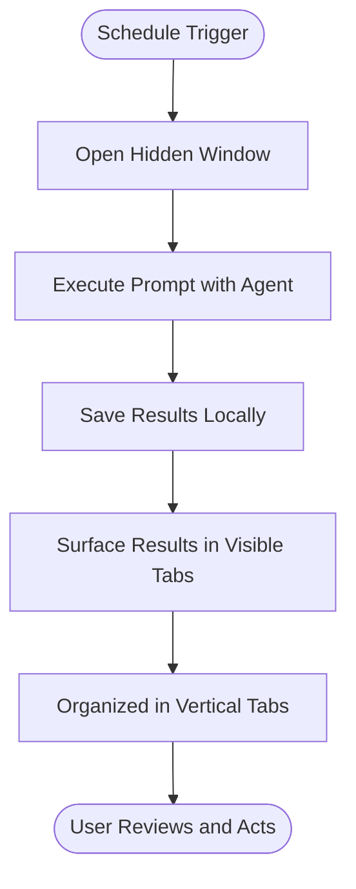
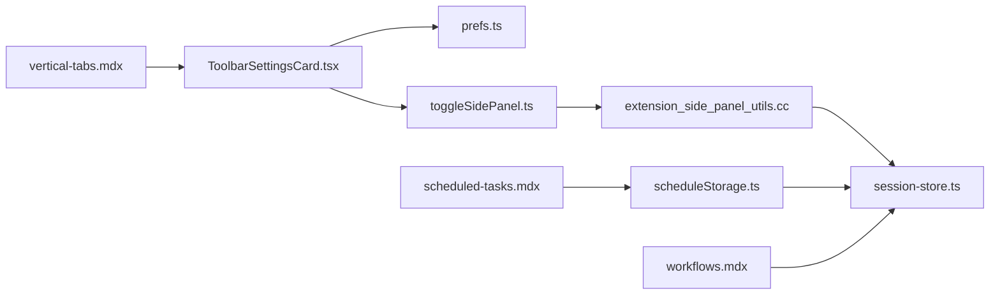

# Vertical Tabs Management

<cite>
**Referenced Files in This Document**
- [vertical-tabs.mdx](file://docs/features/vertical-tabs.mdx)
- [scheduled-tasks.mdx](file://docs/features/scheduled-tasks.mdx)
- [workflows.mdx](file://docs/features/workflows.mdx)
- [toggleSidePanel.ts](file://packages/browseros-agent/apps/agent/lib/browseros/toggleSidePanel.ts)
- [ToolbarSettingsCard.tsx](file://packages/browseros-agent/apps/agent/entrypoints/app/customization/ToolbarSettingsCard.tsx)
- [prefs.ts](file://packages/browseros-agent/apps/agent/lib/browseros/prefs.ts)
- [scheduleStorage.ts](file://packages/browseros-agent/apps/agent/lib/schedules/scheduleStorage.ts)
- [session-store.ts](file://packages/browseros-agent/apps/server/src/agent/session-store.ts)
- [extension_side_panel_utils.cc](file://packages/browseros/chromium_patches/chrome/browser/ui/views/side_panel/extensions/extension_side_panel_utils.cc)
</cite>

## Table of Contents
1. [Introduction](#introduction)
2. [Project Structure](#project-structure)
3. [Core Components](#core-components)
4. [Architecture Overview](#architecture-overview)
5. [Detailed Component Analysis](#detailed-component-analysis)
6. [Dependency Analysis](#dependency-analysis)
7. [Performance Considerations](#performance-considerations)
8. [Troubleshooting Guide](#troubleshooting-guide)
9. [Conclusion](#conclusion)
10. [Appendices](#appendices)

## Introduction
This document explains how BrowserOS manages browser automation sessions using a vertical tabs side-panel system. It covers enabling vertical tabs, organizing multiple active workflows and scheduled tasks, integrating tabs with workflows for session persistence, coordinating with scheduled tasks for automated execution, and optimizing large-scale multi-tab environments. Practical strategies for tab organization, session management, collaboration, layout customization, and cross-device synchronization are included.

## Project Structure
The vertical tabs feature spans documentation, UI preferences, Chromium-side panel APIs, and backend session management:
- Feature documentation defines user-facing behavior and setup.
- UI settings expose a toggle for vertical tabs.
- Chromium-side panel utilities integrate with the browser’s side panel system.
- Scheduling and session management coordinate background automation with visible tabs.

**Diagram sources**
- [vertical-tabs.mdx](file://docs/features/vertical-tabs.mdx)
- [scheduled-tasks.mdx](file://docs/features/scheduled-tasks.mdx)
- [workflows.mdx](file://docs/features/workflows.mdx)
- [ToolbarSettingsCard.tsx](file://packages/browseros-agent/apps/agent/entrypoints/app/customization/ToolbarSettingsCard.tsx)
- [toggleSidePanel.ts](file://packages/browseros-agent/apps/agent/lib/browseros/toggleSidePanel.ts)
- [prefs.ts](file://packages/browseros-agent/apps/agent/lib/browseros/prefs.ts)
- [extension_side_panel_utils.cc](file://packages/browseros/chromium_patches/chrome/browser/ui/views/side_panel/extensions/extension_side_panel_utils.cc)
- [session-store.ts](file://packages/browseros-agent/apps/server/src/agent/session-store.ts)
- [scheduleStorage.ts](file://packages/browseros-agent/apps/agent/lib/schedules/scheduleStorage.ts)

**Section sources**
- [vertical-tabs.mdx](file://docs/features/vertical-tabs.mdx)
- [ToolbarSettingsCard.tsx](file://packages/browseros-agent/apps/agent/entrypoints/app/customization/ToolbarSettingsCard.tsx)
- [toggleSidePanel.ts](file://packages/browseros-agent/apps/agent/lib/browseros/toggleSidePanel.ts)
- [prefs.ts](file://packages/browseros-agent/apps/agent/lib/browseros/prefs.ts)
- [extension_side_panel_utils.cc](file://packages/browseros/chromium_patches/chrome/browser/ui/views/side_panel/extensions/extension_side_panel_utils.cc)
- [session-store.ts](file://packages/browseros-agent/apps/server/src/agent/session-store.ts)
- [scheduleStorage.ts](file://packages/browseros-agent/apps/agent/lib/schedules/scheduleStorage.ts)

## Core Components
- Vertical tabs UI and settings: Users enable/disable vertical tabs via Customization settings, which toggles a preference stored in the agent’s preferences layer.
- Side panel API integration: The agent exposes functions to open or toggle the side panel per tab, backed by Chromium’s side panel extension APIs.
- Session persistence: Sessions maintain browser contexts and optional hidden pages for scheduled tasks, enabling persistent automation across tab switches.
- Scheduling coordination: Scheduled tasks run in hidden windows and surface results in visible tabs; vertical tabs help organize these outputs alongside active workflows.

**Section sources**
- [vertical-tabs.mdx](file://docs/features/vertical-tabs.mdx)
- [ToolbarSettingsCard.tsx](file://packages/browseros-agent/apps/agent/entrypoints/app/customization/ToolbarSettingsCard.tsx)
- [prefs.ts](file://packages/browseros-agent/apps/agent/lib/browseros/prefs.ts)
- [toggleSidePanel.ts](file://packages/browseros-agent/apps/agent/lib/browseros/toggleSidePanel.ts)
- [extension_side_panel_utils.cc](file://packages/browseros/chromium_patches/chrome/browser/ui/views/side_panel/extensions/extension_side_panel_utils.cc)
- [session-store.ts](file://packages/browseros-agent/apps/server/src/agent/session-store.ts)
- [scheduleStorage.ts](file://packages/browseros-agent/apps/agent/lib/schedules/scheduleStorage.ts)

## Architecture Overview
The vertical tabs system integrates UI preferences, Chromium side panel APIs, and automation services:
- Preferences drive the UI toggle and persist the vertical tabs state.
- Side panel toggling is handled by the agent’s side panel utilities and delegated to Chromium’s side panel registry.
- Sessions encapsulate automation contexts and optional hidden pages for scheduled tasks.
- Schedules trigger background runs and surface results into visible tabs, which benefit from vertical tab organization.

**Diagram sources**
- [ToolbarSettingsCard.tsx](file://packages/browseros-agent/apps/agent/entrypoints/app/customization/ToolbarSettingsCard.tsx)
- [prefs.ts](file://packages/browseros-agent/apps/agent/lib/browseros/prefs.ts)
- [toggleSidePanel.ts](file://packages/browseros-agent/apps/agent/lib/browseros/toggleSidePanel.ts)
- [extension_side_panel_utils.cc](file://packages/browseros/chromium_patches/chrome/browser/ui/views/side_panel/extensions/extension_side_panel_utils.cc)

## Detailed Component Analysis

### Vertical Tabs UI and Behavior
- Enabling/disabling vertical tabs: The UI presents a toggle in Customization settings that flips a preference controlling the vertical tabs mode. When enabled, tabs relocate to a collapsible side panel on the left with full-width labels and favicons.
- Interaction model: Click to switch tabs, right-click for standard context actions, drag to reorder or move between groups, and collapse to icon-only mode for more space.

**Section sources**
- [vertical-tabs.mdx](file://docs/features/vertical-tabs.mdx)
- [ToolbarSettingsCard.tsx](file://packages/browseros-agent/apps/agent/entrypoints/app/customization/ToolbarSettingsCard.tsx)

### Side Panel API Integration
- Per-tab side panel control: The agent exposes functions to open or toggle the side panel for a given tab ID. These functions delegate to Chromium’s side panel extension APIs and return the current open state.
- Contextual panel activation: Utilities determine whether a contextual panel is active for a given tab, supporting visibility and lifecycle management.

**Diagram sources**
- [toggleSidePanel.ts](file://packages/browseros-agent/apps/agent/lib/browseros/toggleSidePanel.ts)
- [extension_side_panel_utils.cc](file://packages/browseros/chromium_patches/chrome/browser/ui/views/side_panel/extensions/extension_side_panel_utils.cc)

**Section sources**
- [toggleSidePanel.ts](file://packages/browseros-agent/apps/agent/lib/browseros/toggleSidePanel.ts)
- [extension_side_panel_utils.cc](file://packages/browseros/chromium_patches/chrome/browser/ui/views/side_panel/extensions/extension_side_panel_utils.cc)

### Session Persistence and Automation Integration
- Session store: Maintains agent sessions with optional hidden page IDs and browser contexts. This enables automation to persist across tab switches and re-attach to the correct context.
- Scheduled tasks: Background runs occur in hidden windows; results surface in visible tabs. Vertical tabs help organize these outputs alongside active workflows.

**Diagram sources**
- [session-store.ts](file://packages/browseros-agent/apps/server/src/agent/session-store.ts)

**Section sources**
- [session-store.ts](file://packages/browseros-agent/apps/server/src/agent/session-store.ts)
- [scheduleStorage.ts](file://packages/browseros-agent/apps/agent/lib/schedules/scheduleStorage.ts)

### Scheduling Coordination with Vertical Tabs
- Triggering and execution: Scheduled tasks use the browser’s alarm system to trigger runs. They execute in a hidden window and save results that appear in visible tabs.
- Visibility and organization: With vertical tabs enabled, scheduled task outputs and workflow tabs are easily distinguishable and manageable in a single side panel.

**Diagram sources**
- [scheduled-tasks.mdx](file://docs/features/scheduled-tasks.mdx)
- [scheduleStorage.ts](file://packages/browseros-agent/apps/agent/lib/schedules/scheduleStorage.ts)

**Section sources**
- [scheduled-tasks.mdx](file://docs/features/scheduled-tasks.mdx)
- [scheduleStorage.ts](file://packages/browseros-agent/apps/agent/lib/schedules/scheduleStorage.ts)

### Tab Organization Strategies and Collaboration
- Grouping with workflows: Vertical tabs pair with tab groups to visually separate projects and fold away inactive tabs, improving focus during multi-task automation.
- Practical strategies:
  - Use tab groups for distinct automation domains (e.g., research, production, testing).
  - Collapse the side panel to icon-only mode when maximizing workspace.
  - Pin frequently used automation tabs for quick access.
- Collaborative setups: While direct sharing of tab state is not documented, cloud sync of schedules and preferences ensures consistent vertical tabs behavior across devices.

**Section sources**
- [vertical-tabs.mdx](file://docs/features/vertical-tabs.mdx)
- [workflows.mdx](file://docs/features/workflows.mdx)

## Dependency Analysis
The vertical tabs feature depends on:
- UI preferences to control vertical tabs mode.
- Side panel APIs for per-tab side panel visibility.
- Session management for automation continuity.
- Scheduling subsystem for background automation and result surfacing.

**Diagram sources**
- [ToolbarSettingsCard.tsx](file://packages/browseros-agent/apps/agent/entrypoints/app/customization/ToolbarSettingsCard.tsx)
- [prefs.ts](file://packages/browseros-agent/apps/agent/lib/browseros/prefs.ts)
- [toggleSidePanel.ts](file://packages/browseros-agent/apps/agent/lib/browseros/toggleSidePanel.ts)
- [extension_side_panel_utils.cc](file://packages/browseros/chromium_patches/chrome/browser/ui/views/side_panel/extensions/extension_side_panel_utils.cc)
- [session-store.ts](file://packages/browseros-agent/apps/server/src/agent/session-store.ts)
- [scheduleStorage.ts](file://packages/browseros-agent/apps/agent/lib/schedules/scheduleStorage.ts)
- [vertical-tabs.mdx](file://docs/features/vertical-tabs.mdx)
- [scheduled-tasks.mdx](file://docs/features/scheduled-tasks.mdx)
- [workflows.mdx](file://docs/features/workflows.mdx)

**Section sources**
- [ToolbarSettingsCard.tsx](file://packages/browseros-agent/apps/agent/entrypoints/app/customization/ToolbarSettingsCard.tsx)
- [prefs.ts](file://packages/browseros-agent/apps/agent/lib/browseros/prefs.ts)
- [toggleSidePanel.ts](file://packages/browseros-agent/apps/agent/lib/browseros/toggleSidePanel.ts)
- [extension_side_panel_utils.cc](file://packages/browseros/chromium_patches/chrome/browser/ui/views/side_panel/extensions/extension_side_panel_utils.cc)
- [session-store.ts](file://packages/browseros-agent/apps/server/src/agent/session-store.ts)
- [scheduleStorage.ts](file://packages/browseros-agent/apps/agent/lib/schedules/scheduleStorage.ts)
- [vertical-tabs.mdx](file://docs/features/vertical-tabs.mdx)
- [scheduled-tasks.mdx](file://docs/features/scheduled-tasks.mdx)
- [workflows.mdx](file://docs/features/workflows.mdx)

## Performance Considerations
- Large numbers of tabs: Vertical tabs reduce visual clutter and improve scanning of many tabs. Collapse the panel to icon-only mode to reclaim horizontal space.
- Background automation: Scheduled tasks run in hidden windows to avoid blocking foreground activity. Keep the agent responsive by batching long-running tasks and leveraging parallelism where appropriate.
- Memory and rendering: Prefer grouping related tabs and closing unused ones to minimize rendering overhead. Use tab groups to hide inactive sets while preserving session state.

[No sources needed since this section provides general guidance]

## Troubleshooting Guide
- Side panel does not open: Verify the side panel toggle is active for the current tab and that the Chromium-side panel extension APIs are available. Check for errors returned by the toggle function.
- Vertical tabs not appearing: Confirm the Customization setting is enabled and the preference is persisted. Re-enable the setting if necessary.
- Scheduled task results missing: Ensure the task executed successfully and surfaced results in a visible tab. Review run history and logs for failures.
- Session continuity issues: Confirm the session store retains the correct hidden page ID and browser context for the active automation.

**Section sources**
- [toggleSidePanel.ts](file://packages/browseros-agent/apps/agent/lib/browseros/toggleSidePanel.ts)
- [ToolbarSettingsCard.tsx](file://packages/browseros-agent/apps/agent/entrypoints/app/customization/ToolbarSettingsCard.tsx)
- [session-store.ts](file://packages/browseros-agent/apps/server/src/agent/session-store.ts)
- [scheduleStorage.ts](file://packages/browseros-agent/apps/agent/lib/schedules/scheduleStorage.ts)

## Conclusion
Vertical tabs in BrowserOS streamline multi-task automation by offering a clean, scalable side-panel interface for organizing numerous browser sessions. Combined with workflow-driven automation and scheduled tasks, users can manage complex, coordinated workflows while maintaining visibility and control. Preferences, side panel APIs, session persistence, and scheduling work together to support efficient, large-scale automation scenarios.

[No sources needed since this section summarizes without analyzing specific files]

## Appendices

### Configuration Options and Best Practices
- Vertical tabs toggle: Controlled via Customization settings; enabling collapses the horizontal tab bar into a side panel with full-width labels.
- Layout customization: Collapse the side panel to icon-only mode for more workspace; use tab groups to visually segment automation domains.
- Session restoration: Use the session store to maintain automation contexts and hidden pages for scheduled tasks.
- Cross-device synchronization: Preferences and schedules can sync across devices when signed in, ensuring consistent vertical tabs behavior and scheduled task configurations.

**Section sources**
- [vertical-tabs.mdx](file://docs/features/vertical-tabs.mdx)
- [ToolbarSettingsCard.tsx](file://packages/browseros-agent/apps/agent/entrypoints/app/customization/ToolbarSettingsCard.tsx)
- [prefs.ts](file://packages/browseros-agent/apps/agent/lib/browseros/prefs.ts)
- [scheduleStorage.ts](file://packages/browseros-agent/apps/agent/lib/schedules/scheduleStorage.ts)