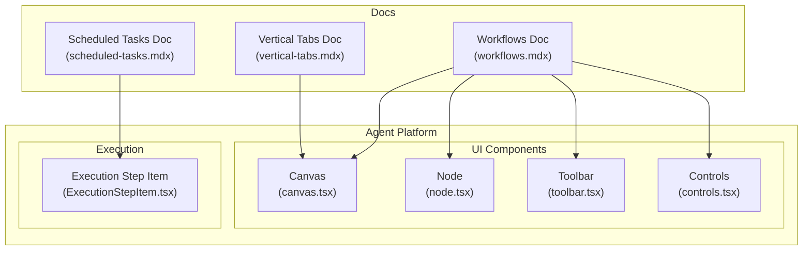
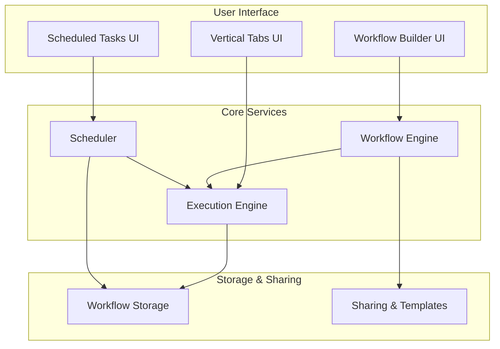
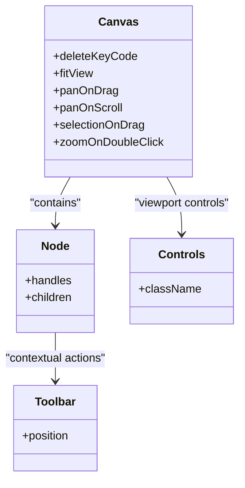
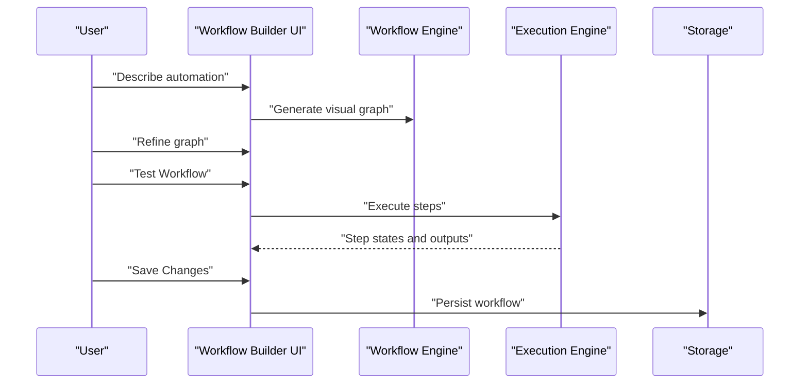
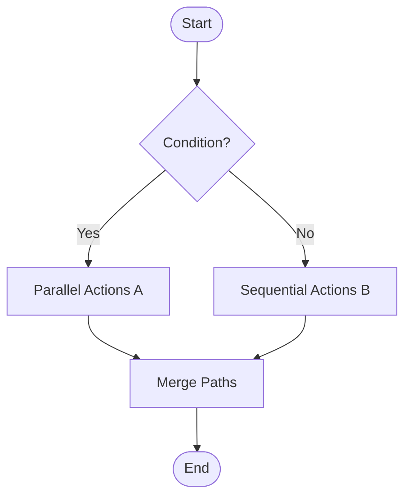
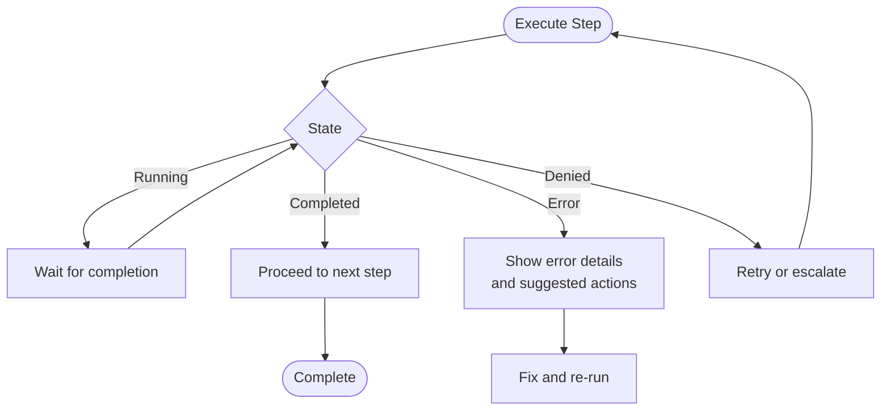
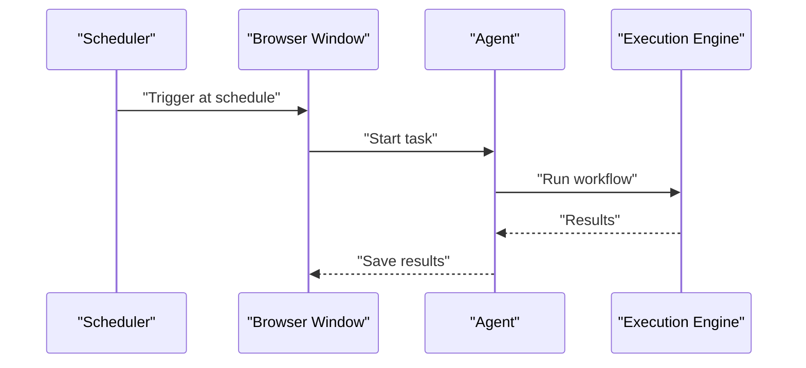
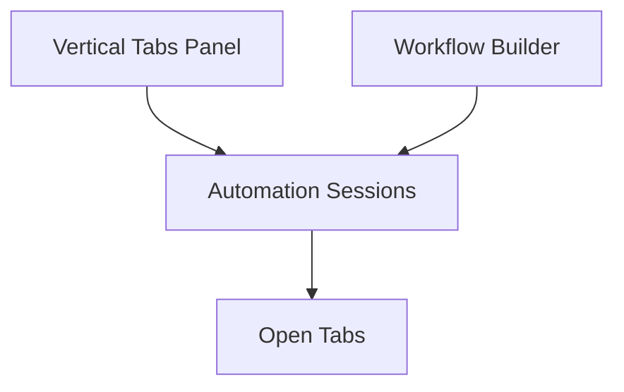
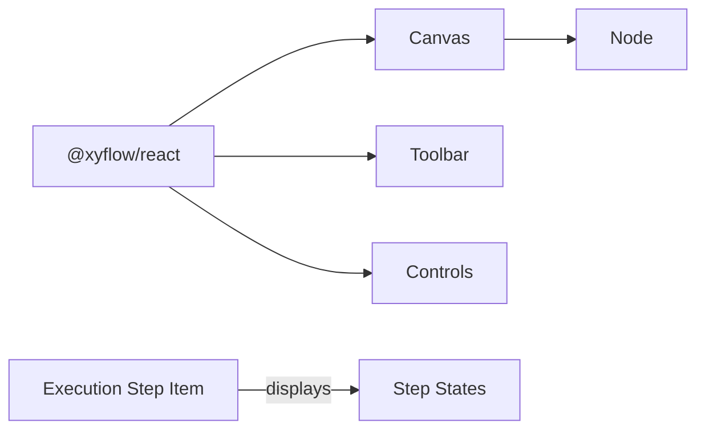

# Visual Workflow Builder

<cite>
**Referenced Files in This Document**
- [README.md](file://README.md)
- [workflows.mdx](file://docs/features/workflows.mdx)
- [scheduled-tasks.mdx](file://docs/features/scheduled-tasks.mdx)
- [vertical-tabs.mdx](file://docs/features/vertical-tabs.mdx)
- [canvas.tsx](file://packages/browseros-agent/apps/agent/components/ai-elements/canvas.tsx)
- [node.tsx](file://packages/browseros-agent/apps/agent/components/ai-elements/node.tsx)
- [toolbar.tsx](file://packages/browseros-agent/apps/agent/components/ai-elements/toolbar.tsx)
- [controls.tsx](file://packages/browseros-agent/apps/agent/components/ai-elements/controls.tsx)
- [ExecutionStepItem.tsx](file://packages/browseros-agent/apps/agent/components/execution-history/ExecutionStepItem.tsx)
- [render-graphs.js](file://.claude/skills/writing-skills/render-graphs.js)
</cite>

## Table of Contents
1. [Introduction](#introduction)
2. [Project Structure](#project-structure)
3. [Core Components](#core-components)
4. [Architecture Overview](#architecture-overview)
5. [Detailed Component Analysis](#detailed-component-analysis)
6. [Dependency Analysis](#dependency-analysis)
7. [Performance Considerations](#performance-considerations)
8. [Troubleshooting Guide](#troubleshooting-guide)
9. [Conclusion](#conclusion)
10. [Appendices](#appendices)

## Introduction
This document describes the Visual Workflow Builder for BrowserOS, focusing on the drag-and-drop automation interface, workflow creation, visual representation of browser actions, integration with scheduled tasks, storage and sharing, versioning, and the relationship with vertical tabs for managing multiple automation sessions. It also covers common workflow patterns, conditional logic, error handling, export/import and templates, collaboration features, optimization techniques, debugging, and best practices for complex automation scenarios.

## Project Structure
The Visual Workflow Builder is part of the BrowserOS agent platform. The repository is a monorepo with two main subsystems:
- Browser (Chromium fork)
- Agent platform (TypeScript/Go)

The agent platform includes:
- Server exposing 53+ MCP tools and running the AI agent loop
- Browser extension UI (WXT + React)
- CLI tool
- Evaluation framework
- Agent SDK and CDP protocol bindings

The visual workflow builder leverages React Flow for drag-and-drop graph construction and rendering, with reusable UI components for nodes, canvas, toolbar, and controls.

**Diagram sources**
- [canvas.tsx:1-23](file://packages/browseros-agent/apps/agent/components/ai-elements/canvas.tsx#L1-L23)
- [node.tsx:1-92](file://packages/browseros-agent/apps/agent/components/ai-elements/node.tsx#L1-L92)
- [toolbar.tsx:1-19](file://packages/browseros-agent/apps/agent/components/ai-elements/toolbar.tsx#L1-L19)
- [controls.tsx:1-21](file://packages/browseros-agent/apps/agent/components/ai-elements/controls.tsx#L1-L21)
- [ExecutionStepItem.tsx:1-44](file://packages/browseros-agent/apps/agent/components/execution-history/ExecutionStepItem.tsx#L1-L44)
- [workflows.mdx:1-70](file://docs/features/workflows.mdx#L1-L70)
- [scheduled-tasks.mdx:1-148](file://docs/features/scheduled-tasks.mdx#L1-L148)
- [vertical-tabs.mdx:1-61](file://docs/features/vertical-tabs.mdx#L1-L61)

**Section sources**
- [README.md:144-178](file://README.md#L144-L178)
- [workflows.mdx:1-70](file://docs/features/workflows.mdx#L1-L70)
- [scheduled-tasks.mdx:1-148](file://docs/features/scheduled-tasks.mdx#L1-L148)
- [vertical-tabs.mdx:1-61](file://docs/features/vertical-tabs.mdx#L1-L61)

## Core Components
- Canvas: Provides the React Flow container with background, keyboard shortcuts, and viewport controls for drag-and-drop.
- Node: A reusable card-based component with optional handles for connecting nodes, enabling visual graph construction.
- Toolbar: A contextual toolbar positioned relative to selected nodes for inline actions.
- Controls: UI controls for zoom, fit view, and navigation within the canvas.
- Execution Step Item: Renders individual tool invocations and their states, useful for debugging and validating workflow execution.

These components collectively enable the visual workflow builder’s drag-and-drop interface and provide a consistent, accessible UX for constructing and inspecting automation flows.

**Section sources**
- [canvas.tsx:1-23](file://packages/browseros-agent/apps/agent/components/ai-elements/canvas.tsx#L1-L23)
- [node.tsx:1-92](file://packages/browseros-agent/apps/agent/components/ai-elements/node.tsx#L1-L92)
- [toolbar.tsx:1-19](file://packages/browseros-agent/apps/agent/components/ai-elements/toolbar.tsx#L1-L19)
- [controls.tsx:1-21](file://packages/browseros-agent/apps/agent/components/ai-elements/controls.tsx#L1-L21)
- [ExecutionStepItem.tsx:1-44](file://packages/browseros-agent/apps/agent/components/execution-history/ExecutionStepItem.tsx#L1-L44)

## Architecture Overview
The Visual Workflow Builder integrates with BrowserOS features to deliver a seamless automation experience:
- Workflows: Visual graph builder for repeatable browser automations.
- Scheduled Tasks: Automated execution of prompts or workflows on a schedule.
- Vertical Tabs: Side-panel tab management to organize multiple automation sessions.

[No sources needed since this diagram shows conceptual architecture, not a direct code mapping]

## Detailed Component Analysis

### Visual Graph Builder (Canvas, Node, Toolbar, Controls)
The visual builder uses React Flow to provide a drag-and-drop environment:
- Canvas: Configures keyboard shortcuts, viewport behavior, and background.
- Node: Encapsulates a card with optional handles for incoming and outgoing connections.
- Toolbar: Appears near selected nodes to offer inline actions.
- Controls: Provides zoom and fit-view controls.

**Diagram sources**
- [canvas.tsx:1-23](file://packages/browseros-agent/apps/agent/components/ai-elements/canvas.tsx#L1-L23)
- [node.tsx:1-92](file://packages/browseros-agent/apps/agent/components/ai-elements/node.tsx#L1-L92)
- [toolbar.tsx:1-19](file://packages/browseros-agent/apps/agent/components/ai-elements/toolbar.tsx#L1-L19)
- [controls.tsx:1-21](file://packages/browseros-agent/apps/agent/components/ai-elements/controls.tsx#L1-L21)

**Section sources**
- [canvas.tsx:1-23](file://packages/browseros-agent/apps/agent/components/ai-elements/canvas.tsx#L1-L23)
- [node.tsx:1-92](file://packages/browseros-agent/apps/agent/components/ai-elements/node.tsx#L1-L92)
- [toolbar.tsx:1-19](file://packages/browseros-agent/apps/agent/components/ai-elements/toolbar.tsx#L1-L19)
- [controls.tsx:1-21](file://packages/browseros-agent/apps/agent/components/ai-elements/controls.tsx#L1-L21)

### Workflow Creation and Execution Flow
The workflow creation process involves generating a visual graph from a natural language description, refining it iteratively, testing, and saving. The execution pipeline records tool invocations and states for debugging.

**Diagram sources**
- [workflows.mdx:25-45](file://docs/features/workflows.mdx#L25-L45)
- [ExecutionStepItem.tsx:1-44](file://packages/browseros-agent/apps/agent/components/execution-history/ExecutionStepItem.tsx#L1-L44)

**Section sources**
- [workflows.mdx:25-45](file://docs/features/workflows.mdx#L25-L45)
- [ExecutionStepItem.tsx:1-44](file://packages/browseros-agent/apps/agent/components/execution-history/ExecutionStepItem.tsx#L1-L44)

### Conditional Logic and Parallel Execution
The visual builder supports complex flows including loops, conditionals, and parallel actions. The generated workflow graph can represent branching and concurrent steps, enabling robust automation patterns.

[No sources needed since this diagram shows conceptual logic, not a direct code mapping]

### Error Handling Strategies
The execution history component displays step states and outcomes, aiding in diagnosing failures and implementing retries or corrective actions.

**Diagram sources**
- [ExecutionStepItem.tsx:27-35](file://packages/browseros-agent/apps/agent/components/execution-history/ExecutionStepItem.tsx#L27-L35)

**Section sources**
- [ExecutionStepItem.tsx:1-44](file://packages/browseros-agent/apps/agent/components/execution-history/ExecutionStepItem.tsx#L1-L44)

### Integration with Scheduled Tasks
Scheduled tasks can run workflows automatically at configured intervals. The scheduler triggers tasks using the browser's alarm system and executes them in a hidden window.

**Diagram sources**
- [scheduled-tasks.mdx:109-124](file://docs/features/scheduled-tasks.mdx#L109-L124)

**Section sources**
- [scheduled-tasks.mdx:16-124](file://docs/features/scheduled-tasks.mdx#L16-L124)

### Relationship with Vertical Tabs
Vertical tabs provide a side-panel for organizing multiple automation sessions. They complement the workflow builder by offering a clean workspace for managing numerous tabs while building and running automations.

**Diagram sources**
- [vertical-tabs.mdx:49-61](file://docs/features/vertical-tabs.mdx#L49-L61)

**Section sources**
- [vertical-tabs.mdx:1-61](file://docs/features/vertical-tabs.mdx#L1-L61)

### Export, Import, Templates, and Collaboration
- Export/Import: Workflows can be exported and imported for reuse across environments.
- Templates: Predefined templates accelerate common automation patterns.
- Collaboration: Sharing workflows enables team-wide adoption and refinement.

[No sources needed since this section provides general guidance]

## Dependency Analysis
The visual workflow builder depends on React Flow for rendering and interaction, with UI components encapsulating layout and behavior. The execution history component complements the builder by surfacing runtime details.

**Diagram sources**
- [canvas.tsx:1-23](file://packages/browseros-agent/apps/agent/components/ai-elements/canvas.tsx#L1-L23)
- [node.tsx:1-92](file://packages/browseros-agent/apps/agent/components/ai-elements/node.tsx#L1-L92)
- [toolbar.tsx:1-19](file://packages/browseros-agent/apps/agent/components/ai-elements/toolbar.tsx#L1-L19)
- [controls.tsx:1-21](file://packages/browseros-agent/apps/agent/components/ai-elements/controls.tsx#L1-L21)
- [ExecutionStepItem.tsx:1-44](file://packages/browseros-agent/apps/agent/components/execution-history/ExecutionStepItem.tsx#L1-L44)

**Section sources**
- [canvas.tsx:1-23](file://packages/browseros-agent/apps/agent/components/ai-elements/canvas.tsx#L1-L23)
- [node.tsx:1-92](file://packages/browseros-agent/apps/agent/components/ai-elements/node.tsx#L1-L92)
- [toolbar.tsx:1-19](file://packages/browseros-agent/apps/agent/components/ai-elements/toolbar.tsx#L1-L19)
- [controls.tsx:1-21](file://packages/browseros-agent/apps/agent/components/ai-elements/controls.tsx#L1-L21)
- [ExecutionStepItem.tsx:1-44](file://packages/browseros-agent/apps/agent/components/execution-history/ExecutionStepItem.tsx#L1-L44)

## Performance Considerations
- Minimize node count and complexity for responsive drag-and-drop.
- Use parallel actions where safe to reduce total runtime.
- Keep conditional branches narrow to avoid combinatorial explosion.
- Persist frequently used templates to reduce generation overhead.
- Use vertical tabs to manage many sessions without cluttering the workspace.

[No sources needed since this section provides general guidance]

## Troubleshooting Guide
- Debugging visual workflows: Inspect execution step states and outputs to identify failures and bottlenecks.
- Retries and escalations: Use the execution history to retry failed steps or escalate to manual intervention.
- Workspace changes: When switching workspaces, rebuild sessions and update context accordingly.

**Section sources**
- [ExecutionStepItem.tsx:1-44](file://packages/browseros-agent/apps/agent/components/execution-history/ExecutionStepItem.tsx#L1-L44)
- [scheduled-tasks.mdx:126-128](file://docs/features/scheduled-tasks.mdx#L126-L128)

## Conclusion
The Visual Workflow Builder in BrowserOS provides a powerful, visual approach to designing repeatable browser automations. By combining drag-and-drop construction, robust execution tracking, integration with scheduled tasks, and organizational tools like vertical tabs, it supports both simple and complex automation scenarios. With export/import, templates, and collaboration features, teams can share and evolve workflows effectively while maintaining reliability and performance.

[No sources needed since this section summarizes without analyzing specific files]

## Appendices

### Practical Examples of Common Workflow Patterns
- Data entry automation: Read from spreadsheets and submit to web forms with pagination and parallel submissions.
- LinkedIn outreach: Visit profiles, apply filters, and send connection requests.
- Price monitoring: Periodically check prices across e-commerce sites and compile results.
- Bulk unsubscribes: Navigate email clients and click unsubscribe links.

**Section sources**
- [workflows.mdx:53-66](file://docs/features/workflows.mdx#L53-L66)

### Workflow Optimization Techniques
- Decompose long workflows into smaller, composable steps.
- Use parallelism judiciously to balance speed and resource usage.
- Implement checkpoints and conditional exits to handle edge cases early.
- Cache intermediate results where appropriate to avoid redundant operations.

[No sources needed since this section provides general guidance]

### Best Practices for Complex Automation Scenarios
- Model complexity with explicit conditionals and parallel branches.
- Use templates for recurring patterns to maintain consistency.
- Leverage scheduled tasks for continuous operations with clear failure handling.
- Employ vertical tabs to keep multiple automation sessions organized and visible.

[No sources needed since this section provides general guidance]

### Diagram Rendering Utility
The repository includes a script to render DOT graphs to SVG, useful for documenting workflow flows and sharing visual designs outside the app.

**Section sources**
- [render-graphs.js:44-93](file://.claude/skills/writing-skills/render-graphs.js#L44-L93)