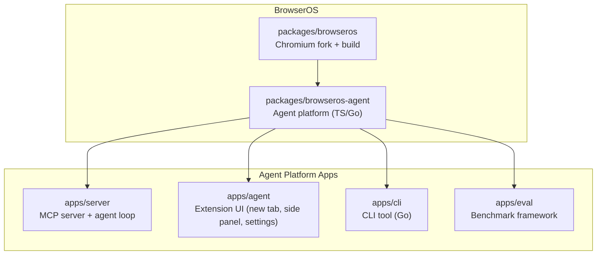
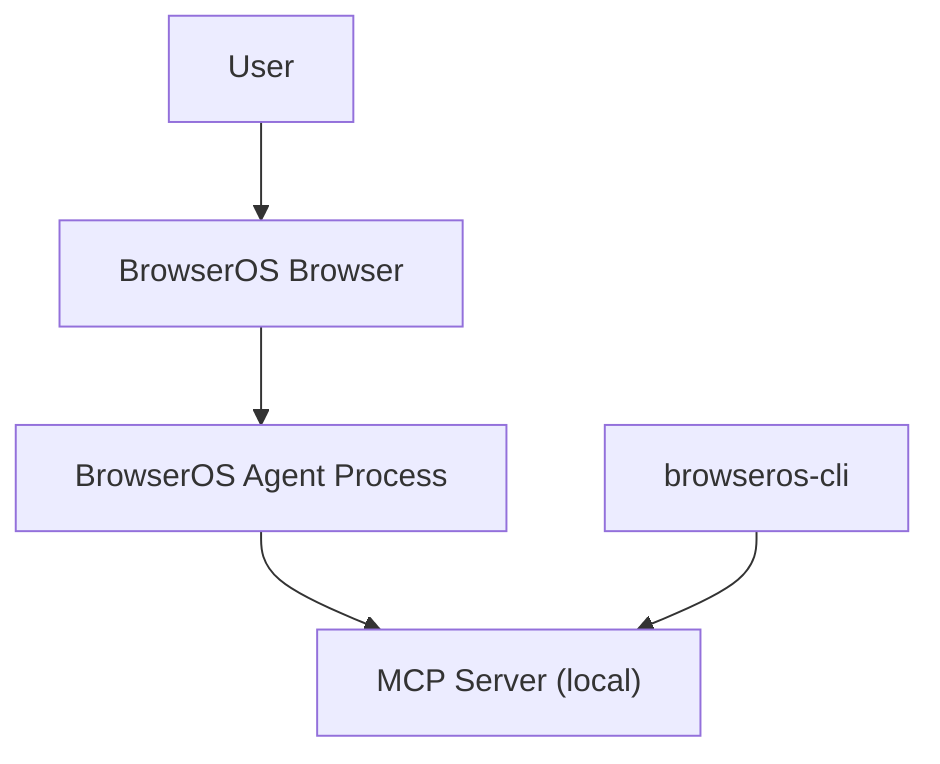
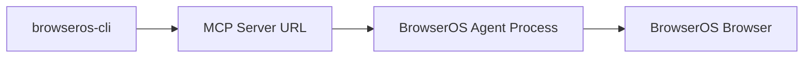

# Getting Started

<cite>
**Referenced Files in This Document**
- [README.md](file://README.md)
- [docs/index.mdx](file://docs/index.mdx)
- [docs/onboarding.mdx](file://docs/onboarding.mdx)
- [docs/update/macos.mdx](file://docs/update/macos.mdx)
- [docs/update/windows.mdx](file://docs/update/windows.mdx)
- [docs/update/linux.mdx](file://docs/update/linux.mdx)
- [docs/features/bring-your-own-llm.mdx](file://docs/features/bring-your-own-llm.mdx)
- [docs/features/local-models.mdx](file://docs/features/local-models.mdx)
- [docs/features/chatgpt-pro-oauth.mdx](file://docs/features/chatgpt-pro-oauth.mdx)
- [docs/features/github-copilot-oauth.mdx](file://docs/features/github-copilot-oauth.mdx)
- [docs/features/qwen-code-oauth.mdx](file://docs/features/qwen-code-oauth.mdx)
- [docs/troubleshooting/connection-issues.mdx](file://docs/troubleshooting/connection-issues.mdx)
- [packages/browseros-agent/apps/cli/README.md](file://packages/browseros-agent/apps/cli/README.md)
</cite>

## Table of Contents
1. [Introduction](#introduction)
2. [Project Structure](#project-structure)
3. [Core Components](#core-components)
4. [Architecture Overview](#architecture-overview)
5. [Detailed Component Analysis](#detailed-component-analysis)
6. [Dependency Analysis](#dependency-analysis)
7. [Performance Considerations](#performance-considerations)
8. [Troubleshooting Guide](#troubleshooting-guide)
9. [Conclusion](#conclusion)
10. [Appendices](#appendices)

## Introduction
This guide walks you through the three-step quick start process to get BrowserOS up and running quickly:
- Download and install BrowserOS for macOS, Windows, or Linux
- Import Chrome data (bookmarks, passwords, extensions)
- Connect AI providers (Claude, OpenAI, Gemini, ChatGPT Pro via OAuth, or local models via Ollama/LM Studio)

It also explains the difference between bringing your own API keys and running local models, how to connect OAuth providers, and how to set up local model environments. Finally, it includes troubleshooting tips and verification steps to ensure a smooth setup.

## Project Structure
The repository is a monorepo with two main subsystems:
- Browser (Chromium fork): the browser application and build system
- Agent platform (TypeScript/Go): the AI agent runtime, MCP server, CLI, and supporting tools

**Diagram sources**
- [README.md:144-178](file://README.md#L144-L178)

**Section sources**
- [README.md:144-178](file://README.md#L144-L178)

## Core Components
- BrowserOS browser: Chromium-based browser with AI-native features
- Agent platform: provides the MCP server, agent loop, and UI
- CLI: command-line tool to launch and control BrowserOS from terminals or AI coding agents
- Settings and onboarding: guided setup for Chrome data import and AI provider configuration

What this means for you:
- You install the BrowserOS browser once
- You optionally import Chrome data for a seamless transition
- You configure AI either via OAuth (no keys needed) or by adding your own API keys or local models

**Section sources**
- [README.md:38-42](file://README.md#L38-L42)
- [docs/index.mdx:28-47](file://docs/index.mdx#L28-L47)
- [docs/onboarding.mdx:8-41](file://docs/onboarding.mdx#L8-L41)

## Architecture Overview
The BrowserOS agent runs as a separate process alongside the browser and communicates via a local MCP server. The CLI can connect to this server to control BrowserOS from your terminal or AI coding agents.

**Diagram sources**
- [packages/browseros-agent/apps/cli/README.md:1-55](file://packages/browseros-agent/apps/cli/README.md#L1-L55)

**Section sources**
- [packages/browseros-agent/apps/cli/README.md:1-55](file://packages/browseros-agent/apps/cli/README.md#L1-L55)

## Detailed Component Analysis

### Step 1: Download and Install BrowserOS
Choose the appropriate installer for your platform and follow the platform-specific update instructions.

- macOS
  - Download the .dmg from the official site
  - Open and drag BrowserOS to Applications
  - Launch and keep “Allow” selected when prompted to allow the BrowserOS Agent to access the network
  - Auto-update occurs automatically; manual update steps are available if needed

- Windows
  - Download the Windows installer (.exe)
  - Run the installer; a temporary folder appears during installation (expected)
  - After installation, allow the BrowserOS Agent network access when prompted
  - Use the Feedback extension to check for updates

- Linux
  - Download the AppImage or Debian package
  - Extract and run the binary; settings and data are preserved across updates

Verification:
- On macOS, check Settings > About BrowserOS to confirm version
- On Windows, use the Feedback extension to check for updates
- On Linux, use the Feedback extension to check for updates

**Section sources**
- [docs/update/macos.mdx:6-20](file://docs/update/macos.mdx#L6-L20)
- [docs/update/windows.mdx:6-44](file://docs/update/windows.mdx#L6-L44)
- [docs/update/linux.mdx:6-22](file://docs/update/linux.mdx#L6-L22)

### Step 2: Import Chrome Data (Optional)
Bring your bookmarks, passwords, history, and extensions from Chrome in one click.

- Navigate to chrome://settings/importData
- Select Google Chrome and click Import
- Choose Always allow when prompted

Tip:
- This imports everything in one click — bookmarks, passwords, history, and extensions

**Section sources**
- [docs/onboarding.mdx:9-19](file://docs/onboarding.mdx#L9-L19)
- [docs/index.mdx:34-36](file://docs/index.mdx#L34-L36)

### Step 3: Connect AI Providers
You have three primary ways to connect AI:
- OAuth providers (no API keys): ChatGPT Pro/Plus, GitHub Copilot, Qwen Code
- Cloud providers (API keys): Gemini, Claude, OpenAI, Azure OpenAI, AWS Bedrock, OpenRouter, and others
- Local models (Ollama or LM Studio)

Concept: Bring your own API keys vs. local models
- Bring your own keys: connect via API keys or OAuth; requests go directly to providers
- Local models: run Ollama or LM Studio locally; your data never leaves your machine

Recommended starting points:
- For Chat Mode: Gemini Flash, Ollama, or any local model
- For Agent Mode: Claude Opus 4.5, GPT-5, or Kimi K2.5 (cloud recommended for agents)

**Section sources**
- [README.md:105-123](file://README.md#L105-L123)
- [docs/index.mdx:49-75](file://docs/index.mdx#L49-L75)
- [docs/onboarding.mdx:21-29](file://docs/onboarding.mdx#L21-L29)

#### OAuth Providers
- ChatGPT Pro / Plus
  - Sign in with your OpenAI account; access GPT-5 Codex and related models
  - Steps: open Settings, click USE on ChatGPT Plus/Pro card, sign in, accept authorization, select a model

- GitHub Copilot
  - Sign in with your GitHub account; access 19+ models including Claude, GPT-5, and Gemini
  - Steps: open Settings, click USE on GitHub Copilot card, copy device code, authorize, select a model

- Qwen Code
  - Sign in with your Qwen account; access Alibaba’s coding models with up to 1M context
  - Steps: open Settings, click USE on Qwen Code card, sign in, authorize, select a model

**Section sources**
- [docs/features/chatgpt-pro-oauth.mdx:8-23](file://docs/features/chatgpt-pro-oauth.mdx#L8-L23)
- [docs/features/github-copilot-oauth.mdx:12-31](file://docs/features/github-copilot-oauth.mdx#L12-L31)
- [docs/features/qwen-code-oauth.mdx:8-23](file://docs/features/qwen-code-oauth.mdx#L8-L23)

#### Cloud Providers (API Keys)
- Gemini (Free)
  - Get a free API key from aistudio.google.com
  - Steps: open Settings, click USE on Gemini card, set Model ID, paste API key, enable Supports Images, set Context Window, save

- Claude (Best for Agents)
  - Get an API key from console.anthropic.com
  - Steps: open Settings, click USE on Anthropic card, set Model ID, paste API key, enable Supports Images, set Context Window, save

- OpenAI
  - Get an API key from platform.openai.com
  - Steps: open Settings, click USE on OpenAI card, set Model ID, paste API key, enable Supports Images, set Context Window, save

- OpenRouter
  - Get a key from openrouter.ai and pick a model ID from their catalog
  - Steps: open Settings, click USE on OpenRouter card, paste model ID and API key, set Context Window, save

- Azure OpenAI
  - Requires Azure subscription and deployed model
  - Steps: open Settings, click USE on Azure card, set Base URL and Model ID, paste API key, enable Supports Images, set Context Window, save

- AWS Bedrock
  - Requires IAM credentials and model access
  - Steps: open Settings, click USE on AWS Bedrock card, set Base URL and Model ID, paste credentials, enable Supports Images, set Context Window, save

- OpenAI Compatible
  - Works with providers that implement the OpenAI-compatible API format
  - Steps: open Settings, click USE on OpenAI Compatible card, set Base URL, Model ID, API key, set Supports Images and Context Window, save

**Section sources**
- [docs/features/bring-your-own-llm.mdx:113-132](file://docs/features/bring-your-own-llm.mdx#L113-L132)
- [docs/features/bring-your-own-llm.mdx:135-154](file://docs/features/bring-your-own-llm.mdx#L135-L154)
- [docs/features/bring-your-own-llm.mdx:157-176](file://docs/features/bring-your-own-llm.mdx#L157-L176)
- [docs/features/bring-your-own-llm.mdx:178-199](file://docs/features/bring-your-own-llm.mdx#L178-L199)
- [docs/features/bring-your-own-llm.mdx:202-222](file://docs/features/bring-your-own-llm.mdx#L202-L222)
- [docs/features/bring-your-own-llm.mdx:225-245](file://docs/features/bring-your-own-llm.mdx#L225-L245)
- [docs/features/bring-your-own-llm.mdx:248-263](file://docs/features/bring-your-own-llm.mdx#L248-L263)

#### Local Models (Ollama or LM Studio)
- Context length matters
  - Ollama defaults to 4,096 tokens, which is too low for BrowserOS
  - Set at least 15,000–20,000 tokens for local models to function properly

- Ollama
  - Install Ollama, pull a model, start with higher context length, then configure in BrowserOS settings

- LM Studio
  - Load a model; it runs a server at http://localhost:1234/v1/
  - Configure BrowserOS to use OpenAI Compatible with the Base URL above

Recommended models by footprint:
- Lightweight (under 5 GB): good for 8 GB RAM machines
- Mid-range (10–15 GB): needs 16+ GB RAM
- Heavy (60+ GB): for workstations with 64+ GB RAM

**Section sources**
- [docs/features/local-models.mdx:8-22](file://docs/features/local-models.mdx#L8-L22)
- [docs/features/local-models.mdx:28-81](file://docs/features/local-models.mdx#L28-L81)
- [docs/features/local-models.mdx:85-121](file://docs/features/local-models.mdx#L85-L121)

### Try It Out
- Open any webpage and click the Assistant button in the toolbar
- Chat Mode: ask questions about the page
- Agent Mode: describe a task and watch it execute
- Tip: For Agent Mode, use Claude Opus 4.5 or Sonnet 4.5; local models work great for Chat but aren’t powerful enough for agents yet

**Section sources**
- [docs/onboarding.mdx:31-40](file://docs/onboarding.mdx#L31-L40)
- [docs/index.mdx:44-47](file://docs/index.mdx#L44-L47)

## Dependency Analysis
The CLI depends on the MCP server being reachable at a configured URL. The agent process must be running and allowed through the OS firewall/network settings.

**Diagram sources**
- [packages/browseros-agent/apps/cli/README.md:1-55](file://packages/browseros-agent/apps/cli/README.md#L1-L55)

**Section sources**
- [packages/browseros-agent/apps/cli/README.md:1-55](file://packages/browseros-agent/apps/cli/README.md#L1-L55)

## Performance Considerations
- For Chat Mode, local models are fine; for Agent Mode, cloud models with strong reasoning capabilities are recommended
- Increase context length for local models to at least 15,000–20,000 tokens to avoid overflow issues
- Choose model sizes based on your hardware capacity; smaller models are faster but less capable

[No sources needed since this section provides general guidance]

## Troubleshooting Guide

Common issues and fixes:
- Windows: Agent network access blocked
  - Allow BrowserOS Agent through Windows Security network settings
  - If still not working, end both BrowserOS and BrowserOS Agent in Task Manager, then reopen the app

- macOS: Quit BrowserOS from the Dock and reopen

- Port conflict (default 9100)
  - Find the process using port 9100 and terminate it, then restart BrowserOS

- Firewall or antivirus blocking local connections
  - Ensure your firewall allows connections to 127.0.0.1:9100
  - Temporarily disable antivirus if needed

- MCP server not reachable
  - In Settings, find the MCP Server section and click Restart
  - If restart doesn’t work, restart the BrowserOS Agent manually

Verification:
- Use the CLI to verify connectivity
  - Install the CLI and run health checks
  - If the CLI cannot connect, copy the current Server URL from BrowserOS Settings > BrowserOS MCP and re-run init with the URL

**Section sources**
- [docs/troubleshooting/connection-issues.mdx:12-52](file://docs/troubleshooting/connection-issues.mdx#L12-L52)
- [docs/troubleshooting/connection-issues.mdx:56-93](file://docs/troubleshooting/connection-issues.mdx#L56-L93)
- [packages/browseros-agent/apps/cli/README.md:32-55](file://packages/browseros-agent/apps/cli/README.md#L32-L55)

## Conclusion
You are ready to use BrowserOS in minutes:
- Installed the browser on your platform
- Imported Chrome data (optional)
- Connected an AI provider via OAuth or API keys, or set up a local model

Need more? Explore the LLM Chat & Hub, MCP integrations, and workflows to expand your BrowserOS experience.

[No sources needed since this section summarizes without analyzing specific files]

## Appendices

### Quick Reference: Three-Step Setup
- Download and install BrowserOS for your platform
- Import Chrome data (bookmarks, passwords, extensions)
- Connect AI provider (OAuth or API keys, or local model)

**Section sources**
- [README.md:38-42](file://README.md#L38-L42)
- [docs/onboarding.mdx:8-41](file://docs/onboarding.mdx#L8-L41)