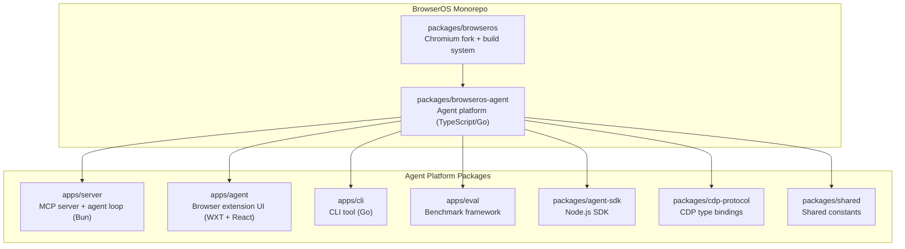
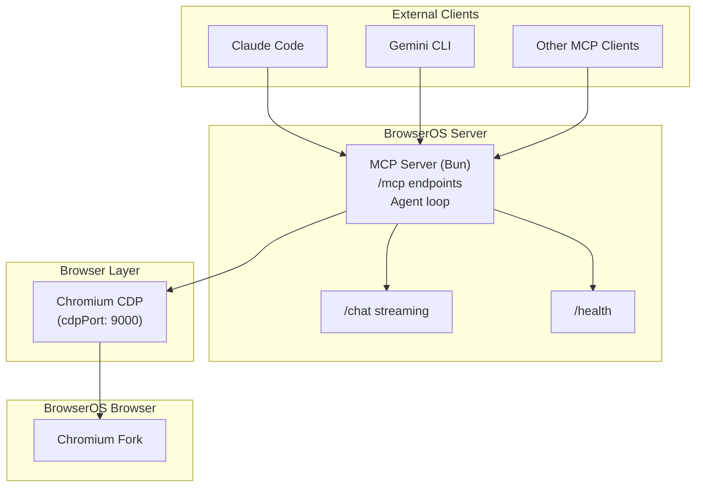
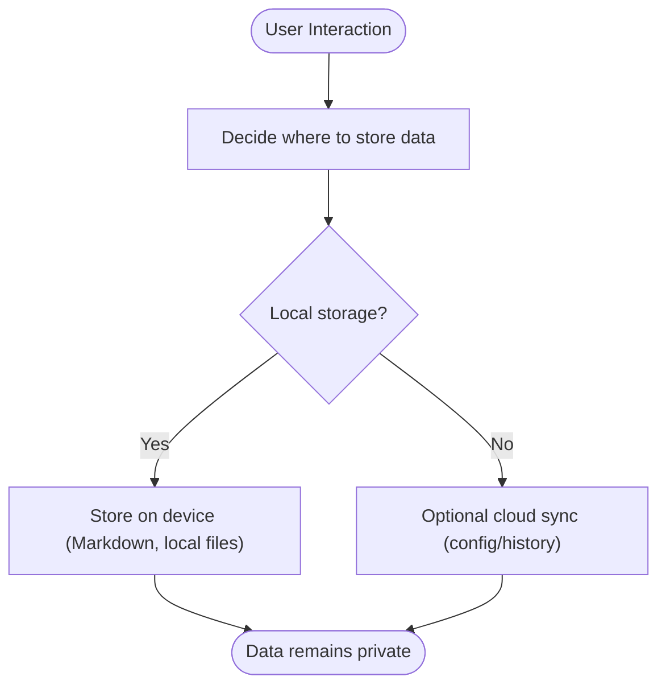
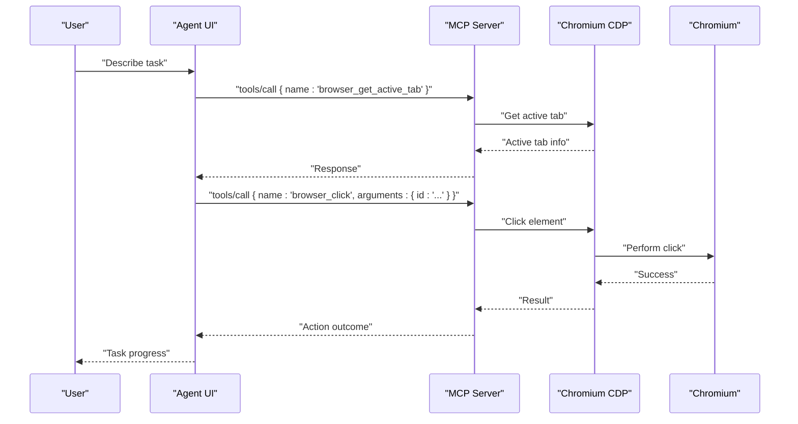
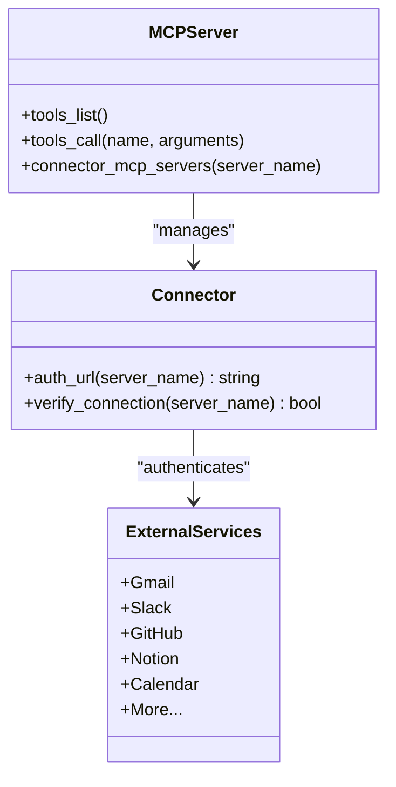
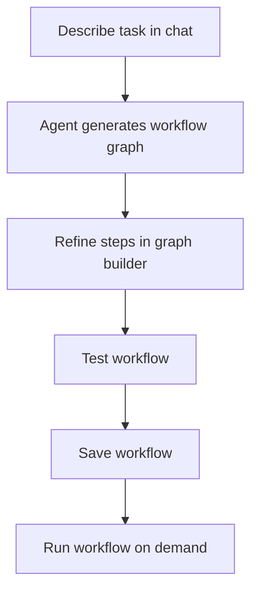
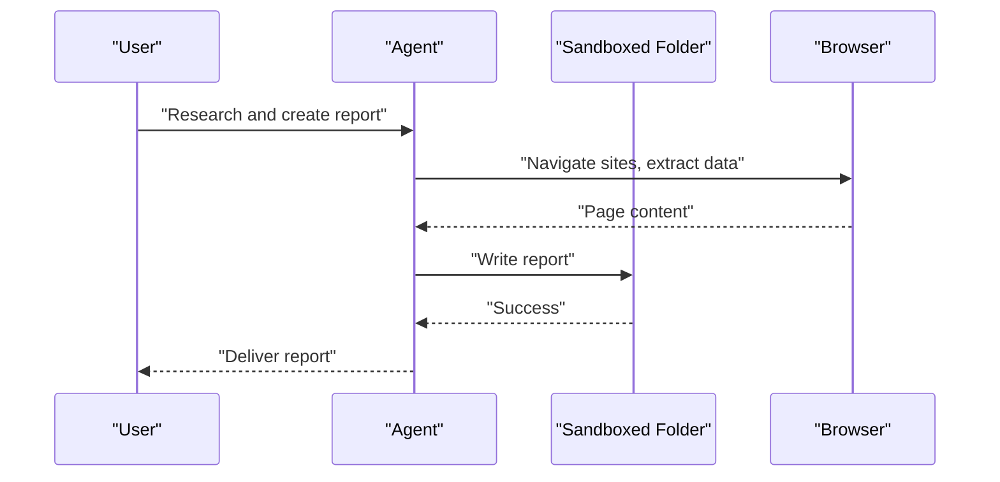
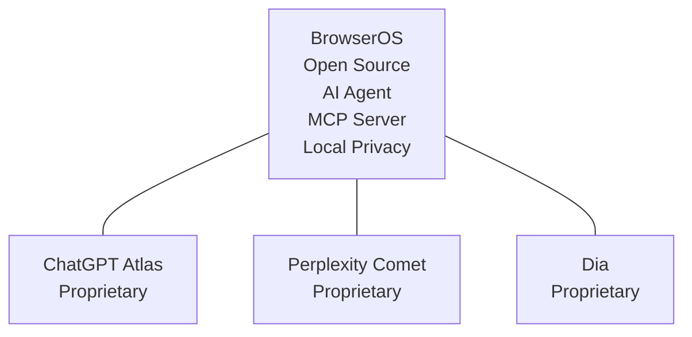
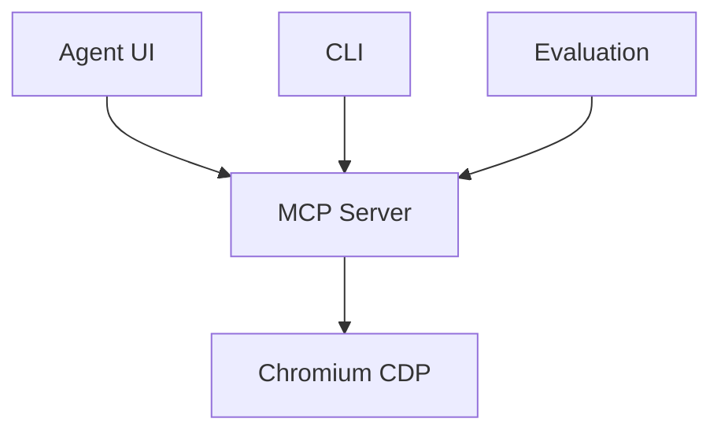

# Introduction

<cite>
**Referenced Files in This Document**
- [README.md](file://README.md)
- [docs/index.mdx](file://docs/index.mdx)
- [docs/onboarding.mdx](file://docs/onboarding.mdx)
- [docs/features/memory.mdx](file://docs/features/memory.mdx)
- [docs/features/soul.mdx](file://docs/features/soul.mdx)
- [docs/features/workflows.mdx](file://docs/features/workflows.mdx)
- [docs/features/connect-mcps.mdx](file://docs/features/connect-mcps.mdx)
- [docs/features/cowork.mdx](file://docs/features/cowork.mdx)
- [docs/comparisons/claude-cowork.mdx](file://docs/comparisons/claude-cowork.mdx)
- [packages/browseros-agent/README.md](file://packages/browseros-agent/README.md)
- [packages/browseros-agent/scripts/dev/mcp-test.sh](file://packages/browseros-agent/scripts/dev/mcp-test.sh)
- [packages/browseros-agent/apps/server/src/api/services/mcp/mcp-prompt.ts](file://packages/browseros-agent/apps/server/src/api/services/mcp/mcp-prompt.ts)
- [packages/browseros/chromium_patches/chrome/browser/ui/webui/browseros_welcome.h](file://packages/browseros/chromium_patches/chrome/browser/ui/webui/browseros_welcome.h)
</cite>

## Table of Contents
1. [Introduction](#introduction)
2. [Project Structure](#project-structure)
3. [Core Components](#core-components)
4. [Architecture Overview](#architecture-overview)
5. [Detailed Component Analysis](#detailed-component-analysis)
6. [Dependency Analysis](#dependency-analysis)
7. [Performance Considerations](#performance-considerations)
8. [Troubleshooting Guide](#troubleshooting-guide)
9. [Conclusion](#conclusion)

## Introduction
BrowserOS is an open-source Chromium fork that runs AI agents natively in your browser. It is the privacy-first alternative to ChatGPT Atlas, Perplexity Comet, and Dia. BrowserOS keeps your data on-device, supports bringing your own API keys or running local models, and offers a comprehensive suite of AI-powered capabilities designed for the modern web.

Key differentiators:
- Native AI agent capabilities with 53+ browser automation tools for navigation, clicking, typing, and data extraction
- MCP server functionality enabling control from Claude Code, Gemini CLI, and other MCP clients
- Local-first privacy model ensuring your browsing and AI interactions remain on your machine
- 40+ integrated apps via Model Context Protocol (MCP) for seamless cross-application workflows
- Visual Workflows for building repeatable, reliable browser automations
- Cowork for combining browser automation with controlled local file operations
- Persistent Memory and customizable SOUL.md for personality shaping

BrowserOS is built on Chromium, maintains Chrome compatibility, and operates under the AGPL-3.0 license. It is community-driven, welcoming contributions from developers and users alike.

Positioning:
- Privacy-first alternative to ChatGPT Atlas, Perplexity Comet, and Dia
- Developer-friendly MCP server for advanced browser automation and integration
- Local-first approach with optional cloud sync for configuration and agent history

Target audience:
- Privacy-conscious users who want AI assistance without uploading sensitive data
- Developers and power users who need robust browser automation and MCP integrations
- Teams seeking reproducible workflows and cross-application automation

**Section sources**
- [README.md:32-34](file://README.md#L32-L34)
- [README.md:124-143](file://README.md#L124-L143)
- [docs/index.mdx:10-12](file://docs/index.mdx#L10-L12)
- [docs/index.mdx:77-92](file://docs/index.mdx#L77-L92)

## Project Structure
BrowserOS is a monorepo with two main subsystems:
- Browser (Chromium fork): patches, build system, and signing
- Agent platform (TypeScript/Go): MCP server, agent UI, CLI, and evaluation framework



**Diagram sources**
- [README.md:144-178](file://README.md#L144-L178)
- [packages/browseros-agent/README.md:5-27](file://packages/browseros-agent/README.md#L5-L27)

**Section sources**
- [README.md:144-178](file://README.md#L144-L178)
- [packages/browseros-agent/README.md:5-27](file://packages/browseros-agent/README.md#L5-L27)

## Core Components
- Browser (Chromium fork): Provides the foundation browser with privacy-enhancing patches and build infrastructure
- Agent platform: Powers AI features, browser automation, and MCP integrations
- MCP server: Exposes 53+ browser automation tools and 40+ app integrations via Model Context Protocol
- Agent UI: Chrome extension offering chat, workflows, and settings
- CLI: Go-based tool for launching and controlling BrowserOS from terminals or AI coding agents
- Evaluation framework: Benchmarks for agent performance (WebVoyager, Mind2Web)

These components work together to deliver a privacy-preserving, extensible browser experience with native AI agent capabilities.

**Section sources**
- [README.md:144-178](file://README.md#L144-L178)
- [packages/browseros-agent/README.md:28-62](file://packages/browseros-agent/README.md#L28-L62)

## Architecture Overview
BrowserOS architecture centers on the MCP server exposing browser automation and app integration tools. The server communicates with Chromium via Chrome DevTools Protocol (CDP) and integrates with external services through MCP.



**Diagram sources**
- [packages/browseros-agent/README.md:34-62](file://packages/browseros-agent/README.md#L34-L62)
- [packages/browseros-agent/README.md:64-71](file://packages/browseros-agent/README.md#L64-L71)

**Section sources**
- [packages/browseros-agent/README.md:28-71](file://packages/browseros-agent/README.md#L28-L71)

## Detailed Component Analysis

### Privacy-First Philosophy and Local-First Model
BrowserOS emphasizes keeping user data on-device:
- Memory persists locally as Markdown files and never uploads to the cloud
- OAuth-based app integrations store credentials locally; BrowserOS never sees or stores passwords
- Agents operate within sandboxed environments with granular permissions
- Optional cloud sync is available only for configuration and agent history, not personal data



**Section sources**
- [docs/features/memory.mdx:113-128](file://docs/features/memory.mdx#L113-L128)
- [docs/features/connect-mcps.mdx:293-308](file://docs/features/connect-mcps.mdx#L293-L308)

### Native AI Agent Capabilities and Browser Automation
BrowserOS provides 53+ browser automation tools, enabling agents to navigate, click, type, take screenshots, manage tabs, and more. The MCP server exposes these tools for use with Claude Code, Gemini CLI, and other MCP clients.



**Diagram sources**
- [packages/browseros-agent/README.md:34-62](file://packages/browseros-agent/README.md#L34-L62)
- [packages/browseros-agent/scripts/dev/mcp-test.sh:13-55](file://packages/browseros-agent/scripts/dev/mcp-test.sh#L13-L55)
- [packages/browseros-agent/apps/server/src/api/services/mcp/mcp-prompt.ts:7-33](file://packages/browseros-agent/apps/server/src/api/services/mcp/mcp-prompt.ts#L7-L33)

**Section sources**
- [README.md:48-61](file://README.md#L48-L61)
- [docs/features/connect-mcps.mdx:14-16](file://docs/features/connect-mcps.mdx#L14-L16)
- [packages/browseros-agent/scripts/dev/mcp-test.sh:13-55](file://packages/browseros-agent/scripts/dev/mcp-test.sh#L13-L55)

### MCP Server Functionality and External Integrations
The MCP server enables BrowserOS to act as an MCP provider, exposing browser automation tools and integrating with 40+ external services. It manages authentication flows and coordinates cross-application workflows.



**Diagram sources**
- [packages/browseros-agent/apps/server/src/api/services/mcp/mcp-prompt.ts:26-33](file://packages/browseros-agent/apps/server/src/api/services/mcp/mcp-prompt.ts#L26-L33)
- [docs/features/connect-mcps.mdx:65-186](file://docs/features/connect-mcps.mdx#L65-L186)

**Section sources**
- [packages/browseros-agent/apps/server/src/api/services/mcp/mcp-prompt.ts:7-33](file://packages/browseros-agent/apps/server/src/api/services/mcp/mcp-prompt.ts#L7-L33)
- [docs/features/connect-mcps.mdx:14-16](file://docs/features/connect-mcps.mdx#L14-L16)

### Visual Workflows and Reproducible Automation
Workflows enable users to build reliable, repeatable browser automations with a visual graph builder. Users describe tasks, the agent generates a workflow graph, and users can refine and run the workflow as needed.



**Section sources**
- [docs/features/workflows.mdx:16-24](file://docs/features/workflows.mdx#L16-L24)
- [docs/features/workflows.mdx:25-45](file://docs/features/workflows.mdx#L25-L45)

### Cowork: Browser Automation Meets Local File Operations
Cowork allows agents to combine browser automation with controlled local file operations. Users grant access to a sandboxed folder, enabling the agent to read/write files, run commands, and search content—all within a single task.



**Section sources**
- [docs/features/cowork.mdx:16-42](file://docs/features/cowork.mdx#L16-L42)
- [docs/features/cowork.mdx:71-156](file://docs/features/cowork.mdx#L71-L156)

### Memory and Personality: SOUL.md
BrowserOS separates knowledge (Memory) from behavior (SOUL.md). Memory stores facts and context locally, while SOUL.md defines personality, tone, and boundaries. Both evolve over time to improve the assistant’s effectiveness and alignment with user preferences.

```mermaid
graph LR
Memory["Memory<br/>Core facts & daily notes"] <- --> |Evolution| Assistant["Assistant"]
SOUL["SOUL.md<br/>Personality & boundaries"] <- --> |Behavior| Assistant
Assistant --> |Responds| User["User"]
```

**Section sources**
- [docs/features/memory.mdx:8-25](file://docs/features/memory.mdx#L8-L25)
- [docs/features/soul.mdx:18-36](file://docs/features/soul.mdx#L18-L36)

### Positioning Against Competitors
BrowserOS distinguishes itself as a privacy-first, open-source alternative to ChatGPT Atlas, Perplexity Comet, and Dia. It offers:
- Open-source under AGPL-3.0 with community-driven development
- Native AI agent capabilities with 53+ browser automation tools
- MCP server enabling integration with Claude Code, Gemini CLI, and other MCP clients
- Local-first privacy model with optional cloud sync for configuration and history
- 40+ app integrations via MCP for cross-application workflows



**Section sources**
- [README.md:124-143](file://README.md#L124-L143)
- [docs/comparisons/claude-cowork.mdx:12-26](file://docs/comparisons/claude-cowork.mdx#L12-L26)

## Dependency Analysis
BrowserOS components depend on each other to deliver a cohesive experience:
- The Agent UI depends on the MCP server for tools and integrations
- The MCP server depends on Chromium CDP for browser control
- The CLI depends on the MCP server for remote control
- The evaluation framework depends on the agent tools for benchmarking



**Diagram sources**
- [packages/browseros-agent/README.md:34-62](file://packages/browseros-agent/README.md#L34-L62)

**Section sources**
- [packages/browseros-agent/README.md:34-62](file://packages/browseros-agent/README.md#L34-L62)

## Performance Considerations
- Browser automation performance benefits from efficient tool usage and proper element observation
- MCP server throughput improves with optimized tool implementations and reduced network latency
- Local-first design minimizes data transfer overhead and reduces reliance on external services
- Sandboxed file operations limit I/O contention and improve reliability

## Troubleshooting Guide
- MCP server connectivity: Use the MCP test script to verify tool listings and basic operations
- Authentication flows: Ensure OAuth flows are properly configured for external services
- Sandbox restrictions: Confirm folder access permissions and sandbox boundaries for file operations
- Privacy settings: Verify memory and credential storage locations and access controls

**Section sources**
- [packages/browseros-agent/scripts/dev/mcp-test.sh:13-55](file://packages/browseros-agent/scripts/dev/mcp-test.sh#L13-L55)
- [docs/features/connect-mcps.mdx:293-308](file://docs/features/connect-mcps.mdx#L293-L308)
- [docs/features/cowork.mdx:210-223](file://docs/features/cowork.mdx#L210-L223)

## Conclusion
BrowserOS delivers a privacy-first, open-source alternative to existing AI-powered browsers. By combining native AI agent capabilities, MCP server functionality, and a local-first model, it empowers users to automate web tasks, integrate applications, and maintain control over their data. Its community-driven development and AGPL-3.0 licensing reinforce transparency and user autonomy.