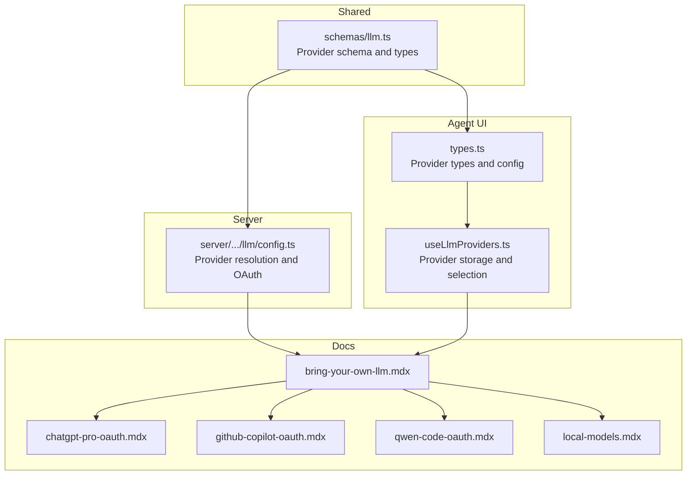
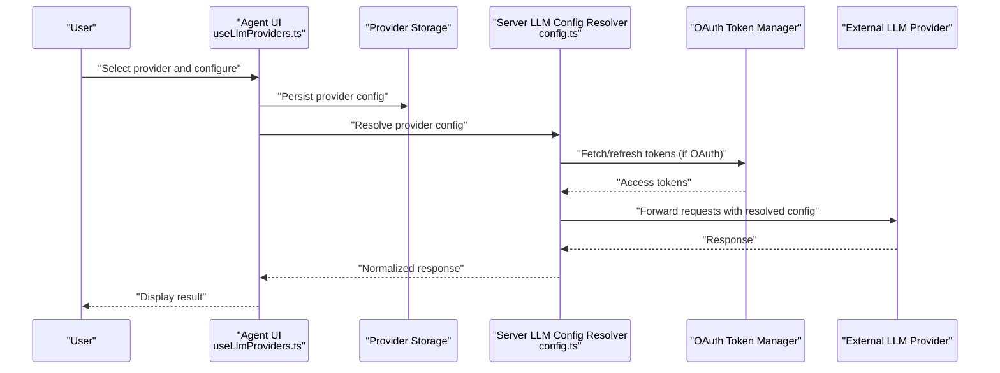
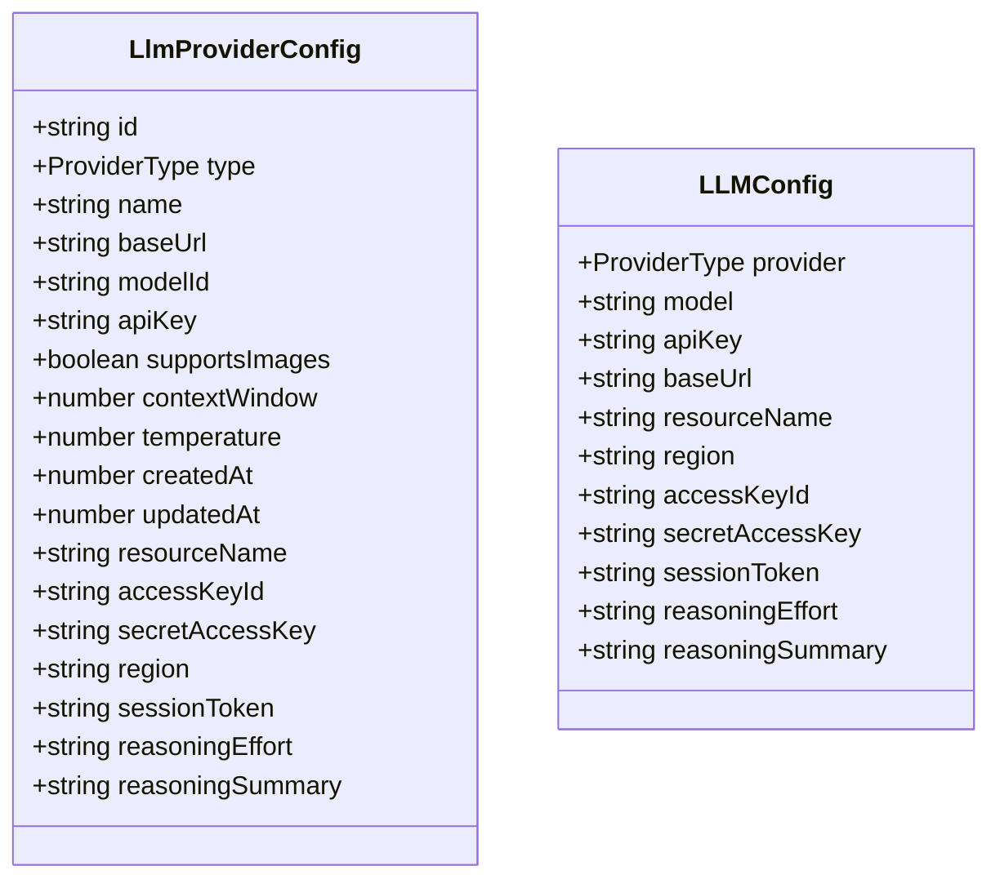
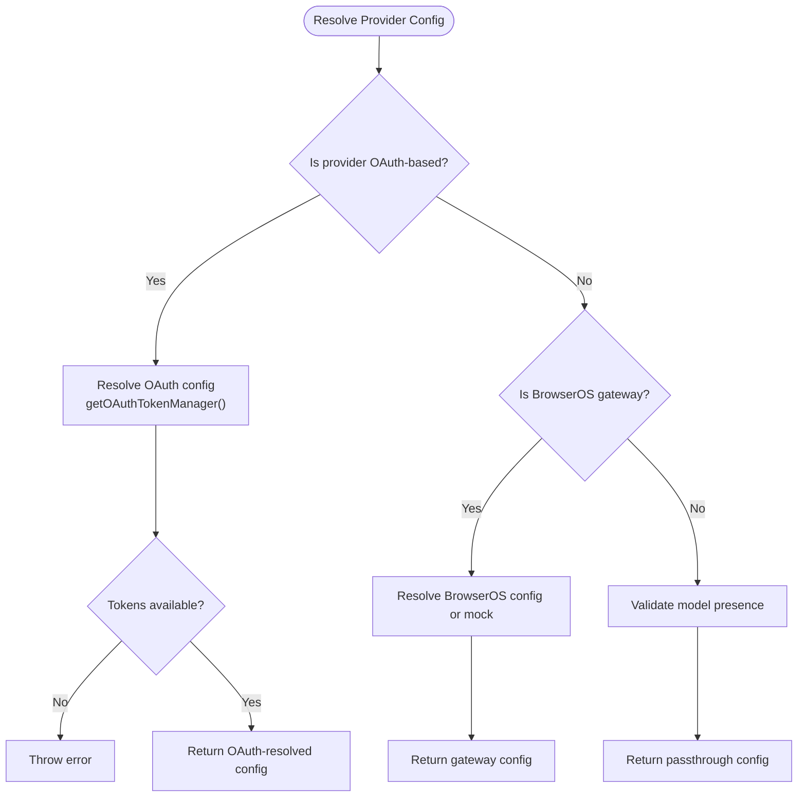
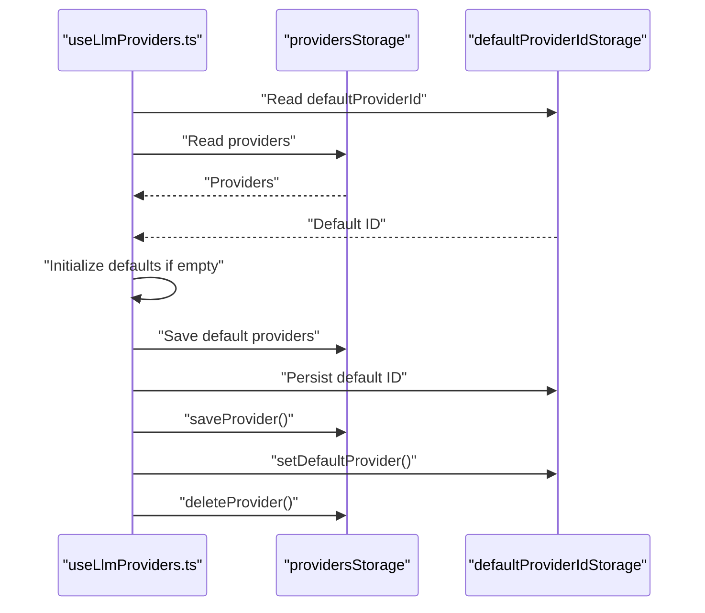
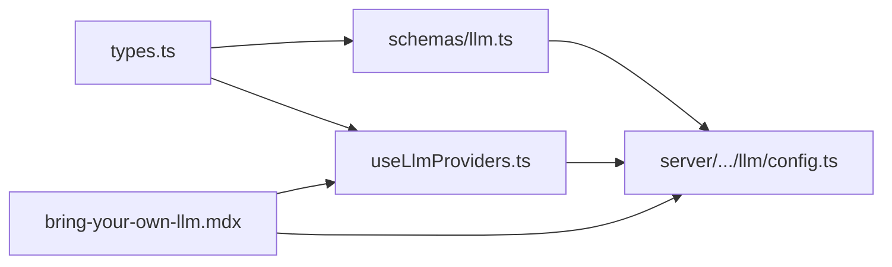

# LLM Providers

<cite>
**Referenced Files in This Document**
- [README.md](file://README.md)
- [bring-your-own-llm.mdx](file://docs/features/bring-your-own-llm.mdx)
- [chatgpt-pro-oauth.mdx](file://docs/features/chatgpt-pro-oauth.mdx)
- [github-copilot-oauth.mdx](file://docs/features/github-copilot-oauth.mdx)
- [qwen-code-oauth.mdx](file://docs/features/qwen-code-oauth.mdx)
- [local-models.mdx](file://docs/features/local-models.mdx)
- [types.ts](file://packages/browseros-agent/apps/agent/lib/llm-providers/types.ts)
- [useLlmProviders.ts](file://packages/browseros-agent/apps/agent/lib/llm-providers/useLlmProviders.ts)
- [config.ts](file://packages/browseros-agent/apps/server/src/lib/clients/llm/config.ts)
- [llm.ts](file://packages/browseros-agent/packages/shared/src/schemas/llm.ts)
- [connection-issues.mdx](file://docs/troubleshooting/connection-issues.mdx)
</cite>

## Table of Contents
1. [Introduction](#introduction)
2. [Project Structure](#project-structure)
3. [Core Components](#core-components)
4. [Architecture Overview](#architecture-overview)
5. [Detailed Component Analysis](#detailed-component-analysis)
6. [Dependency Analysis](#dependency-analysis)
7. [Performance Considerations](#performance-considerations)
8. [Troubleshooting Guide](#troubleshooting-guide)
9. [Conclusion](#conclusion)
10. [Appendices](#appendices)

## Introduction
This document explains how BrowserOS integrates with multiple LLM providers, covering connectivity, authentication, configuration, and operational guidance. It focuses on:
- Supported providers: Kimi K2.5 (default), ChatGPT Pro/Plus, GitHub Copilot, Qwen Code, Claude (Anthropic), GPT-4o/o3 (OpenAI), Gemini (Google), Azure OpenAI, AWS Bedrock, OpenRouter, Ollama, and LM Studio
- Authentication methods: built-in auth for default providers, OAuth for ChatGPT Pro, GitHub Copilot, and Qwen Code, API key and IAM-based auth for cloud providers
- Bring-your-own-keys and local model setup
- Provider factory resolution and configuration management
- Step-by-step setup, authentication flows, troubleshooting, provider switching, and security considerations

## Project Structure
BrowserOS organizes provider-related logic primarily in the agent app and shared schemas, with documentation in the docs directory. The key areas are:
- Agent UI and hooks for provider management and selection
- Shared schemas defining provider types and configuration
- Server-side LLM client configuration resolution
- Documentation pages for each provider type and setup

**Diagram sources**
- [types.ts:1-76](file://packages/browseros-agent/apps/agent/lib/llm-providers/types.ts#L1-L76)
- [useLlmProviders.ts:1-175](file://packages/browseros-agent/apps/agent/lib/llm-providers/useLlmProviders.ts#L1-L175)
- [llm.ts:58-104](file://packages/browseros-agent/packages/shared/src/schemas/llm.ts#L58-L104)
- [config.ts:39-84](file://packages/browseros-agent/apps/server/src/lib/clients/llm/config.ts#L39-L84)
- [bring-your-own-llm.mdx:1-285](file://docs/features/bring-your-own-llm.mdx#L1-L285)
- [chatgpt-pro-oauth.mdx:1-57](file://docs/features/chatgpt-pro-oauth.mdx#L1-L57)
- [github-copilot-oauth.mdx:1-61](file://docs/features/github-copilot-oauth.mdx#L1-L61)
- [qwen-code-oauth.mdx:1-40](file://docs/features/qwen-code-oauth.mdx#L1-L40)
- [local-models.mdx:1-121](file://docs/features/local-models.mdx#L1-L121)

**Section sources**
- [README.md:105-123](file://README.md#L105-L123)
- [types.ts:1-76](file://packages/browseros-agent/apps/agent/lib/llm-providers/types.ts#L1-L76)
- [useLlmProviders.ts:1-175](file://packages/browseros-agent/apps/agent/lib/llm-providers/useLlmProviders.ts#L1-L175)
- [llm.ts:58-104](file://packages/browseros-agent/packages/shared/src/schemas/llm.ts#L58-L104)
- [config.ts:39-84](file://packages/browseros-agent/apps/server/src/lib/clients/llm/config.ts#L39-L84)
- [bring-your-own-llm.mdx:1-285](file://docs/features/bring-your-own-llm.mdx#L1-L285)
- [chatgpt-pro-oauth.mdx:1-57](file://docs/features/chatgpt-pro-oauth.mdx#L1-L57)
- [github-copilot-oauth.mdx:1-61](file://docs/features/github-copilot-oauth.mdx#L1-L61)
- [qwen-code-oauth.mdx:1-40](file://docs/features/qwen-code-oauth.mdx#L1-L40)
- [local-models.mdx:1-121](file://docs/features/local-models.mdx#L1-L121)

## Core Components
- Provider types and configuration schema define supported providers and fields (API key, base URL, Azure resource name, Bedrock credentials, reasoning settings).
- The agent hook manages provider storage, default selection, and persistence.
- The server resolves provider configs and handles OAuth flows for providers requiring it.

Key implementation references:
- Provider types and config fields: [types.ts:5-66](file://packages/browseros-agent/apps/agent/lib/llm-providers/types.ts#L5-L66)
- Provider schema and validation: [llm.ts:58-104](file://packages/browseros-agent/packages/shared/src/schemas/llm.ts#L58-L104)
- Provider storage and selection: [useLlmProviders.ts:36-174](file://packages/browseros-agent/apps/agent/lib/llm-providers/useLlmProviders.ts#L36-L174)
- OAuth and provider resolution: [config.ts:39-84](file://packages/browseros-agent/apps/server/src/lib/clients/llm/config.ts#L39-L84)

**Section sources**
- [types.ts:5-66](file://packages/browseros-agent/apps/agent/lib/llm-providers/types.ts#L5-L66)
- [llm.ts:58-104](file://packages/browseros-agent/packages/shared/src/schemas/llm.ts#L58-L104)
- [useLlmProviders.ts:36-174](file://packages/browseros-agent/apps/agent/lib/llm-providers/useLlmProviders.ts#L36-L174)
- [config.ts:39-84](file://packages/browseros-agent/apps/server/src/lib/clients/llm/config.ts#L39-L84)

## Architecture Overview
BrowserOS supports a broad set of LLM providers through a unified configuration model. The architecture separates concerns:
- UI layer: provider templates, storage, and selection
- Shared layer: provider types and validation schemas
- Server layer: provider resolution, OAuth token management, and request routing

**Diagram sources**
- [useLlmProviders.ts:106-133](file://packages/browseros-agent/apps/agent/lib/llm-providers/useLlmProviders.ts#L106-L133)
- [config.ts:77-84](file://packages/browseros-agent/apps/server/src/lib/clients/llm/config.ts#L77-L84)

**Section sources**
- [useLlmProviders.ts:36-174](file://packages/browseros-agent/apps/agent/lib/llm-providers/useLlmProviders.ts#L36-L174)
- [config.ts:39-84](file://packages/browseros-agent/apps/server/src/lib/clients/llm/config.ts#L39-L84)

## Detailed Component Analysis

### Provider Types and Configuration
- ProviderType enumerates supported provider families (e.g., anthropic, openai, google, azure, bedrock, moonshot, browseros, openai-compatible, chatgpt-pro, github-copilot, qwen-code).
- LlmProviderConfig captures provider identity, model, base URL, API key, image support, context window, temperature, Azure resource name, Bedrock credentials, and ChatGPT Pro reasoning settings.
- LLMConfigSchema validates provider selection, model, optional API key/base URL/resource name/region/credentials, and reasoning options.

**Diagram sources**
- [types.ts:25-66](file://packages/browseros-agent/apps/agent/lib/llm-providers/types.ts#L25-L66)
- [llm.ts:75-102](file://packages/browseros-agent/packages/shared/src/schemas/llm.ts#L75-L102)

**Section sources**
- [types.ts:5-66](file://packages/browseros-agent/apps/agent/lib/llm-providers/types.ts#L5-L66)
- [llm.ts:58-104](file://packages/browseros-agent/packages/shared/src/schemas/llm.ts#L58-L104)

### Provider Factory and Resolution
- The server resolves provider configurations and applies OAuth token management for providers that require it.
- OAuth-resolved providers receive a display name, default model, and refresh behavior.
- Non-OAuth providers pass-through with model validation.

**Diagram sources**
- [config.ts:39-84](file://packages/browseros-agent/apps/server/src/lib/clients/llm/config.ts#L39-L84)

**Section sources**
- [config.ts:39-84](file://packages/browseros-agent/apps/server/src/lib/clients/llm/config.ts#L39-L84)

### Configuration Management (Agent UI)
- The hook loads providers and default provider ID, initializes defaults if missing, repairs stale default IDs, and persists updates.
- It exposes methods to save, set default, and delete providers while guarding against deleting the built-in default provider.

**Diagram sources**
- [useLlmProviders.ts:42-156](file://packages/browseros-agent/apps/agent/lib/llm-providers/useLlmProviders.ts#L42-L156)

**Section sources**
- [useLlmProviders.ts:36-174](file://packages/browseros-agent/apps/agent/lib/llm-providers/useLlmProviders.ts#L36-L174)

### Authentication Methods and Provider Setup

#### Built-in Auth (Default Provider)
- The default provider is Kimi K2.5 (Moonshot AI), presented as “BrowserOS” in the UI.
- Users can bring their own Kimi API key or rely on extended usage limits.
- Base URL is pre-filled when selecting the provider template.

References:
- [README.md:109-112](file://README.md#L109-L112)
- [bring-your-own-llm.mdx:85-104](file://docs/features/bring-your-own-llm.mdx#L85-L104)

#### OAuth: ChatGPT Pro / Plus
- Connect via OpenAI account; access Codex models with up to 400K context.
- Configure reasoning effort and summary after authorization.
- Disconnect removes OAuth tokens from the machine.

References:
- [chatgpt-pro-oauth.mdx:1-57](file://docs/features/chatgpt-pro-oauth.mdx#L1-L57)

#### OAuth: GitHub Copilot
- Single sign-in grants access to 19+ models including Claude, GPT-5, and Gemini.
- Device code flow during setup; disconnect revokes tokens.

References:
- [github-copilot-oauth.mdx:1-61](file://docs/features/github-copilot-oauth.mdx#L1-L61)

#### OAuth: Qwen Code
- Sign in with Qwen account to access models with up to 1M token context.
- Disconnect removes OAuth tokens.

References:
- [qwen-code-oauth.mdx:1-40](file://docs/features/qwen-code-oauth.mdx#L1-L40)

#### API Key Auth: Cloud Providers
- Claude (Anthropic), GPT-4o/o3 (OpenAI), Gemini (Google), Azure OpenAI, OpenRouter.
- Steps include obtaining API keys from provider consoles, configuring model IDs and context windows, and saving in BrowserOS settings.

References:
- [bring-your-own-llm.mdx:107-264](file://docs/features/bring-your-own-llm.mdx#L107-L264)

#### IAM Auth: AWS Bedrock
- Use IAM credentials (access key, secret, region) to access Bedrock-hosted models.
- Configure base URL and model ID according to provider documentation.

References:
- [bring-your-own-llm.mdx:224-245](file://docs/features/bring-your-own-llm.mdx#L224-L245)

#### Local Models: Ollama and LM Studio
- Run models offline; set context length to at least 15K–20K tokens for reliable agent behavior.
- Ollama: pull a model, start with higher context, configure in BrowserOS.
- LM Studio: load a model via GUI; configure base URL to the local server endpoint.

References:
- [local-models.mdx:1-121](file://docs/features/local-models.mdx#L1-L121)

### Provider Switching and Multi-Provider Usage
- Use the model switcher in the Assistant panel to change providers at runtime.
- The default provider is highlighted; switching persists automatically.
- Multiple providers can be saved and cycled through for different tasks.

References:
- [bring-your-own-llm.mdx:276-284](file://docs/features/bring-your-own-llm.mdx#L276-L284)
- [useLlmProviders.ts:158-163](file://packages/browseros-agent/apps/agent/lib/llm-providers/useLlmProviders.ts#L158-L163)

### Security Considerations
- API keys are stored encrypted and kept on the local machine; requests route directly to providers.
- OAuth tokens are stored locally and removed upon disconnection.
- For local models, ensure secure network boundaries and restrict exposure of local inference servers.

References:
- [README.md:34-34](file://README.md#L34-L34)
- [chatgpt-pro-oauth.mdx:54-57](file://docs/features/chatgpt-pro-oauth.mdx#L54-L57)
- [github-copilot-oauth.mdx:58-61](file://docs/features/github-copilot-oauth.mdx#L58-L61)
- [qwen-code-oauth.mdx:37-40](file://docs/features/qwen-code-oauth.mdx#L37-L40)

## Dependency Analysis
The provider system relies on:
- Shared schemas for type safety and validation
- Agent hooks for persistence and selection
- Server resolver for OAuth and provider normalization

**Diagram sources**
- [types.ts:1-76](file://packages/browseros-agent/apps/agent/lib/llm-providers/types.ts#L1-L76)
- [llm.ts:58-104](file://packages/browseros-agent/packages/shared/src/schemas/llm.ts#L58-L104)
- [config.ts:39-84](file://packages/browseros-agent/apps/server/src/lib/clients/llm/config.ts#L39-L84)
- [useLlmProviders.ts:1-175](file://packages/browseros-agent/apps/agent/lib/llm-providers/useLlmProviders.ts#L1-L175)
- [bring-your-own-llm.mdx:1-285](file://docs/features/bring-your-own-llm.mdx#L1-L285)

**Section sources**
- [types.ts:1-76](file://packages/browseros-agent/apps/agent/lib/llm-providers/types.ts#L1-L76)
- [llm.ts:58-104](file://packages/browseros-agent/packages/shared/src/schemas/llm.ts#L58-L104)
- [config.ts:39-84](file://packages/browseros-agent/apps/server/src/lib/clients/llm/config.ts#L39-L84)
- [useLlmProviders.ts:1-175](file://packages/browseros-agent/apps/agent/lib/llm-providers/useLlmProviders.ts#L1-L175)
- [bring-your-own-llm.mdx:1-285](file://docs/features/bring-your-own-llm.mdx#L1-L285)

## Performance Considerations
- Context window: Local models should use at least 15K–20K tokens for reliable agent behavior; lower contexts can cause loops and degraded performance.
- Model selection: Use stronger models (e.g., Claude Opus 4.5, GPT-5, Kimi K2.5) for agent tasks requiring reasoning; lighter models for chat.
- Cost management: Prefer providers with transparent pricing; leverage free tiers (e.g., Gemini Flash) for light usage; monitor quotas and rate limits.
- Latency: Local models depend on hardware; increase context length increases VRAM usage.

References:
- [local-models.mdx:8-22](file://docs/features/local-models.mdx#L8-L22)
- [bring-your-own-llm.mdx:43-52](file://docs/features/bring-your-own-llm.mdx#L43-L52)

## Troubleshooting Guide
Common connection issues and resolutions:
- OAuth failures: Ensure correct account selection and authorization acceptance; verify device code flow completion.
- API key errors: Confirm key validity and permissions; check model availability in the selected region.
- Azure/OpenAI compatibility: Verify base URL and deployment/model names; ensure endpoint access.
- Bedrock IAM: Confirm credentials and region; ensure Bedrock model access is granted.
- Local models: Increase context length to at least 15K–20K; monitor VRAM usage.

References:
- [connection-issues.mdx:1-200](file://docs/troubleshooting/connection-issues.mdx#L1-L200)
- [chatgpt-pro-oauth.mdx:14-22](file://docs/features/chatgpt-pro-oauth.mdx#L14-L22)
- [github-copilot-oauth.mdx:18-30](file://docs/features/github-copilot-oauth.mdx#L18-L30)
- [qwen-code-oauth.mdx:14-22](file://docs/features/qwen-code-oauth.mdx#L14-L22)
- [local-models.mdx:14-22](file://docs/features/local-models.mdx#L14-L22)

## Conclusion
BrowserOS provides a flexible, secure, and extensible LLM provider integration:
- Unified configuration schema and UI for easy setup
- Support for OAuth, API keys, and IAM-based authentication
- First-class local model support with practical guidance
- Robust provider switching and multi-provider usage
Adopt the documented setup flows, apply security best practices, and tune performance based on workload needs.

## Appendices

### Supported Providers Summary
- Default: Kimi K2.5 (Moonshot AI) with built-in auth
- OAuth: ChatGPT Pro/Plus, GitHub Copilot, Qwen Code
- API Key: Claude, GPT-4o/o3, Gemini, Azure OpenAI, OpenRouter
- IAM: AWS Bedrock
- Local: Ollama, LM Studio

References:
- [README.md:109-122](file://README.md#L109-L122)
- [bring-your-own-llm.mdx:107-264](file://docs/features/bring-your-own-llm.mdx#L107-L264)
- [local-models.mdx:26-81](file://docs/features/local-models.mdx#L26-L81)