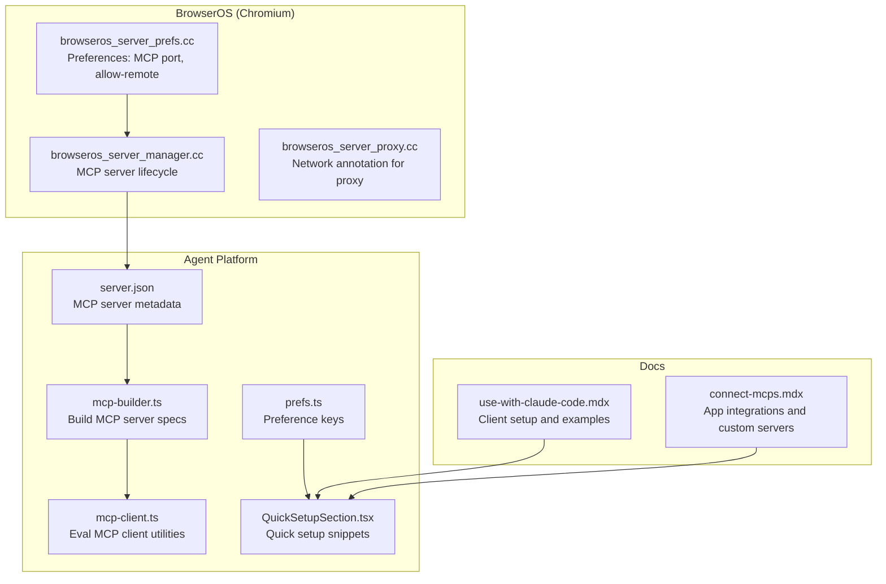
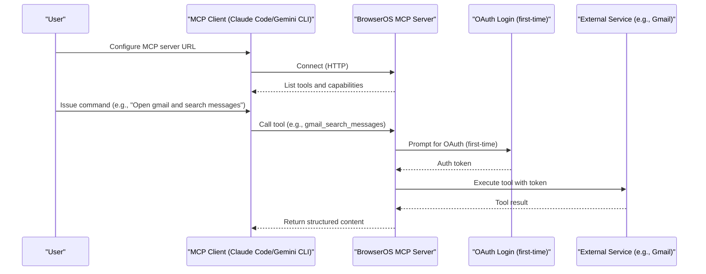
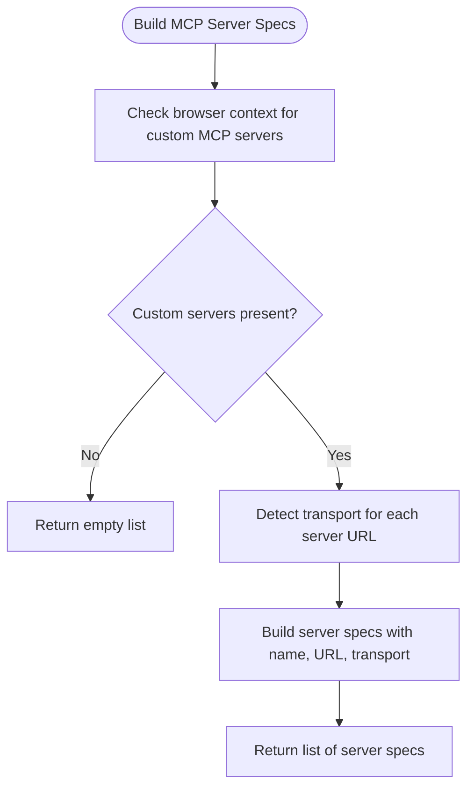
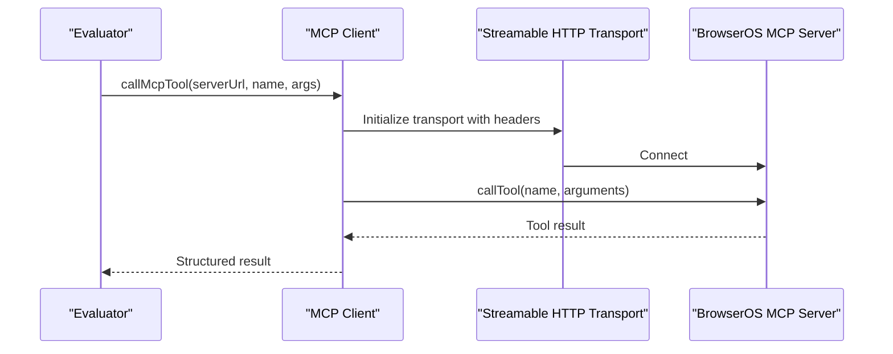
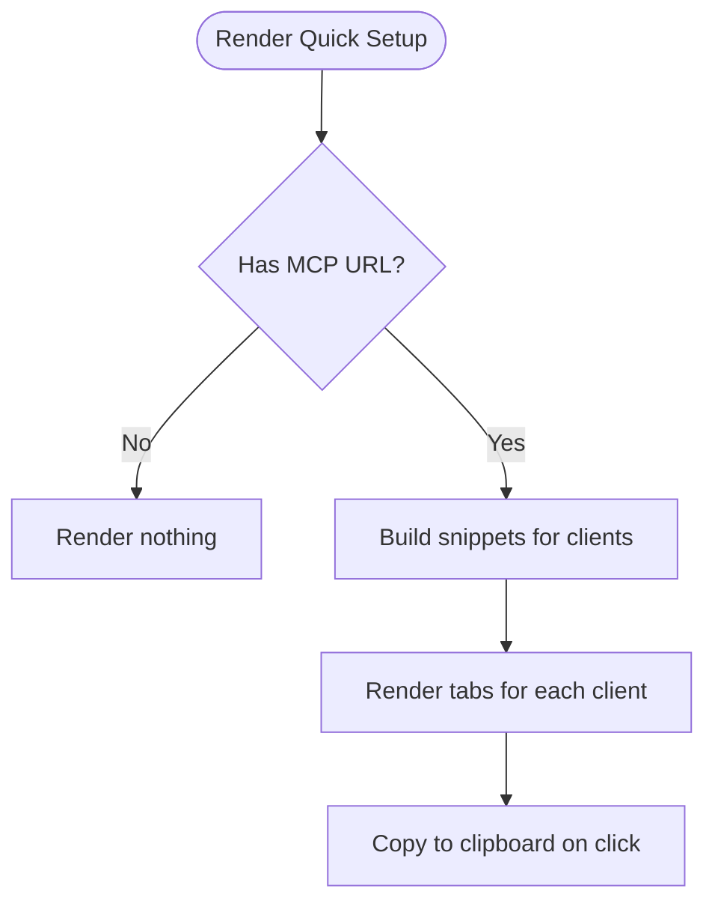
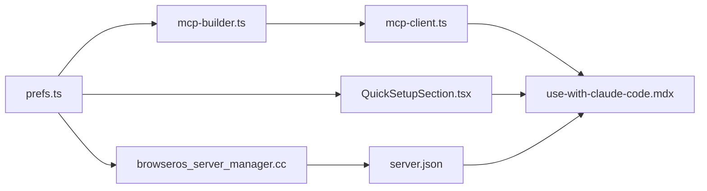

# MCP Integration

<cite>
**Referenced Files in This Document**
- [README.md](file://README.md)
- [server.json](file://packages/browseros-agent/server.json)
- [mcp-builder.ts](file://packages/browseros-agent/apps/agent/src/agent/mcp-builder.ts)
- [mcp-client.ts](file://packages/browseros-agent/apps/eval/src/utils/mcp-client.ts)
- [prefs.ts](file://packages/browseros-agent/apps/agent/lib/browseros/prefs.ts)
- [QuickSetupSection.tsx](file://packages/browseros-agent/apps/agent/entrypoints/app/mcp-settings/QuickSetupSection.tsx)
- [connect-mcps.mdx](file://docs/features/connect-mcps.mdx)
- [use-with-claude-code.mdx](file://docs/features/use-with-claude-code.mdx)
- [browseros_server_manager.cc](file://packages/browseros/chromium_patches/chrome/browser/browseros/server/browseros_server_manager.cc)
- [browseros_server_prefs.cc](file://packages/browseros/chromium_patches/chrome/browser/browseros/server/browseros_server_prefs.cc)
- [browseros_server_proxy.cc](file://packages/browseros/chromium_patches/chrome/browser/browseros/server/browseros_server_proxy.cc)
- [mcp-server-restart.png](file://docs/images/troubleshooting/mcp-server-restart.png)
</cite>

## Table of Contents
1. [Introduction](#introduction)
2. [Project Structure](#project-structure)
3. [Core Components](#core-components)
4. [Architecture Overview](#architecture-overview)
5. [Detailed Component Analysis](#detailed-component-analysis)
6. [Dependency Analysis](#dependency-analysis)
7. [Performance Considerations](#performance-considerations)
8. [Troubleshooting Guide](#troubleshooting-guide)
9. [Conclusion](#conclusion)
10. [Appendices](#appendices)

## Introduction
This document explains how BrowserOS integrates with the Model Context Protocol (MCP) to enable external AI coding agents and tools to control the browser and access integrated services. It covers:
- The MCP server implementation in the BrowserOS application
- How MCP clients (such as Claude Code, Gemini CLI, and others) connect to BrowserOS
- The MCP client library patterns used in the agent platform
- Setup procedures for connecting external AI agents and tools
- Available MCP tools for browser automation and app integration
- Authentication, connection establishment, error handling, security, and troubleshooting

## Project Structure
BrowserOS is a monorepo with a Chromium-based browser and an agent platform. MCP-related functionality spans:
- BrowserOS preferences and server management in the Chromium patches
- MCP server metadata and packaging in the agent platform
- MCP client utilities and quick-setup UI in the agent extension
- Documentation for connecting apps and using MCP with Claude Code/Gemini CLI

**Diagram sources**
- [browseros_server_prefs.cc:29-39](file://packages/browseros/chromium_patches/chrome/browser/browseros/server/browseros_server_prefs.cc#L29-L39)
- [browseros_server_manager.cc:281-979](file://packages/browseros/chromium_patches/chrome/browser/browseros/server/browseros_server_manager.cc#L281-L979)
- [browseros_server_proxy.cc:39-39](file://packages/browseros/chromium_patches/chrome/browser/browseros/server/browseros_server_proxy.cc#L39-L39)
- [server.json:1-22](file://packages/browseros-agent/server.json#L1-L22)
- [mcp-builder.ts:1-44](file://packages/browseros-agent/apps/agent/src/agent/mcp-builder.ts#L1-L44)
- [mcp-client.ts:1-51](file://packages/browseros-agent/apps/eval/src/utils/mcp-client.ts#L1-L51)
- [QuickSetupSection.tsx:1-147](file://packages/browseros-agent/apps/agent/entrypoints/app/mcp-settings/QuickSetupSection.tsx#L1-L147)
- [prefs.ts:1-17](file://packages/browseros-agent/apps/agent/lib/browseros/prefs.ts#L1-L17)
- [use-with-claude-code.mdx:1-417](file://docs/features/use-with-claude-code.mdx#L1-L417)
- [connect-mcps.mdx:1-309](file://docs/features/connect-mcps.mdx#L1-L309)

**Section sources**
- [README.md:144-178](file://README.md#L144-L178)
- [server.json:1-22](file://packages/browseros-agent/server.json#L1-L22)
- [mcp-builder.ts:1-44](file://packages/browseros-agent/apps/agent/src/agent/mcp-builder.ts#L1-L44)
- [mcp-client.ts:1-51](file://packages/browseros-agent/apps/eval/src/utils/mcp-client.ts#L1-L51)
- [prefs.ts:1-17](file://packages/browseros-agent/apps/agent/lib/browseros/prefs.ts#L1-L17)
- [QuickSetupSection.tsx:1-147](file://packages/browseros-agent/apps/agent/entrypoints/app/mcp-settings/QuickSetupSection.tsx#L1-L147)
- [use-with-claude-code.mdx:1-417](file://docs/features/use-with-claude-code.mdx#L1-L417)
- [connect-mcps.mdx:1-309](file://docs/features/connect-mcps.mdx#L1-L309)
- [browseros_server_manager.cc:281-979](file://packages/browseros/chromium_patches/chrome/browser/browseros/server/browseros_server_manager.cc#L281-L979)
- [browseros_server_prefs.cc:29-39](file://packages/browseros/chromium_patches/chrome/browser/browseros/server/browseros_server_prefs.cc#L29-L39)
- [browseros_server_proxy.cc:39-39](file://packages/browseros/chromium_patches/chrome/browser/browseros/server/browseros_server_proxy.cc#L39-L39)

## Core Components
- MCP server metadata and packaging: Defines the server identity, transport, and package registry information for the MCP server exposed by BrowserOS.
- MCP client builder: Constructs MCP server specifications from the browser context, enabling dynamic discovery and connection to custom MCP servers.
- Eval MCP client utilities: Provides a lightweight client for one-shot tool invocations and persistent connections for repeated calls.
- Agent preferences: Exposes preference keys for MCP port, allow-remote, and related server settings.
- Quick setup UI: Generates client-specific setup commands for Claude Code, Gemini CLI, Codex, and Claude Desktop.
- Documentation: Guides for connecting apps, using MCP with Claude Code/Gemini CLI, and adding custom servers.

**Section sources**
- [server.json:1-22](file://packages/browseros-agent/server.json#L1-L22)
- [mcp-builder.ts:1-44](file://packages/browseros-agent/apps/agent/src/agent/mcp-builder.ts#L1-L44)
- [mcp-client.ts:1-51](file://packages/browseros-agent/apps/eval/src/utils/mcp-client.ts#L1-L51)
- [prefs.ts:1-17](file://packages/browseros-agent/apps/agent/lib/browseros/prefs.ts#L1-L17)
- [QuickSetupSection.tsx:1-147](file://packages/browseros-agent/apps/agent/entrypoints/app/mcp-settings/QuickSetupSection.tsx#L1-L147)
- [use-with-claude-code.mdx:1-417](file://docs/features/use-with-claude-code.mdx#L1-L417)
- [connect-mcps.mdx:1-309](file://docs/features/connect-mcps.mdx#L1-L309)

## Architecture Overview
BrowserOS exposes an MCP server that:
- Provides 53+ browser automation tools (navigation, content observation, interaction, file export, window/tab management, bookmarks, history)
- Integrates with 40+ external services via OAuth, accessible through the same MCP connection
- Supports HTTP transport and can be configured for local or remote access
- Enables clients like Claude Code, Gemini CLI, and others to control the browser and orchestrate cross-service workflows

**Diagram sources**
- [use-with-claude-code.mdx:164-406](file://docs/features/use-with-claude-code.mdx#L164-L406)
- [connect-mcps.mdx:250-309](file://docs/features/connect-mcps.mdx#L250-L309)

**Section sources**
- [use-with-claude-code.mdx:1-417](file://docs/features/use-with-claude-code.mdx#L1-L417)
- [connect-mcps.mdx:1-309](file://docs/features/connect-mcps.mdx#L1-L309)

## Detailed Component Analysis

### MCP Server Metadata and Packaging
- Defines the server name, description, repository, version, and package metadata for the MCP server.
- Specifies transport type and environment variables for the server package.

**Section sources**
- [server.json:1-22](file://packages/browseros-agent/server.json#L1-L22)

### MCP Client Builder (Agent Platform)
- Builds MCP server specifications from the browser context.
- Detects transport types for custom servers and constructs server specs dynamically.
- Enables integration with third-party MCP servers and shared background connections.

**Diagram sources**
- [mcp-builder.ts:29-44](file://packages/browseros-agent/apps/agent/src/agent/mcp-builder.ts#L29-L44)

**Section sources**
- [mcp-builder.ts:1-44](file://packages/browseros-agent/apps/agent/src/agent/mcp-builder.ts#L1-L44)

### Eval MCP Client Utilities
- Provides a one-shot client for calling MCP tools with a short-lived connection.
- Supports persistent connections for repeated calls in evaluation contexts.
- Includes timeout configuration and structured result handling.

**Diagram sources**
- [mcp-client.ts:24-51](file://packages/browseros-agent/apps/eval/src/utils/mcp-client.ts#L24-L51)

**Section sources**
- [mcp-client.ts:1-51](file://packages/browseros-agent/apps/eval/src/utils/mcp-client.ts#L1-L51)

### Quick Setup UI for MCP Clients
- Generates client-specific setup snippets for Claude Code, Gemini CLI, Codex, and Claude Desktop.
- Copies the BrowserOS MCP URL and presents ready-to-run commands.

**Diagram sources**
- [QuickSetupSection.tsx:89-147](file://packages/browseros-agent/apps/agent/entrypoints/app/mcp-settings/QuickSetupSection.tsx#L89-L147)

**Section sources**
- [QuickSetupSection.tsx:1-147](file://packages/browseros-agent/apps/agent/entrypoints/app/mcp-settings/QuickSetupSection.tsx#L1-L147)

### BrowserOS Preferences and Server Controls
- Preference keys for MCP port, allow-remote access, and server restart triggers.
- Server manager manages MCP server lifecycle and logs migration/port changes.
- Proxy network annotation ensures proper traffic labeling for MCP proxy behavior.

**Section sources**
- [prefs.ts:1-17](file://packages/browseros-agent/apps/agent/lib/browseros/prefs.ts#L1-L17)
- [browseros_server_prefs.cc:29-39](file://packages/browseros/chromium_patches/chrome/browser/browseros/server/browseros_server_prefs.cc#L29-L39)
- [browseros_server_manager.cc:281-979](file://packages/browseros/chromium_patches/chrome/browser/browseros/server/browseros_server_manager.cc#L281-L979)
- [browseros_server_proxy.cc:39-39](file://packages/browseros/chromium_patches/chrome/browser/browseros/server/browseros_server_proxy.cc#L39-L39)

### MCP Tools Catalog (Browser Automation)
- Navigation & Tabs: get_active_page, list_pages, navigate_page, new_page, new_hidden_page, show_page, move_page, close_page
- Content & Observation: take_snapshot, take_enhanced_snapshot, get_page_content, get_page_links, get_dom, search_dom, take_screenshot, evaluate_script
- Interaction & Input: click, click_at, hover, focus, fill, clear, check, uncheck, select_option, press_key, drag, scroll, upload_file, handle_dialog
- File & Export: save_pdf, save_screenshot, download_file
- Window Management: list_windows, create_window, create_hidden_window, close_window, activate_window
- Tab Groups: list_tab_groups, group_tabs, update_tab_group, ungroup_tabs, close_tab_group
- Bookmarks: get_bookmarks, create_bookmark, remove_bookmark, update_bookmark, move_bookmark, search_bookmarks
- History: search_history, get_recent_history, delete_history_url, delete_history_range

**Section sources**
- [use-with-claude-code.mdx:164-261](file://docs/features/use-with-claude-code.mdx#L164-L261)

### External App Integrations and Custom Servers
- Connect built-in apps via OAuth; credentials are managed securely and never stored in BrowserOS.
- Add custom MCP servers that expose an SSE endpoint; they appear alongside built-in apps.
- Use supergateway and mcp-remote to handle OAuth for protected remote servers.

**Section sources**
- [connect-mcps.mdx:250-309](file://docs/features/connect-mcps.mdx#L250-L309)
- [use-with-claude-code.mdx:269-406](file://docs/features/use-with-claude-code.mdx#L269-L406)

## Dependency Analysis
- The agent platform depends on Chromium preferences and server manager to expose MCP capabilities.
- The MCP client builder depends on the browser context to construct server specs.
- The eval client utilities depend on the MCP SDK for HTTP transport and tool invocation.
- The quick setup UI depends on the MCP URL from preferences to generate client commands.

**Diagram sources**
- [prefs.ts:1-17](file://packages/browseros-agent/apps/agent/lib/browseros/prefs.ts#L1-L17)
- [browseros_server_manager.cc:281-979](file://packages/browseros/chromium_patches/chrome/browser/browseros/server/browseros_server_manager.cc#L281-L979)
- [mcp-builder.ts:1-44](file://packages/browseros-agent/apps/agent/src/agent/mcp-builder.ts#L1-L44)
- [mcp-client.ts:1-51](file://packages/browseros-agent/apps/eval/src/utils/mcp-client.ts#L1-L51)
- [QuickSetupSection.tsx:1-147](file://packages/browseros-agent/apps/agent/entrypoints/app/mcp-settings/QuickSetupSection.tsx#L1-L147)
- [server.json:1-22](file://packages/browseros-agent/server.json#L1-L22)
- [use-with-claude-code.mdx:1-417](file://docs/features/use-with-claude-code.mdx#L1-L417)

**Section sources**
- [prefs.ts:1-17](file://packages/browseros-agent/apps/agent/lib/browseros/prefs.ts#L1-L17)
- [browseros_server_manager.cc:281-979](file://packages/browseros/chromium_patches/chrome/browser/browseros/server/browseros_server_manager.cc#L281-L979)
- [mcp-builder.ts:1-44](file://packages/browseros-agent/apps/agent/src/agent/mcp-builder.ts#L1-L44)
- [mcp-client.ts:1-51](file://packages/browseros-agent/apps/eval/src/utils/mcp-client.ts#L1-L51)
- [QuickSetupSection.tsx:1-147](file://packages/browseros-agent/apps/agent/entrypoints/app/mcp-settings/QuickSetupSection.tsx#L1-L147)
- [server.json:1-22](file://packages/browseros-agent/server.json#L1-L22)
- [use-with-claude-code.mdx:1-417](file://docs/features/use-with-claude-code.mdx#L1-L417)

## Performance Considerations
- Prefer persistent connections for repeated tool calls to reduce overhead.
- Use hidden pages/windows for background tasks to avoid UI contention.
- Limit screenshot and DOM extraction frequency to balance accuracy and speed.
- Batch tool calls when possible to minimize round trips.
- Keep MCP clients running locally to reduce latency compared to remote transports.

## Troubleshooting Guide
Common issues and resolutions:
- MCP server not reachable
  - Verify the MCP URL from settings and ensure the port is stable across restarts.
  - Confirm allow-remote preferences if connecting from another host.
  - Restart the MCP server if connections drop unexpectedly.
- Authentication prompts
  - First-time use of external services triggers OAuth; complete the flow in the browser.
  - Tokens are refreshed transparently; revoke access from the service provider if needed.
- Port stability
  - The server maintains a consistent port across restarts; update client configurations accordingly.
- Proxy/network issues
  - Ensure the proxy network annotation is respected for MCP proxy behavior.

**Section sources**
- [use-with-claude-code.mdx:1-417](file://docs/features/use-with-claude-code.mdx#L1-L417)
- [connect-mcps.mdx:1-309](file://docs/features/connect-mcps.mdx#L1-L309)
- [browseros_server_manager.cc:281-979](file://packages/browseros/chromium_patches/chrome/browser/browseros/server/browseros_server_manager.cc#L281-L979)
- [browseros_server_prefs.cc:29-39](file://packages/browseros/chromium_patches/chrome/browser/browseros/server/browseros_server_prefs.cc#L29-L39)
- [browseros_server_proxy.cc:39-39](file://packages/browseros/chromium_patches/chrome/browser/browseros/server/browseros_server_proxy.cc#L39-L39)
- [mcp-server-restart.png](file://docs/images/troubleshooting/mcp-server-restart.png)

## Conclusion
BrowserOS delivers a production-ready MCP server that empowers AI coding agents to control the browser and integrate with 40+ services seamlessly. The agent platform provides robust client utilities, dynamic server spec building, and a streamlined setup experience. With secure OAuth-based authentication, stable ports, and comprehensive tooling, BrowserOS simplifies MCP integration for Claude Code, Gemini CLI, and other MCP-compatible tools.

## Appendices

### Practical Examples
- Claude Code control
  - Add BrowserOS as an MCP server using the generated command from the quick setup UI.
  - Try prompts like opening a URL, extracting page content, taking screenshots, and searching history.
- Gemini CLI integration
  - Register the local server with the appropriate transport and scope.
  - Execute browser automation and cross-service tasks in a single session.
- Custom MCP servers
  - Add servers exposing SSE endpoints; they integrate as first-class tools.
  - Use supergateway and mcp-remote for OAuth-protected remote servers.

**Section sources**
- [use-with-claude-code.mdx:40-126](file://docs/features/use-with-claude-code.mdx#L40-L126)
- [connect-mcps.mdx:250-309](file://docs/features/connect-mcps.mdx#L250-L309)

### Security Considerations and Best Practices
- OAuth-first design: Credentials are managed by services and never stored in BrowserOS.
- On-demand access: Services are accessed only when requested, minimizing background activity.
- Local-first privacy: All automation runs locally on your machine with your API keys.
- Controlled exposure: MCP server can be restricted to localhost; adjust preferences for remote access when needed.

**Section sources**
- [connect-mcps.mdx:293-309](file://docs/features/connect-mcps.mdx#L293-L309)
- [use-with-claude-code.mdx:269-285](file://docs/features/use-with-claude-code.mdx#L269-L285)