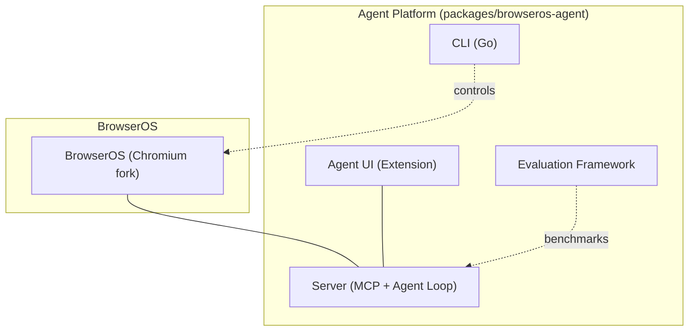
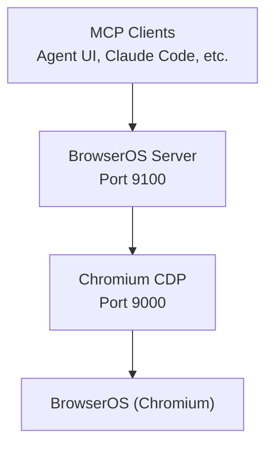
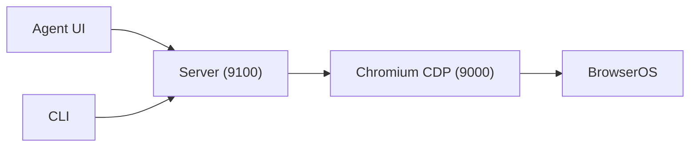

# Troubleshooting

<cite>
**Referenced Files in This Document**
- [README.md](file://README.md)
- [packages/browseros-agent/README.md](file://packages/browseros-agent/README.md)
- [docs/troubleshooting/connection-issues.mdx](file://docs/troubleshooting/connection-issues.mdx)
- [docs/update/windows.mdx](file://docs/update/windows.mdx)
- [docs/update/macos.mdx](file://docs/update/macos.mdx)
- [docs/update/linux.mdx](file://docs/update/linux.mdx)
</cite>

## Table of Contents
1. [Introduction](#introduction)
2. [Project Structure](#project-structure)
3. [Core Components](#core-components)
4. [Architecture Overview](#architecture-overview)
5. [Detailed Component Analysis](#detailed-component-analysis)
6. [Dependency Analysis](#dependency-analysis)
7. [Performance Considerations](#performance-considerations)
8. [Troubleshooting Guide](#troubleshooting-guide)
9. [Conclusion](#conclusion)
10. [Appendices](#appendices)

## Introduction
This document provides a comprehensive troubleshooting guide for BrowserOS. It focuses on diagnosing and resolving common issues across three primary areas:
- Connectivity: MCP server connectivity, OAuth authentication failures, and LLM provider connection issues
- Logging and diagnostics: Enabling debug mode and interpreting logs
- Performance: Memory usage, CPU consumption, and browser automation slowdowns
It also covers installation and setup issues per platform, automation and tool execution failures, monitoring and metrics, and preventive best practices. Step-by-step diagnostic procedures are included, along with guidance on when to seek community support.

## Project Structure
BrowserOS consists of:
- A Chromium-based browser (packages/browseros)
- An agent platform (packages/browseros-agent) with:
  - MCP server (Bun) exposing browser automation tools and agent chat
  - Agent UI (Chrome extension)
  - CLI (Go) for terminal control
  - Evaluation framework
- Documentation and platform-specific update guides

**Diagram sources**
- [packages/browseros-agent/README.md:28-62](file://packages/browseros-agent/README.md#L28-L62)
- [README.md:144-178](file://README.md#L144-L178)

**Section sources**
- [README.md:144-178](file://README.md#L144-L178)
- [packages/browseros-agent/README.md:5-27](file://packages/browseros-agent/README.md#L5-L27)

## Core Components
- MCP Server (Bun): Exposes MCP endpoints, agent chat, health checks, and 53+ browser automation tools backed by CDP. Default ports: 9100 (HTTP), 9000 (CDP).
- Agent UI (Extension): Provides chat interface, settings, and MCP server controls.
- CLI (Go): Launches and controls BrowserOS from the terminal or AI coding agents.
- Evaluation Framework: Benchmarks agent performance on tasks like WebVoyager and Mind2Web.

Key operational ports and roles:
- 9100: HTTP server for MCP, chat, health
- 9000: Chromium CDP server (BrowserOS Server connects as client)
- 9300: Legacy launch argument retained for compatibility

**Section sources**
- [packages/browseros-agent/README.md:64-71](file://packages/browseros-agent/README.md#L64-L71)
- [packages/browseros-agent/README.md:28-62](file://packages/browseros-agent/README.md#L28-L62)

## Architecture Overview
The agent platform communicates with the browser via CDP. MCP clients (Agent UI, external tools) connect to the server over HTTP/SSE.

**Diagram sources**
- [packages/browseros-agent/README.md:34-62](file://packages/browseros-agent/README.md#L34-L62)

**Section sources**
- [packages/browseros-agent/README.md:28-62](file://packages/browseros-agent/README.md#L28-L62)

## Detailed Component Analysis

### MCP Server Connectivity
Common symptoms:
- “Failed to Fetch” or “Unable to connect to BrowserOS agent”
- MCP tools unavailable or timing out

Typical causes and fixes:
- Windows firewall/network permission prompt not accepted
- Port 9100 blocked or in use
- Agent process terminated unexpectedly

Platform-specific steps:
- Windows: Allow BrowserOS Agent through Windows Security; if still failing, end the BrowserOS Agent process in Task Manager and relaunch BrowserOS
- macOS: Quit and reopen BrowserOS from the Dock
- macOS/Linux: Check if port 9100 is in use and free it; then restart BrowserOS

**Section sources**
- [docs/troubleshooting/connection-issues.mdx:12-52](file://docs/troubleshooting/connection-issues.mdx#L12-L52)
- [docs/troubleshooting/connection-issues.mdx:54-93](file://docs/troubleshooting/connection-issues.mdx#L54-L93)

### OAuth Authentication Failures
Symptoms:
- OAuth login prompts fail or redirect back without success
- LLM provider integration not recognized after login

Guidance:
- Verify OAuth provider availability and network connectivity
- Clear browser cookies/cache for the provider domain and retry
- Confirm the provider’s OAuth callback URL is whitelisted in your environment
- Reconnect the provider from the settings panel

[No sources needed since this section provides general guidance]

### LLM Provider Connection Issues
Symptoms:
- “Provider not connected” or “Failed to send message”
- Tool execution errors related to model selection or API keys

Guidance:
- Ensure API keys or OAuth tokens are configured and valid
- Verify provider-specific endpoints and rate limits
- Switch providers to isolate whether the issue is environment-specific
- For local models (Ollama/LM Studio), confirm the local service is reachable and models are loaded

[No sources needed since this section provides general guidance]

### Browser Automation Failures and Tool Execution Errors
Symptoms:
- Tools timeout or return errors
- Steps fail mid-execution (navigation, typing, clicking)

Guidance:
- Increase timeouts and retries in the agent configuration
- Simplify the workflow to a single tool to isolate failure points
- Inspect the browser console and agent logs for CDP errors
- Validate permissions and focus on the target page/tab

[No sources needed since this section provides general guidance]

### Agent Platform Connectivity Problems
Symptoms:
- Health checks fail
- SSE streams disconnect during chat

Guidance:
- Confirm the server is listening on 9100 and CDP on 9000
- Check for port conflicts and firewall rules
- Restart the agent process and reinitialize the browser session

**Section sources**
- [packages/browseros-agent/README.md:64-71](file://packages/browseros-agent/README.md#L64-L71)
- [docs/troubleshooting/connection-issues.mdx:54-93](file://docs/troubleshooting/connection-issues.mdx#L54-L93)

## Dependency Analysis
The server depends on Chromium CDP for browser automation. The UI and CLI depend on the server being healthy and reachable.

**Diagram sources**
- [packages/browseros-agent/README.md:34-62](file://packages/browseros-agent/README.md#L34-L62)

**Section sources**
- [packages/browseros-agent/README.md:28-62](file://packages/browseros-agent/README.md#L28-L62)

## Performance Considerations
- Memory usage: Monitor BrowserOS and the agent process memory; reduce concurrent tabs and automation tasks to lower pressure
- CPU consumption: Close unnecessary extensions and background tabs; limit heavy scraping or repeated actions
- Browser automation slowdowns: Use fewer concurrent tool invocations; batch operations; ensure the target pages are stable and not overly dynamic
- Evaluation framework: Use the evaluation suite to benchmark and compare performance across workflows

[No sources needed since this section provides general guidance]

## Troubleshooting Guide

### Step-by-Step Diagnostic Procedures

#### 1) Connection Problems Between Browser Extension, Agent Platform, and External Tools
- Confirm the MCP server is reachable:
  - Open the BrowserOS settings and click Restart in the MCP Server section
  - On failure, restart the BrowserOS Agent process manually (Task Manager on Windows; Quit and reopen on macOS)
- Check port conflicts:
  - macOS/Linux: Use a command to list processes on port 9100 and terminate conflicting processes
  - Windows: Use a command to list processes on port 9100 and terminate the conflicting process
- Verify firewall/antivirus:
  - Allow localhost traffic to 127.0.0.1:9100
  - Temporarily disable antivirus if it blocks local connections

**Section sources**
- [docs/troubleshooting/connection-issues.mdx:22-52](file://docs/troubleshooting/connection-issues.mdx#L22-L52)
- [docs/troubleshooting/connection-issues.mdx:54-93](file://docs/troubleshooting/connection-issues.mdx#L54-L93)

#### 2) OAuth Authentication Failures
- Clear cookies/cache for the OAuth provider domain
- Retry login from the provider settings panel
- Confirm the OAuth callback URL is whitelisted
- If using a corporate proxy, ensure OAuth endpoints are accessible

[No sources needed since this section provides general guidance]

#### 3) LLM Provider Connection Issues
- Validate API keys or OAuth tokens
- Check provider endpoints and rate limits
- Switch providers to isolate environment-specific issues
- For local models, verify the local service is reachable and models are loaded

[No sources needed since this section provides general guidance]

#### 4) Browser Automation Failures and Tool Execution Errors
- Reduce concurrency and simplify workflows
- Increase timeouts and retries
- Inspect browser console and agent logs for CDP errors
- Ensure the target page is stable and focused

[No sources needed since this section provides general guidance]

#### 5) Agent Platform Connectivity Problems
- Confirm ports 9100 and 9000 are open and not in use
- Restart the agent process and reinitialize the browser session
- Review firewall rules for localhost traffic

**Section sources**
- [packages/browseros-agent/README.md:64-71](file://packages/browseros-agent/README.md#L64-L71)
- [docs/troubleshooting/connection-issues.mdx:54-93](file://docs/troubleshooting/connection-issues.mdx#L54-L93)

#### 6) Performance Troubleshooting
- Monitor memory and CPU usage of BrowserOS and the agent process
- Reduce concurrent automation tasks and close unnecessary tabs
- Limit heavy scraping or repeated actions
- Use the evaluation framework to benchmark and optimize workflows

[No sources needed since this section provides general guidance]

### Logging System and Debug Mode
- Enable debug logging in the agent server configuration to capture detailed diagnostics
- Use the BrowserOS Feedback extension to check for updates and report issues
- Collect logs from the agent server and browser console for correlation

**Section sources**
- [docs/update/windows.mdx:7-13](file://docs/update/windows.mdx#L7-L13)

### Monitoring and Metrics Collection
- Use analytics keys configured in the server environment to collect metrics server-side
- Use the evaluation framework to measure performance on representative tasks
- Track health endpoints and SSE stream stability for agent connectivity

**Section sources**
- [packages/browseros-agent/README.md:109-111](file://packages/browseros-agent/README.md#L109-L111)
- [packages/browseros-agent/README.md:122-123](file://packages/browseros-agent/README.md#L122-L123)

### Error Codes and Log Analysis Techniques
- “Failed to Fetch” or “Unable to connect to BrowserOS agent”: Indicates the agent process is down or unreachable
- Port conflicts: Investigate processes using port 9100 and terminate them
- Firewall/antivirus interference: Temporarily disable to confirm; add exceptions for localhost traffic
- CDP errors: Inspect browser console and server logs for protocol-level failures

**Section sources**
- [docs/troubleshooting/connection-issues.mdx:6-11](file://docs/troubleshooting/connection-issues.mdx#L6-L11)
- [docs/troubleshooting/connection-issues.mdx:54-93](file://docs/troubleshooting/connection-issues.mdx#L54-L93)

### When to Seek Community Support
- After trying all platform-specific fixes and port/firewall checks
- If the issue persists across multiple environments or machines
- When logs indicate server-side anomalies not explained by local configuration

Community channels:
- Discord
- Slack

**Section sources**
- [docs/troubleshooting/connection-issues.mdx:95-106](file://docs/troubleshooting/connection-issues.mdx#L95-L106)

### Preventive Measures and Best Practices
- Keep BrowserOS updated per platform-specific instructions
- Configure firewall/antivirus to allow localhost traffic to 127.0.0.1:9100
- Avoid running multiple applications on port 9100
- Use the evaluation framework to validate performance before scaling automation

**Section sources**
- [docs/update/windows.mdx:15-43](file://docs/update/windows.mdx#L15-L43)
- [docs/update/macos.mdx:6-20](file://docs/update/macos.mdx#L6-L20)
- [docs/update/linux.mdx:6-22](file://docs/update/linux.mdx#L6-L22)

### Security-Related Troubleshooting
- Authentication issues: Verify OAuth provider configuration and network access
- Permission problems: Ensure BrowserOS Agent is allowed network access on Windows; on macOS/Linux, verify process permissions
- Endpoint exposure: Restrict local server access to localhost only; avoid exposing 9100 externally

**Section sources**
- [docs/troubleshooting/connection-issues.mdx:12-21](file://docs/troubleshooting/connection-issues.mdx#L12-L21)
- [docs/troubleshooting/connection-issues.mdx:88-92](file://docs/troubleshooting/connection-issues.mdx#L88-L92)

## Conclusion
By following the diagnostic procedures and best practices outlined here, most connectivity, authentication, and performance issues in BrowserOS can be resolved quickly. Use the logging and monitoring capabilities to pinpoint root causes, and leverage community channels when deeper assistance is needed.

## Appendices

### Installation and Setup Guidance by Platform
- Windows: Use the official installer; allow BrowserOS Agent network access when prompted; update via the Feedback extension
- macOS: Automatic updates apply on restart; manual update if needed
- Linux: Use the Feedback extension to check for updates; download and run the latest binary

**Section sources**
- [docs/update/windows.mdx:6-43](file://docs/update/windows.mdx#L6-L43)
- [docs/update/macos.mdx:6-20](file://docs/update/macos.mdx#L6-L20)
- [docs/update/linux.mdx:6-22](file://docs/update/linux.mdx#L6-L22)